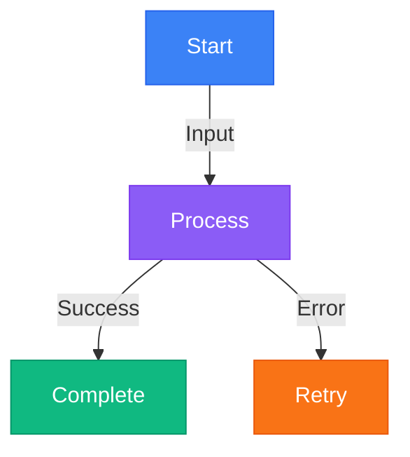

# GitHub Copilot Instructions for AI Resources

## Documentation Standards

### No Emojis Policy
**CRITICAL**: Never use emojis in any documentation files.

- use MkDocs Material compatible icons only  (`:robot:`, `:material-*:`, `:fontawesome-*:`)
- ❌ Do NOT use Unicode emojis (📰, 🚀, 💡, etc.)
- ✅ Use clear, descriptive text instead
- ✅ Use headings, bold text, and formatting for emphasis

### MkDocs Material Best Practices

#### Navigation Structure
```yaml
nav:
  - Home: index.md
  - Blog: blog/index.md
  - Documentation:
      - AI Agents: agents/index.md
      - RAG: rag/index.md
      - MCP: mcp/index.md
  - References: references/index.md
```

Keep navigation clean with 3-5 top-level items maximum.

#### Mermaid Diagrams

Always use **theme-friendly colors** that work in both light and dark modes:

```yaml
Color Palette:
  Primary Blue: "#3b82f6"      # Use for main flows
  Success Green: "#10b981"     # Use for successful paths
  Purple: "#8b5cf6"            # Use for processing/logic
  Orange: "#f97316"            # Use for warnings/important
  Teal: "#14b8a6"              # Use for data/storage
  Pink: "#ec4899"              # Use for user interactions
  Light Green: "#22c55e"       # Use for completion/success
```

**Example Mermaid Diagram:**



#### Grid Cards

Use cards for feature showcases or section links:

```markdown
<div class="grid cards" markdown>

-   __Feature Name__

    Clear description of the feature or section.

    [View →](path/to/page.md)

</div>
```

**Rules:**
- No emojis in card titles
- Use bold (`__text__`) for titles
- Keep descriptions concise (1-2 lines)
- Use simple text links like `[View →]`

#### Blog Posts

**Categories Available:**
- News & Announcements
- Models & LLMs
- AI Agents
- MCP Updates
- Framework Updates
- Tool Releases
- Prompt Engineering
- Research Highlights
- Platform Updates
- Developer Tools
- Observability

**Blog Post Template:**

```markdown
---
draft: false
date: 2025-01-15
authors:
  - nitin
categories:
  - Framework Updates
tags:
  - langgraph
  - ai-agents
---

# Post Title

Brief introduction or summary.

<!-- more -->

## Main Content

Detailed content here.

### Key Points

- Point 1
- Point 2
- Point 3

## Conclusion

Wrap up the post.
```

**Blog Guidelines:**
- Use `<!-- more -->` to separate excerpt
- Keep excerpts under 150 words
- Always add 2-4 relevant tags
- Choose appropriate category from allowed list
- No emojis in titles or content

#### Content Formatting

**Headings:**
```markdown
# Page Title (H1) - One per page
## Section (H2)
### Subsection (H3)
#### Minor Section (H4)
```

**Emphasis:**
- **Bold** for important terms: `**term**`
- *Italic* for emphasis: `*text*`
- `Code` for technical terms: `` `code` ``

**Lists:**
- Use `-` for unordered lists
- Use `1.` for ordered lists
- Indent with 4 spaces for nested lists

**Code Blocks:**
````markdown
```python
def example():
    return "Use language-specific highlighting"
```
````

**Links:**
- Internal: `[Link Text](../path/to/page.md)`
- External: `[Link Text](https://example.com)`
- Button style: `[Text](url){ .md-button .md-button--primary }`

#### Admonitions

Use Material for MkDocs admonitions for callouts:

```markdown
!!! note
    This is a note.

!!! warning
    This is a warning.

!!! tip
    This is a tip.

!!! danger
    This is critical information.
```

**Types:** note, abstract, info, tip, success, question, warning, failure, danger, bug, example, quote

### File Structure

```
docs/
├── index.md              # Landing page (hide navigation/toc)
├── blog/
│   ├── index.md          # Blog landing page
│   ├── .authors.yml      # Author profiles
│   ├── posts/            # Blog posts
│   └── README.md         # Blog documentation
├── agents/
│   ├── index.md
│   ├── architecture.md
│   └── design-patterns.md
├── rag/
│   └── index.md
├── mcp/
│   └── index.md
├── tools/
│   └── index.md
└── references/
    └── index.md
```

### Landing Page Pattern

```markdown
---
hide:
  - navigation
  - toc
---

# Main Title

Brief introduction (2-3 sentences).

<!-- blog -->

## Key Sections

<div class="grid cards" markdown>

-   __Section 1__

    Description.

    [View →](path.md)

-   __Section 2__

    Description.

    [View →](path.md)

</div>

## Contribution

[Contribute on GitHub](url){ .md-button .md-button--primary }
```

### Documentation vs Blog

**Documentation (`docs/agents/`, `docs/rag/`, etc.):**
- In-depth, comprehensive guides
- Structured learning paths
- Reference material
- Conceptual explanations
- Best practices and patterns

**Blog (`docs/blog/posts/`):**
- Latest news and announcements
- Tool and framework releases
- MCP updates
- Quick highlights
- Time-sensitive content

## Code Generation

### Python Code
- Use type hints
- Follow PEP 8 style guide
- Add docstrings to functions and classes
- Use meaningful variable names

### Configuration Files
- Use YAML for MkDocs configuration
- Indent with 2 spaces
- Add comments for complex settings
- Keep configuration organized by section

### Commit Messages
Format: `type: brief description`

Types:
- `docs:` - Documentation changes
- `feat:` - New features
- `fix:` - Bug fixes
- `style:` - Formatting changes
- `refactor:` - Code restructuring
- `chore:` - Maintenance tasks

## Testing Changes

Before committing:
1. Build the documentation locally: `mkdocs serve`
2. Check all pages render correctly
3. Verify diagrams display properly in light and dark modes
4. Test navigation and links
5. Validate no emojis are present

## Summary

1. **Never use emojis** - Use descriptive text instead
2. **Use theme-friendly colors** - Test in light and dark modes
3. **Keep navigation clean** - 3-5 top-level items
4. **Follow blog structure** - Use categories and tags properly
5. **Write clear content** - Professional and accessible
6. **Test before committing** - Build and preview locally
