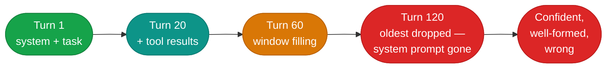
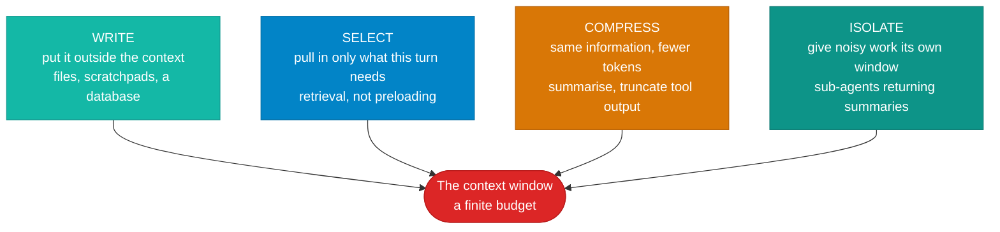

# Context engineering

!!! abstract
    Every turn of the loop appends to a list, and you resend that list in full.
    It only grows. Eventually it outgrows the window — and the failure is
    **silent**: no exception, no warning, nothing in the response. Deciding what
    survives that pressure is context engineering, and it has largely displaced
    prompt engineering as the discipline that matters.

**Prerequisites:** [The harness](the-harness.md).

**Verified as of 2026-08-21.**

## What you'll be able to do

Detect truncation, predict what gets dropped, and apply the four strategies for
keeping a long-running agent inside its window.

## The definition

Anthropic's is the one worth memorising — context engineering is *"the set of
strategies for curating and maintaining the optimal set of tokens (information)
during LLM inference"*, with the governing aim of *"finding the smallest possible
set of high-signal tokens that maximize the likelihood of some desired outcome."*

The important word is **smallest**. The instinct is to add; the discipline is to
subtract.

## Why "just put more in" fails

Two separate problems, often conflated.

**The hard limit.** Past the window, content is dropped. Silently — see below.

**The soft decay, which arrives first.** Performance degrades well before the
limit. The peer-reviewed grounding here is *NoLiMa* (ICML 2025): of 13 models
advertising 128K+ context, **11 fell below half their short-context accuracy at
just 32K** once you remove lexical overlap between the question and the answer.
Chroma's *Context Rot* report tested 18 models across six task families and found
performance *"grows increasingly unreliable as input length grows"* — and, counter
to intuition, that a **single distractor** already hurts, and models often score
*better* on a shuffled haystack than a logically coherent one.

So the advertised context window is a ceiling, not a working budget. Treat it
the way Anthropic's post does: *"a finite resource with diminishing marginal
returns."*

## What actually gets dropped — measured

This is the part most guidance hand-waves, and it is worth being precise because
the behaviour depends on the *shape* of the overflow, not just its size.

Measured against a local server with a 4,096-token window, planting a canary
instruction and checking whether it comes back:

| Overflow shape | `prompt_tokens` sent | What was dropped |
|---|---|---|
| Short conversation | 46 | nothing |
| System prompt + one ~10k-token message | **32** | the huge message, whole. System prompt **survived** |
| Same, but the rule was in an early *user* message | **38** | **the rule** — silently |
| System prompt + 120 accumulated turns | **4,075** | packed to the limit; the **system prompt fell off the front** |

Three things follow.

**The number is your only signal.** In row two, the server reported 32
prompt tokens for a request carrying roughly ten thousand. Nothing else in the
response indicates a loss. Comparing `usage.prompt_tokens` against what you
believe you sent is the check.

**A system prompt is privileged, but not immune.** It survived a single
oversized message and did *not* survive accumulation.

**The last row is the agent case.** Nothing in it was individually large — 120
turns of ordinary tool results. An agent loop produces those without anyone
deciding to.



## The four strategies

LangChain's taxonomy is the most reusable framing — **write, select, compress,
isolate**.



**Write** — the agent keeps notes on a filesystem rather than in the
conversation. Anthropic's memory tool is explicitly this: *"an agent records what
it learns in memory files and reads them back on demand."* Note it is a
filesystem, not a vector store. No embeddings anywhere.

**Select** — *just-in-time* retrieval. Rather than preloading everything, hold
lightweight identifiers — file paths, queries, links — and fetch at the moment of
need. This is why coding agents use `grep` and `glob` rather than embedding the
repository.

**Compress** — summarise the middle, truncate verbose tool output at the harness
layer before it ever reaches the model. A `PreToolUse` hook that filters a test
run down to failures only can take tens of thousands of tokens to hundreds.

**Isolate** — spawn a sub-agent for work whose intermediate output is noise. It
burns its own window and returns a summary. Anthropic report sub-agents returning
*"a condensed, distilled summary of its work (often 1,000-2,000 tokens)."*

## Compaction versus reset

Two ways to make room, and they are not equivalent.

**Compaction** summarises earlier turns in place and the same agent continues on
a shortened history. **Reset** clears the window entirely and starts a fresh
agent with a structured handoff.

Anthropic's harness-design work found reset with a good handoff *outperformed*
compaction for long-running work on Sonnet 4.5 — because compaction accumulates
lossy summaries of lossy summaries, while a handoff forces you to state what
actually matters. They also name a failure mode worth knowing: **context
anxiety**, where a model approaching its limit starts prematurely wrapping up.

One practical trap: compaction rewrites the middle of the context, which
invalidates your prompt cache from that point on. Put a cache breakpoint at the
end of the system prompt and it survives compaction — otherwise every compaction
costs you a full cache rewrite.

## Build it

[**Lab 05 — context limits**](https://github.com/nitin27may/ai-resources/tree/main/labs/05-context-limits) · free, local, ~3 minutes

```bash
python3 labs/05-context-limits/lab.py
```

Plants a canary instruction, buries it four different ways, and shows which
shapes of overflow remove it. Then compacts and recovers it.

## Verify

```
1. Baseline                                   instruction survived
2. system prompt + a ~10k-token message        instruction survived
3. rule as user turn 1, then a ~10k message    instruction LOST
4. system prompt + 241 accumulated messages    instruction LOST

  242 messages -> 8 after compaction
  same conversation, compacted                 instruction survived
```

**What failure looks like:** exactly like success. Every one of those calls
returned HTTP 200 with a fluent, plausible reply. The only difference between a
correct answer and one produced after your instructions were deleted is a token
you deliberately planted to check.

That is the point of the module. If you take one habit from it: **assert on
`usage.prompt_tokens`** in any long-running agent, and alert when it diverges
from what you sent.

## In a framework

Frameworks expose compaction as configuration and sub-agents as a primitive. In
Microsoft Agent Framework, conversation state and trimming live behind context
providers — see
[`tutorials/05-context-providers`](https://github.com/nitin27may/e-commerce-agents/tree/main/tutorials/05-context-providers).

## How it works in a real system

[State, memory and sessions](https://nitinksingh.com/e-commerce-agents/concepts/08-state-memory-and-sessions.html) in `e-commerce-agents` explains this concept
as it is actually implemented there — what the design does, why, and where in the
code to look. It is the bridge between this page and the source below.

## In production

[`shared/session.py`](https://github.com/nitin27may/e-commerce-agents/blob/main/agents/python/shared/session.py)
in `e-commerce-agents` — the Postgres history provider caps history at
`max_history=50`. Read it with
[`shared/agent_host.py`](https://github.com/nitin27may/e-commerce-agents/blob/main/agents/python/shared/agent_host.py),
where the rehydration path carries a comment about ordering: fetching the *most
recent* N means `ORDER BY ... DESC` then reversing. `ORDER BY ASC LIMIT 50`
silently returns the *oldest* fifty — the beginning of a conversation instead of
its present. That is this module's failure mode in production code.

## Go deeper

- [Effective context engineering for AI agents](https://www.anthropic.com/engineering/effective-context-engineering-for-ai-agents) — Anthropic, Sep 2025. The canonical definition and the just-in-time argument.
- [Context Rot](https://www.trychroma.com/research/context-rot) — Chroma, Jul 2025. 18 models, six task families. Vendor-published but well executed; pair it with NoLiMa (ICML 2025) when it carries weight.
- [Context Engineering](https://www.langchain.com/blog/context-engineering-for-agents) — LangChain, Jul 2025. The write/select/compress/isolate taxonomy used above.
- [How Long Contexts Fail](https://www.dbreunig.com/2025/06/22/how-contexts-fail-and-how-to-fix-them.html) — Drew Breunig, Jun 2025. Names four distinct failure modes: poisoning, distraction, confusion, clash.

## Next

[Retrieval](retrieval.md) — what to do when the information the model needs was
never in the conversation to begin with.
