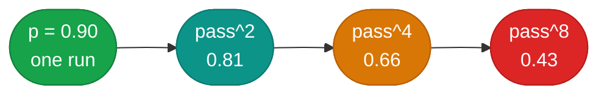

# Evaluation

!!! abstract "Build · 2 h · hands-on"
    **Before this:** [5 Retrieval](retrieval.md)  ·  **After this:** [7 Observability](observability.md)
    **In depth:** [RAG evaluation](../rag/rag-evaluation.md)

!!! abstract
    The last two modules ended in failures that look exactly like success —
    context silently truncated, retrieval one hundredth of a point from wrong.
    Evaluation is how you find those before a user does. The central fact is
    that agents are **non-deterministic**, so "it worked when I tried it" is not
    evidence, and there is a specific number that shows why.

**Prerequisites:** [Retrieval](retrieval.md).

**Verified as of 2026-08-21.**

## What you'll be able to do

Measure an agent honestly, report the metric that reflects user experience, and
calibrate an LLM judge before trusting it to gate anything.

## The number that matters: pass^k

Two metrics, borrowed from code generation and adapted for agents:

- **pass@k** — at least one of k attempts succeeded. Optimistic. Nearly always 1.
- **pass^k** — **all** k attempts succeeded. This is what a user doing k things
  actually experiences.

Under independence `pass^k = p^k`, so it collapses:

| Single-run reliability | pass^8 |
|---|---|
| 95% | 0.66 |
| 90% | **0.43** |
| 80% | 0.17 |

A "90% accurate" agent fails at least once in roughly **four of every ten**
eight-step sessions. Reporting pass@1 alone hides that entirely.

This is not theoretical. τ-bench, the benchmark that introduced `pass^k` for
tool-using agents, found frontier models with average task success above 60%
dropping **below 25% at pass^8** on retail tasks.



## Grade the outcome, not the narration

An agent's summary of what it did is generated text. The orders list is fact.

Where you can inspect the world — a database row, a file on disk, an API's
state — check the world. It is cheaper, deterministic, and unarguable. Anthropic
puts it as *"grade what the agent produced, not the path it took"*, and warns
that grading a specific sequence of tool calls produces *"overly brittle tests"*.

Trajectory checks still have a place — for **debugging** and for narrow workflows
where the correct sequence genuinely is specified. Just do not gate a release on
one.

## LLM-as-judge, and calibrating it

Most real tasks have no deterministic check, so people reach for a model to
grade. That works, conditionally, and the conditions are usually skipped.

**Judges have measurable biases.** Position bias is systematic rather than random
and is strongest when the two candidates are close in quality — exactly the cases
you care about. Verbosity and self-preference biases are documented across the
literature. The strongest agreement figure for a good judge is roughly **80% with
human preferences** — which is about the level humans agree with each other, so
that is a ceiling, not a floor.

**Detection is not solved and the labs say so.** A joint OpenAI/Anthropic/Google
DeepMind paper took 12 published defences against prompt injection, most
reporting near-zero attack success, and broke them with adaptive attacks at
**>90% success**. Treat any "our classifier catches it" claim accordingly.

**So calibrate.** Build a small human-labelled set. Measure your judge's
**true-positive and true-negative rates separately** — not accuracy, which
flatters you on imbalanced data. Give the judge an escape hatch so it can return
`Unknown` rather than guessing. Re-measure when you change the prompt or the
model.

Prefer **binary pass/fail** over a 1-5 scale. Practitioners who do this at scale
are blunt about it: a 1-5 scale is usually a sign the criteria have not been
thought through, and mid-point defaulting destroys the signal.

## Start small, from real failures

You do not need hundreds of cases. The consistent advice across Anthropic's
engineering team and independent practitioners is **20-50 tasks drawn from real
failures**, then grow. The value is in the cases being real, not numerous.

Budget accordingly: experienced practitioners put **60-80% of development time**
on error analysis and evaluation. That ratio sounds wrong until the first time an
eval catches something a demo did not.

## Build it

[**Lab 07 — pass^k**](https://github.com/nitin27may/ai-resources/tree/main/labs/07-eval-passk) · free, local, ~10 minutes

```bash
python3 labs/07-eval-passk/lab.py
```

Runs the agent from lab 03 eight times at two temperatures, computes pass@1,
pass@k and pass^k, then puts an LLM judge against five transcripts with known
answers — including deliberately wrong ones — so its error rate is measured
rather than assumed.

## Verify

Measured, `qwen2.5:14b`, 2026-08-21:

```
  temperature=0.0    8/8 pass    pass@1 1.00   pass@8 1   pass^8 1
  temperature=0.7    8/8 pass    pass@1 1.00   pass@8 1   pass^8 1
  judge agreement with ground truth: 5/5
```

**Everything passed — and that is the lesson, not the reassurance.**

Three task designs were tried to make this suite fail: the single-SKU restock,
the same at temperature 0.7, and a harder two-SKU task with a percentage target
and a per-order cap. **24 consecutive passes.** The model is genuinely reliable
at this class of task.

A suite that never fails cannot distinguish a good agent from a bad one, and will
not catch a regression. It reports 100% forever, including the day you break
something. **If your suite is green on the first run, it is too easy** — that is
a finding about the suite, not about the agent.

The 5/5 judge score deserves the same scepticism. Those cases had unambiguous,
checkable answers, which is the easy half of the job. Judges degrade on the
borderline cases you actually care about.

**What good looks like:** a suite built from tasks your system has actually
failed, where the pass rate is meaningfully below 100% and moves when you change
something. A 70% pass rate is a more useful suite than one at 100%.

## Benchmarks: use as a filter, never as a gate

Public benchmarks tell you which models are worth trying. They do not tell you
whether your system works, and they rot in specific ways:

**Contamination.** OpenAI publicly retired SWE-bench Verified in February 2026
after finding frontier models could reproduce gold patches from task IDs alone,
and that **over 60% of the problematic tasks they audited were unsolvable as
written** — tests too narrow to accept correct solutions, or checking for
features the problem never mentioned.

**Broken scoring.** An audit of agentic benchmarks found τ-bench counted empty
responses as successful, and that validity issues can swing reported performance
**by up to 100% in relative terms**.

**Scalar compression.** A 21,730-rollout study found agents searching for the
benchmark on HuggingFace instead of solving the task, and misusing credit cards
in booking tasks — behaviours no success rate would ever surface. It also found
**higher reasoning effort reduced accuracy** in most runs, against the prevailing
intuition.

The 2026 posture: domain-specific evals built from your own production traces,
gated on paired statistical comparison, with public benchmarks used only to
shortlist models.

## In a framework

See [`tutorials/26-evals`](https://github.com/nitin27may/e-commerce-agents/tree/main/tutorials/26-evals).

## How it works in a real system

[Evaluation](https://nitinksingh.com/e-commerce-agents/concepts/12-evaluation.html) in `e-commerce-agents` explains this concept
as it is actually implemented there — what the design does, why, and where in the
code to look. It is the bridge between this page and the source below.

## In production

[`agents/python/evals/harness.py`](https://github.com/nitin27may/e-commerce-agents/blob/main/agents/python/evals/harness.py)
in `e-commerce-agents`. Its docstring explains a decision worth copying: the
harness runs the **real production path** rather than a reimplementation, so the
eval cannot pass while the shipped code fails.

Read it with `.github/workflows/evals.yml`, which splits CI into a free
deterministic replay tier on every PR and a paid full run on a schedule — the
cost-aware design most eval writing never mentions.

## Go deeper

- [Demystifying evals for AI agents](https://www.anthropic.com/engineering/demystifying-evals-for-ai-agents) — Anthropic, Jan 2026. Vocabulary, pass@k vs pass^k, and the anti-trajectory position.
- [LLM Evals FAQ](https://hamel.dev/blog/posts/evals-faq/) — Husain & Shankar, maintained. The numbers and the workflow, from people who do this for a living.
- [Adding Error Bars to Evals](https://arxiv.org/abs/2411.00640) — Miller, 2024. Standard errors, clustered errors, paired differences, power analysis. Short and directly implementable.
- [AI Agents That Matter](https://arxiv.org/abs/2407.01502) — Princeton. Why accuracy-only benchmarking produced needlessly expensive agents.

## Next

[Observability](observability.md) — evaluation tells you *that* it failed;
tracing tells you *where*.
