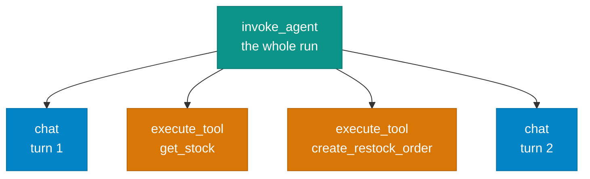

# Observability

!!! abstract "Build · 1 h · hands-on"
    **Before this:** [8 Evaluation](evaluation.md)  ·  **After this:** [10 Safety](safety.md)
    **Overview version:** [Agentic AI](../concepts/agentic-ai.md)

!!! abstract
    A trace is a tree of named, timed, nested spans with attributes. That is the
    entire data model, and you can build a useful one in about thirty lines. This
    module builds it by hand first, then points at the tooling — and surfaces the
    cost behaviour most people have never measured.

**Prerequisites:** [Evaluation](evaluation.md).

**Verified as of 2026-08-21.**

## What you'll be able to do

Instrument an agent loop, read a trace waterfall, and explain why a short agent
run costs far more tokens than its content.

## The data model



That is not a diagram of a concept — it is literally what the lab prints. The
tree structure comes from **your harness**; the token counts come from the
provider's response. Nothing requires the model's cooperation.

OpenTelemetry's GenAI conventions name these spans: `invoke_agent` at the root,
`chat` per model call, `execute_tool` per dispatch, plus `embeddings`, `plan` and
a memory family.

!!! warning "The GenAI conventions are not stable, and they moved"
    Every `gen_ai.*` attribute is still marked **Development**. The conventions
    also moved out of the main OpenTelemetry semantic-conventions repository into
    a dedicated one — the old `opentelemetry.io/docs/specs/semconv/gen-ai/` URL
    is now a redirect stub, and the new repo has **no tagged releases**.

    Use the span model; it is the right mental model and it is converging. Pin
    your expectations to a commit, not a version number, and expect attribute
    names to change.

## The cost behaviour nobody measures

This is the finding worth taking from the lab. A traced two-turn run:

```
  invoke_agent                          43992ms   turns=2
      chat turn 1                       22843ms   in=224   out=53
      execute_tool get_stock                0ms   -> {"on_hand": 3, ...}
      execute_tool create_restock_order      0ms   -> {"order_id": "RO-1", ...}
      chat turn 2                       21148ms   in=339   out=52

  prompt tokens  563   across 2 calls
```

The first call sent 224 prompt tokens. The run sent **563** — about 2.5x — for a
task whose genuinely new content was two small tool results.

That is not waste, it is the mechanism. The conversation is stateless, so every
turn resends everything before it. **Cost grows with the square of the turn
count**, not linearly: roughly `c·n²/2` for context growing `c` per turn.

Two consequences:

**Prompt caching caps the coefficient, not the exponent.** Cached input typically
costs about a tenth, which is a large win — but the quadratic is unchanged. Teams
routinely believe caching solved the scaling problem. It made it cheaper.

**Looking at the last call underestimates a session badly.** A one-line question
at the end of a long session still draws usage for the entire conversation.

Also visible above: **99% of wall clock was in the model**, and 0ms in the tools.
That ratio is typical, and it tells you where optimisation effort belongs.

## What to instrument

| Signal | Where it comes from | Why |
|---|---|---|
| Span tree | your harness | the trajectory, made inspectable |
| Tokens in/out | provider response `usage` | cost, and the truncation canary from [context engineering](context-engineering.md) |
| Duration per span | your timer | model vs tool vs your own code |
| Tool name + arguments | your dispatch | what it actually tried to do |
| Errors | your dispatch | which failures the model recovered from |

**Content capture is opt-in and should stay a decision.** By default most
instrumentation records metadata only — model names, token counts, durations —
not prompts or tool arguments. Turning content capture on is what makes traces
genuinely useful for debugging, and also what puts user data in your telemetry
backend. Decide deliberately, especially under a data-residency regime.

## The failure tracing exists to catch

A real one, from the repo this path cross-links, and a better illustration of
this module than anything invented.

Specialist agents received **zero** conversation history on every
browser-originated turn. Deterministically. For weeks it read as model
nondeterminism.

The chain: the web client never sent a session header → a context variable
stayed empty → the header forwarded between services was empty → history
rehydration **short-circuited before reaching the database, and without
logging**.

Nothing failed. No exception, no error metric, no log line. And it was
intermittent-looking from outside, because the orchestrator *does* hold the
history and its prompt asks it to inline context — which worked often enough to
look like a flaky model.

Same specialist, same question, only the header differing:

> **real session id** — "The Sony WH-1000XM5 headphones we just discussed have a
> battery life of 30 hours."
>
> **empty** — "I couldn't retrieve the battery life for the product we just
> discussed…"

The lesson is specific: **a guard that returns "no data" without logging is
indistinguishable from "there was no data"**, and that ambiguity is what hid it.
The fix logs on every refusal path.

Generalise it: instrument the branches where you decide *not* to do something.
Traces naturally capture what happened; silent early returns are exactly what
they miss, and exactly where this class of bug lives.

## Cost is not standardised

OpenTelemetry defines token and duration metrics. **There is no currency metric.**
Every platform derives spend from its own price table, which means cost is the
one number that does not travel when you change backends.

The practical rule: instrument with OTel and `gen_ai.*` attributes at your
application boundary, then choose a backend. Instrument with a vendor SDK first
and your migration cost is your whole trace history.

The one asset that is never portable, and that you should therefore own outright,
is your **eval dataset and its human labels**. Traces are replaceable; labels are
not.

## Build it

[**Lab 08 — tracing**](https://github.com/nitin27may/ai-resources/tree/main/labs/08-tracing) · free, local, ~2 minutes

```bash
python3 labs/08-tracing/lab.py
```

Thirty lines of tracer around the lab 03 agent. Prints the waterfall, then the
token accounting.

## Verify

You should see a nested waterfall with `invoke_agent` at the root, a `chat` span
per turn carrying `in=`/`out=` token counts, and `execute_tool` spans between
them — then the resend multiplier.

**What failure looks like:** if your tool spans show 0ms and your chat spans show
tens of seconds, that is correct, not a bug. The common mistake is optimising the
0ms half. Trace before you tune.

## For the real thing, locally

**Phoenix** is the lowest-friction option: `pip install arize-phoenix && phoenix
serve` gives the same waterfall in a UI over OTLP, with **no account and no
cloud** — one container, or zero if you launch it in-process. Note its licence is
Elastic 2.0, not OSI open source; fine for learning and internal use, not for
reselling as a service.

**Langfuse** is the better product and a heavier lift: MIT core with genuinely
unlimited traces, but a six-container stack with a documented 16 GiB
recommendation. Reach for it when you want a team-shared backend, not for lesson
one.

## In a framework

See [`tutorials/07-observability-otel`](https://github.com/nitin27may/e-commerce-agents/tree/main/tutorials/07-observability-otel).

## How it works in a real system

[Observability and cost](https://nitinksingh.com/e-commerce-agents/concepts/13-observability-and-cost.html) in `e-commerce-agents` explains this concept
as it is actually implemented there — what the design does, why, and where in the
code to look. It is the bridge between this page and the source below.

## In production

[`shared/agent_observability.py`](https://github.com/nitin27may/e-commerce-agents/blob/main/agents/python/shared/agent_observability.py)
in `e-commerce-agents` records every tool call into a per-request step list,
which the frontend renders as a live timeline. Same idea as this lab's tracer,
attached at a single middleware composition point so nothing has to remember to
call it — `STEP_MIDDLEWARE` on the Python side, `StepRecorderMiddleware` on the
.NET twin. That the two stacks converged on the same shape is part of the
lesson: instrumentation belongs at the composition point, not at each call
site.

Read it with `shared/telemetry.py`, which emits OTel spans using the GenAI
`invoke_agent` convention, and `shared/cost.py`, which carries its own price
table — for exactly the reason in the section above.

## Go deeper

- [OpenTelemetry GenAI semantic conventions](https://github.com/open-telemetry/semantic-conventions-genai) — the current home. Check status badges before depending on an attribute name.
- [Phoenix](https://github.com/Arize-ai/phoenix) — local tracing and evals, no account.
- [Langfuse](https://github.com/langfuse/langfuse) — MIT core, self-hostable, heavier.

## Next

[Safety and failure modes](safety.md) — what happens when the content your agent
reads is trying to manipulate it.
