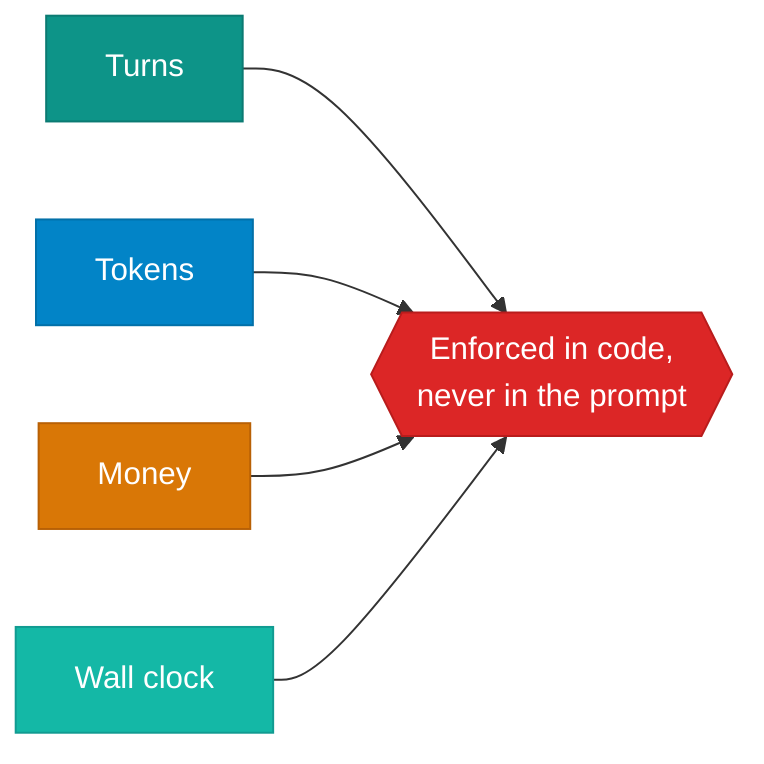

# Production

!!! abstract
    Everything so far assumed tools succeed, runs finish, and nobody is paying.
    Production removes all three. The good news: most of what follows is ordinary
    distributed-systems engineering, and the agent part is not what makes it
    hard.

**Prerequisites:** [Safety](safety.md).

**Verified as of 2026-08-21.**

## What you'll be able to do

Make retries safe, decide what to retry at all, and budget an agent whose cost
grows faster than its turn count.

## The failure that costs money

Not "the call failed". **"The call succeeded and the acknowledgement was lost."**
From the caller those are identical, and the naive response makes it worse:

```
  naive retry:
    attempt 1 -> TimeoutError: upstream timed out after 30s
    retrying...
    attempt 2 -> {'order_id': 'RO-2'}

    orders actually created: 2
    *** the customer was charged twice ***
```

The write landed. Only the response was lost. Retrying created a second order.

**The fix is not fewer retries — it is idempotency.** The caller chooses a key
that is stable across attempts; the server stores the result against it and a
repeat returns the original instead of doing the work again:

```
  idempotency key: restock:ABC-1:2026-08-21:22
    attempt 1 -> TimeoutError
    retrying with the SAME key...
    attempt 2 -> {'order_id': 'RO-1', ..., 'replayed': True}

    orders actually created: 1
```

The key must come from the caller, and must be derived from the *intent* — not
generated fresh per attempt, which would defeat the whole mechanism.

## What to retry, and what never to

| Condition | Retry | Why |
|---|---|---|
| Timeout, connection reset | **yes** | transient, and the operation may have run |
| 429 rate limited | **yes** | back off, respect `Retry-After` |
| 500 / 503 upstream | **yes** | transient |
| 400 malformed request | no | retrying sends the same bad request |
| 401 / 403 auth | no | fix the credential, do not hammer |
| 422 business rule | no | the answer will not change |
| Model produced a bad tool call | no | **return it as context** — the model retries, not you |

That last row is the agent-specific one. A malformed tool call is not your
retry; it is information the model should see, as in
[the harness](the-harness.md).

Exponential backoff **with jitter**, and a cap. Without jitter, everything that
failed together retries together and you rebuild the thundering herd you were
recovering from.

## Cost, and the multipliers nobody plans for

From [observability](observability.md), measured: a two-turn run sent 224 prompt
tokens on the first call and 563 across the run. Context is resent every turn, so
**cost grows with the square of turn count**.

Then multiply again by architecture. Published figures, relative to a plain chat
interaction:

| Shape | Token multiplier |
|---|---|
| Single agent | ~4x |
| Small agent team | ~7x |
| Full multi-agent system | ~15x |

Worth knowing that the same vendor later revised the multi-agent figure **down to
3-10x** while narrowing when it is justified at all — context protection, genuine
parallelism, or real specialisation. Outside those three, coordination cost
usually exceeds the benefit. Their own guidance is blunt: teams have spent months
on elaborate multi-agent architectures only to find improved prompting on a
single agent got there too.

For an order-of-magnitude anchor, one vendor reports coding-agent deployments
averaging **~$13 per developer per active day**, with 90% of users under $30.
Self-reported, one product category — treat it as a scale check, not a benchmark.

## Four budgets, enforced in code



Turns stop a model that will not. Tokens stop silent truncation
([module 6](context-engineering.md)). Money stops the surprise invoice. Wall
clock stops a hung tool call. None of these are things a system prompt can hold.

## The rest of the checklist

| | Why |
|---|---|
| **Circuit breakers** | stop calling a dependency that is already down |
| **Per-tenant rate limits** | one user's loop should not starve everyone |
| **Graceful degradation** | answer without the tool rather than fail the request |
| **Structured logs + traces** | you cannot debug non-determinism from a stack trace |
| **Cost attribution** | per tenant and per feature, or you cannot price it |
| **Replay fixtures** | deterministic CI that costs nothing per run |
| **A kill switch** | disable an agent without a deploy |

## Build it

[**Lab 10 — production concerns**](https://github.com/nitin27may/ai-resources/tree/main/labs/10-production) · free, ~5 seconds, **no model calls**

```bash
python3 labs/10-production/lab.py
```

Deterministic on purpose. These are engineering problems and they reproduce
exactly, which is itself the point — this is the one lab you can reason about
without a model in the loop.

## Verify

The duplicate order appears, then does not. If section 1 shows one order rather
than two, the simulated failure did not fire — that is a bug in the lab, not good
news.

**What failure looks like in the real thing:** it does not look like anything. A
duplicated order is a support ticket three days later, not an exception. This
class of bug is found by reconciliation, not by monitoring.

## How it works in a real system

[Production concerns](https://nitinksingh.com/e-commerce-agents/concepts/14-production-concerns.html) in `e-commerce-agents` explains this concept
as it is actually implemented there — what the design does, why, and where in the
code to look. It is the bridge between this page and the source below.

## In a framework

Retry and compensation as workflow constructs — see
[`tutorials/31-retry-and-compensation`](https://github.com/nitin27may/e-commerce-agents/tree/main/tutorials/31-retry-and-compensation)
and [`tutorials/32-cost-control-and-budgets`](https://github.com/nitin27may/e-commerce-agents/tree/main/tutorials/32-cost-control-and-budgets).

## In production

`e-commerce-agents` has each of these as a readable file:
[`shared/idempotency.py`](https://github.com/nitin27may/e-commerce-agents/blob/main/agents/python/shared/idempotency.py),
[`shared/http_resilience.py`](https://github.com/nitin27may/e-commerce-agents/blob/main/agents/python/shared/http_resilience.py)
(circuit breaker),
[`shared/rate_limit.py`](https://github.com/nitin27may/e-commerce-agents/blob/main/agents/python/shared/rate_limit.py)
(Redis-backed), and `shared/guardrails/cost_budget_middleware.py`.

The one worth reading first is `.github/workflows/evals.yml`, which splits CI
into a free deterministic replay tier on every PR and a paid full run on a
schedule. Cost-aware CI is the part most production writing skips.

## Go deeper

- [Effective harnesses for long-running agents](https://www.anthropic.com/engineering/effective-harnesses-for-long-running-agents) — durable state and structured handoffs across context windows.
- [12-Factor Agents](https://github.com/humanlayer/12-factor-agents) — own your control flow, compact errors into context. A 2025 document.
- [Building effective agents](https://www.anthropic.com/engineering/building-effective-agents) — read the superseded banner; the patterns vocabulary still holds.

## Next

You have finished the agent spine: setup, tool calling, the loop, the harness,
context, retrieval, evaluation, observability, safety and production.

For depth on any stage of retrieval, the [RAG section](../rag/index.md) goes
further. For the same ideas in a framework and then in a running system, every
module links into
[`e-commerce-agents`](https://github.com/nitin27may/e-commerce-agents).
