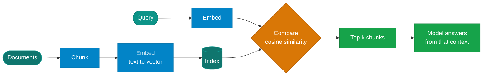

# Retrieval

!!! abstract "Build · 1.5 h · hands-on"
    **Before this:** [4 Context engineering](context-engineering.md)  ·  **After this:** [6 Evaluation](evaluation.md)
    **Overview version:** [Retrieval and data](../concepts/retrieval-and-data.md)  ·  **In depth:** [Retrieval in depth](../rag/index.md)

!!! abstract
    Retrieval fetches information the model does not have and puts it in context.
    The mechanism is three lines — embed, compare, take the top matches. The hard
    part is that it **always returns something**, so a retrieval failure and a
    correct answer look identical from the outside.

**Prerequisites:** [Context engineering](context-engineering.md).

**Verified as of 2026-08-21.**

## What you'll be able to do

Build a retrieval pipeline from scratch, explain why hybrid search beats dense
alone, and recognise the failure that toy corpora hide.

## The mechanism



A vector database adds speed, persistence and scale. It does not add a different
idea — in [lab 06](https://github.com/nitin27may/ai-resources/tree/main/labs/06-local-rag)
the entire index is a Python list.

For the depth on each stage, the RAG section covers
[chunking](../rag/chunking-strategies.md), [embeddings](../rag/embeddings.md) and
[vector databases](../rag/vector-databases.md). This page is about what goes
wrong.

## Retrieval always returns something

There is no empty result. Cosine similarity ranks every chunk you have and hands
back the top ones, whatever the question. Ask a corpus about refunds what its
gift-card policy is, and you get refund chunks with respectable scores.

Nothing in the retrieval layer can tell you the answer is absent. The only thing
standing between that and a confident fabrication is an instruction to refuse —
and then verification that it did.

## Toy corpora lie

This is the finding worth taking away, and it is measured rather than asserted.

Lab 06 asks a corpus *"What does RET-14 cover?"* — a policy identifier. On **six
chunks** dense retrieval ranks the right one first, comfortably. Everything looks
fine.

Then it adds **forty bland neighbours** — "Section N: returns for category N
follow the standard process" — and asks again:

| | Answer's score | Top distractor | Margin |
|---|---|---|---|
| Dense only | 0.580 | 0.566 | **0.014** |
| Hybrid (dense + exact match) | 0.415 | 0.283 | **0.132** |

**Both still rank the answer first.** Read the margin, not the rank. Dense is
fourteen thousandths from being wrong; hybrid has ten times the separation.

Scale from 46 chunks to 46,000 and the dense margin goes negative. You will not
see that happen. You will just start getting confident wrong answers, because
retrieval always returns something.

The lesson: **retrieval quality is a property of scale and of how similar your
near-misses are.** A pipeline that scores perfectly on twenty test documents has
told you nothing.

## Hybrid search is the highest-leverage change

Dense embeddings are weakest on exactly the tokens users are most precise about —
identifiers, error codes, product names, part numbers. Those carry little
semantic weight and lots of intent.

Keyword search (BM25 in practice) is strong precisely there, and weak where dense
is strong. Running both and fusing the rankings is a small change with a large
effect. Anthropic's measured ablation on top-20 retrieval failure rate:

| Configuration | Failure rate |
|---|---|
| Dense embeddings only | 5.7% |
| + BM25 | **2.9%** |
| + reranking | **1.9%** |

Adding BM25 removed roughly half the failures. A reranker removed a third of what
remained. Microsoft's guidance converges on the same place: hybrid retrieval with
a semantic reranker is one of the two strategies they name as current best
practice.

If you do one thing to a struggling RAG system, do this before anything cleverer.

!!! warning "Reranking has no local story"
    Ollama has no reranker support — the request has been open since March 2024
    and there are no reranking models in its library. A rerank stage cannot be
    Ollama-only. Use `sentence-transformers` with a cross-encoder, or
    llama.cpp's `--reranking` server mode. This is a real gap in the local
    stack, worth knowing before you design around it.

## Retrieval as a tool

The framing has shifted. Classic RAG retrieves *before* the model runs, always,
with a fixed query. Agentic retrieval makes retrieval **a tool the model calls** —
so it decides whether to search at all, with what query, and whether to search
again after seeing results.

That buys recall on hard questions — multi-hop, ambiguous, needing
decomposition — and costs determinism and tail latency on easy ones. The same
query can take a different path on different runs, which breaks caching and
regression tests.

Be sceptical of "agentic RAG is better". A 2026 budget-aware evaluation found
**retrieval harm is non-negligible** — adding retrieval machinery can make
answers *worse* — and that simple uncertainty baselines often match learned
routing policies. The engineering question is routing, not picking a side: a
cheap hybrid path for the majority of queries, an agentic path for the ones that
need it.

## Build it

[**Lab 06 — local RAG**](https://github.com/nitin27may/ai-resources/tree/main/labs/06-local-rag) · free, local, ~4 minutes

```bash
ollama pull nomic-embed-text
python3 labs/06-local-rag/lab.py
```

Four cases: a question the corpus answers, the identifier question on six chunks,
the same question on forty-six, and a question the corpus cannot answer.

## Verify

```
2. six documents      correct chunk ranked first: True
3. forty-six documents
     dense   0.580 vs 0.566 distractor   margin 0.014
     hybrid  0.415 vs 0.283 distractor   margin 0.132
4. unanswerable       A: not in the provided context
```

**What failure looks like:** case 3 does not fail. That is the demonstration —
the system that is one hundredth of a point from being wrong looks exactly like
the system that is working. Case 4 only refuses because the system prompt tells
it to; remove that instruction and it will answer from the nearest refund chunk.

## In a framework

Retrieval as a tool the agent calls — see
[`tutorials/24-rag-and-grounding`](https://github.com/nitin27may/e-commerce-agents/tree/main/tutorials/24-rag-and-grounding).

## How it works in a real system

[Grounding and RAG](https://nitinksingh.com/e-commerce-agents/concepts/09-grounding-and-rag.html) in `e-commerce-agents` explains this concept
as it is actually implemented there — what the design does, why, and where in the
code to look. It is the bridge between this page and the source below.

## In production

[`product_discovery/tools.py`](https://github.com/nitin27may/e-commerce-agents/blob/main/agents/python/product_discovery/tools.py)
in `e-commerce-agents` — `semantic_search` is pgvector cosine distance exposed as
a tool the agent chooses to call, with the index defined in
[`docker/postgres/init.sql`](https://github.com/nitin27may/e-commerce-agents/blob/main/docker/postgres/init.sql).

Then read `shared/grounding/verifier.py` in the same repo, which does something
this page argues for: **verifying** claims against the database is a separate
step from retrieving. Retrieval gets you candidate context; it does not get you
a true answer.

## Go deeper

- [Contextual Retrieval](https://www.anthropic.com/news/contextual-retrieval) — Anthropic, Sep 2024. The source of the ablation table above.
- [Relevance and ranking in Azure AI Search](https://learn.microsoft.com/en-us/azure/search/search-relevance-overview) — unusually candid vendor docs naming hybrid+reranker and agentic retrieval as the two current strategies.
- [Agentic RAG: A Survey](https://arxiv.org/abs/2501.09136) — a taxonomy and map, actively revised. Use it for vocabulary, not as evidence that agentic retrieval wins.
- [RAG vs GraphRAG: A Systematic Evaluation](https://arxiv.org/abs/2502.11371) — when the extra machinery earns its cost, and when it does not.

## Next

[Evaluation](evaluation.md) — how you would have caught any of this before your
users did.
