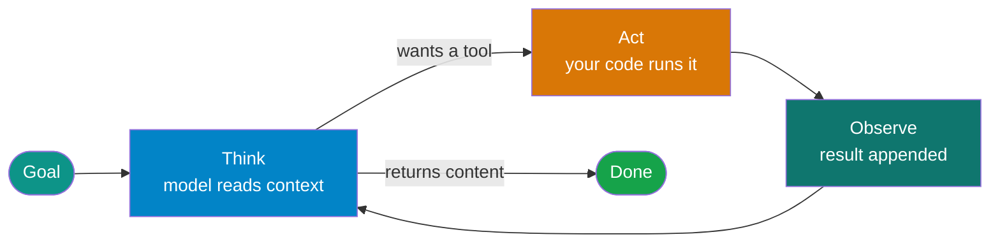

# The agent loop

!!! abstract "Build · 1 h · hands-on"
    **Before this:** [1 Tool calling](tool-calling.md)  ·  **After this:** [3 The harness](the-harness.md)
    **Overview version:** [What an agent is](../concepts/ai-agents.md)  ·  **In depth:** [Design patterns](../patterns/design-patterns.md)

!!! abstract
    An agent is a model calling tools in a loop until it stops asking for them.
    That is the entire idea. This page has you write the loop by hand — roughly
    thirty lines — so that when you later read `agent.run()` in any framework,
    you can see the four steps it is hiding.

**Prerequisites:** [Tool calling](tool-calling.md).

**Verified as of 2026-08-21.**

## What you'll be able to do

Write a working agent loop from scratch, name the four steps, and explain what a
framework adds around them.

## Why a loop is necessary

A single request/response cannot answer: *"SKU ABC-1 is low — check it and
restock to the reorder point."*

Answering needs two tool calls, and **the second call's arguments depend on what
the first one returned**. You cannot know to order 22 units until you have
learned that on-hand is 3 and the reorder point is 25. A one-shot model would
have to guess both at once, from nothing.

That dependency is the whole justification for the loop.

## The four steps



**Think** — send the whole message list, get back either tool calls or content.
**Act** — look the name up in your registry and run it.
**Observe** — append the result as a `role: "tool"` message.
**Repeat** — the model now has information it did not have on the previous pass.

The exit condition is the part people miss: the loop ends when the model returns
**content instead of a tool call**. Nothing else stops it — which is why the
turn limit below is not optional.

## The three things that are not the loop

Writing it yourself makes clear that the interesting parts are the guardrails
around the four steps, not the steps themselves:

**A turn limit.** `MAX_TURNS` exists because a confused model will call the same
tool forever. Without a ceiling, the only thing that ends a bad run is your
budget.

**A registry, not a dispatch table of your code.** The model emits a *name*. You
map names to functions. The model never touches your code, cannot reach a
function you did not register, and cannot invent one — an unknown name returns an
error, not an import.

**Errors as context.** A tool that raises kills the run. A tool that *returns*
`{"error": ...}` gives the model a chance to correct itself. This single choice
is most of what separates a demo from something that survives contact with real
inputs.

## Build it

[**Lab 03 — the agent loop**](https://github.com/nitin27may/ai-resources/tree/main/labs/03-agent-loop) · free, local, ~1 minute

```bash
python3 labs/03-agent-loop/lab.py
```

Thirty lines, two tools, no framework. It prints every turn so you can watch the
dependency resolve.

## Verify

Expected output — note that turn 2's argument could not have been known at turn 1:

```
  turn 1: get_stock({'sku': 'ABC-1'}) -> {'on_hand': 3, 'reorder_point': 25}
  turn 2: create_restock_order({'sku': 'ABC-1', 'quantity': 22}) -> {'order_id': 'RO-1', ...}
  turn 3: final answer
  VERDICT: PASS
```

**What failure looks like:** the lab checks the order against a known-correct
answer and prints `FAIL` if the model ordered the wrong quantity, ordered twice,
or never ordered at all. When that happens the loop is still correct — the
*model* was wrong. That distinction is the entire subject of
[evaluation](evaluation.md), and no framework closes the gap.

## In a framework

Frameworks implement these four steps and hand you the seams. In Microsoft Agent
Framework the loop is inside `agent.run()`; see
[`tutorials/01-first-agent`](https://github.com/nitin27may/e-commerce-agents/tree/main/tutorials/01-first-agent).

## How it works in a real system

[The agentic loop](https://nitinksingh.com/e-commerce-agents/concepts/02-the-agentic-loop.html) in `e-commerce-agents` explains this concept
as it is actually implemented there — what the design does, why, and where in the
code to look. It is the bridge between this page and the source below.

## In production

[`shared/agent_host.py`](https://github.com/nitin27may/e-commerce-agents/blob/main/agents/python/shared/agent_host.py)
in `e-commerce-agents` is instructive precisely because it does **not** implement
a loop — an earlier hand-rolled version was deleted once the framework's native
one proved sufficient. What remains is the boundary: where the loop is invoked
and where its result lands. Knowing when to stop writing your own is part of the
skill.

## Go deeper

- [How the agent loop works](https://code.claude.com/docs/en/agent-sdk/agent-loop) — the clearest plain-language teardown available: turns vs messages, context accumulation, budget guardrails.
- [Building effective agents](https://www.anthropic.com/engineering/building-effective-agents) — Anthropic, Dec 2024. Still the best vocabulary for agent patterns. **Read the banner at the top**: Anthropic marks it superseded and points to their current approach, so treat it as terminology rather than current practice.
- [12-Factor Agents](https://github.com/humanlayer/12-factor-agents) — framework-agnostic production principles. Own your prompts, own your control flow. Note it is a 2025 document, last updated Sep 2025.

## Next

[The harness](the-harness.md) — everything that surrounds the loop once you
stop trusting the model.
