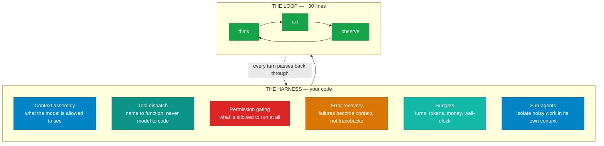
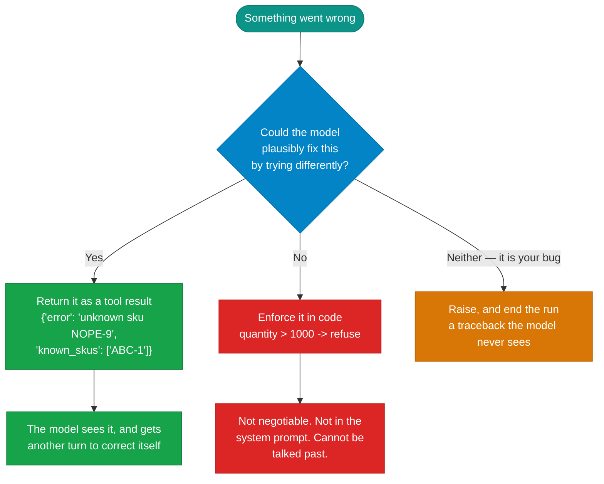

# The harness

!!! abstract "Build · 1 h · hands-on"
    **Before this:** [2 The agent loop](the-agent-loop.md)  ·  **After this:** [4 Context engineering](context-engineering.md)
    **Overview version:** [Agentic AI](../concepts/agentic-ai.md)  ·  **In depth:** [Design principles](../patterns/design-principles.md)

!!! abstract
    The loop is about thirty lines. Everything else a real agent needs — deciding
    what goes in the context, mapping names to functions, gating what is allowed
    to run, turning failures into something the model can react to, capping the
    spend — is the **harness**. It is a distinct engineering surface, and in
    practice it is where most of your time goes.

**Prerequisites:** [The agent loop](the-agent-loop.md).

**Verified as of 2026-08-21.**

## What you'll be able to do

Name the parts of a harness, decide which failures belong in context and which
belong in code, and judge claims of the form "harness X beats model Y".

## Where the term comes from

It is worth knowing this is now a term of art rather than a metaphor, because
three independent definitions converged on the same thing in 2026.

Simon Willison's is the most compact — a coding agent is *"a piece of software
that acts as a harness for an LLM, extending that LLM with additional
capabilities that are powered by invisible prompts and implemented as callable
tools."* OpenAI's Codex team enumerate it: an agent needs *"a way to understand
a task, maintain context over time, inspect relevant information, call tools,
expose progress, handle failures, request human approval when necessary, and
return a useful result. That surrounding execution system is the harness."*

That list is the rest of this page.

## The layers



Nothing in the outer box is model behaviour. It is all decisions you make in
code, and the model cannot alter any of them.

## The one distinction that matters most

Every failure an agent hits sorts into two bins, and putting a failure in the
wrong bin is the most common harness bug.



A wrong SKU is **information** — hand it back and the model tries another. A
50,000-unit order is a **boundary** — it must fail in code, because a system
prompt is guidance, not enforcement. Confusing the two gives you either an agent
that dies on trivia, or one that can be argued into anything.

## Permission gating, and why approval prompts decay

The instinct is to ask a human before anything risky. The evidence says that
degrades fast.

Anthropic ran a controlled study of 1,053 paid developers on dangerous commands.
**Humans caught 13.6%.** A classifier reviewing the same commands caught 89% and
blocked 800 that humans had approved. Their own documentation is blunt about the
mechanism: *"After the tenth approval you're clicking through rather than
reviewing."*

The lesson is not "replace humans with a classifier". It is that **per-action
approval is not a safety control** — it is a compliance artifact unless it is
scoped to a small number of genuinely irreversible decisions. If you find
yourself adding an approval prompt, first ask whether you can remove the
capability instead.

The gates that actually hold are the ones with no judgement in them: a domain
allowlist, a filesystem boundary enforced by the OS, a hard numeric cap, a tool
that simply is not registered.

## Budgets

Four of them, and they fail differently:

| Budget | What it stops | What happens without it |
|---|---|---|
| **Turns** | A model that will not stop calling tools | The loop runs until your wallet does |
| **Tokens** | Context growing until it silently truncates | The oldest messages — your system prompt — vanish |
| **Money** | An expensive model on a cheap task | You find out at the end of the month |
| **Wall-clock** | A hung tool call | The run never returns |

Turn limits are the one people remember. Token budgets are the one that bites
quietly, because on a local model the failure is invisible — the context fills,
the oldest messages are dropped, and the answer comes back confident and wrong.

## Build it

[**Lab 04 — the loop with recovery**](https://github.com/nitin27may/ai-resources/tree/main/labs/04-loop-with-recovery) · free, local, ~2 minutes

```bash
python3 labs/04-loop-with-recovery/lab.py
```

The loop from lab 03 is unchanged. Everything added is harness, and the lab
breaks it four ways: an unknown SKU, malformed arguments, a hard cap, and a
budget too small to finish.

## Verify

```
1. Happy path
     turn 1: get_stock(...) -> {'on_hand': 3, 'reorder_point': 25}
     turn 2: create_restock_order(... quantity 22 ...) -> {'order_id': 'RO-1'...}

2. A SKU that does not exist
     turn 1: get_stock({'sku': 'NOPE-9'}) -> {'error': 'unknown sku NOPE-9', 'known_skus': ['ABC-1']}
     turn 2: get_stock({'sku': 'ABC-1'})  -> recovered

3. A request that trips a hard guardrail
     turn 1: create_restock_order({'quantity': 50000, ...}) -> {'error': 'exceeds the 1000-unit cap'}
     orders=[]   cap held: True

4. A budget too small to finish
     turns=2  stopped=turn limit  answer=None
```

**What failure looks like:** case 3 is the interesting one. Its system prompt is
deliberately different from the others — the default prompt says "restock to the
reorder point", which makes the model quietly correct 50,000 down to 22, and the
cap never fires. That is a *prompt* silently substituting for a *guardrail*, and
it is exactly the confusion this module is about. Change the prompt back and
watch the demonstration evaporate.

## In a framework

Frameworks hand you the harness as configuration and hooks rather than code. In
Microsoft Agent Framework the layer is middleware — see
[`tutorials/06-middleware`](https://github.com/nitin27may/e-commerce-agents/tree/main/tutorials/06-middleware).

## How it works in a real system

[The agent harness](https://nitinksingh.com/e-commerce-agents/concepts/04-agent-harness.html) in `e-commerce-agents` explains this concept
as it is actually implemented there — what the design does, why, and where in the
code to look. It is the bridge between this page and the source below.

## In production

[`shared/middleware.py`](https://github.com/nitin27may/e-commerce-agents/blob/main/agents/python/shared/middleware.py)
in `e-commerce-agents` — `build_specialist_middleware()` composes the whole
stack in one function, and the **order is the design**: logging, PII redaction,
tool auditing, injection checks, cost budget. Read it alongside
[`shared/tool_inputs.py`](https://github.com/nitin27may/e-commerce-agents/blob/main/agents/python/shared/tool_inputs.py),
which re-validates tool arguments even though a schema was already supplied —
for the reason in [tool calling](tool-calling.md).

## Does the harness matter as much as the model?

You will see this claimed. The honest answer is *"it is a large and usually
unreported source of variance"*, which is weaker than the slogan and more useful.

**For:** a controlled comparison found scaffold choice alone moving accuracy by
up to 28 points on one benchmark within a single model. Anthropic's own
harness-design work reports a solo agent producing a non-functional result in 20
minutes for \$9, against a working application in 6 hours for \$200 with a full
planner/generator/evaluator harness.

**Against:** METR — an independent evaluator with no product to sell — tested
exactly this claim in February 2026 and found Claude Code beat their own plain
ReAct scaffold in **50.7% of bootstrap samples**. A coin flip. For GPT-5 and
Codex it was 14.5%, i.e. worse than their default.

The reconciliation is that harness effects are largest when someone has iterated
the harness against a specific benchmark's failure modes, and smallest on
held-out tasks measured by a neutral party. So: **any model comparison that does
not hold the harness fixed is uninterpretable** — but a great harness does not
rescue a weak model.

Worth holding alongside a line from Anthropic's own harness engineers:

> Every component in a harness encodes an assumption about what the model can't
> do on its own, and those assumptions are worth stress testing, both because
> they may be incorrect, and because they can quickly go stale as models improve.

Your retry wrapper, your planning step, your output validator — each exists
because a model could not do something. Some of them stopped being true a
release ago.

## Go deeper

- [Effective harnesses for long-running agents](https://www.anthropic.com/engineering/effective-harnesses-for-long-running-agents) — Anthropic, Nov 2025. Harness design for work spanning multiple context windows: durable state, structured handoffs, verification.
- [How coding agents work](https://simonwillison.net/guides/agentic-engineering-patterns/how-coding-agents-work/) — Willison, Mar 2026. The clearest short teardown of what a harness contains.
- [Measuring time horizon using Claude Code and Codex](https://metr.org/notes/2026-02-13-measuring-time-horizon-using-claude-code-and-codex/) — METR, Feb 2026. The null result above. Read it whenever you see a harness comparison quoted without one.
- [12-Factor Agents](https://github.com/humanlayer/12-factor-agents) — own your prompts, own your control flow, compact errors into context. A 2025 document, last updated Sep 2025.

## Next

[Context engineering](context-engineering.md) — deciding what the model is
allowed to see, once "put everything in" stops working.
