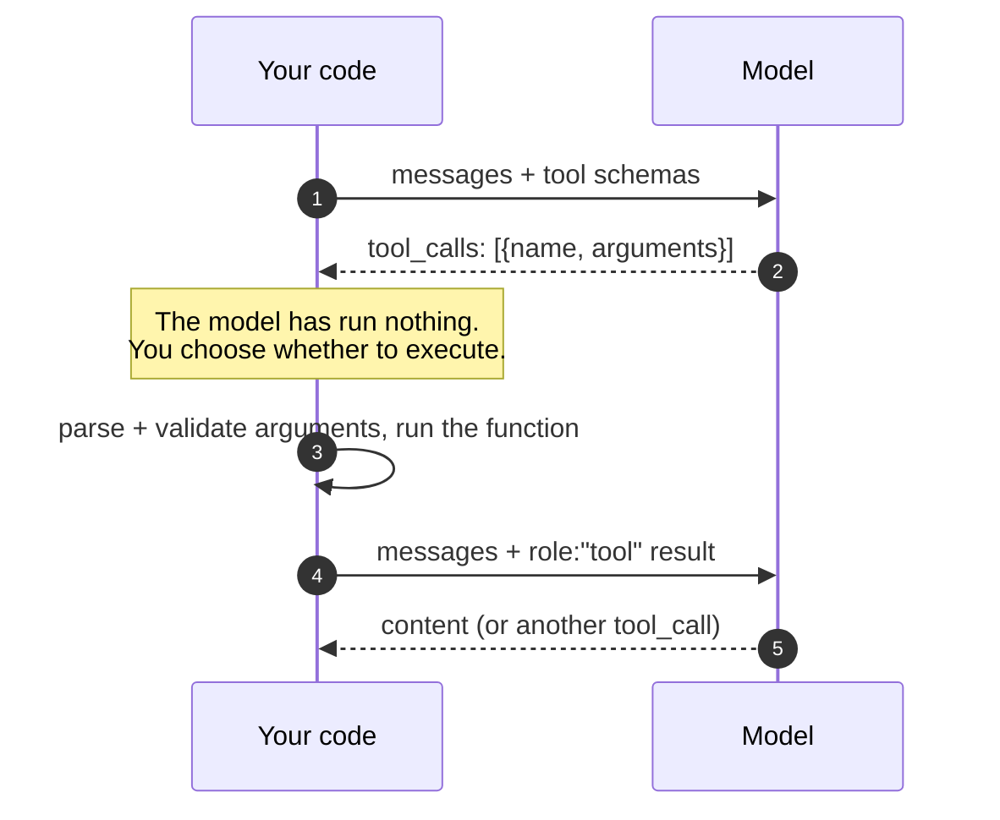

# Tool calling

!!! abstract
    "Function calling" is a misleading name. The model never calls anything. It
    emits a structured *request* — a name and a JSON string of arguments — and
    your code decides whether to honour it. Understanding that this is a protocol
    rather than execution is what makes every agent framework legible afterwards.

**Prerequisites:** [Setup](../00-start-here/setup.md) — a model answering locally.

**Verified as of 2026-08-21.**

## What you'll be able to do

Define a tool, recognise a tool-call request in a raw response, dispatch it
yourself, and hand the result back so the model can use it.

## The mechanism

Three things move between you and the model:



A tool is **two things that must agree**: a JSON Schema the model reads, and a
function you run. Nothing enforces the agreement. If they drift, the model sends
arguments your function does not accept and you get an error the model never
sees.

## The three details that matter

**Arguments arrive as a string, not an object.** `arguments` is JSON *text* the
model wrote. Parse it, then validate it. The schema guides the model; it does not
bind it.

**Descriptions are the interface.** The model chooses a tool by reading its
`description`. A vague description is a bug — it produces a model that reaches
for the wrong tool, and no amount of prompt engineering elsewhere fixes it.

**Errors belong in the conversation, not in a stack trace.** Return
`{"error": "..."}` as the tool result. A raised exception ends the run with a
traceback the model never sees and cannot correct. A returned error gives it a
chance to try again with different arguments.

## Build it

[**Lab 02 — tool dispatch**](https://github.com/nitin27may/ai-resources/tree/main/labs/02-tool-dispatch) · free, local, ~1 minute

```bash
python3 labs/02-tool-dispatch/lab.py
```

It asks the model a question it cannot answer from memory, prints the raw
tool-call request, dispatches it by hand, and feeds the result back.

## Verify

You should see a `tool_calls` block with `"arguments": "{\"sku\":\"ABC-1\"}"` —
note the escaping; it is a string — followed by the model answering correctly
once the result is in context.

**What failure looks like:** the lab exits non-zero if the model answers directly
without requesting the tool. That is the quiet failure mode of weak tool support:
the model invents a plausible number rather than admitting it needs to look one
up. It is not an error you can catch — only an answer you can distrust.

## In a framework

Every framework wraps exactly this. In Microsoft Agent Framework, the schema is
generated from your Python type hints by a decorator, and the dispatch step is
inside `agent.run()` — see
[`tutorials/02-add-tools`](https://github.com/nitin27may/e-commerce-agents/tree/main/tutorials/02-add-tools).

## In production

[`product_discovery/tools.py`](https://github.com/nitin27may/e-commerce-agents/blob/main/agents/python/product_discovery/tools.py)
in `e-commerce-agents` — real tools with filtering, validation and clamped
inputs. Note `shared/tool_inputs.py` alongside it: production tools re-validate
arguments even though a schema was supplied, for exactly the reason above.

## Go deeper

- [Writing effective tools for agents](https://www.anthropic.com/engineering/writing-effective-tools-for-agents) — Anthropic, Sep 2025. The best single piece on tool design: namespacing, token-efficient responses, actionable errors. Vendor-authored but concrete and non-promotional.
- [Advanced tool use](https://www.anthropic.com/engineering/advanced-tool-use) — Anthropic, Nov 2025. What to do when the tool definitions themselves start costing more context than the task.

## Next

[The agent loop](the-agent-loop.md) — what happens when one tool result creates
the need for another.
