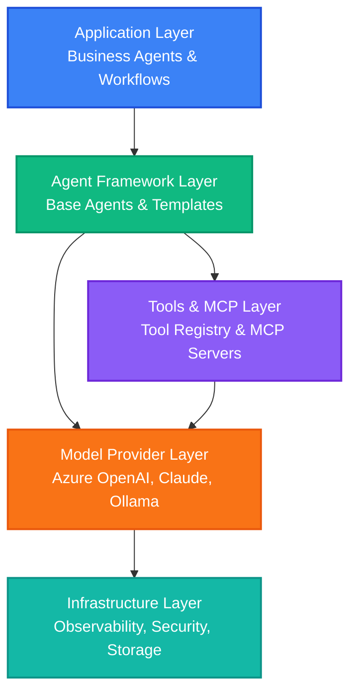
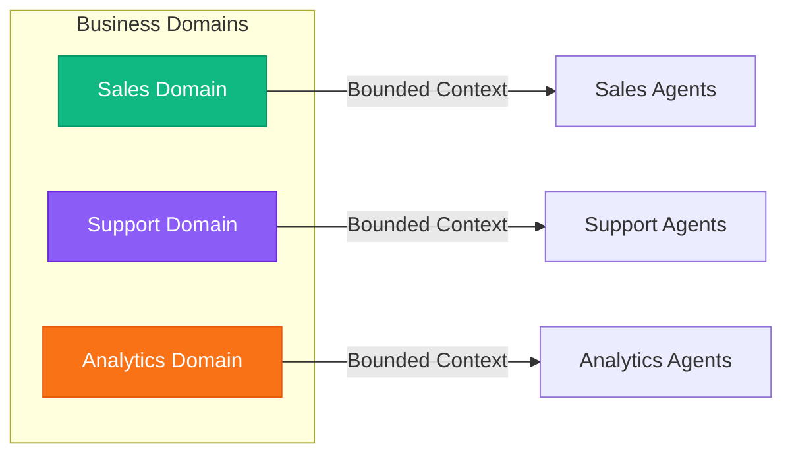
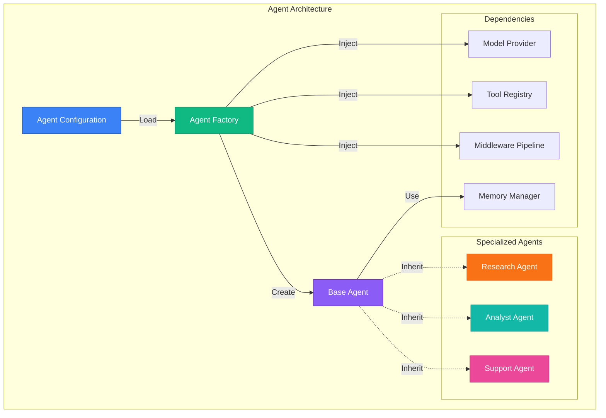
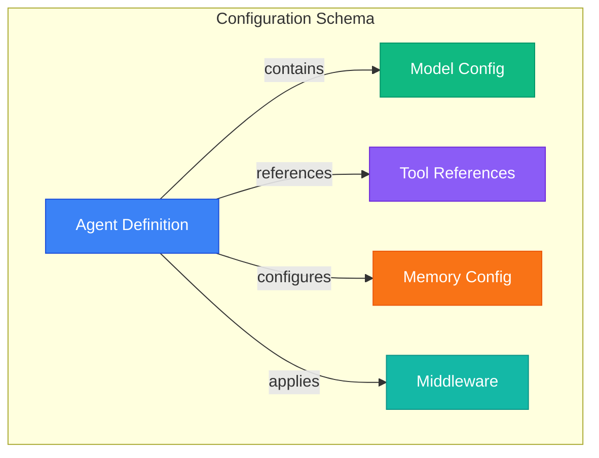
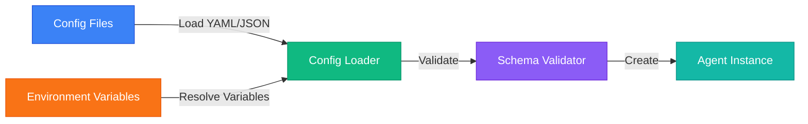
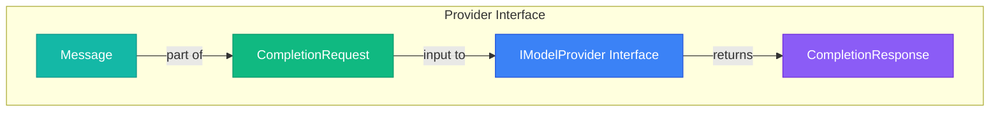
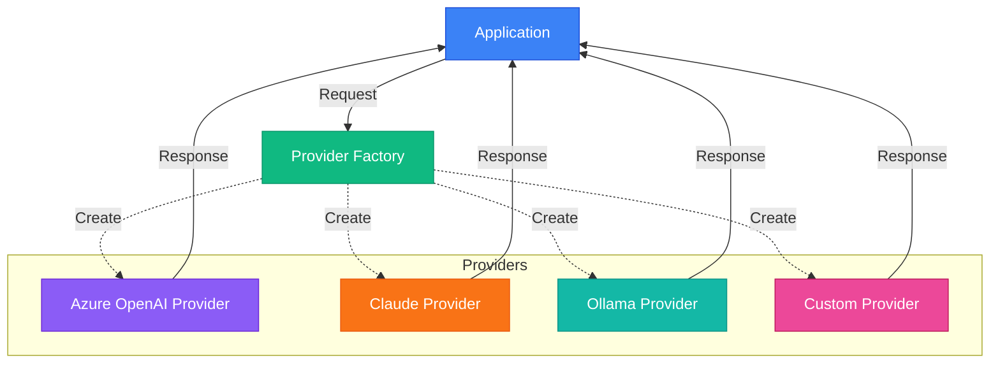
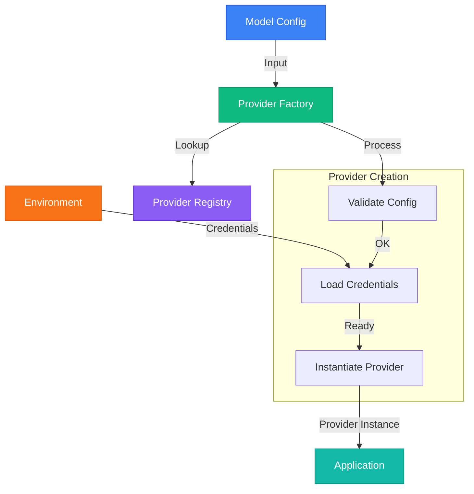

# Enterprise Agentic System Architecture with Microsoft Agent Framework

## Executive Summary

This document outlines a comprehensive enterprise-level architecture for building reusable, scalable AI agents using Microsoft Agent Framework, with support for MCP (Model Context Protocol) tools, multi-model providers (Azure OpenAI, Claude, Ollama), and plug-and-play components.

---

## Table of Contents

1. [Architecture Overview](#architecture-overview)
2. [Core Design Principles](#core-design-principles)
3. [Project Structure](#project-structure)
4. [Component Architecture](#component-architecture)
5. [Reusable Components](#reusable-components)
6. [MCP Tools Architecture](#mcp-tools-architecture)
7. [Agent Configuration System](#agent-configuration-system)
8. [Multi-Model Provider Strategy](#multi-model-provider-strategy)
9. [Best Practices](#best-practices)

---

## 1. Architecture Overview

### 1.1 Layered Architecture



### 1.2 Key Architectural Decisions

!!! tip "Design Philosophy"
    This architecture prioritizes flexibility, reusability, and maintainability through thoughtful design decisions that enable enterprise-scale deployment.

=== "Modularity"
    **Modularity First**: Every component (agents, tools, workflows) is independently deployable
    
    - Components can be developed, tested, and deployed separately
    - Reduces coupling and increases system resilience
    - Enables team autonomy and parallel development

=== "Configuration"
    **Configuration-Driven**: Minimize code changes through extensive configuration
    
    - Agents defined in YAML/JSON files
    - Tool assignments through configuration
    - Environment-specific settings externalized
    - Reduces deployment risk and improves agility

=== "Protocols"
    **Protocol Adherence**: Full MCP and A2A (Agent-to-Agent) protocol support
    
    - Standards-based tool integration
    - Interoperability with ecosystem
    - Future-proof architecture
    - Community-driven improvements

=== "Multi-Tenancy"
    **Multi-Tenancy Ready**: Support for multiple teams/projects with isolation
    
    - Logical separation of resources
    - Independent configurations per tenant
    - Shared infrastructure, isolated data
    - Cost optimization through resource pooling

=== "Cloud Agnostic"
    **Cloud-Agnostic Core**: While optimized for Azure, core components work anywhere
    
    - Provider abstraction layer
    - Portable across cloud platforms
    - Hybrid deployment support
    - Avoid vendor lock-in

---

## 2. Core Design Principles

### 2.1 SOLID Principles Applied to Agents

!!! info "SOLID Principles in Agent Architecture"
    These time-tested object-oriented design principles provide the foundation for building maintainable, scalable agent systems.

=== "Single Responsibility"
    **Single Responsibility Principle (SRP)**
    
    Each component has ONE clear, well-defined purpose:
    
    - ✓ Each agent focuses on one domain or capability
    - ✓ Tools perform one specific action
    - ✓ Workflows orchestrate, agents execute
    - ✓ Clear boundaries reduce complexity

=== "Open/Closed"
    **Open/Closed Principle (OCP)**
    
    Open for extension, closed for modification:
    
    - ✓ Extend agents through configuration, not code changes
    - ✓ Add capabilities via middleware/plugins
    - ✓ Tool registry enables dynamic tool addition
    - ✓ No core framework changes for new features

=== "Liskov Substitution"
    **Liskov Substitution Principle (LSP)**
    
    Subtypes must be substitutable for their base types:
    
    - ✓ All model providers implement common interface
    - ✓ Agent types interchangeable through base classes
    - ✓ Tools follow consistent contract
    - ✓ Seamless provider/agent swapping

=== "Interface Segregation"
    **Interface Segregation Principle (ISP)**
    
    Clients shouldn't depend on unused interfaces:
    
    - ✓ Separate interfaces for different capabilities
    - ✓ Tools expose only required methods
    - ✓ Depend on abstractions, not concretions
    - ✓ Lean, focused contracts

=== "Dependency Inversion"
    **Dependency Inversion Principle (DIP)**
    
    Depend on abstractions, not implementations:
    
    - ✓ Use interfaces (IModelProvider, IToolRegistry)
    - ✓ High-level policies independent of details
    - ✓ Inject dependencies via factory pattern
    - ✓ Never hard-code implementations

### 2.2 Enterprise Patterns

!!! note "Battle-Tested Design Patterns"
    Leveraging proven enterprise patterns ensures the architecture scales effectively and remains maintainable as the system grows.

**Domain-Driven Design (DDD)**



- Organize by business domains (Sales, Support, Analytics)
- Bounded contexts for each domain
- Ubiquitous language in agent instructions
- Domain experts collaborate on agent design

**Repository Pattern**

- **AgentRepository**: Store and retrieve agent definitions with versioning
- **ToolRepository**: Manage tool catalog with discovery and registration
- **ConfigurationRepository**: Centralized configuration with environment management
- **StateRepository**: Persist agent state and conversation history

**Factory Pattern**

- **AgentFactory**: Create agents from configurations with dependency injection
- **ToolFactory**: Instantiate tools dynamically with lazy loading
- **WorkflowFactory**: Build workflows from definitions with validation
- **ProviderFactory**: Create model providers with credential management

**Strategy Pattern**

- **Model Provider Selection**: Runtime selection based on requirements
- **Routing Strategies**: Dynamic routing in workflows based on context
- **Tool Selection**: Algorithm-driven tool matching for tasks
- **Retry Strategies**: Configurable retry and fallback policies

---

## 3. Project Structure

### 3.1 Monorepo Structure (Recommended)

```
enterprise-agent-framework/
│
├── packages/                          # Reusable packages
│   ├── core/                         # Core framework extensions
│   │   ├── src/
│   │   │   ├── agents/              # Base agent classes
│   │   │   ├── models/              # Model provider abstractions
│   │   │   ├── tools/               # Tool base classes
│   │   │   ├── workflows/           # Workflow orchestration
│   │   │   ├── middleware/          # Middleware pipeline
│   │   │   └── interfaces/          # Core interfaces
│   │   ├── tests/
│   │   └── pyproject.toml / package.json
│   │
│   ├── tools-library/               # Reusable tools package
│   │   ├── src/
│   │   │   ├── http/               # HTTP tools
│   │   │   ├── database/           # Database tools
│   │   │   ├── file/               # File system tools
│   │   │   ├── api-integrations/   # Third-party APIs
│   │   │   └── custom/             # Custom business tools
│   │   ├── tests/
│   │   └── pyproject.toml
│   │
│   ├── mcp-tools/                   # MCP tool packages
│   │   ├── mcp-http-server/        # HTTP MCP server
│   │   ├── mcp-database-server/    # Database MCP server
│   │   ├── mcp-crm-server/         # CRM integration
│   │   └── mcp-analytics-server/   # Analytics tools
│   │
│   ├── agent-templates/             # Reusable agent templates
│   │   ├── research-agent/
│   │   ├── customer-support-agent/
│   │   ├── code-review-agent/
│   │   └── data-analyst-agent/
│   │
│   ├── model-providers/             # Model provider implementations
│   │   ├── azure-openai-provider/
│   │   ├── claude-provider/
│   │   ├── ollama-provider/
│   │   └── openai-provider/
│   │
│   └── shared/                      # Shared utilities
│       ├── config/                  # Configuration schemas
│       ├── logging/                 # Structured logging
│       ├── monitoring/              # Observability
│       └── security/                # Auth & authorization
│
├── services/                         # Deployable services
│   ├── agent-runtime/               # Agent execution service
│   ├── mcp-gateway/                 # MCP server gateway
│   ├── tool-registry/               # Tool discovery service
│   ├── workflow-orchestrator/       # Workflow engine
│   └── api-gateway/                 # External API gateway
│
├── applications/                     # Business applications
│   ├── customer-support/            # Customer support app
│   ├── sales-assistant/             # Sales automation
│   ├── data-analysis/               # Analytics platform
│   └── code-assistant/              # Developer tools
│
├── infrastructure/                   # IaC and deployment
│   ├── terraform/                   # Cloud infrastructure
│   ├── kubernetes/                  # K8s manifests
│   ├── docker/                      # Container definitions
│   └── scripts/                     # Deployment scripts
│
├── docs/                            # Documentation
│   ├── architecture/
│   ├── api/
│   ├── guides/
│   └── examples/
│
├── config/                          # Configuration files
│   ├── agents/                      # Agent definitions
│   ├── tools/                       # Tool configurations
│   ├── workflows/                   # Workflow definitions
│   └── environments/                # Environment configs
│
└── tests/                           # Integration tests
    ├── e2e/
    ├── integration/
    └── performance/
```

### 3.2 Core Package Structure

The core package provides the fundamental building blocks for enterprise AI agents:

**Agent Core**: Contains base agent implementations including chat agents, workflow agents, and specialized domain-specific agents like research, analyst, and support agents.

**Model Provider Abstraction**: Defines interfaces and factories for different AI model providers (Azure OpenAI, Claude, Ollama) with unified configuration management.

**Tools Framework**: Provides the foundation for tool creation, registration, discovery, and validation with decorators for easy tool development.

**MCP Integration**: Implements client and server wrappers for Model Context Protocol with transport layers and tool adapters for seamless MCP compatibility.

**Workflows**: Offers workflow graph construction and execution with common patterns including sequential, parallel, and conditional execution.

**Middleware**: Implements cross-cutting concerns through a pipeline architecture covering logging, metrics, security, and caching.

**Configuration**: Handles schema definition, configuration loading, validation, and environment management for consistent agent setup.

**Observability**: Integrates OpenTelemetry for tracing, metrics collection, and structured logging across all components.

**State Management**: Manages thread persistence, agent memory, and workflow checkpoints for stateful agent interactions.

---

## 4. Component Architecture

### 4.1 Reusable Agent Architecture

The agent architecture follows SOLID principles with a base agent class that provides:

**AgentConfig Structure**: Defines agent configuration including name, description, instructions, model settings, tool assignments, middleware stack, memory configuration, and metadata for governance.

**Base Agent Class**: Abstract base providing initialization, tool registry integration, model provider injection, and middleware pipeline execution. All specialized agents inherit from this foundation.

**Specialized Agents**: Domain-specific implementations (Research, Analyst, Support) that inherit from BaseAgent and add specialized processing logic for their specific use cases.

**Agent Factory**: Creates agents from configuration with dependency injection for model providers, tool registry access, and dynamic middleware pipeline construction. Supports loading from YAML files.

**Composability**: Agents are composed of interchangeable parts - model providers, tools, and middleware - allowing flexible configuration without code changes.



### 4.2 Configuration-Driven Agent Definition

Agents are defined declaratively through YAML configuration files containing:

**Identity**: Name, version, type classification, and descriptive text for agent cataloging.

**Model Configuration**: Provider selection (Azure OpenAI, Claude, Ollama), model name, temperature settings, token limits, and provider-specific parameters.

**Instructions**: System prompts defining agent behavior, constraints, and operational guidelines in natural language.

**Tool Assignment**: References to registered tools the agent can invoke, enabling capability composition.

**Middleware Stack**: Ordered list of cross-cutting concerns (logging, metrics, caching, rate limiting) applied during execution.

**Memory Configuration**: Settings for conversation history management, context window size, and persistence strategy.

**Metadata**: Governance information including ownership, tagging, cost allocation, and compliance requirements.

**Capabilities**: Feature flags controlling streaming responses, multi-turn conversation support, and tool calling behavior.

---

## 5. Reusable Components

### 5.1 MCP Tool Components

MCP (Model Context Protocol) tools are designed as reusable, configurable components that can be packaged and shared across projects:

**HTTP Tool**: Generic HTTP client tool supporting multiple authentication methods (Bearer, API Key, OAuth2, Basic) with configurable base URLs, headers, timeouts, and retry policies. Can be configured for any REST API without code changes.

**Database Tools**: Reusable connectors for PostgreSQL, MySQL, MongoDB, and other databases with query execution, transaction management, and connection pooling.

**File System Tools**: Standardized file operations including read, write, search, and transformation capabilities with security controls and path restrictions.

**Search Tools**: Web search, document search, and vector search tools with unified interfaces and configurable providers.

**Communication Tools**: Email, Slack, Teams, and other communication platform integrations with template management and delivery tracking.

### 5.2 Tool Configuration Pattern

Tools are configured declaratively through structured configuration files defining:

**Tool Identity**: Name, version, type classification, and description for discovery and cataloging.

**MCP Server Configuration**: Command execution details, arguments, environment variables, and resource requirements for MCP server initialization.

**Tool-Specific Settings**: API endpoints, authentication credentials (environment variable references), default headers, timeout values, and retry strategies.

**Usage Examples**: Sample invocations demonstrating common use cases and parameter patterns for documentation and testing.

### 5.3 Tool Packaging and Distribution

Tools are packaged as standalone, distributable components:

**Package Structure**: Standard Python package with project metadata, dependencies, scripts, and build configuration.

**Dependency Management**: Clear specification of required libraries, optional development dependencies, and version constraints.

**Distribution**: Published to internal or public package registries (PyPI, private artifact repos) for easy installation and version management.

**Reusability**: Installed and configured in multiple projects without duplication, promoting consistency and reducing maintenance overhead.

---

## 6. Configuration Management

Configuration management provides a structured approach to defining, loading, and validating agent and tool configurations across the system.

### 6.1 Configuration Schema Design

The configuration system uses strongly-typed schemas to ensure correctness and enable validation:

**Model Provider Schema**: Defines supported providers (Azure OpenAI, Claude, Ollama, OpenAI) with standardized configuration parameters including temperature, token limits, sampling parameters, and provider-specific settings.

**Tool Reference Schema**: Specifies tool identity, version constraints, and tool-specific configuration parameters for runtime instantiation.

**Memory Configuration Schema**: Controls memory behavior including type (conversation, summary, vector), capacity limits, and backend storage options (Redis, PostgreSQL).

**Agent Definition Schema**: Complete agent specification including identity, instructions, model configuration, tool references, middleware stack, memory settings, workflow configuration, and deployment parameters.

**Tool Definition Schema**: Comprehensive tool specification supporting Python tools (module, class, function references), MCP tools (server configuration), and generic tools with configuration schemas, metadata, and ownership information.



### 6.2 Configuration Loader Pattern

The configuration loader implements a centralized system for loading and validating configurations with key capabilities:

**Multi-Format Support**: Loads configurations from YAML and JSON files with automatic format detection.

**Environment Variable Resolution**: Replaces environment variable references (${VAR_NAME} or $VAR_NAME) with actual values at load time for secure secret management.

**Validation**: Applies schema validation using Pydantic models to catch configuration errors before runtime.

**Caching**: Maintains environment variable cache to optimize repeated lookups and improve performance.

**Path Resolution**: Handles relative paths and discovers configuration files across standard directory structures (config/agents/, config/tools/).



---

## 7. Multi-Model Provider Strategy

The multi-model provider strategy enables seamless switching between different AI model providers through a unified interface, supporting Azure OpenAI, Claude, Ollama, and other providers without application code changes.

### 7.1 Provider Interface Design

All model providers implement a common interface ensuring consistent behavior:

**Message Structure**: Standardized message format with role (system, user, assistant), content, and optional metadata.

**Completion Request**: Unified request format containing messages, temperature, token limits, tool definitions, streaming preferences, and provider-specific parameters.

**Completion Response**: Consistent response structure with generated content, role, tool calls, finish reason, token usage statistics, and metadata.

**Core Operations**: Common methods for completion generation, streaming, configuration validation, and model discovery.



### 7.2 Provider Implementations

Each provider implements the common interface while handling provider-specific requirements:

**Azure OpenAI Provider**: Integrates with Azure OpenAI Service using Azure SDK, supports Azure AD authentication via DefaultAzureCredential, handles API key or token-based auth, manages deployment names and API versions, and provides comprehensive token usage tracking.

**Claude Provider**: Connects to Anthropic's Claude API, converts message formats between standard and Claude-specific structures, handles system messages separately, supports Claude's tool calling format, and tracks input/output token usage.

**Ollama Provider**: Interfaces with local Ollama installations, configurable host endpoints for flexible deployment, supports open-source models (Llama, Mistral, etc.), handles local model management, and provides simplified response format.



### 7.3 Provider Factory Pattern

The factory pattern centralizes provider instantiation and configuration:

**Provider Registration**: Maintains registry of available providers with automatic discovery and registration of built-in providers, support for custom provider registration, and graceful handling of missing optional providers.

**Configuration Loading**: Maps generic model configuration to provider-specific settings, loads credentials from environment variables, handles provider-specific parameters, and validates configuration before instantiation.

**Provider Creation**: Instantiates providers based on configuration, injects provider-specific dependencies, applies security best practices, and returns fully configured provider instances.

**Flexibility Benefits**: Easy addition of new providers, configuration-driven provider selection, no application code changes to switch providers, and centralized provider management.



---

## 8. Best Practices

### 9.1 Agent Development

**DO:**
- Keep agents focused on single responsibilities
- Use configuration for all customization
- Version your agent definitions
- Document expected inputs/outputs
- Include usage examples
- Test agents in isolation

**DON'T:**
- Hard-code API keys or secrets
- Create god agents that do everything
- Bypass the tool registry
- Ignore error handling
- Skip observability instrumentation

### 9.2 Tool Development

**DO:**
- Make tools stateless when possible
- Use clear, descriptive function names
- Validate all inputs
- Return structured outputs
- Include error information
- Document tool capabilities

**DON'T:**
- Create tools with side effects that aren't obvious
- Return unstructured string data
- Ignore authentication requirements
- Skip input validation
- Create tools that are too specific

### 9.3 MCP Tool Publishing

**DO:**
- Follow semantic versioning
- Include comprehensive README
- Provide configuration examples
- Add integration tests
- Document authentication patterns
- Include Docker/container examples

**DON'T:**
- Publish untested tools
- Skip version management
- Omit security considerations
- Forget backward compatibility
- Ignore documentation

### 9.4 Configuration Management

**DO:**
- Use environment variables for secrets
- Version control configurations (except secrets)
- Validate configs at load time
- Provide default configurations
- Document all config options

**DON'T:**
- Store secrets in config files
- Hard-code environment-specific values
- Skip schema validation
- Use inconsistent naming

### 9.5 Testing Strategy

**Unit Tests:**
- Test each component in isolation
- Mock external dependencies
- Cover edge cases
- Aim for >80% coverage

**Integration Tests:**
- Test agent + tool interactions
- Test multi-step workflows
- Test error scenarios
- Use test fixtures

**E2E Tests:**
- Test complete workflows
- Use real (sandbox) APIs
- Test deployment scenarios
- Monitor performance

**Performance Tests:**
- Measure latency per agent type
- Test concurrent execution
- Monitor resource usage
- Establish SLOs

---

## 9. Conclusion

This architecture provides:

✅ **Reusability**: Agents, tools, and workflows are reusable across projects
✅ **Flexibility**: Easy to swap models (Azure OpenAI ↔ Claude ↔ Ollama)
✅ **Scalability**: Designed for enterprise scale from day one
✅ **Maintainability**: Configuration-driven, well-structured codebase
✅ **MCP Native**: Full support for Model Context Protocol
✅ **Package-able**: Tools can be published and shared as packages
✅ **Observable**: Built-in tracing, logging, and metrics
✅ **Secure**: Authentication, authorization, and audit logging

### Next Steps

1. Review this architecture with your team
2. Start with Phase 1 (Foundation)
3. Build first proof-of-concept agent
4. Iterate based on learnings
5. Gradually expand to more providers and tools

### Additional Resources

- [Microsoft Agent Framework Docs](https://learn.microsoft.com/en-us/agent-framework/)
- [MCP Specification](https://modelcontextprotocol.io/)
- [Agent Framework GitHub](https://github.com/microsoft/agent-framework)
- [Agent Framework Samples](https://github.com/microsoft/Agent-Framework-Samples)

---
