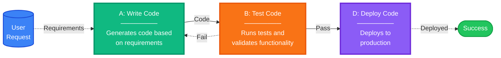
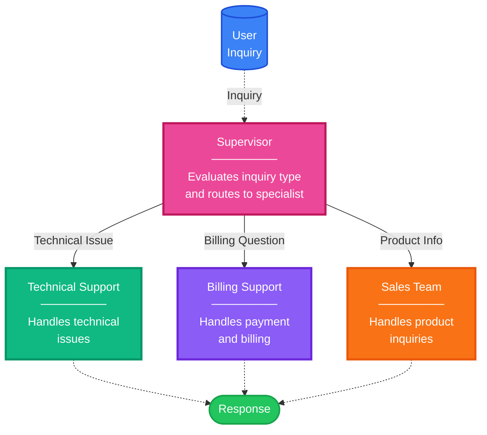
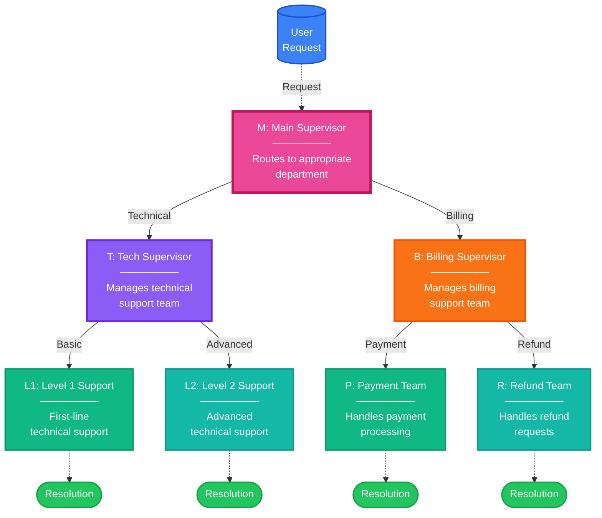
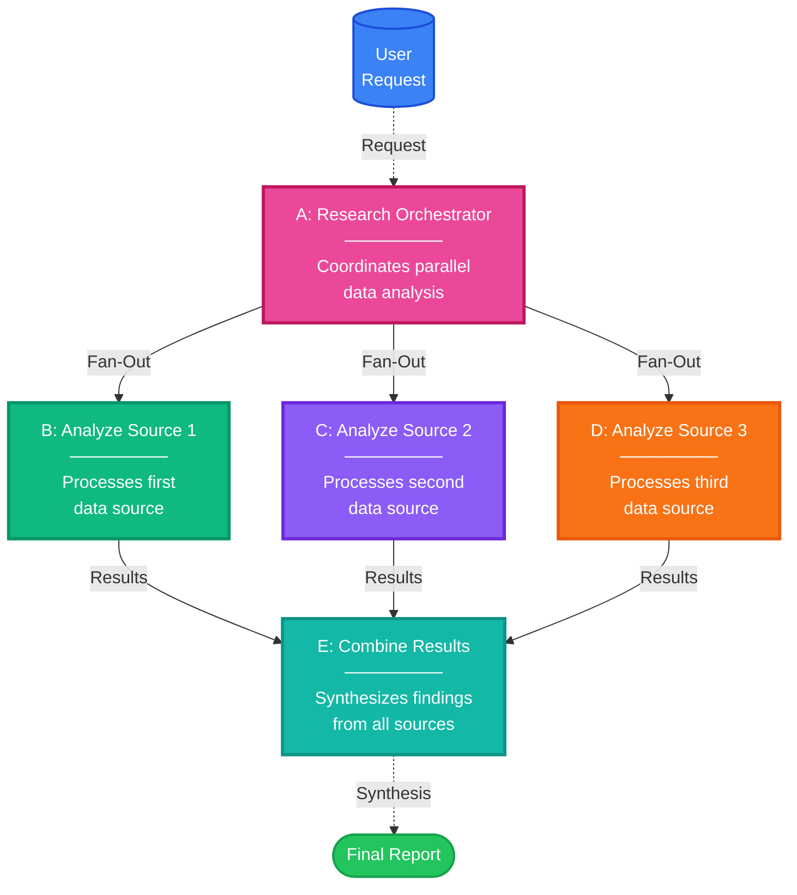
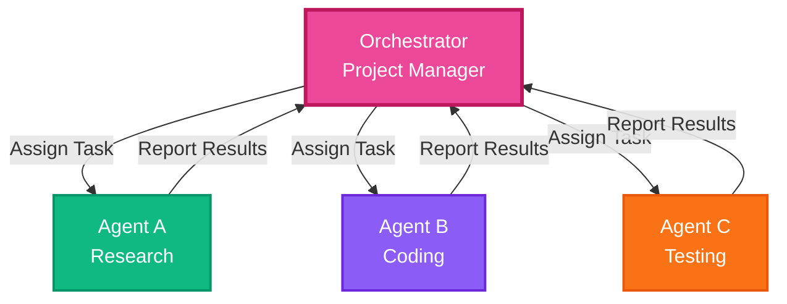
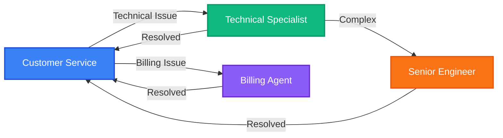
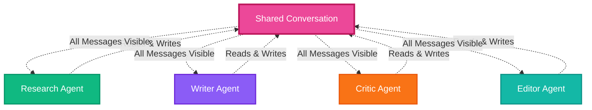
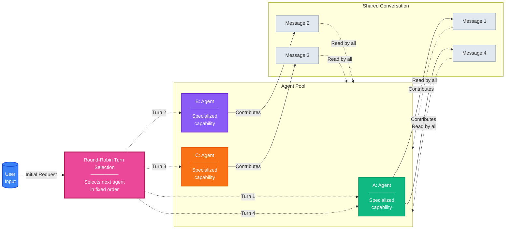
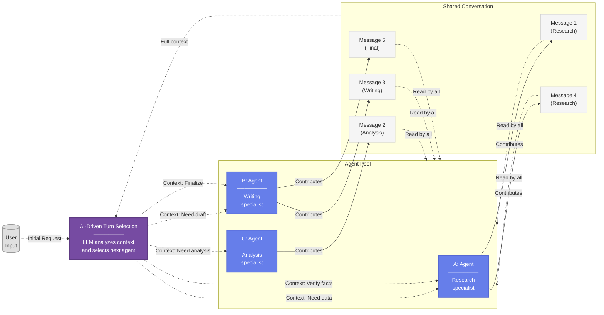
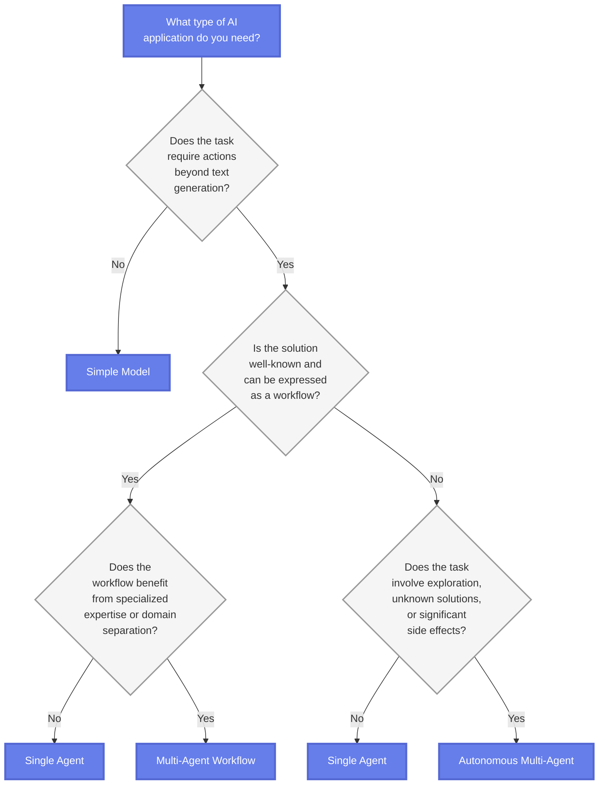

# AI Agent Architecture Patterns

## Overview

Building AI applications requires choosing the right level of complexity from a spectrum of architectures: simple models for text generation, single agents for action-taking, multi-agent workflows for structured collaboration, and autonomous multi-agent systems for exploratory problem-solving.

### Challenges and Considerations

While autonomous multi-agent systems offer the most sophisticated capabilities, they introduce significant challenges:

!!! warning "Autonomous System Challenges"
    - **Unpredictable outcomes** - Behavior can vary between runs
    - **Reproducibility issues** - Different model versions may produce different results
    - **Increased error potential** - More moving parts means more failure points
    - **Complex security boundaries** - Harder to control and audit agent actions

This comprehensive guide helps you select the appropriate architecture by understanding each pattern's characteristics, use cases, and implementation strategies.

---

## Foundation: Basic Architecture Patterns

### Simple Model

**When to use:**

- Tasks require only text generation
- No external actions or tool usage needed
- Direct question-answer scenarios from training data
- Document summarization or code generation from specifications

**Characteristics:**

- Fast and cost-effective
- Easy to implement with direct LLM API calls
- Limited to text processing, analysis, or generation

**Example Use Cases:**

- Text completion and generation
- Simple question answering
- Content summarization
- Code generation from clear specifications

### Single Agent

**When to use:**

- Tasks require actions beyond text generation
- Solution involves known action sequences with action-perception loops
- Can be handled effectively by one type of expertise
- Tasks involve API calls with result validation
- No need for specialized domain expertise or complex collaboration

**Characteristics:**

- Flexible with tool usage capabilities
- Moderate complexity
- Can handle action-taking with appropriate tools
- May struggle with highly complex multi-step tasks

**Example Use Cases:**

- Simple automation tasks
- Basic tool calling scenarios
- Straightforward decision-making
- Tasks requiring validation loops

### Multi-Agent Workflow

**When to use:**

- Solution can be expressed as a well-defined workflow
- Benefits from specialized expertise or domain separation
- Different parts of the task require distinct domain knowledge
- Collaboration pattern between agents is well-understood
- Each agent's role and handoffs follow established processes

**Characteristics:**

- Structured and maintainable
- Clear agent responsibilities
- Orchestrated, predictable execution flow
- Requires upfront design
- Less flexible than autonomous approaches

**Example Use Cases:**

- Content creation pipeline (research, writing, editing agents)
- Customer service routing (triage, specialist, resolution)
- Financial analysis (market data, risk assessment, portfolio optimization)
- Data processing workflows with specialized steps

### Autonomous Multi-Agent

**When to use:**

- Tasks involve exploration and discovery
- Solutions emerge through dynamic agent interaction
- Agents must adapt collaboration based on intermediate results
- Performance improves through iterative learning
- Solutions are unknown or emergent
- Significant side effects need to be managed

**Characteristics:**

- Handles complex scenarios
- Adaptive and emergent solutions
- Higher cost and complexity
- Unpredictable outcomes
- Requires careful monitoring and safeguards

**Example Use Cases:**

- Complex problem-solving requiring creative approaches
- Application development with evolving requirements
- Research tasks with uncertain outcomes
- Scenarios requiring agent negotiation and coordination

---

## Workflow Patterns (Explicit Control)

Workflow patterns provide developer-defined execution paths with predictable behavior. These patterns borrow concepts from graph theory to model multi-agent orchestration as computational graphs where nodes represent computational units and edges define control flow between nodes.

### Graph-Based Orchestration Fundamentals

!!! info "Key Concepts in Workflow Patterns"
    **Node**: A computational unit within the graph (e.g., an agent or function). Nodes typically have defined inputs which they process and generate output data structures. Nodes may maintain their own internal state, read and modify shared state, and interact with the rest of the system through their output and shared state.
    
    **Edge**: A connection between nodes that defines control flow or transitions. For an edge E that defines a transition from node A to node B, the implied behavior is that the output of A becomes the input of B. Edges may be conditional—the transition only occurs if certain conditions are met based on output, shared state, external signals, human input, or a combination of these.

**Benefits of Graph-Based Approach:**

- **Validation**: Execution paths can be validated before runtime
- **Visualization**: Agent interactions are easy to visualize and reason about
- **Deterministic**: Predictable execution behavior
- **Composability**: Workflows can be nested and reused

!!! tip "Implementation Phases"
    Workflow patterns have two distinct phases:
    
    1. **Build Phase**: The graph structure is constructed and validated
    2. **Run Phase**: The graph is executed with actual data

### Sequential Workflows

Sequential workflows implement linear execution where each node's output feeds into the next node (A → B → C), ensuring ordered processing with predictable execution timing.


**Characteristics:**

- Each step must complete before the next begins
- Ensures ordered processing of information
- Clear error isolation - if one stage fails, you know exactly where
- Predictable execution timing

**Ideal For:**

- Tasks with natural sequential dependencies
- Output of one stage is essential input for the next
- News summarization pipelines
- Data processing pipelines
- Report generation workflows

**Example**: News Summarization Pipeline  
User Request → Topic Selection → Research → Analysis → Report Generation → Output

### Conditional Workflows

Conditional workflows use logic-based edges to determine the next node based on conditions, enabling branching execution paths and dynamic routing.



**Characteristics:**

- Dynamic branching based on evaluation results
- Enables retry and correction loops
- Conditional logic determines execution path
- Supports iterative improvement

**Ideal For:**

- Code development and testing
- Quality assurance workflows
- Approval processes
- Error handling and retry logic

**Example**: Code Development  
Write Code → Test Code → (Pass: Deploy | Fail: Back to Write Code)

#### Supervisor Workflows

A supervisor workflow is a conditional workflow variant where a central control node evaluates requests and routes tasks to specialized agents based on task characteristics.



**Characteristics:**

- Central control node for routing decisions
- Specialized agents for different domains
- Results flow back through supervisor
- Clear separation of concerns

**Ideal For:**

- Customer service systems
- Task routing and delegation
- Multi-department workflows
- Help desk operations

#### Hierarchical Workflows

When each node itself contains a workflow, we get hierarchical patterns enabling complex systems like multi-tier support desks where supervisors manage sub-teams.



**Characteristics:**

- Multiple layers of orchestration
- Department supervisors manage sub-teams
- Complex organizational workflows
- Scalable team structures

**Ideal For:**

- Large-scale support operations
- Enterprise workflow management
- Multi-tier approval processes
- Complex organizational structures

### Parallel Workflows

Parallel workflows enable concurrent execution of independent tasks using Directed Acyclic Graphs (DAGs), with fan-out phases that split work and fan-in phases that combine results.



**Characteristics:**

- **Fan-Out Phase**: Work is distributed to multiple agents for parallel processing
- **Fan-In Phase**: Results are collected and synthesized
- Significant performance benefits for time-consuming tasks
- Independent tasks run simultaneously without side effects

**Ideal For:**

- Processing multiple data sources
- Running independent analyses
- Parallel API calls
- Map-reduce style operations
- Performance-critical workflows

**Example**: Research Analysis  
Orchestrator → (Parallel: Analyze Source 1, 2, 3) → Combine Results → Output

### Workflow Patterns: Strengths and Limitations

=== "Strengths"
    - **Predictability**: You know exactly what will happen and when
    - **Reliability**: Proven execution paths with clear error handling
    - **Debuggability**: Easy to identify where failures occur
    - **Performance**: Can optimize execution paths
    - **Validation**: Paths can be validated before runtime
    - **Visualization**: Easy to understand and communicate

=== "Limitations"
    - **Flexibility**: Struggle with tasks requiring dynamic adaptation
    - **Upfront Design**: Require knowledge of correct task decomposition
    - **Static Nature**: Optimal sequence must be predetermined
    - **Resource Intensive**: Need developer expertise to design workflows
    - **Adaptation**: Cannot easily adjust to changing requirements at runtime

!!! note "Relationship to Software Engineering Patterns"
    These workflow patterns are fundamentally similar to well-known pipeline patterns used extensively in data processing and software development. Beyond incorporating intelligent computations (e.g., LLMs in nodes or nested workflows), the core concepts remain largely unchanged. This similarity is advantageous—it allows us to leverage existing ideas from software engineering, scaling, and testing to build reliable multi-agent systems.

### When Workflow Patterns Work Best

Workflow patterns rely on several key assumptions:

1. **Known Solution**: The correct task decomposition is identified
2. **Available Resources**: Time and developer expertise are available
3. **Static Tasks**: Predictable requirements without need for real-time adjustments
4. **Clear Dependencies**: Input-output relationships are well understood

!!! warning "When These Assumptions Don't Hold"
    When tasks are dynamic, solutions are unknown, or resources are limited, autonomous patterns offer an alternative approach that shifts control from developers to the agents themselves.

---

## Multi-Agent Orchestration Patterns

Multi-agent orchestration patterns fall into two main categories based on control flow:

1. **Workflow Patterns (Explicit Control)** - Developer-defined execution paths with predictable behavior
2. **Autonomous Patterns (Emergent Control)** - Runtime-determined execution based on agent reasoning

### Graph-Based Orchestration Concepts

A common, emergent practice is to borrow concepts from graph theory and model multi-agent orchestration as computational graphs where nodes represent computational units and edges define control flow.

!!! info "Key Graph Concepts"
    **Node**: A computational unit within the graph (e.g., an agent or function)
    
    - Nodes have defined inputs which they process to generate output
    - May maintain internal state and read/modify shared state
    - Interact with the system through outputs and shared state
    
    **Edge**: A connection between nodes that defines control flow
    
    - Output of Node A becomes input of Node B
    - May be conditional based on output, state, or external signals
    - Can incorporate human input or arbitrary logic

**Benefits of Graph-Based Approach:**

- ✓ **Validation** - Execution paths validated before runtime
- ✓ **Visualization** - Easy to reason about system behavior
- ✓ **Determinism** - Predictable execution behavior
- ✓ **Debugging** - Clear error isolation and troubleshooting

---

## Autonomous Patterns (Emergent Control)

Autonomous patterns enable runtime-determined execution based on task state and agent reasoning. The critical concept is that **the flow of control is driven by an AI model** and dynamically determined at runtime. Rather than following prescribed paths, agents orchestrate through communication and shared understanding of the current task context.

These patterns exist on a **spectrum of control**, from structured orchestration to fully emergent behavior.

!!! info "Hierarchical Composition in Autonomous Patterns"
    An important design principle is that any "agent" in these patterns may itself be a **multi-agent system internally**, implementing any of the workflow or autonomous orchestration patterns. These composite agents present as a single entity to the broader system, with their internal conversations and orchestration remaining private.
    
    **Example**: What appears as a single "Coder agent" might internally be:
    
    - A workflow pattern with sequential Research → Code → Test steps
    - An autonomous orchestration pattern managing specialized sub-agents
    
    This **hierarchical approach** provides clear boundaries and reduces communication noise in the overall system.

### Plan-Based Orchestration Pattern

The plan-based orchestration pattern employs a **single orchestrator agent** to manage entire task execution through explicit plan creation, dynamic task assignment, and centralized progress monitoring. This agent acts as a "project manager", creating plans, assigning work, reviewing progress, and orchestrating between specialized agents.

**Pattern Structure:**



**Control Flow Characteristics:**

| Aspect | Description |
|--------|-------------|
| **Plan Management** | Orchestrator maintains explicit task plans with assignments and dependencies |
| **Visibility** | Orchestrator sees all context; other agents receive only relevant information |
| **Task Assignment** | Explicit work distribution by orchestrator based on current plan |
| **State Management** | Centralized in orchestrator (plan, progress monitoring, result evaluation) |

**Example Scenario: Software Development**

Consider a software development task:

1. **Orchestrator** creates development plan
2. **Assigns research** to Agent A
3. **Monitors output** from Agent A
4. **Assigns coding** to Agent B with only relevant context from Agent A
5. **Reviews and coordinates** final delivery

This selective information sharing helps prevent context overload and maintains focus.

**Strengths:**

!!! success "Advantages"
    - ✓ Excel at **complex task decomposition** and resource management
    - ✓ Efficiently orchestrate **diverse specialists** while maintaining oversight
    - ✓ **Clear accountability** and progress tracking
    - ✓ **Selective information sharing** prevents context overload

**Limitations:**

!!! warning "Challenges"
    - ✗ Creates a **single point of failure**
    - ✗ May **bottleneck** on orchestrator's reasoning capabilities
    - ✗ **Centralized control** can limit parallel execution opportunities

**Real-World Examples:**

!!! example "Industry Implementations"
    **Microsoft's Magentic-One**
    
    - Multi-agent architecture with lead Orchestrator directing four other agents
    - Uses explicit Task and Progress Ledgers
    - Achieves **statistically competitive performance** on multiple agentic benchmarks
    
    **Anthropic's Research System**
    
    - Orchestrator-worker pattern with parallel subagent delegation
    - Dynamically spawns **1-10+ subagents** based on query complexity
    - Results in **90.2% performance improvement** over single-agent approaches

### Handoff Pattern

Handoff patterns enable agents to operate with **limited, local knowledge** while still achieving coordinated behavior through **peer-to-peer delegation**. Agents make local decisions about when and to whom they should transfer control based on their understanding of the task and knowledge of other available agents.

**Pattern Structure:**



**Control Flow Characteristics:**

| Aspect | Description |
|--------|-------------|
| **Visibility** | Each agent knows only a subset of other agents and their capabilities |
| **Turn-taking** | Direct handoff via explicit transfer mechanisms |
| **Decision Making** | Local decisions based on task needs and known agents |
| **State Management** | Explicitly passed between agents during handoff |

**Example Scenario: Customer Service**

A customer service workflow demonstrates this pattern:

1. **Customer Service** agent receives inquiry
2. **Evaluates** issue type locally
3. **Handoffs** to appropriate specialist:
    - Technical issues → Technical Specialist
    - Billing issues → Billing Agent
4. **Specialist** can further handoff (e.g., to Senior Engineer)
5. **Returns control** when resolved

Each agent makes handoff decisions based on local assessment and passes relevant context along.

**Strengths:**

!!! success "Advantages"
    - ✓ **Scalability and specialization** while avoiding central bottlenecks
    - ✓ Effective for **well-defined domains** with clear handoff criteria
    - ✓ **Simple implementation** - agents as tools, handoffs as tool calls
    - ✓ **Distributed decision-making** reduces single points of failure

**Limitations:**

!!! warning "Challenges"
    - ✗ Requires **careful design** to prevent stuck or cycling agents
    - ✗ Need **clear handoff criteria** and protocols
    - ✗ **Limited visibility** may result in suboptimal global decisions

!!! tip "Implementation Note"
    From an implementation perspective, this pattern is straightforward:
    
    - Agent A sees Agents B and D as **available tools**
    - Handoffs become **tool calls**
    - Clean separation of concerns

### Conversation-Driven Pattern (Group Chat)

In conversation-driven patterns (also known as **group chat patterns**), all agents participate in a **shared conversation** where orchestration emerges through turn-taking as part of a dialogue rather than explicit plans or structured handoffs. This approach mirrors **human team collaboration** where everyone can see the discussion and contribute when appropriate.

**Pattern Structure:**



**Control Flow Characteristics:**

| Aspect | Description |
|--------|-------------|
| **Visibility** | Broadcast - all agents observe all messages in shared conversation |
| **Turn-taking** | Determined by selection mechanisms (round-robin, random, or AI-driven) |
| **Decision Making** | Next speaker selected based on conversation context, not predetermined plans |
| **State Management** | Implicit in the conversation history |

!!! info "Why Conversation-Driven Patterns Work Naturally"
    Most modern AI models are trained for "chat completions" - taking turns within conversations by reading message history and generating appropriate responses. This makes LLMs inherently well-suited for conversation-driven coordination.
    
    **Implementation Simplicity**: The orchestration mechanism is essentially "all agents append to the same shared conversation list" - requiring minimal orchestration logic compared to complex workflow graphs.
    
    **Automated Improvements**: System performance improves automatically as upstream AI models become more capable, providing a "free upgrade" path without code changes.

#### Round-Robin Conversation Pattern

In the round-robin conversation pattern, agents take turns in a **fixed, repeating order**, until some termination condition is met. The conversation flows in a circular manner, with each agent contributing their input before passing the turn to the next agent.



**Key Characteristics:**

!!! note "Round-Robin Behavior"
    **Agents take turns in round-robin fashion** until some termination condition is met
    
    During each turn, agents make progress by **adding to a shared conversation**

=== "Strengths"
    - ✓ **Predictable turn order** - Easy to debug and understand
    - ✓ **Simple to implement** - Minimal orchestration logic required
    - ✓ **Equal participation** - Ensures all agents get their turn
    - ✓ **Fair resource distribution** - No agent dominates the conversation

=== "Limitations"
    - ✗ **May be inefficient** - Some agents might have nothing to contribute
    - ✗ **Fixed order** - Cannot adapt to conversation dynamics
    - ✗ **Potential waste** - Agents must participate even when not relevant
    - ✗ **Limited flexibility** - Cannot skip inactive agents

#### AI-Driven Conversation Pattern

In an AI-driven conversation pattern, an **LLM dynamically selects** the agent to take the next turn based on the current conversation context. This selection can be based on the task state, agent expertise, or other dynamic factors. The turn selection mechanism itself is an LLM prompt that evaluates the conversation history and decides which agent should speak next.



**Key Characteristics:**

!!! note "AI-Driven Selection"
    **AI is used to determine the agent** that takes the next turn given conversation state or until some termination condition is met
    
    During each turn, agents make progress by **adding to a shared conversation**

**Comparison: Round-Robin vs AI-Driven Selection**

Consider a research task with Research, Writer, and Critic agents:

=== "Round-Robin Selection"
    **Fixed Turn Order**
    
    ```
    Turn 1: Research Agent → Gathers information
    Turn 2: Writer Agent   → Drafts content (may be premature)
    Turn 3: Critic Agent   → Reviews draft
    Turn 4: Research Agent → (Must participate even if done)
    Turn 5: Writer Agent   → Revises content
    Turn 6: Critic Agent   → Final review
    ```
    
    - ✓ Predictable sequence
    - ✗ Some turns may be wasted
    - ✗ Cannot skip agents based on need

=== "AI-Driven Selection"
    **Context-Based Turn Order**
    
    ```
    Turn 1: Research Agent → "Research is needed"
    Turn 2: Research Agent → "More data required"
    Turn 3: Writer Agent   → "Research complete, draft content"
    Turn 4: Critic Agent   → "Draft needs improvement"
    Turn 5: Writer Agent   → "Address feedback"
    Turn 6: Critic Agent   → "Verify final version"
    ```
    
    - ✓ Adaptive to conversation state
    - ✓ Agents selected only when relevant
    - ✗ Less predictable behavior

**Strengths of Conversation-Driven Patterns:**

- **Transparency**: All agents maintain shared context and can build naturally on each other's contributions
- **Emergent Collaboration**: With AI-driven selection, sophisticated behaviors emerge organically
- **Natural Retry Loops**: A Coder agent might be selected again after code execution results appear in conversation history
- **Branching Logic**: Dynamic exploration without explicit programming
- **Flexibility**: Easy to add or remove agents without restructuring workflows

!!! info "Connection to Single-Agent Patterns"
    Conversation-driven patterns naturally enable core mechanisms of well-known single-agent research patterns through their built-in turn-taking and shared conversation history:
    
    **ReAct Pattern**: Creates a Thought-Action-Observation loop where reasoning traces help induce and update action plans. For example, when answering complex questions, ReAct alternates between thinking ("I need to search for X"), acting (searching Wikipedia), and observing results to plan next steps. In conversation-driven patterns, this happens when specialized agents (Thinker, Actor, Observer) take turns building reasoning traces in shared conversation.
    
    **Reflexion Pattern**: Converts failure signals into actionable verbal feedback stored as episodic memory for future attempts. When tasks fail, agents generate natural language reflections explaining specific mistakes and corrective actions—such as "I failed because I incorrectly assumed the pan was in the stove burner, but it wasn't there. Next time I should verify the pan's location before trying to clean it"—then successfully complete subsequent attempts using these stored lessons. In conversation-driven patterns, Reflexion-like learning occurs when agents learn from past mistakes visible in conversation history. The conversation itself becomes the episodic memory enabling both reasoning loops and learning from failure.

**Limitations of Conversation-Driven Patterns:**

- **Token Usage**: Grows linearly with conversation length, making them expensive for extended tasks
- **Context Window**: Can overflow, causing agents to lose important early context
- **Conflicting Decisions**: Agents working from the same conversation may still make conflicting decisions due to incomplete understanding of each other's reasoning
- **Fragmented Outcomes**: Despite shared visibility, can lead to fragmented outcomes
- **Scalability**: Performance degrades with many agents or long conversations

### Quick Reference: Autonomous Patterns

| Pattern | Control Structure | Best For | Complexity | Scalability |
|---------|------------------|----------|------------|-------------|
| **Plan-Based Orchestration** | Centralized orchestrator | Complex tasks needing decomposition | Medium | Medium |
| **Handoff** | Peer-to-peer delegation | Well-defined domain boundaries | Low | High |
| **Round-Robin Conversation** | Fixed turn order | Simple collaborative tasks | Low | Low |
| **AI-Driven Conversation** | Dynamic turn selection | Exploratory, emergent tasks | Medium | Medium |

---

## Choosing the Right AI Agent Architecture

The decision framework below helps you select the appropriate architecture by following a logical progression of questions about your task requirements.



### Decision Framework Steps

**Step 1: Does your task require actions beyond text generation?**

If your task involves only text processing, analysis, or generation, directly calling an AI model to generate a response is sufficient. Choose **Simple Model**.

If action-taking is required, proceed to the next step.

**Step 2: Is your solution well-known and can be expressed as a workflow?**

If you have a clear understanding of the steps needed and how they should be executed, proceed to Step 3 to choose between single agents and multi-agent workflows.

If the solution approach is not well-defined, proceed to Step 4 to evaluate the level of exploration required.

**Step 3: Does the workflow benefit from specialized expertise?**

If different parts of the task require distinct domain knowledge and the collaboration pattern is well-understood, choose **Multi-Agent Workflow**.

If the task can be handled effectively by one type of expertise, choose **Single Agent**.

**Step 4: Does the task involve exploration, unknown solutions, or significant side effects?**

If the task requires known action sequences with action-perception loops (like API calls with result validation), choose **Single Agent**.

If solutions emerge through exploration and dynamic agent interaction, or agents must adapt based on intermediate results, choose **Autonomous Multi-Agent**.

## Implementation Considerations

### Framework Recommendations

| Pattern | Pros | Cons | Recommended Frameworks |
|---------|------|------|------------------------|
| **Simple Model** | Fast, cost-effective, easy to implement | Limited capabilities, no tool usage | Direct LLM API calls (OpenAI, Anthropic, Azure OpenAI) |
| **Single Agent** | Flexible, can use tools, moderate complexity | May struggle with complex multi-step tasks | LangChain, Semantic Kernel |
| **Multi-Agent Workflow** | Structured, maintainable, clear responsibilities | Requires upfront design, less flexible | LangGraph, Microsoft Agent Framework, AutoGen |
| **Autonomous Multi-Agent** | Handles complex scenarios, adaptive, emergent solutions | Higher cost, unpredictable, requires monitoring | CrewAI, AutoGen, Advanced LangGraph patterns |

### Complexity vs Capability Trade-offs

Each architecture level introduces additional complexity, development time, and potential failure points while offering greater capability and adaptability. Choose the simplest architecture that effectively addresses your requirements.

---

## Pattern Selection and Comparison

Having explored the full spectrum of multi-agent orchestration patterns, we can now compare each approach across four key dimensions:

!!! abstract "Key Dimensions"
    1. **Control Flow** - How execution moves between agents
    2. **Autonomy** - How flexibly the system can explore solution paths
    3. **Developer Control** - How much predictable control developers have
    4. **Complexity** - Implementation and operational complexity required

### Comprehensive Pattern Analysis

The following table provides a comprehensive comparison of all orchestration patterns:

| Pattern | Control Flow | Autonomy | Developer Control | Complexity |
|:--------|:------------|:--------:|:-----------------:|:----------:|
| **Sequential Workflow** | Linear sequence (A → B → C) | Low | High | Low |
| **Conditional Workflow** | Conditional routing | Low | High | Low-Medium |
| **Parallel Workflow** | Concurrent execution | Low | High | Medium |
| **Plan-Based Orchestration** | Dynamic orchestration | Medium | High | Medium |
| **Handoff** | Peer-to-peer delegation | Medium | Medium | Low |
| **Round-Robin Conversation** | Fixed rotation | Low | High | Low |
| **AI-Driven Conversation** | Context-driven selection | High | Low | Medium |

### Pattern Selection Criteria

**Based on Task Characteristics:**

- **Well-defined, repeatable processes** → Workflow patterns (Sequential, Conditional, Parallel)
- **Dynamic, exploratory tasks** → Autonomous patterns (Conversation-driven)
- **Complex planning required** → Plan-Based Orchestration
- **Domain expertise needed** → Handoff patterns
- **Emergent solutions required** → AI-Driven Conversation

**Based on System Requirements:**

- **High predictability needed** → Workflow patterns
- **Maximum autonomy required** → AI-Driven Conversation
- **Resource constraints** → Handoff patterns (minimal coordination overhead)
- **Scalability concerns** → Parallel Workflows or Handoff patterns
- **Transparency required** → Conversation-driven patterns (shared visibility)

**Based on Implementation Considerations:**

- **Developer resources available** → Workflow patterns (explicit control)
- **Rapid prototyping needed** → Conversation-driven patterns (simple implementation)
- **Production reliability critical** → Workflow patterns with explicit task management
- **Human oversight required** → Any pattern with human-in-the-loop integration
- **Complex task decomposition** → Plan-Based Orchestration

### Hybrid Approaches

Most production systems benefit from hybrid approaches that combine multiple patterns based on task decomposition:

**Design Principles:**

1. **Use workflow patterns** for predictable, well-understood components
2. **Apply autonomous patterns** where flexibility and adaptation are essential
3. **Implement task management patterns** consistently across all orchestration types
4. **Design hierarchical compositions** where complex agents internally use different patterns

**Example Hybrid Architecture:**

```
Application Development System:
├── Main Orchestrator (Plan-Based)
│   ├── Requirements Agent (Single Agent)
│   ├── Design Team (AI-Driven Conversation)
│   │   ├── Architecture Agent
│   │   ├── UI/UX Agent
│   │   └── Security Agent
│   ├── Implementation Workflow (Sequential)
│   │   ├── Coder Agent (internally: Research → Code → Test)
│   │   └── Code Review Agent
│   └── Testing Pipeline (Parallel Workflow)
│       ├── Unit Test Agent
│       ├── Integration Test Agent
│       └── Performance Test Agent
```

**Key Principle**: **Pattern-to-task alignment** - match the orchestration pattern to each task's inherent characteristics and your system's reliability requirements, rather than forcing all orchestration through a single pattern type.

### Decision Matrix

Use this matrix to quickly identify the most appropriate pattern:

| Your Requirement | Recommended Pattern |
|-----------------|---------------------|
| Fixed, repeatable steps | Sequential Workflow |
| Conditional branching | Conditional Workflow |
| Parallel processing | Parallel Workflow |
| Complex task planning | Plan-Based Orchestration |
| Specialized domain agents | Handoff Pattern |
| Simple collaboration | Round-Robin Conversation |
| Adaptive, exploratory | AI-Driven Conversation |
| Mix of above | Hybrid Approach |

## When to Avoid Multi-Agent Approaches

Stick to simpler architectures when dealing with:

**Simple and Deterministic Tasks**

- Temperature conversion
- Password generation
- Basic calculations

**Single Expertise Domain**

- Writing blog posts
- Simple content generation
- Straightforward data transformations

**Static Environments**

- Well-defined problems with unchanging requirements
- Predictable input-output patterns
- No need for adaptive behavior

**Minimal Context Needs**

- Tasks not requiring extensive information processing
- No need for information gathering or synthesis
- Direct transformations or generations

## Best Practices

### General Guidelines

1. **Start Simple**: Begin with simpler patterns and increase complexity only when needed
2. **Measure Performance**: Track latency, cost, and quality metrics for each architecture
3. **Validate Requirements**: Ensure the added complexity of multi-agent systems is justified
4. **Prototype First**: Test with simple implementations before committing to complex architectures

### For Multi-Agent Systems

1. **Define Clear Boundaries**: Clearly define each agent's responsibility and expertise domain
2. **Establish Communication Patterns**: Define how agents will interact and handoff tasks
3. **Implement Safeguards**: Add appropriate error handling and validation, especially for autonomous agents
4. **Monitor Behavior**: Continuously monitor agent interactions and outcomes
5. **Plan for Failures**: Design fallback mechanisms for when agents fail or produce unexpected results

### Optimization and Maintenance

1. **Iterate Based on Data**: Use observability tools to understand and improve agent performance
2. **Version Control**: Track changes to agent configurations and prompts
3. **Cost Management**: Monitor and optimize LLM API costs across agent interactions
4. **Regular Reviews**: Periodically review whether the chosen architecture still fits your needs

## Key Evaluation Questions

Before implementing your chosen architecture, consider:

**Complexity**

- How many steps are involved in the task?
- Are the steps predictable or exploratory?

**Domain Expertise**

- Does the task benefit from specialized knowledge?
- Are there distinct domains that should be separated?

**Tool Requirements**

- What external tools or APIs are needed?
- How complex are the tool interactions?

**Predictability**

- Is the solution path well-defined?
- How much uncertainty exists in the task?

**Side Effects**

- What are the consequences of actions?
- How critical is error handling?
- Are there security or safety concerns?


