# AI Agent Architecture Patterns

## Overview

Building AI applications requires choosing the right level of complexity from a spectrum of architectures: simple models for text generation, single agents for action-taking, multi-agent workflows for structured collaboration, and autonomous multi-agent systems for exploratory problem-solving.

### Challenges and Considerations

While autonomous multi-agent systems offer the most sophisticated capabilities, they introduce significant challenges:

!!! warning "Autonomous System Challenges"
    - **Unpredictable outcomes** - Behavior can vary between runs
    - **Reproducibility issues** - Different model versions may produce different results
    - **Increased error potential** - More moving parts means more failure points
    - **Complex security boundaries** - Harder to control and audit agent actions

This comprehensive guide helps you select the appropriate architecture by understanding each pattern's characteristics, use cases, and implementation strategies.

---

## Foundation: Basic Architecture Patterns

### Simple Model

**When to use:**

- Tasks require only text generation
- No external actions or tool usage needed
- Direct question-answer scenarios from training data
- Document summarization or code generation from specifications

**Characteristics:**

- Fast and cost-effective
- Easy to implement with direct LLM API calls
- Limited to text processing, analysis, or generation

**Example Use Cases:**

- Text completion and generation
- Simple question answering
- Content summarization
- Code generation from clear specifications

### Single Agent

**When to use:**

- Tasks require actions beyond text generation
- Solution involves known action sequences with action-perception loops
- Can be handled effectively by one type of expertise
- Tasks involve API calls with result validation
- No need for specialized domain expertise or complex collaboration

**Characteristics:**

- Flexible with tool usage capabilities
- Moderate complexity
- Can handle action-taking with appropriate tools
- May struggle with highly complex multi-step tasks

**Example Use Cases:**

- Simple automation tasks
- Basic tool calling scenarios
- Straightforward decision-making
- Tasks requiring validation loops

### Multi-Agent Workflow

**When to use:**

- Solution can be expressed as a well-defined workflow
- Benefits from specialized expertise or domain separation
- Different parts of the task require distinct domain knowledge
- Collaboration pattern between agents is well-understood
- Each agent's role and handoffs follow established processes

**Characteristics:**

- Structured and maintainable
- Clear agent responsibilities
- Orchestrated, predictable execution flow
- Requires upfront design
- Less flexible than autonomous approaches

**Example Use Cases:**

- Content creation pipeline (research, writing, editing agents)
- Customer service routing (triage, specialist, resolution)
- Financial analysis (market data, risk assessment, portfolio optimization)
- Data processing workflows with specialized steps

### Autonomous Multi-Agent

**When to use:**

- Tasks involve exploration and discovery
- Solutions emerge through dynamic agent interaction
- Agents must adapt collaboration based on intermediate results
- Performance improves through iterative learning
- Solutions are unknown or emergent
- Significant side effects need to be managed

**Characteristics:**

- Handles complex scenarios
- Adaptive and emergent solutions
- Higher cost and complexity
- Unpredictable outcomes
- Requires careful monitoring and safeguards

**Example Use Cases:**

- Complex problem-solving requiring creative approaches
- Application development with evolving requirements
- Research tasks with uncertain outcomes
- Scenarios requiring agent negotiation and coordination

---

## Workflow Patterns 

Workflow patterns provide developer-defined execution paths with predictable behavior. These patterns borrow concepts from graph theory to model multi-agent orchestration as computational graphs where nodes represent computational units and edges define control flow between nodes.

### Sequential Workflows

Sequential workflows implement linear execution where each node's output feeds into the next node (A → B → C), ensuring ordered processing with predictable execution timing.

```mermaid
flowchart LR
    User[("User<br/>Request")]
    A["A: Topic Selection<br/>────────<br/>Identifies key topics<br/>from user input"]
    B["B: Research<br/>────────<br/>Gathers information<br/>on selected topics"]
    C["C: Analysis<br/>────────<br/>Processes and<br/>analyzes research data"]
    D["D: Report Generation<br/>────────<br/>Creates comprehensive<br/>final report"]
    End([Output])
    
    User -.->|Input| A
    A -->|Selected Topics| B
    B -->|Research Data| C
    C -->|Analysis Results| D
    D -.->|Final Report| End
    
    style User fill:#3b82f6,stroke:#1d4ed8,stroke-width:2px,color:#fff
    style A fill:#10b981,stroke:#059669,stroke-width:3px,color:#fff
    style B fill:#8b5cf6,stroke:#6d28d9,stroke-width:3px,color:#fff
    style C fill:#f97316,stroke:#ea580c,stroke-width:3px,color:#fff
    style D fill:#14b8a6,stroke:#0d9488,stroke-width:3px,color:#fff
    style End fill:#22c55e,stroke:#16a34a,stroke-width:2px,color:#fff
```

**Characteristics:**

- Each step must complete before the next begins
- Ensures ordered processing of information
- Clear error isolation - if one stage fails, you know exactly where
- Predictable execution timing

**Ideal For:**

- Tasks with natural sequential dependencies
- Output of one stage is essential input for the next
- News summarization pipelines
- Data processing pipelines
- Report generation workflows

**Example**: News Summarization Pipeline  
User Request → Topic Selection → Research → Analysis → Report Generation → Output

### When Workflow Patterns Work Best

Workflow patterns rely on several key assumptions:

1. **Known Solution**: The correct task decomposition is identified
2. **Available Resources**: Time and developer expertise are available
3. **Static Tasks**: Predictable requirements without need for real-time adjustments
4. **Clear Dependencies**: Input-output relationships are well understood

!!! warning "When These Assumptions Don't Hold"
    When tasks are dynamic, solutions are unknown, or resources are limited, autonomous patterns offer an alternative approach that shifts control from developers to the agents themselves.

---

## Multi-Agent Orchestration Patterns

Multi-agent orchestration patterns fall into two main categories based on control flow:

1. **Workflow Patterns (Explicit Control)** - Developer-defined execution paths with predictable behavior
2. **Autonomous Patterns (Emergent Control)** - Runtime-determined execution based on agent reasoning

### Comprehensive Pattern Analysis

The following table provides a comprehensive comparison of all orchestration patterns:

| Pattern | Control Flow | Autonomy | Developer Control | Complexity |
|:--------|:------------|:--------:|:-----------------:|:----------:|
| **Sequential Workflow** | Linear sequence (A → B → C) | Low | High | Low |
| **Conditional Workflow** | Conditional routing | Low | High | Low-Medium |
| **Parallel Workflow** | Concurrent execution | Low | High | Medium |
| **Plan-Based Orchestration** | Dynamic orchestration | Medium | High | Medium |
| **Handoff** | Peer-to-peer delegation | Medium | Medium | Low |
| **Round-Robin Conversation** | Fixed rotation | Low | High | Low |
| **AI-Driven Conversation** | Context-driven selection | High | Low | Medium |

### Decision Matrix

Use this matrix to quickly identify the most appropriate pattern:

| Your Requirement | Recommended Pattern |
|-----------------|---------------------|
| Fixed, repeatable steps | Sequential Workflow |
| Conditional branching | Conditional Workflow |
| Parallel processing | Parallel Workflow |
| Complex task planning | Plan-Based Orchestration |
| Specialized domain agents | Handoff Pattern |
| Simple collaboration | Round-Robin Conversation |
| Adaptive, exploratory | AI-Driven Conversation |
| Mix of above | Hybrid Approach |

## When to Avoid Multi-Agent Approaches

Stick to simpler architectures when dealing with:

**Simple and Deterministic Tasks**

- Temperature conversion
- Password generation
- Basic calculations

**Single Expertise Domain**

- Writing blog posts
- Simple content generation
- Straightforward data transformations

**Static Environments**

- Well-defined problems with unchanging requirements
- Predictable input-output patterns
- No need for adaptive behavior

**Minimal Context Needs**

- Tasks not requiring extensive information processing
- No need for information gathering or synthesis
- Direct transformations or generations

## Best Practices

### General Guidelines

1. **Start Simple**: Begin with simpler patterns and increase complexity only when needed
2. **Measure Performance**: Track latency, cost, and quality metrics for each architecture
3. **Validate Requirements**: Ensure the added complexity of multi-agent systems is justified
4. **Prototype First**: Test with simple implementations before committing to complex architectures

### For Multi-Agent Systems

1. **Define Clear Boundaries**: Clearly define each agent's responsibility and expertise domain
2. **Establish Communication Patterns**: Define how agents will interact and handoff tasks
3. **Implement Safeguards**: Add appropriate error handling and validation, especially for autonomous agents
4. **Monitor Behavior**: Continuously monitor agent interactions and outcomes
5. **Plan for Failures**: Design fallback mechanisms for when agents fail or produce unexpected results

### Optimization and Maintenance

1. **Iterate Based on Data**: Use observability tools to understand and improve agent performance
2. **Version Control**: Track changes to agent configurations and prompts
3. **Cost Management**: Monitor and optimize LLM API costs across agent interactions
4. **Regular Reviews**: Periodically review whether the chosen architecture still fits your needs

## Key Evaluation Questions

Before implementing your chosen architecture, consider:

**Complexity**

- How many steps are involved in the task?
- Are the steps predictable or exploratory?

**Domain Expertise**

- Does the task benefit from specialized knowledge?
- Are there distinct domains that should be separated?

**Tool Requirements**

- What external tools or APIs are needed?
- How complex are the tool interactions?

**Predictability**

- Is the solution path well-defined?
- How much uncertainty exists in the task?

**Side Effects**

- What are the consequences of actions?
- How critical is error handling?
- Are there security or safety concerns?

