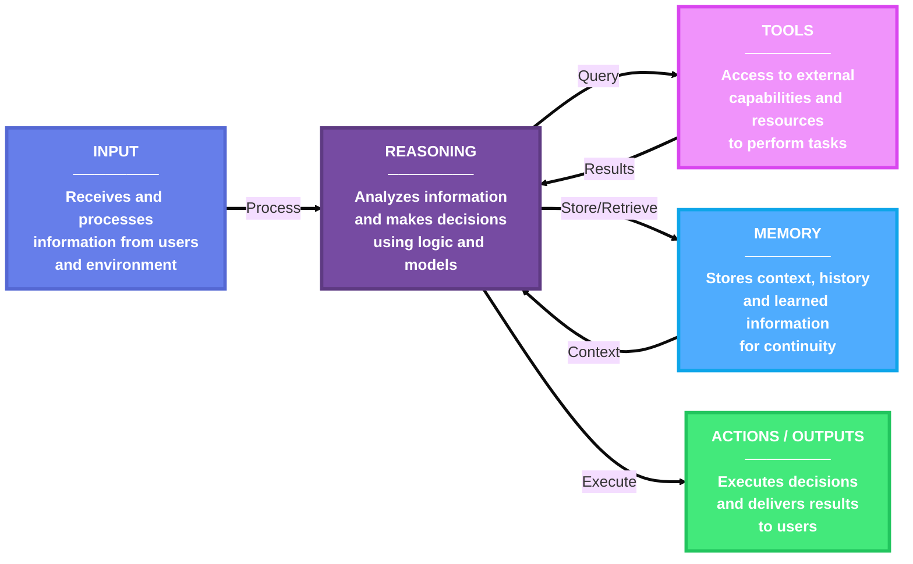
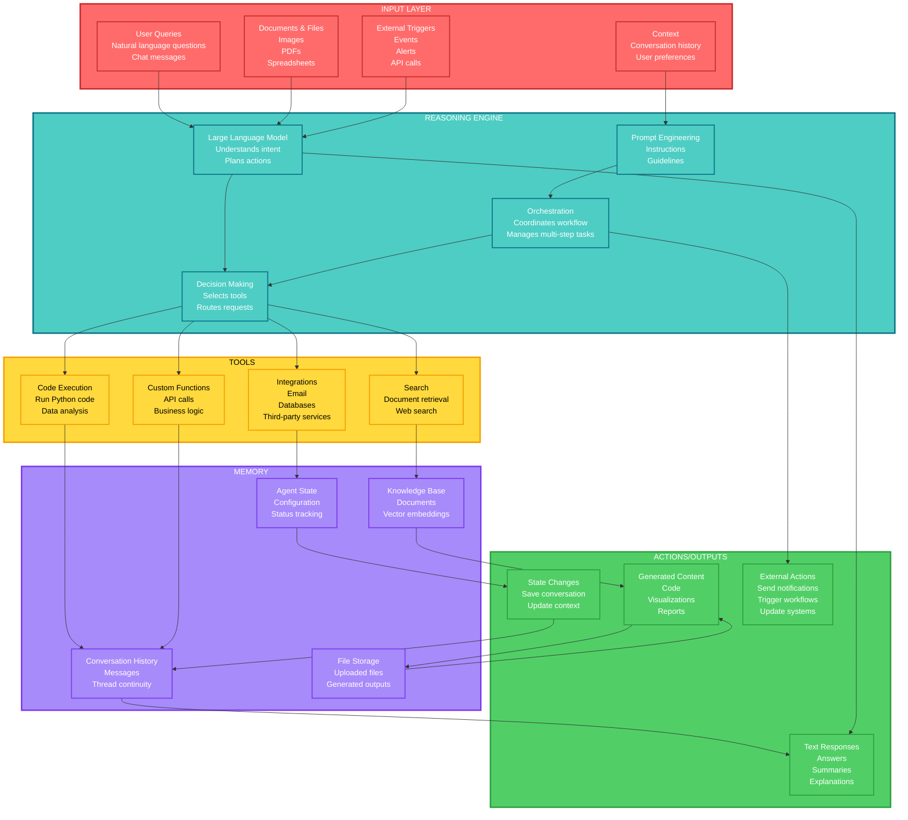

# AI Agents

## What is an AI agent?

AI Agents consist of five core components: **Input**, **Reasoning**, **Tools**, **Memory**, and **Actions/Outputs**. An AI agent uses an LLM to process user inputs, make decisions, call tools or MCP servers to perform actions, and generate responses. The following diagram illustrates the core components and their interactions in an AI agent:

Examples:

### When to use an AI agent?

AI agents are suitable for applications that require autonomous decision-making, ad hoc planning, trial-and-error exploration, and conversation-based user interactions. They are particularly useful for scenarios where the input task is unstructured and cannot be easily defined in advance.
Here are some common scenarios where AI agents excel:

- **Customer Support:** AI agents can handle multi-modal queries (text, voice, images) from customers, use tools to look up information, and provide natural language responses.
- **Education and Tutoring:** AI agents can leverage external knowledge bases to provide personalized tutoring and answer student questions.
- **Code Generation and Debugging:** For software developers, AI agents can assist with implementation, code reviews, and debugging by using various programming tools and environments.
- **Research Assistance:** For researchers and analysts, AI agents can search the web, summarize documents, and piece together information from multiple sources.

The key is that AI agents are designed to operate in a dynamic and underspecified setting, where the exact sequence of steps to fulfill a user request is not known in advance and might require exploration and close collaboration with users.
### When not to use an AI agent?

AI agents are not well-suited for tasks that are highly structured and require strict adherence to predefined rules. If your application anticipates a specific kind of input and has a well-defined sequence of operations to perform, using AI agents might introduce unnecessary uncertainty, latency, and cost.

**If you can write a function to handle the task, do that instead of using an AI agent. You can use AI to help you write that function.**

A single AI agent might struggle with complex tasks that involve multiple steps and decision points. Such tasks might require a large number of tools (for example, over 20), which a single agent cannot feasibly manage.

In these cases, consider using workflows instead.

## Workflows
### What is a Workflow?

A workflow can express a predefined sequence of operations that can include AI agents as components while maintaining consistency and reliability. Workflows are designed to handle complex and long-running processes that might involve multiple agents, human interactions, and integrations with external systems.
The execution sequence of a workflow can be explicitly defined, allowing for more control over the execution path. The following diagram illustrates an example of a workflow that connects two AI agents and a function:

```mermaid
%%{init: {'theme':'base', 'themeVariables': {'fontSize':'16px'}}}%%

graph LR
    Start([User Input])
    Func1["FUNCTION<br/>────────<br/>Data Fetching<br/>• REST API calls<br/>• Database queries<br/>• External data sources"]
    Agent1["AI AGENT 1<br/>────────<br/>Research Agent<br/>• Analyzes request<br/>• Searches knowledge base<br/>• Gathers information"]
    Func2["FUNCTION<br/>────────<br/>Data Processing<br/>• Validates data<br/>• Transforms format<br/>• Applies business rules"]
    Agent2["AI AGENT 2<br/>────────<br/>Response Agent<br/>• Synthesizes findings<br/>• Generates response<br/>• Formats output"]
    End([User Output])
    
    Start -->|"1. Initial Request"| Func1
    Func1 -->|"2. Fetched Data"| Agent1
    Agent1 -->|"3. Analyzed Data"| Func2
    Func2 -->|"4. Processed Data"| Agent2
    Agent2 -->|"5. Final Response"| End
    
    style Start fill:#667eea,stroke:#5568d3,stroke-width:3px,color:#ffffff,font-weight:bold
    style Func1 fill:#ff6b6b,stroke:#ee5a6f,stroke-width:4px,color:#ffffff,font-weight:bold
    style Agent1 fill:#f093fb,stroke:#d946ef,stroke-width:4px,color:#ffffff,font-weight:bold
    style Func2 fill:#feca57,stroke:#ff9f43,stroke-width:4px,color:#000000,font-weight:bold
    style Agent2 fill:#48dbfb,stroke:#0abde3,stroke-width:4px,color:#ffffff,font-weight:bold
    style End fill:#1dd1a1,stroke:#10ac84,stroke-width:3px,color:#ffffff,font-weight:bold
    
    linkStyle 0 stroke:#667eea,stroke-width:3px
    linkStyle 1 stroke:#ff6b6b,stroke-width:3px
    linkStyle 2 stroke:#f093fb,stroke-width:3px
    linkStyle 3 stroke:#feca57,stroke-width:3px
    linkStyle 4 stroke:#48dbfb,stroke-width:3px
```

Workflows can also express dynamic sequences using conditional routing, model-based decision making, and concurrent execution. This is how multi-agent orchestration patterns are implemented. The orchestration patterns provide mechanisms to coordinate multiple agents to work on complex tasks that require multiple steps and decision points, addressing the limitations of single agents.

### What problems do Workflows solve?

Workflows provide a structured way to manage complex processes that involve multiple steps, decision points, and interactions with various systems or agents. The types of tasks workflows are designed to handle often require more than one AI agent.

Here are some of the key benefits of Agent Framework workflows:

- **Modularity:** Workflows can be broken down into smaller, reusable components, making it easier to manage and update individual parts of the process.
- **Agent Integration:** Workflows can incorporate multiple AI agents alongside non-agentic components, allowing for sophisticated orchestration of tasks.
- **Type Safety:** Strong typing ensures messages flow correctly between components, with comprehensive validation that prevents runtime errors.
- **Flexible Flow:** Graph-based architecture allows for intuitive modeling of complex workflows with executors and edges. Conditional routing, parallel processing, and dynamic execution paths are all supported.
- **External Integration:** Built-in request/response patterns enable seamless integration with external APIs and support human-in-the-loop scenarios.
- **Checkpointing:** Save workflow states via checkpoints, enabling recovery and resumption of long-running processes on the server side.
- **Multi-Agent Orchestration:** Built-in patterns for coordinating multiple AI agents, including sequential, concurrent, hand-off, and Magentic.
- **Composability:** Workflows can be nested or combined to create more complex processes, allowing for scalability and adaptability.

