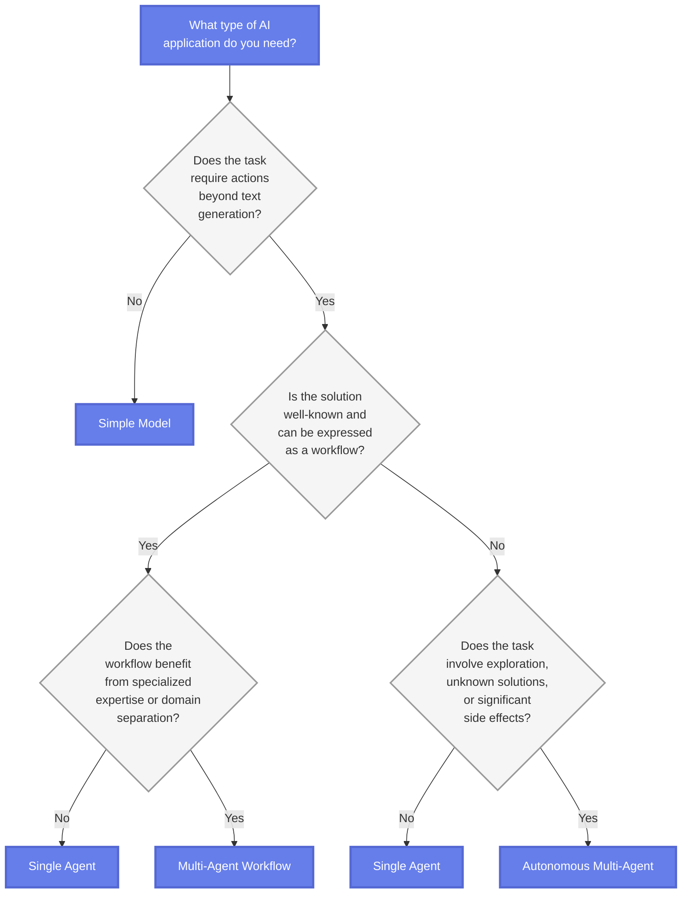

# AI Agent Architecture Patterns

## Overview

Building AI applications requires choosing the right level of complexity from a spectrum of architectures: simple models for text generation, single agents for action-taking, multi-agent workflows for structured collaboration, and autonomous multi-agent systems for exploratory problem-solving.

While autonomous multi-agent systems offer the most sophisticated capabilities, they introduce significant challenges including:

- Unpredictable outcomes
- Reproducibility issues across model versions
- Increased error potential
- Complex security boundaries

This guide helps you select the appropriate architecture by understanding each pattern's characteristics and use cases.

## Architecture Patterns Explained

### Simple Model

**When to use:**

- Tasks require only text generation
- No external actions or tool usage needed
- Direct question-answer scenarios from training data
- Document summarization or code generation from specifications

**Characteristics:**

- Fast and cost-effective
- Easy to implement with direct LLM API calls
- Limited to text processing, analysis, or generation

**Example Use Cases:**

- Text completion and generation
- Simple question answering
- Content summarization
- Code generation from clear specifications

### Single Agent

**When to use:**

- Tasks require actions beyond text generation
- Solution involves known action sequences with action-perception loops
- Can be handled effectively by one type of expertise
- Tasks involve API calls with result validation
- No need for specialized domain expertise or complex collaboration

**Characteristics:**

- Flexible with tool usage capabilities
- Moderate complexity
- Can handle action-taking with appropriate tools
- May struggle with highly complex multi-step tasks

**Example Use Cases:**

- Simple automation tasks
- Basic tool calling scenarios
- Straightforward decision-making
- Tasks requiring validation loops

### Multi-Agent Workflow

**When to use:**

- Solution can be expressed as a well-defined workflow
- Benefits from specialized expertise or domain separation
- Different parts of the task require distinct domain knowledge
- Collaboration pattern between agents is well-understood
- Each agent's role and handoffs follow established processes

**Characteristics:**

- Structured and maintainable
- Clear agent responsibilities
- Orchestrated, predictable execution flow
- Requires upfront design
- Less flexible than autonomous approaches

**Example Use Cases:**

- Content creation pipeline (research, writing, editing agents)
- Customer service routing (triage, specialist, resolution)
- Financial analysis (market data, risk assessment, portfolio optimization)
- Data processing workflows with specialized steps

### Autonomous Multi-Agent

**When to use:**

- Tasks involve exploration and discovery
- Solutions emerge through dynamic agent interaction
- Agents must adapt collaboration based on intermediate results
- Performance improves through iterative learning
- Solutions are unknown or emergent
- Significant side effects need to be managed

**Characteristics:**

- Handles complex scenarios
- Adaptive and emergent solutions
- Higher cost and complexity
- Unpredictable outcomes
- Requires careful monitoring and safeguards

**Example Use Cases:**

- Complex problem-solving requiring creative approaches
- Application development with evolving requirements
- Research tasks with uncertain outcomes
- Scenarios requiring agent negotiation and coordination

## Choosing the Right AI Agent Architecture

The decision framework below helps you select the appropriate architecture by following a logical progression of questions about your task requirements.

### Decision Framework Steps

**Step 1: Does your task require actions beyond text generation?**

If your task involves only text processing, analysis, or generation, directly calling an AI model to generate a response is sufficient. Choose **Simple Model**.

If action-taking is required, proceed to the next step.

**Step 2: Is your solution well-known and can be expressed as a workflow?**

If you have a clear understanding of the steps needed and how they should be executed, proceed to Step 3 to choose between single agents and multi-agent workflows.

If the solution approach is not well-defined, proceed to Step 4 to evaluate the level of exploration required.

**Step 3: Does the workflow benefit from specialized expertise?**

If different parts of the task require distinct domain knowledge and the collaboration pattern is well-understood, choose **Multi-Agent Workflow**.

If the task can be handled effectively by one type of expertise, choose **Single Agent**.

**Step 4: Does the task involve exploration, unknown solutions, or significant side effects?**

If the task requires known action sequences with action-perception loops (like API calls with result validation), choose **Single Agent**.

If solutions emerge through exploration and dynamic agent interaction, or agents must adapt based on intermediate results, choose **Autonomous Multi-Agent**.

## Autonomous Multi-Agent Patterns

Autonomous patterns enable runtime-determined execution based on task state and agent reasoning. A critical concept is that the flow of control is driven by an AI model and dynamically determined at runtime. Rather than following prescribed paths, agents orchestrate through communication and shared understanding of the current task context.

These patterns exist on a spectrum of control, from structured orchestration to fully emergent behavior.

!!! info "Hierarchical Composition in Autonomous Patterns"
    An important design principle is that any "agent" in these patterns may itself be a multi-agent system internally, implementing any of the workflow or autonomous orchestration patterns. These composite agents present as a single entity to the broader system, with their internal conversations and orchestration remaining private.
    
    For example, what appears as a single "Coder agent" might internally be a workflow pattern with sequential Research → Code → Test steps, or an autonomous orchestration pattern managing specialized sub-agents. This hierarchical approach provides clear boundaries and reduces communication noise in the overall system.

### Plan-Based Orchestration Pattern

The plan-based orchestration pattern employs a single orchestrator agent to manage entire task execution through explicit plan creation, dynamic task assignment, and centralized progress monitoring. This agent acts as a "project manager", creating plans, assigning work, reviewing progress, and orchestrating between specialized agents.

**Control Flow Characteristics:**

- **Plan Management**: Orchestrator maintains explicit task plans with assignments and dependencies
- **Visibility**: Orchestrator sees all context; other agents receive only relevant information
- **Task Assignment**: Explicit work distribution by the orchestrator based on the current plan
- **State Management**: Centralized in the orchestrator (plan, progress monitoring, result evaluation)

**Example Scenario:**

Consider a software development task: the orchestrator creates a development plan, assigns research to Agent A, monitors the output, then assigns coding to Agent B with only the relevant context from Agent A's research. This selective information sharing helps prevent context overload and maintains focus.

**Strengths:**

- Excel at complex task decomposition and resource management
- Efficiently orchestrate diverse specialists while maintaining oversight
- Clear accountability and progress tracking

**Limitations:**

- Create a single point of failure
- May bottleneck on the orchestrator's reasoning capabilities

**Real-World Examples:**

- **Microsoft's Magentic-One**: Uses "a multi-agent architecture where a lead agent, the Orchestrator, directs four other agents to solve tasks" through explicit Task and Progress Ledgers, achieving statistically competitive performance on multiple challenging agentic benchmarks
- **Anthropic's Research System**: Employs "an orchestrator-worker pattern, where a lead agent coordinates the process while delegating to specialized subagents that operate in parallel," with the lead agent dynamically spawning 1-10+ subagents based on query complexity, resulting in a 90.2% performance improvement over single-agent approaches

### Handoff Pattern

Handoff patterns enable agents to operate with limited, local knowledge while still achieving coordinated behavior through peer-to-peer delegation. Agents make local decisions about when and to whom they should transfer control based on their understanding of the task and knowledge of other available agents.

**Control Flow Characteristics:**

- **Visibility**: Each agent knows only a subset of other agents and their capabilities
- **Turn-taking**: Direct handoff via explicit transfer mechanisms
- **Decision Making**: Local decisions based on task needs and known agents
- **State Management**: Explicitly passed between agents during handoff

**Example Scenario:**

A customer service scenario: a Customer Service agent can handoff to either a Technical Specialist or Billing agent based on the issue type. The Technical Specialist, in turn, can handoff to a Senior Engineer or return control to Customer Service. Each agent makes handoff decisions based on their local assessment of the situation and passes relevant context along.

**Strengths:**

- Provides scalability and specialization while avoiding central bottlenecks
- Particularly effective for well-defined domains where handoff criteria can be clearly established
- Relatively simple implementation - agents can be represented as tools, and handoffs become tool calls

**Limitations:**

- Require careful design to prevent agents from getting stuck or cycling ineffectively
- Need clear handoff criteria and protocols

### Conversation-Driven Pattern (Group Chat)

In conversation-driven patterns (also known as group chat patterns), all agents participate in a shared conversation where orchestration emerges through turn-taking as part of a dialogue rather than explicit plans or structured handoffs. This approach mirrors human team collaboration where everyone can see the discussion and contribute when appropriate.

**Control Flow Characteristics:**

- **Visibility**: Broadcast - all agents observe all messages in the shared conversation
- **Turn-taking**: Determined by selection mechanisms (round-robin, random, or AI-driven)
- **Decision Making**: Next speaker selected based on conversation context, not predetermined plans
- **State Management**: Implicit in the conversation history

!!! info "Why Conversation-Driven Patterns Work Naturally"
    Most modern AI models are trained for "chat completions" - taking turns within conversations by reading message history and generating appropriate responses. This makes LLMs inherently well-suited for conversation-driven coordination.
    
    **Implementation Simplicity**: The orchestration mechanism is essentially "all agents append to the same shared conversation list" - requiring minimal orchestration logic compared to complex workflow graphs.
    
    **Automated Improvements**: System performance improves automatically as upstream AI models become more capable, providing a "free upgrade" path without code changes.

#### Round-Robin Conversation Pattern

In the round-robin conversation pattern, agents take turns in a fixed, repeating order, until some termination condition is met. The conversation flows in a circular manner, with each agent contributing their input before passing the turn to the next agent.

#### AI-Driven Conversation Pattern

In an AI-driven conversation pattern, an LLM or other AI model selects the agent to take the next turn based on the current conversation context. This selection can be based on the task state, agent expertise, or other dynamic factors.

**Example Scenario:**

Consider a research task with a Research agent, Writer, and Critic:

- **Round-robin selection**: Each agent takes turns in a predetermined order
- **AI-driven selection**: An LLM selector determines who should take the next turn based on context: "The research is complete, so the Writer should draft content" or "The draft needs improvement, so the Critic should provide feedback"

**Strengths:**

- Transparency and emergent collaboration
- All agents maintain shared context and can build naturally on each other's contributions
- With AI-driven selection, sophisticated behaviors emerge organically (natural retry loops, branching logic, in-situ exploration)

!!! info "Connection to Single-Agent Patterns"
    Conversation-driven patterns naturally enable core mechanisms of well-known single-agent research patterns like ReAct and Reflexion through their built-in turn-taking and shared conversation history.
    
    **ReAct**: Creates a Thought-Action-Observation loop where reasoning traces help induce and update action plans. In conversation-driven patterns, this happens when specialized agents (Thinker, Actor, Observer) take turns building reasoning traces in shared conversation.
    
    **Reflexion**: Converts failure signals into actionable verbal feedback stored as episodic memory for future attempts. In conversation-driven patterns, this occurs when agents learn from past mistakes visible in conversation history.

**Limitations:**

- Token usage grows linearly with conversation length, making them expensive for extended tasks
- Context windows can overflow, causing agents to lose important early context
- Agents working from the same conversation may still make "conflicting decisions" due to incomplete understanding of each other's reasoning

## Pattern Selection and Comparison

### Comparative Analysis

The following table compares multi-agent orchestration patterns across key dimensions: Control Flow, Autonomy, Control, and Complexity.

| Pattern | Control Flow | Autonomy | Developer Control | Complexity |
|---------|--------------|----------|-------------------|------------|
| **Sequential Workflow** | Linear sequence (A → B → C) | Low | High | Low |
| **Conditional Workflow** | Conditional routing | Low | High | Low-Medium |
| **Parallel Workflow** | Concurrent execution | Low | High | Medium |
| **Plan-Based Orchestration** | Dynamic orchestration | Medium | High | Medium |
| **Handoff** | Peer-to-peer delegation | Medium | Medium | Low |
| **Round-Robin Conversation** | Fixed rotation | Low | High | Low |
| **AI-Driven Conversation** | Context-driven selection | High | Low | Medium |

### Selection Criteria

**Based on Task Characteristics:**

- **Well-defined, repeatable processes** → Workflow patterns (Sequential, Conditional, Parallel)
- **Dynamic, exploratory tasks** → Autonomous patterns (Conversation-driven)
- **Complex planning required** → Plan-Based Orchestration
- **Domain expertise needed** → Handoff patterns

**Based on System Requirements:**

- **High predictability needed** → Workflow patterns
- **Maximum autonomy required** → AI-Driven Conversation
- **Resource constraints** → Handoff patterns (minimal coordination overhead)
- **Scalability concerns** → Parallel Workflows or Handoff patterns

**Based on Implementation Considerations:**

- **Developer resources available** → Workflow patterns
- **Rapid prototyping needed** → Conversation-driven patterns
- **Production reliability critical** → Workflow patterns with explicit task management
- **Human oversight required** → Any pattern + Human Delegation

### Hybrid Approaches

Most production systems benefit from hybrid approaches that combine multiple patterns based on task decomposition:

- Use workflow patterns for predictable, well-understood components
- Apply autonomous patterns where flexibility and adaptation are essential
- Implement task management patterns consistently across all orchestration types
- Design hierarchical compositions where complex agents internally use different patterns

**Key Principle**: Pattern-to-task alignment - match the orchestration pattern to each task's inherent characteristics and your system's reliability requirements, rather than forcing all orchestration through a single pattern type.

## Implementation Considerations

### Framework Recommendations

| Pattern | Pros | Cons | Recommended Frameworks |
|---------|------|------|------------------------|
| **Simple Model** | Fast, cost-effective, easy to implement | Limited capabilities, no tool usage | Direct LLM API calls (OpenAI, Anthropic, Azure OpenAI) |
| **Single Agent** | Flexible, can use tools, moderate complexity | May struggle with complex multi-step tasks | LangChain, Semantic Kernel |
| **Multi-Agent Workflow** | Structured, maintainable, clear responsibilities | Requires upfront design, less flexible | LangGraph, Microsoft Agent Framework, AutoGen |
| **Autonomous Multi-Agent** | Handles complex scenarios, adaptive, emergent solutions | Higher cost, unpredictable, requires monitoring | CrewAI, AutoGen, Advanced LangGraph patterns |

### Complexity vs Capability Trade-offs

Each architecture level introduces additional complexity, development time, and potential failure points while offering greater capability and adaptability. Choose the simplest architecture that effectively addresses your requirements.

## When to Avoid Multi-Agent Approaches

Stick to simpler architectures when dealing with:

**Simple and Deterministic Tasks**

- Temperature conversion
- Password generation
- Basic calculations

**Single Expertise Domain**

- Writing blog posts
- Simple content generation
- Straightforward data transformations

**Static Environments**

- Well-defined problems with unchanging requirements
- Predictable input-output patterns
- No need for adaptive behavior

**Minimal Context Needs**

- Tasks not requiring extensive information processing
- No need for information gathering or synthesis
- Direct transformations or generations

## Best Practices

### General Guidelines

1. **Start Simple**: Begin with simpler patterns and increase complexity only when needed
2. **Measure Performance**: Track latency, cost, and quality metrics for each architecture
3. **Validate Requirements**: Ensure the added complexity of multi-agent systems is justified
4. **Prototype First**: Test with simple implementations before committing to complex architectures

### For Multi-Agent Systems

1. **Define Clear Boundaries**: Clearly define each agent's responsibility and expertise domain
2. **Establish Communication Patterns**: Define how agents will interact and handoff tasks
3. **Implement Safeguards**: Add appropriate error handling and validation, especially for autonomous agents
4. **Monitor Behavior**: Continuously monitor agent interactions and outcomes
5. **Plan for Failures**: Design fallback mechanisms for when agents fail or produce unexpected results

### Optimization and Maintenance

1. **Iterate Based on Data**: Use observability tools to understand and improve agent performance
2. **Version Control**: Track changes to agent configurations and prompts
3. **Cost Management**: Monitor and optimize LLM API costs across agent interactions
4. **Regular Reviews**: Periodically review whether the chosen architecture still fits your needs

## Key Evaluation Questions

Before implementing your chosen architecture, consider:

**Complexity**

- How many steps are involved in the task?
- Are the steps predictable or exploratory?

**Domain Expertise**

- Does the task benefit from specialized knowledge?
- Are there distinct domains that should be separated?

**Tool Requirements**

- What external tools or APIs are needed?
- How complex are the tool interactions?

**Predictability**

- Is the solution path well-defined?
- How much uncertainty exists in the task?

**Side Effects**

- What are the consequences of actions?
- How critical is error handling?
- Are there security or safety concerns?

