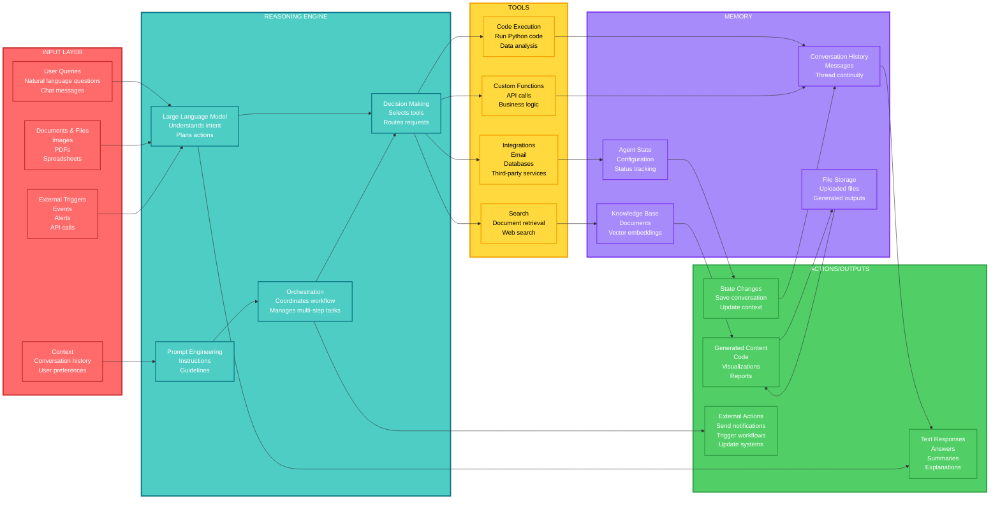

# AI Agents

## What is an AI Agent?

AI Agents consist of five core components: **Input**, **Reasoning**, **Tools**, **Memory**, and **Actions/Outputs**. An AI agent uses an LLM to process user inputs, make decisions, call tools or MCP servers to perform actions, and generate responses. 

### Core Components

The following diagram illustrates the core components and their interactions in an AI agent:

```mermaid
%%{init: {'theme':'base', 'themeVariables': {'fontSize':'18px'}}}%%

flowchart LR
    Input["INPUT<br/>────────<br/>Receives and processes<br/>information from users<br/>and environment"]
    
    Reasoning["REASONING<br/>────────<br/>Analyzes information<br/>and makes decisions<br/>using logic and models"]
    
    Tools["TOOLS<br/>────────<br/>Access to external<br/>capabilities and resources<br/>to perform tasks"]
    
    Memory["MEMORY<br/>────────<br/>Stores context, history<br/>and learned information<br/>for continuity"]
    
    Output["ACTIONS / OUTPUTS<br/>────────<br/>Executes decisions<br/>and delivers results<br/>to users"]
    
    Input ==>|Process| Reasoning
    Reasoning ==>|Query| Tools
    Reasoning ==>|Store/Retrieve| Memory
    Tools ==>|Results| Reasoning
    Memory ==>|Context| Reasoning
    Reasoning ==>|Execute| Output

    
    style Input fill:#667eea,stroke:#5568d3,stroke-width:4px,color:#ffffff,font-weight:bold
    style Reasoning fill:#764ba2,stroke:#5e3a82,stroke-width:4px,color:#ffffff,font-weight:bold
    style Tools fill:#f093fb,stroke:#d946ef,stroke-width:4px,color:#ffffff,font-weight:bold
    style Memory fill:#4facfe,stroke:#0ea5e9,stroke-width:4px,color:#ffffff,font-weight:bold
    style Output fill:#43e97b,stroke:#22c55e,stroke-width:4px,color:#ffffff,font-weight:bold

```

### Detailed Component Architecture

The following diagram shows a detailed view of each component with specific examples:

## Conceptual Overview of AI Agents

!!! abstract "Definition"
    An autonomous system that perceives its environment, reasons about context, takes actions via tools or APIs, and learns through feedback to achieve defined objectives.

### Core Architectural Components

- **Perception Layer**: Interfaces that receive context or inputs (text, data, voice, sensors, APIs)
- **Reasoning & Planning Layer**: LLM or symbolic reasoning engine responsible for decision-making
- **Memory Layer**: Manages contextual memory — short-term (session), long-term (vector DB), and episodic (persistent state)
- **Action Layer**: Executes actions via APIs, tools, or system commands
- **Feedback Loop**: Evaluates outcomes and adapts strategies for continuous improvement
- **Agent Lifecycle**: Initialization → Perception → Reasoning → Action → Evaluation → Learning

## When to Use AI Agents?

!!! success "Ideal Use Cases"
    AI agents are suitable for applications that require autonomous decision-making, ad hoc planning, trial-and-error exploration, and conversation-based user interactions. They are particularly useful for scenarios where the input task is unstructured and cannot be easily defined in advance.

### Common Scenarios Where AI Agents Excel

1. **Customer Support**: AI agents can handle multi-modal queries (text, voice, images) from customers, use tools to look up information, and provide natural language responses
2. **Education and Tutoring**: AI agents can leverage external knowledge bases to provide personalized tutoring and answer student questions
3. **Code Generation and Debugging**: For software developers, AI agents can assist with implementation, code reviews, and debugging by using various programming tools and environments
4. **Research Assistance**: For researchers and analysts, AI agents can search the web, summarize documents, and piece together information from multiple sources

!!! info "Key Characteristic"
    AI agents are designed to operate in a dynamic and underspecified setting, where the exact sequence of steps to fulfill a user request is not known in advance and might require exploration and close collaboration with users.

## When Not to Use AI Agents?

!!! warning "Limitations"
    AI agents are not well-suited for tasks that are highly structured and require strict adherence to predefined rules. If your application anticipates a specific kind of input and has a well-defined sequence of operations to perform, using AI agents might introduce unnecessary uncertainty, latency, and cost.

### Alternative Approaches

!!! tip "Use Functions Instead"
    If you can write a function to handle the task, do that instead of using an AI agent. You can use AI to help you write that function.

!!! note "Complex Multi-Step Tasks"
    A single AI agent might struggle with complex tasks that involve multiple steps and decision points. Such tasks might require a large number of tools (for example, over 20), which a single agent cannot feasibly manage. In these cases, consider using **workflows** instead.

---

## Multi-Agent Systems

### What is a Multi-Agent System?

A **multi-agent system** (or multi-agent application) is a collection of agents that collaborate to solve tasks. Each agent maintains specific capabilities—reasoning, acting, and communicating—and can adapt to changes in the task or environment.

### Multi-Agent Orchestration Patterns

#### 1. Multi-Agent Workflows (Defined Orchestration)

```mermaid 
graph TD
    subgraph "Workflow Orchestration"    
        User1[👤 User] --> Agent1[Agent 1]
        Agent1 --> Agent2[Agent 2]
        Agent2 --> Agent3[Agent 3]
        
        Note1["Control flow is predefined<br/>(typically modelled as a graph)"]
    end
%% Styling

classDef agentStyle fill:#3B82F6,stroke:#1E40AF,stroke-width:3px,color:#fff
classDef orchestratorStyle fill:#F59E0B,stroke:#D97706,stroke-width:3px,color:#fff
classDef noteStyle fill:#F3F4F6,stroke:#9CA3AF,stroke-width:1px,color:#374151  

class Agent1,Agent2,Agent3,AgentA1,AgentA2,AgentA3,AgentA4 agentStyle
class Orchestrator orchestratorStyle
class Note1,Note2,Patterns noteStyle

```

!!! info "Defined Orchestration"
    These systems follow pre-defined collaboration patterns where each agent has clearly specified roles, responsibilities, and handoff points. The orchestration logic is explicitly programmed, creating predictable and repeatable processes.
    
    **Example**: A document processing workflow might have agents that specialize in text extraction, analysis, and formatting, working in a predetermined sequence with defined inputs and outputs for each stage.

#### 2. Autonomous Multi-Agent Orchestration (AI-Driven Orchestration)

```mermaid 
%% Autonomous (AI Driven) Orchestration
graph TD
    subgraph "Autonomous (AI Driven) Orchestration"
        User2[👤 User] -.-> Orchestrator[AI Orchestrator]
        
        Orchestrator -.-> AgentA1[Agent 1]
        Orchestrator -.-> AgentA2[Agent 2]
        Orchestrator -.-> AgentA3[Agent 3]
        Orchestrator -.-> AgentA4[Agent 4]
        
        AgentA1 -.-> Orchestrator
        AgentA2 -.-> Orchestrator
        AgentA3 -.-> Orchestrator
        AgentA4 -.-> Orchestrator
        
        Note2["Control flow is driven by an AI model at runtime"]
        
    end

%% Styling
classDef userStyle fill:#6B7280,stroke:#374151,stroke-width:2px,color:#fff
classDef agentStyle fill:#3B82F6,stroke:#1E40AF,stroke-width:3px,color:#fff
classDef orchestratorStyle fill:#F59E0B,stroke:#D97706,stroke-width:3px,color:#fff
classDef noteStyle fill:#F3F4F6,stroke:#9CA3AF,stroke-width:1px,color:#374151

class User1,User2 userStyle
class Agent1,Agent2,Agent3,AgentA1,AgentA2,AgentA3,AgentA4 agentStyle
class Orchestrator orchestratorStyle
class Note1,Note2,Patterns noteStyle

```

!!! info "AI-Driven Orchestration"
    These systems use AI models to drive orchestration decisions, allowing agents to dynamically negotiate responsibilities and adapt their collaboration based on task requirements and intermediate results. The orchestration emerges from agent interactions rather than being pre-programmed.
    
    **Use Case**: This approach is particularly valuable for complex tasks where the optimal solution strategy cannot be predetermined and must evolve through exploration and adaptation.

---

## Workflows

### What is a Workflow?

A **workflow** can express a predefined sequence of operations that can include AI agents as components while maintaining consistency and reliability. Workflows are designed to handle complex and long-running processes that might involve multiple agents, human interactions, and integrations with external systems.

The execution sequence of a workflow can be explicitly defined, allowing for more control over the execution path.

### Workflow Example: Connecting Agents and Functions

The following diagram illustrates an example of a workflow that connects two AI agents and a function:

```mermaid

%%{init: {'theme':'base', 'themeVariables': {'fontSize':'16px'}}}%%

graph LR
    Start([User Input])
    Func1["FUNCTION<br/>────────<br/>Data Fetching<br/>• REST API calls<br/>• Database queries<br/>• External data sources"]
    Agent1["AI AGENT 1<br/>────────<br/>Research Agent<br/>• Analyzes request<br/>• Searches knowledge base<br/>• Gathers information"]
    Func2["FUNCTION<br/>────────<br/>Data Processing<br/>• Validates data<br/>• Transforms format<br/>• Applies business rules"]
    Agent2["AI AGENT 2<br/>────────<br/>Response Agent<br/>• Synthesizes findings<br/>• Generates response<br/>• Formats output"]
    End([User Output])
    
    Start -->|"1. Initial Request"| Func1
    Func1 -->|"2. Fetched Data"| Agent1
    Agent1 -->|"3. Analyzed Data"| Func2
    Func2 -->|"4. Processed Data"| Agent2
    Agent2 -->|"5. Final Response"| End
    
    style Start fill:#667eea,stroke:#5568d3,stroke-width:3px,color:#ffffff,font-weight:bold
    style Func1 fill:#ff6b6b,stroke:#ee5a6f,stroke-width:4px,color:#ffffff,font-weight:bold
    style Agent1 fill:#f093fb,stroke:#d946ef,stroke-width:4px,color:#ffffff,font-weight:bold
    style Func2 fill:#feca57,stroke:#ff9f43,stroke-width:4px,color:#000000,font-weight:bold
    style Agent2 fill:#48dbfb,stroke:#0abde3,stroke-width:4px,color:#ffffff,font-weight:bold
    style End fill:#1dd1a1,stroke:#10ac84,stroke-width:3px,color:#ffffff,font-weight:bold
    
    linkStyle 0 stroke:#667eea,stroke-width:3px
    linkStyle 1 stroke:#ff6b6b,stroke-width:3px
    linkStyle 2 stroke:#f093fb,stroke-width:3px
    linkStyle 3 stroke:#feca57,stroke-width:3px
    linkStyle 4 stroke:#48dbfb,stroke-width:3px

```

!!! note "Dynamic Workflows"
    Workflows can also express dynamic sequences using conditional routing, model-based decision making, and concurrent execution. This is how multi-agent orchestration patterns are implemented. The orchestration patterns provide mechanisms to coordinate multiple agents to work on complex tasks that require multiple steps and decision points, addressing the limitations of single agents.

### What Problems Do Workflows Solve?

Workflows provide a structured way to manage complex processes that involve multiple steps, decision points, and interactions with various systems or agents. The types of tasks workflows are designed to handle often require more than one AI agent.

### Key Benefits of Workflows

!!! success "Workflow Advantages"
    
    - **Modularity**: Workflows can be broken down into smaller, reusable components, making it easier to manage and update individual parts of the process
    
    - **Agent Integration**: Workflows can incorporate multiple AI agents alongside non-agentic components, allowing for sophisticated orchestration of tasks
    
    - **Type Safety**: Strong typing ensures messages flow correctly between components, with comprehensive validation that prevents runtime errors
    
    - **Flexible Flow**: Graph-based architecture allows for intuitive modeling of complex workflows with executors and edges. Conditional routing, parallel processing, and dynamic execution paths are all supported
    
    - **Scalability**: Components can be reused or combined to create more complex processes, allowing for scalability and adaptability

---

## Architectural Patterns for AI Agents

The following table summarizes common architectural patterns for implementing AI agents:

| Pattern | Description | Common Use Case |
|---------|-------------|-----------------|
| **Monolithic Agent** | Single LLM-based reasoning with embedded tool use and memory | Chatbots, copilots |
| **Modular Agent** | Decomposed components for reasoning, memory, and execution | Scalable assistants, analytics |
| **Multi-Agent System (MAS)** | Multiple agents with defined roles collaborating via orchestration | Research simulation, workflow automation |
| **Hierarchical Agents** | Supervisor agent delegates to specialized sub-agents | Complex task planning, enterprise orchestration |

