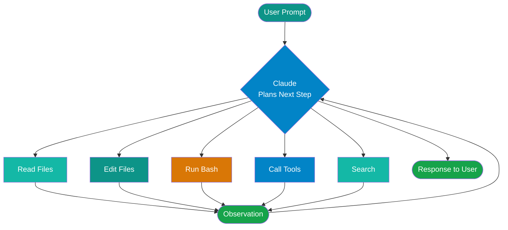

# Claude Code

!!! abstract
    Claude Code is an agentic CLI that reads your codebase, edits files, runs shell commands, and makes multi-file changes iteratively toward a goal. This page covers installation, how the tool use loop works, and how to configure project-specific behavior with `CLAUDE.md`.

## What Is Claude Code?

Claude Code is an agentic CLI tool — not a chatbot. You give it a goal, and it works toward that goal by reading files, editing code, running shell commands, and using tools iteratively until the task is done or it needs your input.

The key difference from an IDE copilot plugin is scope. Claude Code can see your entire codebase, run your test suite, check git history, search for patterns across files, and make coordinated changes across multiple files in a single session. A copilot plugin completes the line you're currently typing. Claude Code completes the feature.

It runs in your terminal. Extensions for VS Code and JetBrains are available for users who prefer to stay inside their IDE while still getting full agentic capabilities.

## Installation

```bash
npm install -g @anthropic-ai/claude-code
```

**Prerequisites:**

- Node.js 18 or later
- An Anthropic API key, or a Claude.ai Pro/Max subscription (which includes Claude Code access)

**First run:**

```bash
cd your-project
claude
```

On first launch, Claude Code prompts for your API key if one isn't already set in the environment (`ANTHROPIC_API_KEY`). After that, each session starts by reading your project's `CLAUDE.md` if one exists.

## How Claude Code Works

Claude Code operates in a tool use loop. It plans what to do, executes one tool at a time, observes the result, and decides the next step — repeating until the task is complete or it hits a decision point that requires your input.



**Permission modes:**

By default, Claude Code prompts before performing operations it considers risky — writing files, running shell commands, or making git commits. This gives you a checkpoint to review what it's about to do.

For trusted automated environments (CI pipelines, pre-configured dev containers), you can bypass these prompts:

```bash
claude --dangerously-skip-permissions
```

!!! warning
    `--dangerously-skip-permissions` auto-approves all operations including file writes and shell commands. Only use this in controlled, trusted environments where you understand what the agent will run.

## CLAUDE.md — Project Configuration

`CLAUDE.md` is a Markdown file that Claude Code reads at the start of every session. It's your mechanism for encoding project-specific context, conventions, and instructions once rather than repeating them in every prompt.

**What to put in it:**

- Project overview — what the codebase does, key architectural decisions
- Build and run commands — how to start the dev server, run tests, lint
- Coding conventions — naming patterns, preferred libraries, patterns to avoid
- What NOT to do — explicit constraints that protect against common mistakes
- Common workflows — how PRs are structured, branch naming, deployment steps

**File hierarchy:** Claude Code merges configuration from multiple levels, with more specific files taking precedence:

1. `~/.claude/CLAUDE.md` — global defaults (your personal preferences across all projects)
2. `./CLAUDE.md` — project root (checked into source control, shared with your team)
3. Subdirectory `CLAUDE.md` files — scoped to specific parts of the codebase

**Example structure:**

```markdown
# My Project

## Overview
Order management API built with .NET 8 and Azure Service Bus.
Deployed to AKS via Helm charts.

## Commands
- `dotnet run --project src/Api` — start the API locally
- `dotnet test` — run all tests
- `docker-compose up` — start dependencies (SQL, Service Bus emulator)

## Conventions
- All controllers use MediatR — no business logic in controllers
- FluentValidation for all request models
- Serilog structured logging — never use Console.WriteLine
- MSTest for unit tests, Moq for mocking

## Do Not
- Add synchronous blocking calls (no .Result or .Wait())
- Commit connection strings or secrets
- Modify the Helm charts without updating the values.schema.json
```

!!! tip
    Treat `CLAUDE.md` like onboarding docs for a new teammate who happens to be an AI. Everything you'd tell a contractor on their first day — project structure, build steps, conventions, gotchas — belongs here.

## Key Capabilities

**File operations**
Read, edit, and create files across the entire project. Claude Code understands file relationships and makes coordinated edits — renaming a type and updating all its usages, for example.

**Shell execution**
Run tests, build commands, lint, git operations, or any shell command. Claude Code reads the output and factors it into the next step — if a test fails after an edit, it reads the failure and attempts a fix.

**Git integration**
Read commit history, check diffs, stage files, create commits. Claude Code follows your commit message conventions if they're defined in `CLAUDE.md`.

**Multi-file refactoring**
Make coordinated changes across multiple files in a single session — interface changes and their implementations, API contract changes and their consumers, or large-scale renaming.

**Search**
Grep for patterns, search file names with glob patterns, and read symbol definitions across the codebase. This is how Claude Code builds context before making changes rather than guessing at structure.

## Memory System

Claude Code has three memory layers:

- **User memory** (`~/.claude/memory/`) — persists across sessions and projects; stores your preferences, recurring context, and things you've told it to remember
- **Project memory** — session-scoped notes the agent maintains while working on a task; cleared when the session ends
- **Feedback memory** — Claude Code learns your correction patterns over time, adjusting behavior in future sessions

For full detail on skills and project-scoped memory, see [Claude Code Skills & Agents](claude-code-skills.md).

## Working Effectively with Claude Code

!!! tip
    Be specific. "Fix the bug in `auth.ts` where JWT validation fails with RS256 keys — the `verifyToken` function throws when the key is a PEM string" is better than "fix the auth bug". The more context you provide upfront, the fewer clarifying round-trips the agent needs.

!!! tip
    Iterate. Don't try to accomplish everything in one prompt. Start with a scoped task, review the result, then continue. Long-running single-prompt sessions accumulate errors that compound.

!!! tip
    Review changes before committing. Claude Code makes mistakes — it can misread intent, make a correct change in the wrong place, or edit a file you didn't expect. The diff review step is not optional.

!!! tip
    Use `CLAUDE.md` to encode your project conventions once rather than repeating them in every session. Conventions in `CLAUDE.md` are always active; conventions in prompts are only active for that prompt.

## References

- [Claude Code Documentation](https://docs.anthropic.com/en/docs/claude-code)

## Next Steps

- [Claude Code Skills & Agents](claude-code-skills.md) — custom slash commands, subagents, hooks, and MCP integration
- [Model Context Protocol (MCP)](mcp.md) — extend Claude Code with external tools and data sources
