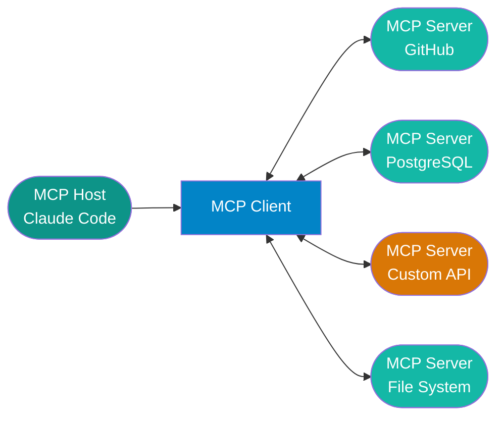

# Model Context Protocol (MCP)

!!! abstract
    MCP is an open protocol that standardizes how AI applications connect to external tools and data sources. Instead of writing a custom integration for every combination of AI host and external service, you write one MCP server and any compliant host can use it. This page covers the architecture, the three primitives, building a server in Python, and connecting it to Claude Code.

## What Is MCP?

Think of MCP as USB-C for AI tools. Before USB-C, every device had its own connector — proprietary, incompatible, requiring a specific cable for each combination. MCP plays the same unifying role: a standardized protocol so AI hosts don't need custom integrations for every tool or data source they want to access.

MCP was created by Anthropic and is now an open standard with broad adoption. GitHub Copilot, Cursor, Claude Code, and Claude.ai all support it. If you build an MCP server once, it works with any of these hosts without modification.

**What it solves:** Traditional function calling is host-specific. The schema for defining a callable function in OpenAI's API is different from Anthropic's, different from how LangChain wires up tools. MCP is transport-layer agnostic and host-agnostic — the same server definition works regardless of which AI application is calling it.

## Architecture

MCP separates responsibilities into three roles:

- **MCP Host** — the AI application the user interacts with: Claude Code, GitHub Copilot CLI, Claude.ai. The host manages the user-facing experience.
- **MCP Client** — embedded in the host; manages the connection lifecycle to one or more MCP servers, routes tool calls, and returns results.
- **MCP Server** — your code. It exposes tools, resources, and prompts over a defined transport. One server per service or domain is the typical pattern.



**Transport types:**

- **stdio** — the server runs as a child process; communication happens over stdin/stdout. This is the default for Claude Code local integrations. Simple, no networking required.
- **SSE / HTTP** — the server runs as a remote HTTP service; communication happens over Server-Sent Events. Use this for shared, centralized, or cloud-hosted servers.

## The Three Primitives

Every MCP server exposes some combination of three primitives.

**Tools** are callable functions the LLM can invoke, similar to function calling in other frameworks. The model decides when to call a tool based on its description, passes arguments, and receives structured data back. Example: `search_github_issues(query, repo)`.

**Resources** are read-only data exposed to the LLM as named documents. Resources are URI-addressed — the host can list available resources and fetch any of them by URI. Think of these as documents the model can read on demand: a file, a database row, a live API response. Unlike tools, resources don't execute logic — they return content.

**Prompts** are reusable prompt templates parameterized at runtime. The host can list available prompts and invoke them with arguments, getting back a fully rendered prompt string. Useful for encoding complex task descriptions that the host surfaces to users as named actions.

| Primitive | Triggered By | Use For | Returns |
|---|---|---|---|
| Tool | LLM decision | Execute logic, call APIs, modify state | Structured data or text |
| Resource | Host or LLM request | Read-only data access | Document content |
| Prompt | Host or user selection | Reusable prompt templates | Rendered prompt text |

!!! note
    Most MCP servers only implement Tools. Resources and Prompts are less commonly used but powerful for specialized workflows — Resources are well-suited for document retrieval systems, and Prompts work well for encoding domain-specific task instructions that users invoke by name.

## Building an MCP Server (Python)

### Installation

```bash
# With pip
pip install mcp

# With uv (recommended)
uv add mcp
```

### Minimal Working Server

This example implements a single `get_weather` tool and runs over stdio transport:

```python
from mcp.server import Server
from mcp.server.stdio import stdio_server
from mcp.types import Tool, TextContent
import mcp.types as types

server = Server("my-server")


@server.list_tools()
async def list_tools() -> list[Tool]:
    return [
        Tool(
            name="get_weather",
            description="Get current weather for a city",
            inputSchema={
                "type": "object",
                "properties": {
                    "city": {"type": "string", "description": "City name"}
                },
                "required": ["city"]
            }
        )
    ]


@server.call_tool()
async def call_tool(name: str, arguments: dict) -> list[types.TextContent]:
    if name == "get_weather":
        city = arguments["city"]
        # Replace with your actual data source
        return [TextContent(type="text", text=f"Weather in {city}: 22°C, partly cloudy")]
    raise ValueError(f"Unknown tool: {name}")


if __name__ == "__main__":
    import asyncio
    asyncio.run(stdio_server(server))
```

**Key parts:**

- `@server.list_tools()` — registers the handler that returns tool definitions. The MCP client calls this on connection to discover what the server can do.
- `@server.call_tool()` — registers the handler that executes tool calls. Receives the tool name and argument dict; returns a list of content objects.
- `stdio_server(server)` — starts the server on stdin/stdout transport. This is all that's needed for local Claude Code integration.
- `inputSchema` — standard JSON Schema. The LLM uses this to know what arguments to pass; the host validates inputs against it.

**Production considerations:** Use Pydantic to validate `arguments` before processing — the LLM won't always pass exactly what you expect, especially for optional fields or edge-case inputs.

```python
from pydantic import BaseModel

class WeatherInput(BaseModel):
    city: str

@server.call_tool()
async def call_tool(name: str, arguments: dict) -> list[types.TextContent]:
    if name == "get_weather":
        params = WeatherInput(**arguments)  # validates and raises on bad input
        return [TextContent(type="text", text=await fetch_weather(params.city))]
    raise ValueError(f"Unknown tool: {name}")
```

## Connecting MCP to Claude Code

Claude Code reads `.mcp.json` from the project root on startup and connects to each listed server automatically. No other configuration is required.

```json
{
  "mcpServers": {
    "my-server": {
      "command": "python",
      "args": ["path/to/server.py"],
      "env": {}
    },
    "github": {
      "command": "npx",
      "args": ["-y", "@modelcontextprotocol/server-github"],
      "env": {
        "GITHUB_PERSONAL_ACCESS_TOKEN": "${GITHUB_TOKEN}"
      }
    }
  }
}
```

Environment variable references in the `env` block (`${GITHUB_TOKEN}`) are resolved from your shell environment at startup. Keep secrets out of `.mcp.json` itself — reference them by name from the environment.

For `uv`-managed Python servers, the `command` pattern is:

```json
{
  "my-server": {
    "command": "uv",
    "args": ["run", "--project", "path/to/project", "python", "server.py"],
    "env": {}
  }
}
```

## Official MCP Servers

Anthropic and the community maintain a collection of reference servers for common services. These are ready to use without writing any server code.

| Server | Package | What It Exposes |
|---|---|---|
| filesystem | `@modelcontextprotocol/server-filesystem` | File read/write within configured allowed directories |
| git | `@modelcontextprotocol/server-git` | Git operations: log, diff, blame, show |
| github | `@modelcontextprotocol/server-github` | Repos, issues, PRs, file contents, code search |
| postgres | `@modelcontextprotocol/server-postgres` | SQL queries and schema introspection |
| brave-search | `@modelcontextprotocol/server-brave-search` | Web search via Brave Search API |

All official servers: [github.com/modelcontextprotocol/servers](https://github.com/modelcontextprotocol/servers)

## Security Considerations

MCP servers run as local processes under your user account. The same permissions that let you read a file or call an API are available to the server — and by extension, to the LLM using it.

**Scope tools to minimum necessary access.** Read-only tools are lower risk than write tools. If a tool only needs to query a database, don't give it write access.

**Authenticate requests.** MCP servers can validate tokens passed in the `env` block or via environment. For servers exposed over HTTP, require authentication on every request.

**Sandbox untrusted servers.** For MCP servers from sources you don't fully control, run them in Docker with restricted filesystem mounts and network access. The MCP transport works identically over stdio in a container.

**Validate and sanitize resource content.** Resources fetched from external systems can contain arbitrary text. A malicious document could include content designed to redirect tool calls or manipulate the LLM's behavior — a prompt injection attack through retrieved content. Sanitize resource content before returning it, and don't return raw user-controlled content without review.

!!! warning
    Only install MCP servers from sources you trust. A malicious MCP server has access to the same tools Claude Code does — it could read files, execute shell commands, or exfiltrate data. Treat installing an MCP server with the same scrutiny as installing any other executable.

## References

- [MCP Specification](https://modelcontextprotocol.io/specification/2025-11-25)
- [MCP Documentation](https://modelcontextprotocol.io/docs)
- [Official MCP Servers](https://github.com/modelcontextprotocol/servers)
- [Claude Code MCP Guide](https://docs.anthropic.com/en/docs/claude-code/mcp)

## Next Steps

- [Claude Code Skills & Agents](claude-code-skills.md) — configure `.mcp.json` in context with hooks, skills, and subagents
- [Copilot CLI Extensions](copilot-cli-extensions.md) — GitHub Copilot's MCP-compatible extension model
