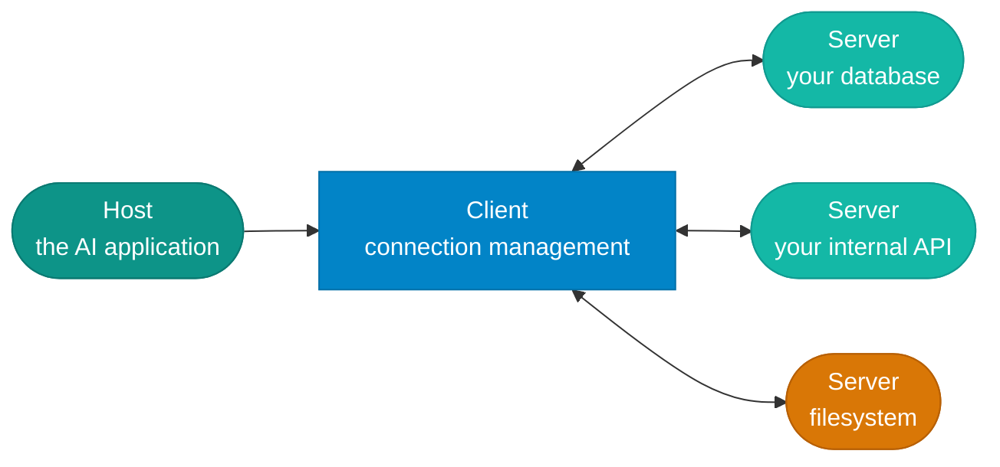

# Model Context Protocol (MCP)

!!! abstract
    MCP standardises how AI applications connect to external tools and data.
    Write one server, and any compliant host can use it. This page covers the
    architecture as of spec revision **`2026-07-28`**, which was a breaking
    redesign — and a server that runs on the current SDK.

**Verified as of 2026-08-21.**

!!! warning "Most MCP tutorials you will find are now wrong"
    Revision `2026-07-28` removed the `initialize` handshake and sessions,
    deprecated roots, sampling and logging, and dropped standalone HTTP+SSE. The
    Python SDK went to **2.0.0** the same day and renamed `FastMCP` to
    `MCPServer`.

    Anything written before mid-2026 — including most courses and the majority
    of blog posts — teaches an API that no longer exists. Check the revision date
    on anything you read. This page targets `2026-07-28`; verify against the
    [spec](https://modelcontextprotocol.io/specification) before building.

## What it is

Think of MCP as USB-C for AI tools. Before it, every host needed a bespoke
integration for every service. Now you write one server and any host can use it.

MCP was created by Anthropic and is an open standard under the Linux
Foundation's Agentic AI Foundation. GitHub Copilot, Cursor, Claude Code and
Claude.ai all speak it.

## Architecture

Three roles:

- **Host** — the AI application the user interacts with
- **Client** — embedded in the host; manages connections and routes calls
- **Server** — your code, exposing tools, resources and prompts


```mermaid
flowchart LR
    H([Host<br/>the AI application]):::primary --> C[Client<br/>connection management]:::processing
    C <--> S1([Server<br/>your database]):::storage
    C <--> S2([Server<br/>your internal API]):::storage
    C <--> S3([Server<br/>filesystem]):::warning

    classDef primary fill:#0d9488,stroke:#0b7a72,color:#fff
    classDef processing fill:#0284c7,stroke:#0270a8,color:#fff
    classDef storage fill:#14b8a6,stroke:#119b91,color:#fff
    classDef warning fill:#d97706,stroke:#b86005,color:#fff
```

### What changed in 2026-07-28

This is the part that invalidates older material.

| Was (through `2025-11-25`) | Now (`2026-07-28`) |
|---|---|
| `initialize` / `initialized` handshake | **Removed.** Stateless, self-contained requests |
| `Mcp-Session-Id` header, connection-scoped session | **Removed.** Per-request `_meta` carries version and capabilities |
| Servers could initiate requests to clients | **Removed.** Multi Round-Trip Requests instead: the server returns `input_required`, the client retries with responses |
| stdio + HTTP+SSE transports | **stdio + Streamable HTTP.** SSE survives only as a response mode of a POST |
| Roots, sampling, logging | **Deprecated**, with a 12-month window |
| — | New `server/discover` request; `Mcp-Method` / `Mcp-Name` headers for gateway routing |

There is also a new **extensions** layer, opt-in and negotiated: **Tasks**
(durable long-running operations with polling), **Skills over MCP**, and **MCP
Apps** (inline UI). None of these existed in the revision most tutorials target.

## The three server primitives

| Primitive | Triggered by | Use for | Returns |
|---|---|---|---|
| **Tool** | model decision | execute logic, call APIs, change state | structured data |
| **Resource** | host or model request | read-only data, URI-addressed | document content |
| **Prompt** | host or user selection | reusable templates | rendered prompt |

Most servers implement only tools. On the client side, the current spec lists
**elicitation** — a server asking the user for input mid-call.

## Build a server

The SDK is at **2.0.0**. `FastMCP` no longer exists; the class is `MCPServer`.

```bash
uv add "mcp>=2"
```

```python
from mcp.server import MCPServer

mcp = MCPServer("weather")


@mcp.tool()
def get_weather(city: str) -> str:
    """Get current weather for a city."""
    return f"Weather in {city}: 22C, partly cloudy"


if __name__ == "__main__":
    mcp.run()
```

That is the whole server. The schema is derived from your type hints, and the
docstring becomes the description the model reads — so write it for the model,
not for a colleague.

!!! danger "Pin your SDK version"
    `mcp>=1.28,<2` and `mcp>=2` are different APIs with the same package name.
    Mixing a v2 server with a v1-era tutorial produces import errors that look
    like your mistake. Pin deliberately, and know which era you are in.

    A live example: `langchain-mcp-adapters` pins `mcp<2.0.0`, so
    `uv add mcp langchain-mcp-adapters` silently downgrades you to 1.x — and a
    server you wrote against v2 stops importing.

**Validate inputs anyway.** Type hints generate a schema, and the schema *guides*
the model — it does not bind it. Validate before you act, for the reason in
[tool calling](../02-agents/tool-calling.md).

## Connecting to a host

Claude Code reads `.mcp.json` from the project root:

```json
{
  "mcpServers": {
    "weather": {
      "command": "uv",
      "args": ["run", "--project", "path/to/project", "python", "server.py"],
      "env": {}
    }
  }
}
```

Environment references in `env` resolve from your shell at startup. Keep secrets
out of the file itself.

Debug with the **MCP Inspector** — it connects to your server and lets you list
and call tools without wiring up a host first.

## Finding existing servers

The reference server collection was **pruned**. `modelcontextprotocol/servers`
now ships two educational servers (`everything`, `fetch`); the ~20 others —
github, postgres, slack, brave-search and the rest — are archived and frozen.
Content telling you to `npx @modelcontextprotocol/server-github` is out of date;
that one moved to GitHub's own `github/github-mcp-server`.

Discovery now happens through the **MCP Registry**. Be careful with
"awesome-mcp-servers" lists — the largest has over 90,000 stars and more than
3,000 unmerged pull requests, meaning nobody is curating it.

## Security

MCP servers run as local processes with your permissions. The model driving them
can be influenced by anything it reads.

**Scope tools to minimum access.** A read-only tool cannot be talked into a write.

**Never accept tokens not issued for your server.** The spec is normative here:
servers *"MUST NOT accept any tokens that were not explicitly issued for the MCP
server."* Passing a token through collapses your audit trail and turns the server
into a proxy for exfiltration.

**Assume prompt injection.** Content fetched by a tool is untrusted input that
the model will read as instructions. This is not solvable by filtering — the
practical defence is architectural: cut one leg of the trifecta of *private data
+ untrusted content + a way to send data out*. See
[the harness](../02-agents/the-harness.md) on enforcing limits in code.

**Sandbox untrusted servers.** Treat installing one with the scrutiny of
installing any executable.

## References

- [MCP Specification](https://modelcontextprotocol.io/specification) — always check the revision date
- [Architecture](https://modelcontextprotocol.io/docs/learn/architecture) — better than the spec for first contact; includes full wire traces
- [Python SDK](https://github.com/modelcontextprotocol/python-sdk) — read the v1→v2 migration guide as teaching material
- [MCP Inspector](https://github.com/modelcontextprotocol/inspector)
- [MCP Registry](https://github.com/modelcontextprotocol/registry)

## Next

[Agent Skills](../02-agents/the-harness.md) and the wider interop story — MCP is
one of three standards worth knowing.
