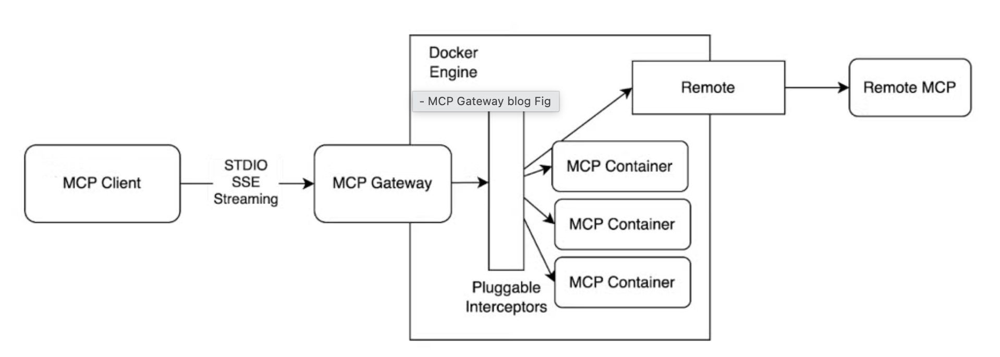

# Docker Introduces Custom MCP Catalog for Enterprise Control

Docker has launched new tooling that lets organizations build custom MCP catalogs with tighter control over which tools developers and AI assistants can access. This addresses a critical need for enterprises requiring strict security policies and curated tool sets.

<!-- more -->

## The Challenge

Many organizations face security concerns when deploying AI tooling. Some have policies prohibiting direct pulls from Docker Hub, while others need to offer only trusted MCP servers to their teams. The new Docker MCP tooling solves this.

## The Solution: Three Core Components



*Figure: MCP Gateway architecture - securely orchestrating and managing MCP servers*

**MCP Catalog**: A YAML-based index with 220+ containerized MCP servers. Fork it or build your own.

**MCP Gateway**: Connects clients to servers, reducing X * Y configurations to just Y entries (one per client). Open source and provides a single connection point.

**MCP Toolkit**: GUI built into Docker Desktop for catalog access, secret handling, and easy client integration with Claude, Cursor, Continue.dev, and more.

## Key Benefits

**Control**: Host MCP server images in your own container registry  
**Security**: Enforce strict policies on tool access  
**Simplicity**: Manage all servers through a single gateway  
**Flexibility**: Fork existing catalog or build completely custom ones

## Getting Started

The workflow involves forking the official catalog, creating your private version, pushing images to your registry, and running the MCP Gateway with your custom catalog. The gateway command is straightforward:

```bash
docker mcp gateway run --catalog my-private-catalog
```

Integration with popular clients like VS Code requires simple JSON configuration updates.

## Learn More

This is a game-changer for enterprises seeking to deploy AI tooling with appropriate guardrails. For the complete step-by-step guide with code examples:

**Read the full post**: [Build Custom MCP Catalog](https://www.docker.com/blog/build-custom-mcp-catalog/)

**Official Documentation**: [MCP Gateway Docs](https://docs.docker.com/ai/mcp-catalog-and-toolkit/mcp-gateway/)

**Source Code**: [MCP Gateway GitHub](https://github.com/docker/mcp-gateway/)

---

*Interested in MCP and AI integration? Check out our [MCP documentation](/mcp/) for implementation patterns and best practices.*
