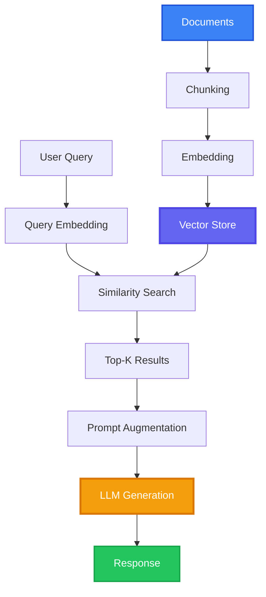

# Building Your First RAG System: A Practical Guide

Learn how to build a production-ready Retrieval-Augmented Generation (RAG) system from scratch. This tutorial covers everything from vector database setup to query optimization.

<!-- more -->

## Introduction

Retrieval-Augmented Generation (RAG) has become a cornerstone technique for building AI applications that need access to specific knowledge bases. In this guide, we'll walk through implementing a complete RAG system.

## What You'll Build

By the end of this tutorial, you'll have:

- A working vector database setup
- Document ingestion pipeline
- Query processing system
- RAG-enhanced LLM integration
- Basic optimization techniques

## Prerequisites

Before starting, you should have:

- Basic Python knowledge
- Understanding of LLMs and embeddings
- Python 3.9+ installed
- API key for an LLM provider (OpenAI, Anthropic, etc.)

## Architecture Overview

Our RAG system will follow this architecture:



## Step 1: Setting Up the Environment

First, let's install the required dependencies:

```python
# Install required packages
pip install langchain chromadb openai tiktoken
```

## Step 2: Document Processing

We'll start by loading and chunking our documents:

```python
from langchain.text_splitter import RecursiveCharacterTextSplitter
from langchain.document_loaders import DirectoryLoader

# Load documents
loader = DirectoryLoader('./documents', glob="**/*.txt")
documents = loader.load()

# Chunk documents
text_splitter = RecursiveCharacterTextSplitter(
    chunk_size=1000,
    chunk_overlap=200,
    length_function=len
)
chunks = text_splitter.split_documents(documents)
```

## Step 3: Creating Embeddings

Next, we'll convert chunks to embeddings:

```python
from langchain.embeddings import OpenAIEmbeddings

embeddings = OpenAIEmbeddings(
    model="text-embedding-3-small"
)
```

## Step 4: Vector Database Setup

Store embeddings in ChromaDB:

```python
from langchain.vectorstores import Chroma

vectorstore = Chroma.from_documents(
    documents=chunks,
    embedding=embeddings,
    persist_directory="./chroma_db"
)
```

## Step 5: RAG Pipeline

Implement the retrieval and generation:

```python
from langchain.chat_models import ChatOpenAI
from langchain.chains import RetrievalQA

# Initialize LLM
llm = ChatOpenAI(
    model="gpt-4",
    temperature=0
)

# Create retrieval chain
qa_chain = RetrievalQA.from_chain_type(
    llm=llm,
    chain_type="stuff",
    retriever=vectorstore.as_retriever(
        search_kwargs={"k": 3}
    )
)

# Query the system
query = "What is RAG and how does it work?"
response = qa_chain.run(query)
print(response)
```

## Optimization Tips

### 1. Chunking Strategy
- Experiment with chunk sizes (500-2000 tokens)
- Use overlap to maintain context
- Consider semantic chunking for better results

### 2. Retrieval Tuning
- Adjust the number of retrieved documents (k)
- Use similarity thresholds to filter results
- Implement re-ranking for better relevance

### 3. Prompt Engineering
- Structure prompts clearly
- Include instructions for using context
- Handle cases with no relevant context

## Next Steps

To further improve your RAG system:

- Implement hybrid search (vector + keyword)
- Add metadata filtering
- Set up evaluation metrics
- Deploy with caching for performance
- Add user feedback loops

## Conclusion

You now have a functional RAG system! This is just the beginning - RAG systems can be enhanced with various techniques like query expansion, multi-hop reasoning, and adaptive retrieval.

For more advanced patterns, check out our [RAG documentation](/rag/) and explore different vector database options.

## Resources

- [RAG Documentation](/rag/)
- [Vector Databases Comparison](/blog/posts/vector-db-comparison/)
- [LangChain Documentation](https://python.langchain.com/)
- [ChromaDB Documentation](https://docs.trychroma.com/)

---

**Note**: This post is marked as draft and will be published soon. Stay tuned!
