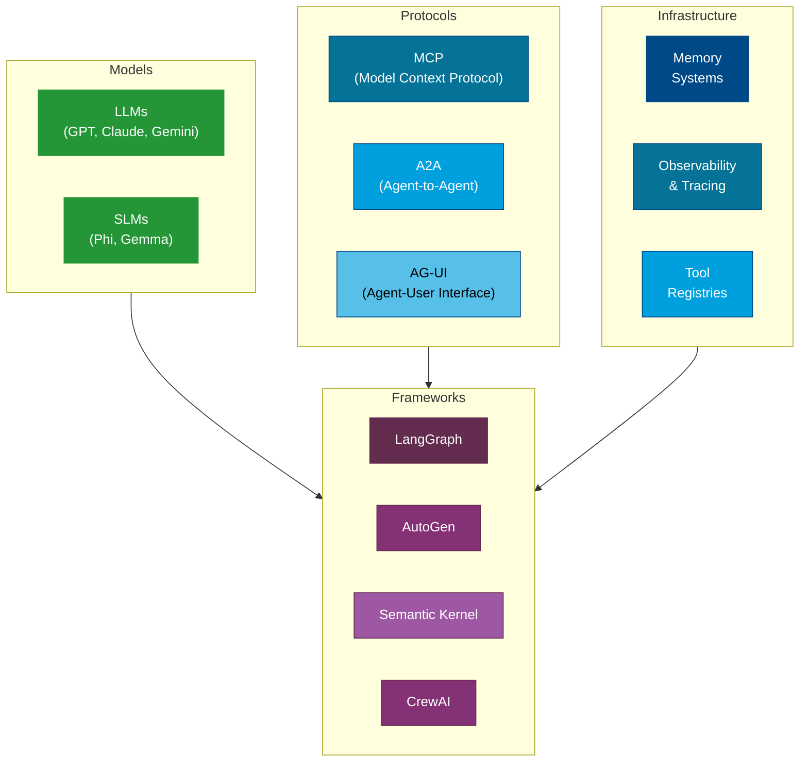
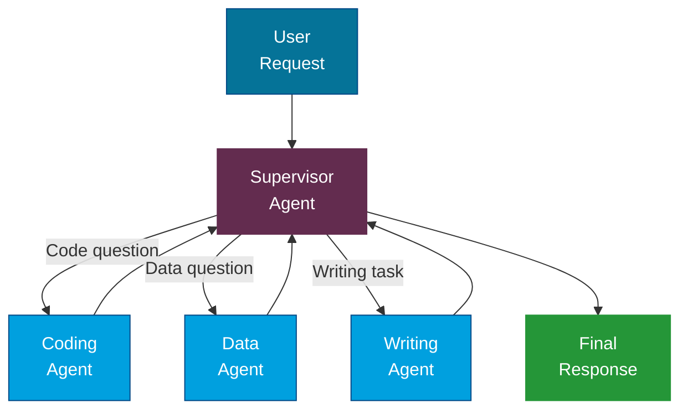

---
tags:
  - Intermediate
  - Concepts
---

# Agentic AI

Traditional AI applications take a prompt and return a response. **Agentic AI** goes further -- it can plan, use tools, make decisions, and take multi-step actions to accomplish goals. This page covers the protocols, patterns, and infrastructure that make agentic AI possible.

---

## What Makes AI "Agentic"?

A standard LLM interaction is **reactive**: you ask, it answers. An agentic system is **proactive**: given a goal, it can break it into steps, decide which tools to use, evaluate its own output, and iterate until the goal is met.

| Characteristic | Standard LLM | Agentic AI |
|---|---|---|
| Interaction | Single turn or multi-turn chat | Autonomous multi-step execution |
| Tool use | None | Calls APIs, searches databases, runs code |
| Planning | None | Breaks goals into subtasks |
| Memory | Limited to context window | Short-term and long-term memory |
| Self-correction | None | Evaluates and revises its own output |
| Decision-making | Follows instructions literally | Chooses between approaches |

!!! tip "Not Everything Needs to Be Agentic"
    Agentic systems add complexity. If a well-crafted prompt with RAG solves your problem, you do not need an agent. Use agents when the task genuinely requires multi-step reasoning, tool use, or dynamic decision-making.

---

## The Agentic Ecosystem

The modern agentic AI ecosystem consists of models, protocols, frameworks, and infrastructure working together:



---

## Key Protocols

### Model Context Protocol (MCP)

**MCP** is an open standard (created by Anthropic) that defines how AI models connect to external tools and data sources. Think of it as a **USB-C for AI** -- a universal interface that lets any model talk to any tool.

**Why it matters:**

- Before MCP, every tool integration was custom-built for each model/framework combination.
- With MCP, a tool server built once can work with any MCP-compatible client.
- It standardizes how tools describe their capabilities, accept inputs, and return results.

**Key components:**

MCP Server
:   Exposes tools, resources, and prompts via a standardized protocol.

MCP Client
:   The AI application that discovers and calls tools from MCP servers.

Transport
:   Communication layer (stdio for local, HTTP with SSE for remote).

### Agent-to-Agent Protocol (A2A)

**A2A** (by Google) enables agents built on different frameworks to communicate with each other. While MCP connects models to tools, A2A connects **agents to other agents**.

**Key concepts:**

- **Agent Cards**: JSON metadata describing what an agent can do (like a business card for agents).
- **Tasks**: Structured units of work that one agent can send to another.
- **Streaming**: Support for long-running tasks with progress updates.

### AG-UI Protocol

**AG-UI** (Agent-User Interface) standardizes the communication between AI agents and frontend interfaces. It defines how agents stream their progress, decisions, and outputs to users in real time.

**Why it matters:**

- Users need visibility into what agents are doing (not just the final answer).
- AG-UI provides standard events for tool calls, state changes, and intermediate results.
- It enables consistent UX patterns across different agent frameworks.

---

## Tool Use and Function Calling

**Tool use** (also called function calling) is the mechanism that lets an LLM invoke external functions. The model does not execute code directly -- instead, it outputs a structured request (function name + arguments), the application executes it, and the result is fed back to the model.

### How It Works

1. You define available tools (name, description, parameters) in the system prompt or API call.
2. The model decides whether a tool is needed to answer the user's question.
3. If yes, the model outputs a tool call with arguments.
4. Your application executes the tool and returns the result.
5. The model incorporates the result into its response.

!!! note "The Model Does Not Execute Tools"
    The model only *decides* which tool to call and with what arguments. Your application code is responsible for actually executing the tool. This is an important security boundary.

---

## Agentic Design Patterns

### ReAct (Reasoning + Acting)

The **ReAct** pattern interleaves reasoning and action. The agent thinks about what to do, takes an action (tool call), observes the result, and then thinks again.

```
Thought: I need to find the user's order status. I should search the database.
Action: search_orders(user_id="12345")
Observation: Order #789 - Shipped, tracking: XYZ123
Thought: I have the information. I can now respond to the user.
Answer: Your order #789 has been shipped. Tracking number: XYZ123.
```

### Reflection

In the **Reflection** pattern, an agent evaluates its own output and decides whether to revise it. This is like a built-in code review -- the agent generates a draft, critiques it, and improves it.

**Common implementation:**

1. Generator agent produces initial output.
2. Critic agent reviews the output against quality criteria.
3. If the critic finds issues, the generator revises.
4. This loop repeats until quality is acceptable or a max iteration is reached.

### Supervisor / Router

A **Supervisor** agent acts as a coordinator. It receives a user request, decides which specialized agent should handle it, routes the task, and aggregates results.



### Handoff

In a **Handoff** pattern, one agent transfers control to another when the task moves outside its area of expertise. Unlike a supervisor that routes upfront, handoff happens mid-conversation.

**Example:** A customer service agent handles a general inquiry, then hands off to a billing specialist agent when the conversation shifts to payment issues.

---

## Agent Memory

Agents need memory to maintain context across interactions and learn from past experience.

### Short-Term Memory

- Stored within the current conversation or session.
- Typically the messages in the LLM's context window.
- Lost when the session ends.
- **Example:** Remembering what the user said three messages ago.

### Long-Term Memory

- Persisted across sessions in an external store (database, vector store, file system).
- Allows agents to remember user preferences, past interactions, and learned facts.
- Must be explicitly managed (what to store, when to retrieve, when to forget).
- **Example:** Remembering that the user prefers Python over JavaScript.

!!! warning "Memory Is Not Free"
    Every piece of information stored in memory costs tokens when retrieved. Be selective about what goes into long-term memory. Store summaries and key facts, not raw transcripts.

---

## Human-in-the-Loop

Not every decision should be automated. **Human-in-the-loop (HITL)** patterns ensure that a human reviews and approves critical actions before they are executed.

**When to use HITL:**

- Actions with real-world consequences (sending emails, making purchases, modifying data)
- High-stakes decisions (financial transactions, medical recommendations)
- When confidence is low (the agent is unsure about its plan)
- Regulatory requirements demand human oversight

**Implementation approaches:**

- **Approval gates**: The agent pauses and asks for confirmation before executing a tool.
- **Review queues**: Actions are queued for human review before execution.
- **Escalation**: The agent recognizes when it is out of its depth and escalates to a human.

---

## Observability and Tracing

Agentic systems are harder to debug than simple API calls. An agent might make a dozen tool calls, revise its plan three times, and route through multiple sub-agents before producing a response. **Observability** gives you visibility into this process.

### What to Trace

- **Agent decisions**: Why did the agent choose this tool? Why did it route to this sub-agent?
- **Tool calls**: What was called, with what arguments, what was returned, how long did it take?
- **Token usage**: How many tokens were consumed at each step?
- **Latency breakdown**: Where is time being spent?
- **Errors and retries**: What failed and how did the agent recover?

### Tools for Observability

| Tool | Type | Key Features |
|---|---|---|
| LangSmith | Managed service | Deep LangChain/LangGraph integration, evaluation |
| Azure AI Foundry Tracing | Managed service | Built into Azure AI, end-to-end traces |
| Phoenix (Arize) | Open source | Model-agnostic, real-time monitoring |
| OpenLLMetry | Open source | OpenTelemetry-based, vendor-neutral |

---

## Deterministic vs Non-Deterministic Workflows

| Aspect | Deterministic | Non-Deterministic |
|---|---|---|
| **Flow** | Predefined sequence of steps | Agent decides the path dynamically |
| **Predictability** | Same input always produces same flow | Flow may vary between runs |
| **Use case** | Structured processes (approvals, pipelines) | Open-ended tasks (research, analysis) |
| **Debugging** | Easier -- follow the fixed path | Harder -- need observability |
| **Example** | "Extract data, validate, save to DB" | "Research this topic and write a report" |

!!! tip "Start Deterministic, Add Agency Gradually"
    Build your workflow as a deterministic pipeline first. Then identify specific decision points where the LLM should choose the path. This hybrid approach gives you predictability where you need it and flexibility where it helps.

---

## Orchestration Frameworks

| Framework | Maintainer | Key Strengths |
|---|---|---|
| **LangGraph** | LangChain | Graph-based workflows, streaming, persistence, human-in-the-loop |
| **AutoGen** | Microsoft | Multi-agent conversations, code execution, group chat |
| **Semantic Kernel** | Microsoft | Enterprise-ready, .NET and Python, planner-based agents |
| **CrewAI** | CrewAI | Role-based agents, easy-to-define crews and tasks |

Each framework has its own philosophy. LangGraph is graph-first (you define nodes and edges). AutoGen is conversation-first (agents talk to each other). Semantic Kernel is plugin-first (you compose capabilities). CrewAI is role-first (you define agent personas).

---

## References

- [Model Context Protocol (MCP)](https://modelcontextprotocol.io/)
- [Google A2A Protocol](https://google.github.io/A2A/)
- [AG-UI Protocol](https://docs.ag-ui.com/)
- [Microsoft AutoGen](https://microsoft.github.io/autogen/)
- [Semantic Kernel Agents](https://learn.microsoft.com/en-us/semantic-kernel/agents/)
- [LangGraph Documentation](https://langchain-ai.github.io/langgraph/)
