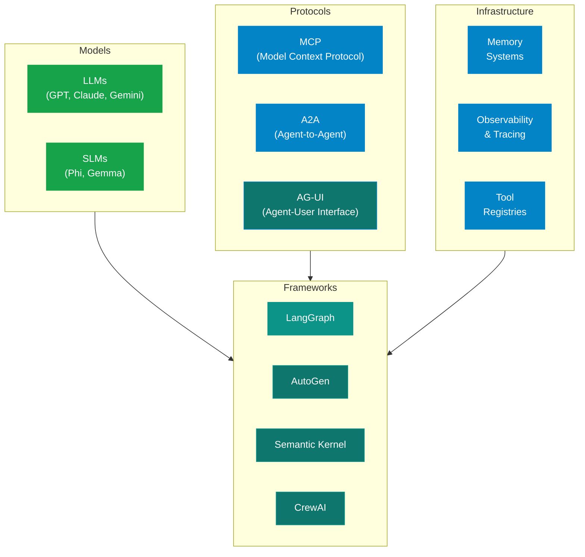
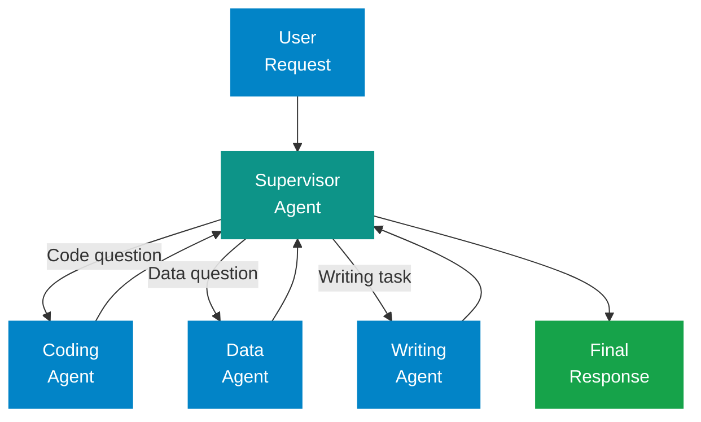

# Agentic AI

!!! abstract "Understand · 40 min · no code"
    **Before this:** [What an agent is](ai-agents.md)  ·  **After this:** [Enterprise AI patterns](../patterns/enterprise-patterns.md)
    **Hands-on version:** [4 The harness](../02-agents/the-harness.md)  ·  **In depth:** [Model Context Protocol](../ai-dev-tools/mcp.md)

[What an agent is](ai-agents.md) covered the loop and when not to use one.
This page is the ecosystem around it: the patterns agents are built from, how
they remember, how humans stay involved, and the protocols that let agents talk
to tools and to each other.

---

## What makes AI "agentic"?

A standard LLM interaction is **reactive**: you ask, it answers. An agentic system is **proactive**: given a goal, it can break it into steps, decide which tools to use, evaluate its own output, and iterate until the goal is met.

| Characteristic | Standard LLM | Agentic AI |
|---|---|---|
| Interaction | Single turn or multi-turn chat | Autonomous multi-step execution |
| Tool use | None | Calls APIs, searches databases, runs code |
| Planning | None | Breaks goals into subtasks |
| Memory | Limited to context window | Short-term and long-term memory |
| Self-correction | None | Evaluates and revises its own output |
| Decision-making | Follows instructions literally | Chooses between approaches |

!!! tip "Not everything needs to be agentic"
    Agentic systems add complexity. If a well-crafted prompt with RAG solves your problem, you do not need an agent. Use agents when the task genuinely requires multi-step reasoning, tool use, or dynamic decision-making.

---

## The agentic ecosystem

The modern agentic AI ecosystem consists of models, protocols, frameworks, and infrastructure working together:


```mermaid
graph TD
    subgraph Protocols
        MCP["MCP<br/>(Model Context Protocol)"]
        A2A["A2A<br/>(Agent-to-Agent)"]
        AGUI["AG-UI<br/>(Agent-User Interface)"]
    end

    subgraph Frameworks
        LG["LangGraph"]
        AG["AutoGen"]
        SK["Semantic Kernel"]
        CW["CrewAI"]
    end

    subgraph Infrastructure
        MEM["Memory<br/>Systems"]
        OBS["Observability<br/>& Tracing"]
        TOOLS["Tool<br/>Registries"]
    end

    subgraph Models
        LLM["LLMs<br/>(GPT, Claude, Gemini)"]
        SLM["SLMs<br/>(Phi, Gemma)"]
    end

    Models --> Frameworks
    Protocols --> Frameworks
    Infrastructure --> Frameworks

    style MCP fill:#0284c7,stroke:#0284c7,color:#fff
    style A2A fill:#0284c7,stroke:#0284c7,color:#fff
    style AGUI fill:#0f766e,stroke:#0284c7,color:#fff
    style LG fill:#0d9488,stroke:#0d9488,color:#fff
    style AG fill:#0f766e,stroke:#0d9488,color:#fff
    style SK fill:#0f766e,stroke:#0d9488,color:#fff
    style CW fill:#0f766e,stroke:#0d9488,color:#fff
    style MEM fill:#0284c7,stroke:#0284c7,color:#fff
    style OBS fill:#0284c7,stroke:#0284c7,color:#fff
    style TOOLS fill:#0284c7,stroke:#0284c7,color:#fff
    style LLM fill:#16a34a,stroke:#16a34a,color:#fff
    style SLM fill:#16a34a,stroke:#16a34a,color:#fff
```

---

## Key protocols

### Model Context Protocol (MCP)

**MCP** is an open standard (created by Anthropic) that defines how AI models connect to external tools and data sources. Think of it as a **USB-C for AI** — a universal interface that lets any model talk to any tool.

**Why it matters:**

- Before MCP, every tool integration was custom-built for each model/framework combination.
- With MCP, a tool server built once can work with any MCP-compatible client.
- It standardizes how tools describe their capabilities, accept inputs, and return results.

**Key components:**

MCP Server
:   Exposes tools, resources, and prompts via a standardized protocol.

MCP Client
:   The AI application that discovers and calls tools from MCP servers.

Transport
:   Communication layer (stdio for local, HTTP with SSE for remote).

### Agent-to-agent protocol (A2A)

**A2A** (by Google) enables agents built on different frameworks to communicate with each other. While MCP connects models to tools, A2A connects **agents to other agents**.

**Key concepts:**

- **Agent Cards**: JSON metadata describing what an agent can do (like a business card for agents).
- **Tasks**: Structured units of work that one agent can send to another.
- **Streaming**: Support for long-running tasks with progress updates.

### AG-UI protocol

**AG-UI** (Agent-User Interface) standardizes the communication between AI agents and frontend interfaces. It defines how agents stream their progress, decisions, and outputs to users in real time.

**Why it matters:**

- Users need visibility into what agents are doing (not just the final answer).
- AG-UI provides standard events for tool calls, state changes, and intermediate results.
- It enables consistent UX patterns across different agent frameworks.

---

## Tool use and function calling

**Tool use** (also called function calling) is the mechanism that lets an LLM invoke external functions. The model does not execute code directly — instead, it outputs a structured request (function name + arguments), the application executes it, and the result is fed back to the model.

### How it works

1. You define available tools (name, description, parameters) in the system prompt or API call.
2. The model decides whether a tool is needed to answer the user's question.
3. If yes, the model outputs a tool call with arguments.
4. Your application executes the tool and returns the result.
5. The model incorporates the result into its response.

!!! note "The model does not execute tools"
    The model only *decides* which tool to call and with what arguments. Your application code is responsible for actually executing the tool. This is an important security boundary.

---

## Agentic design patterns

### ReAct (reasoning + acting)

The **ReAct** pattern interleaves reasoning and action. The agent thinks about what to do, takes an action (tool call), observes the result, and then thinks again.

```
Thought: I need to find the user's order status. I should search the database.
Action: search_orders(user_id="12345")
Observation: Order #789 - Shipped, tracking: XYZ123
Thought: I have the information. I can now respond to the user.
Answer: Your order #789 has been shipped. Tracking number: XYZ123.
```

### Reflection

In the **Reflection** pattern, an agent evaluates its own output and decides whether to revise it. This is like a built-in code review — the agent generates a draft, critiques it, and improves it.

**Common implementation:**

1. Generator agent produces initial output.
2. Critic agent reviews the output against quality criteria.
3. If the critic finds issues, the generator revises.
4. This loop repeats until quality is acceptable or a max iteration is reached.

### Supervisor / router

A **Supervisor** agent acts as a coordinator. It receives a user request, decides which specialized agent should handle it, routes the task, and aggregates results.


```mermaid
graph TD
    U["User<br/>Request"] --> S["Supervisor<br/>Agent"]
    S -->|"Code question"| C["Coding<br/>Agent"]
    S -->|"Data question"| D["Data<br/>Agent"]
    S -->|"Writing task"| W["Writing<br/>Agent"]
    C --> S
    D --> S
    W --> S
    S --> R["Final<br/>Response"]

    style U fill:#0284c7,stroke:#0284c7,color:#fff
    style S fill:#0d9488,stroke:#0d9488,color:#fff
    style C fill:#0284c7,stroke:#0284c7,color:#fff
    style D fill:#0284c7,stroke:#0284c7,color:#fff
    style W fill:#0284c7,stroke:#0284c7,color:#fff
    style R fill:#16a34a,stroke:#16a34a,color:#fff
```

### Handoff

In a **Handoff** pattern, one agent transfers control to another when the task moves outside its area of expertise. Unlike a supervisor that routes upfront, handoff happens mid-conversation.

**Example:** A customer service agent handles a general inquiry, then hands off to a billing specialist agent when the conversation shifts to payment issues.

---

## Agent memory

The model remembers nothing. "Agent memory" is always software: something your
code stores and chooses to put back into a later prompt.

| Kind | Where it lives | Lost when | Example |
|---|---|---|---|
| **Short-term** | The message list in the current context window | The session ends, or the window overflows | What the user said three messages ago |
| **Long-term** | An external store: database, file, vector store | Never, until you delete it | That this user prefers Python |
| **Episodic** | A record of past runs and their outcomes | Never | That this approach failed last time |

Retrieval and long-term memory are the same machinery pointed at different
data: one at your documents, the other at what happened before. Everything in
[Retrieval and data](retrieval-and-data.md) applies here too, including the fact
that a lookup always returns something.

**The three decisions**, and they are all yours rather than the model's:

1. **What to write.** Storing whole transcripts is the common mistake. Store
   facts and decisions, not conversation.
2. **When to read.** Retrieving all memory every turn wastes context and buries
   the current task. Retrieve what is relevant to this turn.
3. **When to forget.** Almost nobody builds this, and it is why memory systems
   decay. Preferences change; superseded facts need removing, not accumulating.

!!! warning "Memory is not free, and it can poison a run"
    Every remembered item costs tokens on every turn that retrieves it.

    Worse, a wrong memory is durable. If an agent stores an incorrect
    conclusion — a misread preference, a fact that was true last quarter — it is
    reinjected into future prompts as established context, and the model has no
    way to know it is wrong. One bad write can degrade every later run, and the
    symptom looks like the model getting worse rather than the store being
    wrong.

    Treat writes with more suspicion than reads: validate what goes in, record
    where it came from, and make it possible to inspect and delete.

---

## Human-in-the-loop

Not every decision should be automated. **Human-in-the-loop** patterns put a
person between the agent's intention and its effect.

[What an agent is](ai-agents.md#autonomy-is-a-dial-not-a-switch) covers choosing
a level of autonomy, including per tool rather than per system, and why
approval fatigue makes universal confirmation worthless. This section is the
implementation side.

**When to use HITL:**

- Actions with real-world consequences (sending emails, making purchases, modifying data)
- High-stakes decisions (financial transactions, medical recommendations)
- When confidence is low (the agent is unsure about its plan)
- Regulatory requirements demand human oversight

**Implementation approaches:**

- **Approval gates**: The agent pauses and asks for confirmation before executing a tool.
- **Review queues**: Actions are queued for human review before execution.
- **Escalation**: The agent recognizes when it is out of its depth and escalates to a human.

---

## Observability and tracing

Agentic systems are harder to debug than simple API calls. An agent might make a dozen tool calls, revise its plan three times, and route through multiple sub-agents before producing a response. **Observability** gives you visibility into this process.

### What to trace

- **Agent decisions**: Why did the agent choose this tool? Why did it route to this sub-agent?
- **Tool calls**: What was called, with what arguments, what was returned, how long did it take?
- **Token usage**: How many tokens were consumed at each step?
- **Latency breakdown**: Where is time being spent?
- **Errors and retries**: What failed and how did the agent recover?

### Tools for observability

| Tool | Type | Key Features |
|---|---|---|
| LangSmith | Managed service | Deep LangChain/LangGraph integration, evaluation |
| Azure AI Foundry Tracing | Managed service | Built into Azure AI, end-to-end traces |
| Phoenix (Arize) | Open source | Model-agnostic, real-time monitoring |
| OpenLLMetry | Open source | OpenTelemetry-based, vendor-neutral |

---

## Deterministic and non-deterministic, mixed

[What an agent is](ai-agents.md#agent-workflow-or-copilot) sets out the choice
between a fixed workflow and a model-directed agent. In practice the useful
answer is usually neither one nor the other.

!!! tip "Start deterministic, add agency at the points that need it"
    Build the process as an ordinary pipeline first. Then find the specific
    steps where the path genuinely cannot be known in advance, and let the model
    decide only there.

    A document pipeline might extract, validate and store deterministically, and
    use the model only to classify an ambiguous document or to draft a summary.
    You get predictable cost and debuggability everywhere except the two places
    that needed judgement.

This hybrid is what most successful systems look like, and it is rarely what
gets demonstrated, because a fixed pipeline with three model calls in it is less
impressive than an agent that appears to decide everything for itself.

---

## Orchestration frameworks

You do not need one of these. [The build path](../00-start-here/the-path.md)
constructs a working agent loop in about thirty lines without any framework, and
doing that once is the best preparation for choosing between them.

What a framework actually gives you is the harness: retries, state, streaming,
tracing, checkpointing and multi-agent plumbing you would otherwise write.

| Framework | Maintainer | Philosophy |
|---|---|---|
| **Microsoft Agent Framework** | Microsoft | Graph-based orchestration on .NET and Python. The successor to Semantic Kernel and AutoGen, GA since April 2026 |
| **LangGraph** | LangChain | Graph-first: you define nodes and edges, with checkpointing and resumable state |
| **OpenAI Agents SDK** | OpenAI | Small surface area, with handoffs between agents as a first-class concept |
| **Google ADK** | Google | Multi-agent composition with evaluation built in rather than bolted on |
| **CrewAI** | CrewAI | Role-first: you define agent personas and the crew that coordinates them |

!!! warning "Semantic Kernel and AutoGen"
    Both are superseded by Microsoft Agent Framework, which merged them in April
    2026. Existing code keeps working and Semantic Kernel still gets security
    fixes, but new work should not start on either. They are still recommended
    by a great deal of writing that predates the merger — including comparison
    posts published after it.

The fuller comparison, including platforms rather than just libraries, is in
[Frameworks and platforms](../tools-and-frameworks/index.md).

---

## Go deeper

- [Model Context Protocol](https://modelcontextprotocol.io/) — the tool-connection standard. The [hands-on version](../ai-dev-tools/mcp.md) is on this site.
- [A2A protocol](https://a2a-protocol.org) — agent-to-agent delegation. Linux Foundation since June 2025, so treat "A2A by Google" as a dated phrase.
- [AG-UI protocol](https://docs.ag-ui.com/) — the agent-to-user interaction layer, the least settled of the three.
- [Microsoft Agent Framework](https://learn.microsoft.com/en-us/agent-framework/) — the current Microsoft answer, and the successor to both Semantic Kernel and AutoGen.
- [LangGraph](https://docs.langchain.com/oss/python/langgraph/overview) — orchestration as an explicit graph, with checkpoints and resumable state.
- [Anthropic: building effective agents](https://www.anthropic.com/engineering/building-effective-agents) — still the best shared vocabulary for these patterns. Read the banner: the authors mark it superseded on practice, not on terminology.
