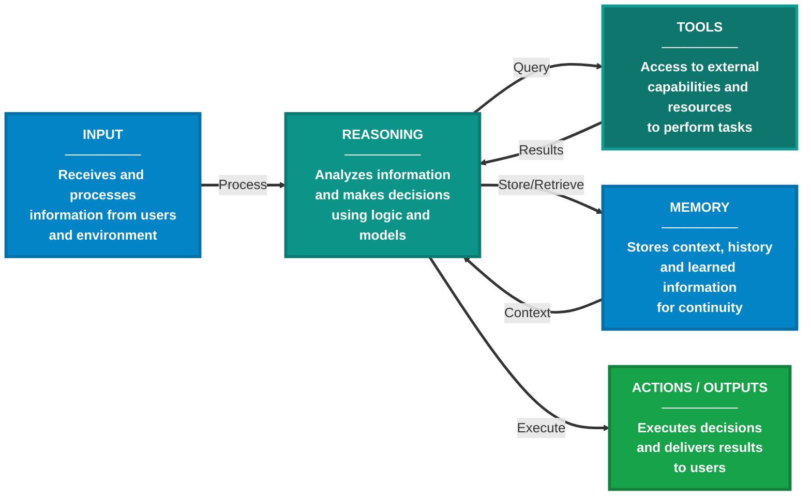
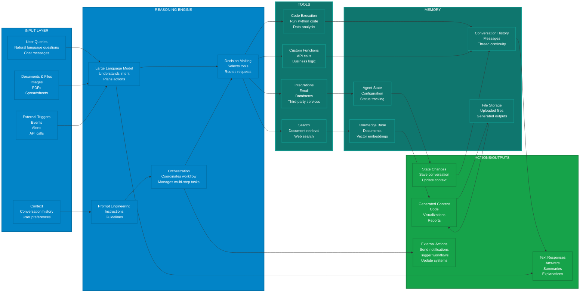
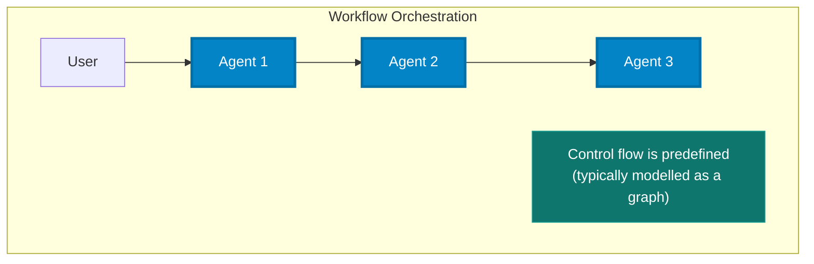
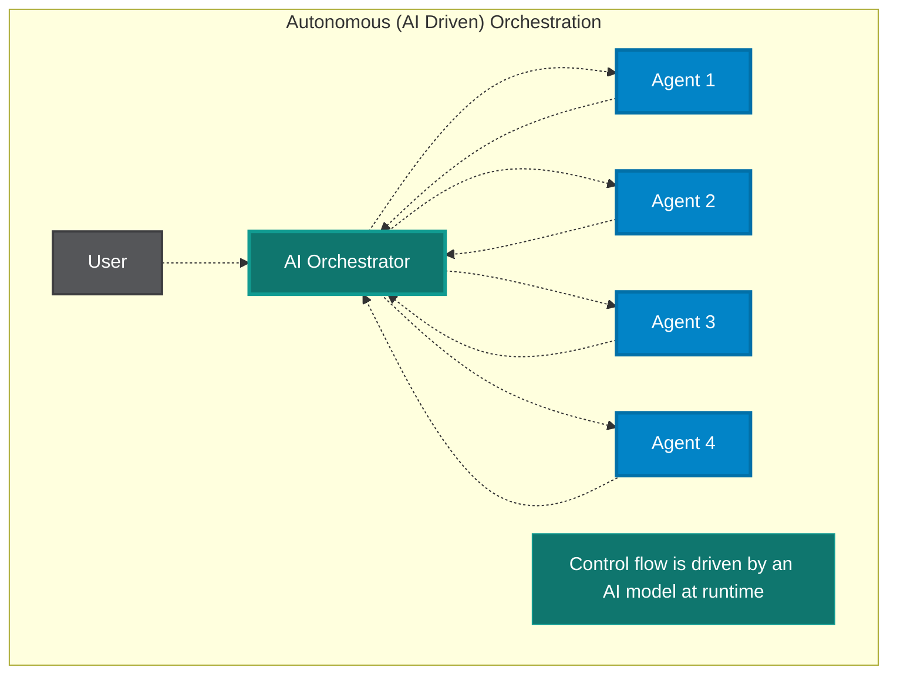

# What an agent is

!!! abstract "Understand · 40 min · no code"
    **Before this:** [Retrieval and data](retrieval-and-data.md)  ·  **After this:** [Agentic AI](agentic-ai.md)
    **Hands-on version:** [3 The agent loop](../02-agents/the-agent-loop.md)  ·  **In depth:** [Design patterns](../patterns/design-patterns.md)

[AI 101](../getting-started/index.md) made the point that a model cannot *do*
anything — it only produces text. An agent is what you build around that
limitation.

## An agent is a loop

Strip away the vocabulary and an agent is one idea:

> The model is called repeatedly. Each time, it either asks for an action or
> gives a final answer. Your code performs the requested action, hands back the
> result, and calls the model again. The loop ends when the model stops asking.

That is the whole mechanism. Not a plan executed step by step, and not a system
that decides for itself what it is allowed to do — a loop, where the model
chooses the next step given everything that has happened so far.

Three consequences follow, and they explain most agent behaviour:

- **Nothing else stops it.** The loop ends when the model returns content
  instead of an action request. If it never does, it runs until you impose a
  limit. Step and cost budgets are not optional extras.
- **The model never executes anything.** It emits a structured request — a name
  and some arguments — and your code decides whether to honour it. Every
  security question about agents is really a question about that decision.
- **Each turn resends everything.** The model has no memory, so the whole
  history goes back every time. This is why agents are expensive in a way that
  surprises people, and why the context window becomes a live constraint.

!!! warning "Agents do not learn"
    A common and consequential misreading. The model's weights are frozen. An
    agent that "learns from feedback" is one whose *software* writes something
    down and includes it in a later prompt. Nothing improves by itself, and
    yesterday's mistake will recur tomorrow unless something in your system
    stored it and puts it back into the context.

## The components

Around that loop sit five parts. 

### Core components

The following diagram illustrates the core components and their interactions in an AI agent:

### Detailed component architecture

The following diagram shows a detailed view of each component with specific examples:

## Agent, workflow, or copilot?

"Agent" is used for three quite different things, and the differences decide
cost, reliability and how much can go wrong.

| | **Workflow** | **Agent** | **Copilot** |
|---|---|---|---|
| Who decides the steps | You, in code | The model, at runtime | The person |
| Path through the task | Fixed | Different every run | Person-led |
| Cost and latency | Predictable | Variable, sometimes wildly | Predictable |
| Debuggable | Like normal software | Only through traces | Directly |
| Fails by | Throwing an error | Doing something plausible and wrong | Suggesting something you reject |
| Reach for it when | The steps are known | The steps genuinely cannot be known in advance | A person should stay accountable |

Most production systems that succeed are workflows with model calls inside
them, or copilots. Fully autonomous agents are the smallest category and the
hardest to operate — which is the reverse of how they are discussed.

**The order to try things:** a function, then a workflow with model calls at the
uncertain steps, then a single agent with a small set of tools, then multiple
agents. Each step multiplies what can go wrong. Take it only when the previous
one has demonstrably failed.

## Autonomy is a dial, not a switch

Between "suggests" and "acts alone" there are useful settings, and picking one
deliberately is most of the design work.

| Level | The agent | Suits |
|---|---|---|
| **Suggest** | Proposes; a person performs the action | High-stakes, low-volume |
| **Confirm** | Prepares the action; a person approves it | Irreversible actions: payments, deletion, external messages |
| **Act and report** | Acts, then reports what it did | Reversible actions with an audit trail |
| **Act freely** | Acts within limits set in code | Read-only work, low-value reversible writes |

The dial can differ per tool in the same agent. Searching a knowledge base can
be free; issuing a refund can require confirmation. That is a better design than
picking one level for the whole system.

!!! warning "Approval fatigue is a real failure mode"
    A confirmation step only works while people read it. Ask someone to approve
    forty actions an hour and they will approve the forty-first without looking.
    If everything needs approval, nothing is really approved. Reserve it for the
    actions that genuinely cannot be undone, and make those few.

## When to use AI agents?

!!! success "Ideal use cases"
    AI agents are suitable for applications that require autonomous decision-making, ad hoc planning, trial-and-error exploration, and conversation-based user interactions. They are particularly useful for scenarios where the input task is unstructured and cannot be easily defined in advance.

### Common scenarios where AI agents excel

1. **Customer Support**: AI agents can handle multi-modal queries (text, voice, images) from customers, use tools to look up information, and provide natural language responses
2. **Education and Tutoring**: AI agents can leverage external knowledge bases to provide personalized tutoring and answer student questions
3. **Code Generation and Debugging**: For software developers, AI agents can assist with implementation, code reviews, and debugging by using various programming tools and environments
4. **Research Assistance**: For researchers and analysts, AI agents can search the web, summarize documents, and piece together information from multiple sources

!!! info "Key characteristic"
    AI agents are designed to operate in a dynamic and underspecified setting, where the exact sequence of steps to fulfill a user request is not known in advance and might require exploration and close collaboration with users.

## When not to use AI agents?

!!! warning "Limitations"
    AI agents are not well-suited for tasks that are highly structured and require strict adherence to predefined rules. If your application anticipates a specific kind of input and has a well-defined sequence of operations to perform, using AI agents might introduce unnecessary uncertainty, latency, and cost.

### Alternative approaches

!!! tip "Use functions instead"
    If you can write a function to handle the task, do that instead of using an AI agent. You can use AI to help you write that function.

!!! note "Complex multi-step tasks"
    A single AI agent might struggle with complex tasks that involve multiple steps and decision points. Such tasks might require a large number of tools (for example, over 20), which a single agent cannot feasibly manage. In these cases, consider using **workflows** instead.

---

## Why agents are hard

The gap between a demo and a system that works is wider here than almost
anywhere else in software, for reasons that are structural rather than a matter
of effort.

**Errors compound across steps.** If each step is 95% reliable, a five-step task
succeeds about 77% of the time and a ten-step task about 60%. Nothing is broken;
that is just what multiplying does. Reliability per step is the thing to
improve, and shorter tasks are more valuable than they look.

**Failure is plausible, not loud.** Ordinary software throws an exception. An
agent produces a confident, well-formed, wrong result and continues. Your
monitoring has to look for wrongness, not for errors.

**The same input gives different runs.** Two identical requests can take
different paths. Testing has to be statistical rather than exact — see
[evaluation](../02-agents/evaluation.md).

**Cost grows faster than the task.** Every turn resends the whole history, so
cost rises with roughly the square of the number of turns. A task that takes
twice as many steps costs about four times as much.

**Debugging needs a trace.** "Why did it do that?" is unanswerable without a
record of every call, tool result and decision. Tracing is a prerequisite, not a
maturity milestone — see [observability](../02-agents/observability.md).

---

## Multi-agent systems

### What is a multi-agent system?

A **multi-agent system** (or multi-agent application) is a collection of agents that collaborate to solve tasks. Each agent maintains specific capabilities—reasoning, acting, and communicating—and can adapt to changes in the task or environment.

### Multi-agent orchestration patterns

#### 1. Multi-agent workflows (defined orchestration)

!!! info "Defined orchestration"
    These systems follow pre-defined collaboration patterns where each agent has clearly specified roles, responsibilities, and handoff points. The orchestration logic is explicitly programmed, creating predictable and repeatable processes.
    
    **Example**: A document processing workflow might have agents that specialize in text extraction, analysis, and formatting, working in a predetermined sequence with defined inputs and outputs for each stage.

#### 2. Autonomous multi-agent orchestration (AI-driven orchestration)

!!! info "AI-driven orchestration"
    These systems use AI models to drive orchestration decisions, allowing agents to dynamically negotiate responsibilities and adapt their collaboration based on task requirements and intermediate results. The orchestration emerges from agent interactions rather than being pre-programmed.
    
    **Use Case**: This approach is particularly valuable for complex tasks where the optimal solution strategy cannot be predetermined and must evolve through exploration and adaptation.

---

## Workflows

### What is a workflow?

A **workflow** can express a predefined sequence of operations that can include AI agents as components while maintaining consistency and reliability. Workflows are designed to handle complex and long-running processes that might involve multiple agents, human interactions, and integrations with external systems.

The execution sequence of a workflow can be explicitly defined, allowing for more control over the execution path.

### Workflow example: connecting agents and functions

The following diagram illustrates an example of a workflow that connects two AI agents and a function:

```mermaid

%%{init: {'themeVariables': {'fontSize':'16px'}}}%%

graph LR
    Start([User Input])
    Func1["FUNCTION<br/>────────<br/>Data Fetching<br/>• REST API calls<br/>• Database queries<br/>• External data sources"]
    Agent1["AI AGENT 1<br/>────────<br/>Research Agent<br/>• Analyzes request<br/>• Searches knowledge base<br/>• Gathers information"]
    Func2["FUNCTION<br/>────────<br/>Data Processing<br/>• Validates data<br/>• Transforms format<br/>• Applies business rules"]
    Agent2["AI AGENT 2<br/>────────<br/>Response Agent<br/>• Synthesizes findings<br/>• Generates response<br/>• Formats output"]
    End([User Output])
    
    Start -->|"1. Initial Request"| Func1
    Func1 -->|"2. Fetched Data"| Agent1
    Agent1 -->|"3. Analyzed Data"| Func2
    Func2 -->|"4. Processed Data"| Agent2
    Agent2 -->|"5. Final Response"| End
    
    style Start fill:#0284c7,stroke:#0270a8,stroke-width:3px,color:#ffffff,font-weight:bold
    style Func1 fill:#0284c7,stroke:#0270a8,stroke-width:4px,color:#ffffff,font-weight:bold
    style Agent1 fill:#0f766e,stroke:#119b91,stroke-width:4px,color:#ffffff,font-weight:bold
    style Func2 fill:#0f766e,stroke:#119b91,stroke-width:4px,color:#fff,font-weight:bold
    style Agent2 fill:#0284c7,stroke:#0270a8,stroke-width:4px,color:#ffffff,font-weight:bold
    style End fill:#16a34a,stroke:#15803d,stroke-width:3px,color:#ffffff,font-weight:bold
    
    linkStyle 0 stroke:#0284c7,stroke-width:3px
    linkStyle 1 stroke:#0284c7,stroke-width:3px
    linkStyle 2 stroke:#14b8a6,stroke-width:3px
    linkStyle 3 stroke:#14b8a6,stroke-width:3px
    linkStyle 4 stroke:#0284c7,stroke-width:3px

```

!!! note "Dynamic workflows"
    Workflows can also express dynamic sequences using conditional routing, model-based decision making, and concurrent execution. This is how multi-agent orchestration patterns are implemented. The orchestration patterns provide mechanisms to coordinate multiple agents to work on complex tasks that require multiple steps and decision points, addressing the limitations of single agents.

### What problems do workflows solve?

Workflows provide a structured way to manage complex processes that involve multiple steps, decision points, and interactions with various systems or agents. The types of tasks workflows are designed to handle often require more than one AI agent.

### Key benefits of workflows

!!! success "Workflow advantages"
    
    - **Modularity**: Workflows can be broken down into smaller, reusable components, making it easier to manage and update individual parts of the process
    
    - **Agent Integration**: Workflows can incorporate multiple AI agents alongside non-agentic components, allowing for sophisticated orchestration of tasks
    
    - **Type Safety**: Strong typing ensures messages flow correctly between components, with comprehensive validation that prevents runtime errors
    
    - **Flexible Flow**: Graph-based architecture allows for intuitive modeling of complex workflows with executors and edges. Conditional routing, parallel processing, and dynamic execution paths are all supported
    
    - **Scalability**: Components can be reused or combined to create more complex processes, allowing for scalability and adaptability

---

## Architectural patterns for AI agents

The following table summarizes common architectural patterns for implementing AI agents:

| Pattern | Description | Common Use Case |
|---------|-------------|-----------------|
| **Monolithic Agent** | Single LLM-based reasoning with embedded tool use and memory | Chatbots, copilots |
| **Modular Agent** | Decomposed components for reasoning, memory, and execution | Scalable assistants, analytics |
| **Multi-Agent System (MAS)** | Multiple agents with defined roles collaborating via orchestration | Research simulation, workflow automation |
| **Hierarchical Agents** | Supervisor agent delegates to specialized sub-agents | Complex task planning, enterprise orchestration |

---

## Go deeper

- [Anthropic: building effective agents](https://www.anthropic.com/engineering/building-effective-agents) — the clearest statement of when a workflow beats an agent, which is more often than the marketing suggests.
- [Foundry Agent Service overview](https://learn.microsoft.com/en-us/azure/foundry/agents/overview) — what a managed agent runtime actually provides, if you would rather not build the harness.
- [Microsoft Agent Framework](https://learn.microsoft.com/en-us/agent-framework/) — the current .NET and Python SDK.
- [LangGraph](https://docs.langchain.com/oss/python/langgraph/overview) — the same ideas as a state graph.
- [OpenAI function calling](https://developers.openai.com/api/docs/guides/function-calling) — the request and response shape that the rest of the industry copied.
- [Don't build multi-agents](https://cognition.com/blog/dont-build-multi-agents) and [how we built our multi-agent research system](https://www.anthropic.com/engineering/multi-agent-research-system) — published a day apart, arguing opposite conclusions. Read them as a pair; the disagreement teaches more than either alone.
