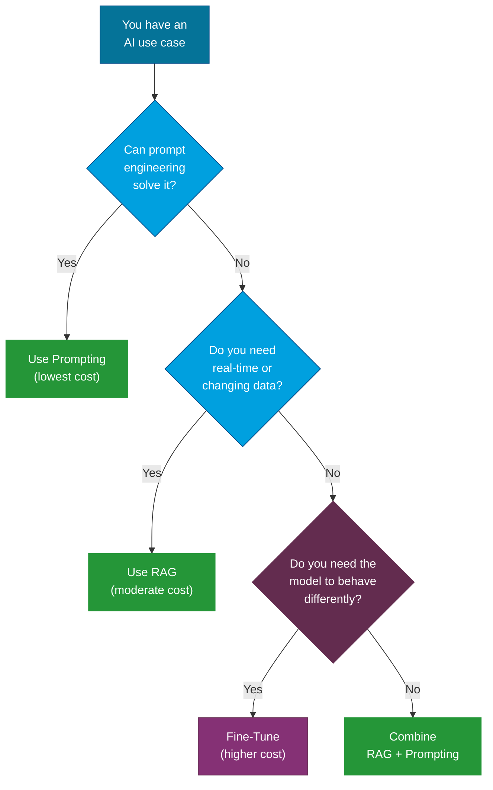
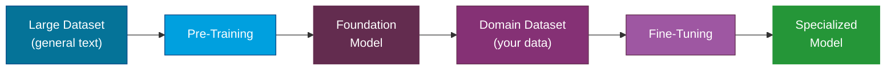

---
tags:
  - Advanced
  - Concepts
---

# Fine-Tuning & Training

Prompting and RAG handle most AI use cases. But when you need a model to adopt a specific behavior, tone, or deep domain expertise that cannot be achieved through instructions alone, **fine-tuning** is the next step. This page explains when and how to customize AI models for your specific needs.

---

## When to Fine-Tune: The Decision Flow

Before investing in fine-tuning, make sure simpler approaches will not work. Here is a decision framework:



!!! tip "The 80/20 Rule"
    In practice, 80% of AI use cases can be solved with good prompt engineering and RAG. Fine-tuning is for the remaining 20% where you need the model to fundamentally change how it responds.

---

## What Is Fine-Tuning?

**Fine-tuning** is the process of taking a pre-trained model and further training it on a smaller, task-specific dataset. The model adjusts its internal weights to become better at the specific task while retaining its general capabilities.

### Analogy

Think of a pre-trained model as a university graduate with broad knowledge. Fine-tuning is like that graduate doing a specialized internship -- they apply their general knowledge to a specific domain and get better at it.

### What Fine-Tuning Changes

- **Output style and tone**: Write in your brand voice, match a specific format.
- **Domain behavior**: Respond like a medical professional, legal expert, or financial analyst.
- **Task specialization**: Get consistently better at a narrow task (classification, extraction, scoring).
- **Reduced prompting**: The model "just knows" things that previously required long prompts.

### What Fine-Tuning Does NOT Do

- It does not give the model access to new data at inference time (that is what RAG does).
- It does not guarantee elimination of hallucinations.
- It does not change the model's architecture or fundamental capabilities.

---

## Supervised Fine-Tuning (SFT)

**Supervised Fine-Tuning** is the most common approach. You provide a dataset of input-output pairs (examples of what the model should produce) and train it to replicate those patterns.

### Training Data Format

Most fine-tuning APIs expect data in a conversational format:

```json
{
  "messages": [
    {"role": "system", "content": "You are a medical coding assistant."},
    {"role": "user", "content": "Patient presents with acute bronchitis."},
    {"role": "assistant", "content": "ICD-10 Code: J20.9 - Acute bronchitis, unspecified"}
  ]
}
```

### How Much Data Do You Need?

| Goal | Minimum Examples | Recommended |
|---|---|---|
| Style/tone adjustment | 50-100 | 200-500 |
| Task specialization | 100-500 | 500-2,000 |
| Deep domain expertise | 500-1,000 | 2,000-10,000 |

!!! note "Quality Over Quantity"
    50 high-quality, carefully curated examples will outperform 5,000 noisy, inconsistent ones. Invest in data quality. Every example should be one you would be proud to show as a correct response.

---

## LoRA and Efficient Fine-Tuning

Training all parameters of a large model is expensive and slow. **LoRA (Low-Rank Adaptation)** and related techniques make fine-tuning practical by training only a small fraction of the model's parameters.

### How LoRA Works

Instead of updating all model weights during training, LoRA:

1. **Freezes** the original model weights.
2. **Injects** small, trainable matrices (adapters) into specific layers.
3. **Trains** only these adapters, which are typically less than 1% of the total parameters.

### Benefits

| Aspect | Full Fine-Tuning | LoRA |
|---|---|---|
| **Parameters trained** | All (billions) | ~0.1-1% |
| **GPU memory** | Very high (multi-GPU) | Moderate (single GPU possible) |
| **Training time** | Hours to days | Minutes to hours |
| **Storage** | Full model copy per task | Small adapter file per task |
| **Quality** | Highest | Near-equivalent for most tasks |

### QLoRA

**QLoRA** combines LoRA with **quantization** -- reducing the precision of the frozen model weights (e.g., from 16-bit to 4-bit). This further reduces memory requirements, making it possible to fine-tune large models on consumer-grade GPUs.

!!! tip "LoRA for Experimentation"
    LoRA's low cost and fast iteration make it ideal for experimentation. You can quickly test whether fine-tuning will help your use case before committing to a full training run.

---

## Transfer Learning

**Transfer learning** is the broader concept that fine-tuning is built on. The idea is simple: knowledge learned from one task can be **transferred** to help with a related task.

### Why It Works

A model pre-trained on billions of words of text has already learned:

- Grammar and sentence structure
- Common sense reasoning
- World knowledge
- Logic and pattern recognition

When you fine-tune, you are not teaching the model language from scratch. You are redirecting its existing capabilities toward your specific domain.

### The Transfer Learning Pipeline



---

## RLHF: Reinforcement Learning from Human Feedback

**RLHF** is the technique that transformed raw language models into the helpful, harmless assistants we use today. It aligns model behavior with human preferences.

### How RLHF Works (Simplified)

1. **Supervised Fine-Tuning**: Start with a base model and fine-tune it on curated examples of good responses.
2. **Reward Model Training**: Have humans rank multiple model outputs for the same prompt. Use these rankings to train a separate "reward model" that predicts which responses humans prefer.
3. **Reinforcement Learning**: Use the reward model to further train the language model. The language model learns to generate responses that score high on the reward model.

### Why RLHF Matters

- It is the reason models refuse harmful requests, stay on topic, and try to be helpful.
- It is how model providers align general-purpose models with safety guidelines.
- Without RLHF, models would simply predict the most statistically likely text, which often includes toxic or unhelpful content.

### Alternatives to RLHF

DPO (Direct Preference Optimization)
:   A simpler alternative to RLHF that skips the reward model step. It directly uses human preference data to adjust model weights. Faster and more stable than RLHF.

RLAIF (RL from AI Feedback)
:   Uses an AI model (instead of humans) to provide feedback. Scales better but may inherit biases from the feedback model.

!!! note "RLHF Is Typically Done by Model Providers"
    Unless you are building a foundation model from scratch, you will likely not implement RLHF yourself. It is included here for understanding because it fundamentally shapes how all modern AI models behave.

---

## Cost and Effort Considerations

Fine-tuning is not free. Here is an honest look at the investment required:

### Cost Factors

| Factor | Description |
|---|---|
| **Compute** | GPU hours for training. LoRA reduces this significantly. |
| **Data preparation** | Curating, cleaning, and formatting training data is the most time-consuming step. |
| **Evaluation** | You need a systematic way to measure whether fine-tuning improved the model. |
| **Iteration** | Fine-tuning rarely works perfectly on the first try. Budget for multiple rounds. |
| **Hosting** | Fine-tuned models may need dedicated endpoints, increasing serving costs. |
| **Maintenance** | As your domain changes, training data and models need updating. |

### Comparison of Approaches

| Approach | Upfront Cost | Ongoing Cost | Time to Deploy | Flexibility |
|---|---|---|---|---|
| Prompt engineering | Very low | Per-token API costs | Hours | High (change prompts anytime) |
| RAG | Moderate (indexing pipeline) | Per-query + API costs | Days to weeks | High (update data anytime) |
| LoRA fine-tuning | Moderate (GPU + data prep) | Hosting + API costs | Weeks | Medium (retrain to update) |
| Full fine-tuning | High (multi-GPU + data prep) | Hosting + API costs | Weeks to months | Low (expensive to update) |

!!! warning "Do Not Fine-Tune Prematurely"
    Fine-tuning should be your last resort, not your first approach. Exhaust prompt engineering and RAG first. If you still cannot achieve the quality you need, then consider fine-tuning -- starting with LoRA.

---

## References

- [Fine-tuning Azure OpenAI](https://learn.microsoft.com/en-us/azure/ai-services/openai/how-to/fine-tuning)
- [Hugging Face PEFT/LoRA](https://huggingface.co/docs/peft/)
- [OpenAI Fine-tuning Guide](https://platform.openai.com/docs/guides/fine-tuning)
