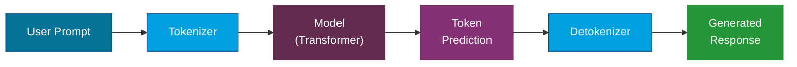

---
tags:
  - Beginner
  - Concepts
---

# Foundation & Models

Modern AI is built on **foundation models** -- large neural networks trained on massive datasets that can be adapted to a wide range of tasks. This page breaks down how these models work, the different types available, and the key concepts you need to understand before building AI-powered applications.

---

## What Is a Large Language Model (LLM)?

A Large Language Model is a type of AI that has been trained on vast amounts of text data to understand and generate human language. At its core, an LLM predicts the **next most likely token** (word or sub-word) given everything that came before it.

Think of it like a very sophisticated autocomplete: you give it a sentence, and it figures out what should come next -- except it can do this across paragraphs, pages, and even entire documents.

!!! tip "Key Insight"
    LLMs do not "understand" language the way humans do. They learn **statistical patterns** in text. Their ability to generate coherent, useful responses comes from the sheer scale of data and parameters, not from genuine comprehension.

### How It Works (Simplified)

1. **Training**: The model reads billions of text samples and learns patterns -- grammar, facts, reasoning styles, code syntax, and more.
2. **Prompt**: You provide an input (the prompt).
3. **Inference**: The model generates output by predicting tokens one at a time, each informed by the tokens before it.

---

## The Transformer Architecture

Nearly all modern language models are built on the **Transformer** architecture, introduced in the 2017 paper *"Attention Is All You Need"*.

The key innovation is the **self-attention mechanism**, which allows the model to weigh the importance of every word in a sentence relative to every other word -- regardless of distance. This solved a major limitation of earlier architectures (RNNs, LSTMs) that struggled with long-range dependencies.

Self-attention
:   A mechanism that lets each token in a sequence look at all other tokens to determine context. For example, in "The cat sat on the mat because **it** was tired," attention helps the model understand that "it" refers to "the cat."

Parameters
:   The internal weights of the model that are adjusted during training. More parameters generally means more capacity to learn patterns. GPT-4 is estimated to have over a trillion parameters.

Pre-training
:   The initial phase where the model learns general language patterns from a large corpus. This produces a **foundation model** that can then be fine-tuned for specific tasks.

---

## Tokens and Context Windows

### Tokens

Models do not process raw text. Instead, text is broken into **tokens** -- small units that might be whole words, parts of words, or punctuation.

| Text | Approximate Tokens |
|---|---|
| "Hello" | 1 token |
| "ChatGPT is great" | 4 tokens |
| "Artificial intelligence" | 2-3 tokens |
| 1,000 words of English | ~750 tokens |

!!! note "Why Tokens Matter"
    You are billed per token (input + output) when using commercial APIs. Understanding tokenization helps you estimate costs and optimize prompts.

### Context Window

The **context window** is the maximum number of tokens a model can process in a single request (input + output combined). It defines how much information the model can "see" at once.

| Model | Context Window |
|---|---|
| GPT-4o | 128K tokens |
| Claude 4 Sonnet | 200K tokens |
| Gemini 2.5 Pro | 1M tokens |
| Llama 3.1 405B | 128K tokens |
| Phi-4 | 16K tokens |

A larger context window allows the model to work with longer documents, but also increases cost and latency.

---

## Types of AI Models

### Comparison Table

| Feature | Foundation Model | LLM | SLM | VLM |
|---|---|---|---|---|
| **What it is** | Base model trained on broad data | Large text-focused model | Small, efficient text model | Model that handles text + images |
| **Parameters** | Varies (billions+) | 70B - 1T+ | 1B - 14B | Varies |
| **Typical use** | General-purpose base | Complex reasoning, generation | On-device, low-latency tasks | Image understanding, visual Q&A |
| **Examples** | GPT-4, Claude, Gemini | GPT-4o, Claude 4 Sonnet | Phi-4, Gemma 3 | GPT-4o (vision), Gemini, Llama 3.2-Vision |
| **Cost** | High | High | Low to moderate | Moderate to high |
| **Deployment** | Cloud | Cloud | Edge or cloud | Cloud |

### Foundation Models

A **foundation model** is any large-scale model trained on broad, diverse data that can be adapted (via prompting, fine-tuning, or RAG) to many downstream tasks. GPT-4, Claude, and Gemini are all foundation models.

### Large Language Models (LLMs)

LLMs are foundation models specifically focused on text. They excel at complex reasoning, long-form generation, summarization, translation, and code. Their strength is versatility, but they require significant compute resources.

### Small Language Models (SLMs)

SLMs trade some capability for **efficiency**. Models like Microsoft's Phi-4 (14B parameters) or Google's Gemma can run on consumer hardware or at the edge. They are ideal when:

- Latency must be very low
- Cost per query must be minimal
- The task is well-defined and does not require broad world knowledge
- Data privacy requires on-premise or on-device deployment

### Vision Language Models (VLMs)

VLMs extend language models with the ability to process **images** alongside text. You can ask them to describe a photo, extract data from a chart, or answer questions about a diagram. Examples include GPT-4o with vision, Gemini, and Llama 3.2-Vision.

---

## How Inference Works

When you send a prompt to an AI model, here is what happens behind the scenes:

1. **Tokenization**: Your text prompt is split into tokens using the model's tokenizer.
2. **Encoding**: Tokens are converted into numerical representations (embeddings).
3. **Processing**: The transformer processes these embeddings through many layers of self-attention and feed-forward networks.
4. **Prediction**: The model outputs a probability distribution over its vocabulary for the next token.
5. **Decoding**: The predicted token is selected (using strategies like temperature, top-p sampling) and appended to the output.
6. **Repetition**: Steps 3-5 repeat until the model generates a stop token or reaches the maximum output length.
7. **Detokenization**: The output tokens are converted back into human-readable text.

### Key Inference Parameters

Temperature
:   Controls randomness. Lower values (0.0-0.3) produce focused, deterministic output. Higher values (0.7-1.0) increase creativity and variation.

Top-p (nucleus sampling)
:   Limits the model to considering only the most probable tokens whose cumulative probability reaches a threshold *p*. A top-p of 0.9 means the model considers the smallest set of tokens that together have a 90% probability.

Max tokens
:   The maximum number of tokens the model will generate in its response.

!!! warning "Temperature Is Not Creativity"
    Setting temperature to 1.0 does not make the model "more creative" in a meaningful sense. It increases randomness, which can lead to incoherent or off-topic output. For most production use cases, keep temperature between 0.0 and 0.5.

---

## Choosing the Right Model

There is no single "best" model. The right choice depends on your requirements:

| Requirement | Recommended Approach |
|---|---|
| Complex reasoning, broad knowledge | LLM (GPT-4o, Claude 4 Sonnet, Gemini 2.5 Pro) |
| Low latency, cost-sensitive | SLM (Phi-4, Gemma) |
| Image + text understanding | VLM (GPT-4o vision, Gemini) |
| On-device or edge deployment | SLM with quantization |
| Domain-specific accuracy | Fine-tuned LLM or SLM |
| Long document processing | Model with large context window |

!!! tip "Start Simple"
    Begin with a hosted LLM and well-crafted prompts. Only move to fine-tuning or smaller models when you have a clear need for cost reduction, latency improvement, or domain specialization.

---

## References

- [Azure OpenAI Models](https://learn.microsoft.com/en-us/azure/ai-services/openai/concepts/models)
- [Microsoft Phi Models](https://azure.microsoft.com/en-us/products/phi)
- [Google Gemini](https://deepmind.google/technologies/gemini/)
- [Anthropic Claude Models](https://docs.anthropic.com/en/docs/about-claude/models)
- [Meta Llama](https://llama.meta.com/)
- [OpenAI Models Overview](https://platform.openai.com/docs/models)
