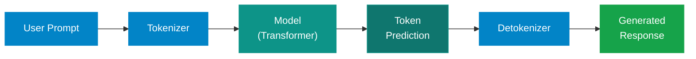

# How models work

!!! abstract "Understand · 30 min · no code"
    **Before this:** [AI 101](../getting-started/index.md)  ·  **After this:** [Prompting](prompting-and-techniques.md)
    **Hands-on version:** [5 Context engineering](../02-agents/context-engineering.md)  ·  **In depth:** [Frameworks and platforms](../tools-and-frameworks/index.md)

Modern AI is built on **foundation models** — large neural networks trained on
broad data and adapted to many tasks. This page is the layer beneath
[AI 101](../getting-started/index.md): what a token really is, what a context
window really costs, what the settings do, and how to choose a model without
naming one.

Still no code. Everything here is conceptual, and every idea has a hands-on
counterpart in the build path.

---

## What is a large language model (LLM)?

A Large Language Model is a type of AI that has been trained on vast amounts of text data to understand and generate human language. At its core, an LLM predicts the **next most likely token** (word or sub-word) given everything that came before it.

Think of it like a very sophisticated autocomplete: you give it a sentence, and it figures out what should come next — except it can do this across paragraphs, pages, and even entire documents.

!!! tip "Key insight"
    LLMs do not "understand" language the way humans do. They learn **statistical patterns** in text. Their ability to generate coherent, useful responses comes from the sheer scale of data and parameters, not from genuine comprehension.

### How it works (simplified)

1. **Training**: The model reads billions of text samples and learns patterns — grammar, facts, reasoning styles, code syntax, and more.
2. **Prompt**: You provide an input (the prompt).
3. **Inference**: The model generates output by predicting tokens one at a time, each informed by the tokens before it.

---

## The transformer architecture

Nearly all modern language models are built on the **Transformer** architecture, introduced in the 2017 paper *"Attention Is All You Need"*.

The key innovation is the **self-attention mechanism**, which allows the model to weigh the importance of every word in a sentence relative to every other word — regardless of distance. This solved a major limitation of earlier architectures (RNNs, LSTMs) that struggled with long-range dependencies.

Self-attention
:   A mechanism that lets each token in a sequence look at all other tokens to determine context. For example, in "The cat sat on the mat because **it** was tired," attention helps the model understand that "it" refers to "the cat."

Parameters
:   The internal weights of the model that are adjusted during training. More parameters generally means more capacity to learn patterns. Frontier models are estimated at hundreds of billions to trillions of parameters, though most vendors no longer publish the figure.

Pre-training
:   The initial phase where the model learns general language patterns from a large corpus. This produces a **foundation model** that can then be fine-tuned for specific tasks.

---

## Tokens and context windows

### Tokens

Models do not process raw text. Instead, text is broken into **tokens** — small units that might be whole words, parts of words, or punctuation.

| Text | Approximate Tokens |
|---|---|
| "Hello" | 1 token |
| "ChatGPT is great" | 4 tokens |
| "Artificial intelligence" | 2-3 tokens |
| 1,000 words of English | ~750 tokens |

!!! note "Why tokens matter"
    You are billed per token, input and output both. Tokenisation is also where
    several practical surprises live.

**Three tokenisation effects worth knowing:**

- **Other languages cost more.** Tokenisers are fit to their training mix, which
  skews English. The same sentence in Hindi, Japanese or Arabic can take two to
  three times as many tokens as its English translation — so the same feature
  costs more, and hits the context limit sooner, for some of your users than for
  others.
- **Numbers and code fragment badly.** A long number or an unusual identifier
  can become many tokens. This is also part of why models are shaky at digit-level
  arithmetic: they may not see the number as one thing at all.
- **Whitespace and formatting are not free.** Pretty-printed JSON, deep
  indentation and long tables all bill. Compact your payloads before you blame
  the model for being expensive.

### Context window

The **context window** is the maximum number of tokens a model can process in a single request (input + output combined). It defines how much information the model can "see" at once.

Context windows in the current frontier generation run from roughly **200K to
2M tokens**, with small local models often at 4K-128K. Naming specific models
here would date this page within months — check the provider's live model page
for current figures: [OpenAI](https://developers.openai.com/api/docs/models),
[Anthropic](https://docs.claude.com/en/docs/about-claude/models),
[Google](https://ai.google.dev/gemini-api/docs/models).

A larger window costs more and is slower. It is also **not** the same as usable
context: of 13 models advertising 128K+, 11 fell below half their short-context
accuracy at just 32K once lexical overlap between question and answer was
removed (NoLiMa, ICML 2025). Treat the advertised number as a ceiling, not a
working budget — see [context engineering](../02-agents/context-engineering.md).

### The context window is not the output limit

These are two different numbers and they are constantly confused.

| | What it limits | Typical size |
|---|---|---|
| **Context window** | Everything the model considers: system prompt, conversation, retrieved documents *and* the answer | Large — 200K and up on frontier models |
| **Max output tokens** | Only what the model may generate in one response | Much smaller — often a few thousand to tens of thousands |

A model with a two-million-token window will still refuse to write you a
two-million-token document. If a long answer stops mid-sentence, the output
limit is the first thing to check, not the context window.

### Prompt caching, the lever most people miss

Because the model has no memory, applications resend the same system prompt and
the same documents on every turn. Providers let you mark that stable prefix as
cacheable: the first call pays full price, and later calls that reuse the same
prefix pay substantially less for it and return faster.

The practical consequence is architectural rather than clever. Put the parts
that never change — system prompt, tool definitions, reference documents — at
the *front* of the prompt, and the parts that change every turn at the end.
Reorder those and the cache stops matching. This is one of the largest cost
levers available and it costs nothing to design for.

---

## Types of AI models

### Comparison table

| Feature | Foundation Model | LLM | SLM | VLM |
|---|---|---|---|---|
| **What it is** | Base model trained on broad data | Large text-focused model | Small, efficient text model | Model that handles text + images |
| **Parameters** | Varies (billions+) | 70B - 1T+ | 1B - 14B | Varies |
| **Typical use** | General-purpose base | Complex reasoning, generation | On-device, low-latency tasks | Image understanding, visual Q&A |
| **Examples** | the frontier families: GPT, Claude, Gemini, Llama | the flagship tier of those families | Phi, Gemma, Qwen small variants | the multimodal variant of most frontier families |
| **Cost** | High | High | Low to moderate | Moderate to high |
| **Deployment** | Cloud | Cloud | Edge or cloud | Cloud |

### Foundation models

A **foundation model** is any large-scale model trained on broad, diverse data that can be adapted (via prompting, fine-tuning, or RAG) to many downstream tasks. The GPT, Claude, Gemini and Llama families are all foundation models.

!!! note "Why this page names families, not models"
    Specific model names date faster than anything else in AI writing. A page
    naming this quarter's flagship is wrong by the next one, and wrong in a way
    that is hard to spot — the name still looks plausible. Reason in **capability
    tiers**, and get current names from the vendor's live model page at the moment
    you need one.

### Large language models (LLMs)

LLMs are foundation models specifically focused on text. They excel at complex reasoning, long-form generation, summarization, translation, and code. Their strength is versatility, but they require significant compute resources.

### Small language models (SLMs)

SLMs trade some capability for **efficiency**. Models in the 1B-14B range — Microsoft's Phi family, Google's Gemma, the smaller Qwen variants — run on consumer hardware or at the edge. They are ideal when:

- Latency must be very low
- Cost per query must be minimal
- The task is well-defined and does not require broad world knowledge
- Data privacy requires on-premise or on-device deployment

### Vision language models (VLMs)

VLMs extend language models with the ability to process **images** alongside text. You can ask them to describe a photo, extract data from a chart, or answer questions about a diagram. Most frontier families ship a multimodal variant; several open-weight families do too.

---

## Reasoning models, and paying for thinking

A newer distinction cuts across the tiers above: some models are trained to
**work through a problem before answering**, generating a long internal chain of
reasoning that you are usually not shown.

The trade is straightforward:

| | Standard model | Reasoning model |
|---|---|---|
| Latency | Fast | Slow — often much slower |
| Cost | Output tokens you see | Output tokens you see, **plus** the hidden reasoning |
| Better at | Summarising, extraction, drafting, classification | Maths, logic, planning, multi-step debugging |
| Worse at | Hard multi-step problems | Everything where the thinking is wasted |

Two things this changes in practice.

**Reasoning is billed.** The hidden working-out is output, charged at output
rates. A short answer can be expensive.

**It can consume the whole budget.** Because the reasoning comes first, a
reasoning model under a tight output cap can spend its entire allowance thinking
and return nothing at all. Measured on one of the labs on this site, a reasoning
model emitted nearly 4,000 characters of reasoning and **zero** characters of
answer under a 1,024-token cap, while a similar non-reasoning model answered in
ten seconds. That is why [the labs](../00-start-here/the-path.md) default to a
non-reasoning model: the failure is worth understanding, but not while you are
still learning what a tool call is.

Reach for reasoning when the task genuinely has steps. For most retrieval,
summarisation and extraction work, it buys latency and cost and returns nothing.

## Why "how many parameters" stopped being a useful question

Parameter counts used to be a rough proxy for capability. Two things broke that.

**Mixture of experts.** Many current models activate only a fraction of their
parameters for any given token, routing each one to a subset of specialised
sub-networks. A model can hold a very large total while only paying to run a
small part of it. Total and active parameter counts can differ by an order of
magnitude, so a single headline number tells you neither cost nor capability.

**Training quality dominates.** Data curation, training length and
post-training now separate models more than raw size does. Smaller,
better-trained models routinely beat larger, older ones.

Most vendors have stopped publishing the figure. Judge on measured behaviour for
your task — see [evaluation](../02-agents/evaluation.md) — not on a number.

---

## How inference works

When you send a prompt to an AI model, here is what happens behind the scenes:

```mermaid
graph LR
    A["User Prompt"] --> B["Tokenizer"]
    B --> C["Model<br/>(Transformer)"]
    C --> D["Token<br/>Prediction"]
    D --> E["Detokenizer"]
    E --> F["Generated<br/>Response"]

    style A fill:#0284c7,stroke:#0284c7,color:#fff
    style B fill:#0284c7,stroke:#0284c7,color:#fff
    style C fill:#0d9488,stroke:#0d9488,color:#fff
    style D fill:#0f766e,stroke:#0d9488,color:#fff
    style E fill:#0284c7,stroke:#0284c7,color:#fff
    style F fill:#16a34a,stroke:#16a34a,color:#fff
```

1. **Tokenization**: Your text prompt is split into tokens using the model's tokenizer.
2. **Encoding**: Tokens are converted into numerical representations (embeddings).
3. **Processing**: The transformer processes these embeddings through many layers of self-attention and feed-forward networks.
4. **Prediction**: The model outputs a probability distribution over its vocabulary for the next token.
5. **Decoding**: The predicted token is selected (using strategies like temperature, top-p sampling) and appended to the output.
6. **Repetition**: Steps 3-5 repeat until the model generates a stop token or reaches the maximum output length.
7. **Detokenization**: The output tokens are converted back into human-readable text.

### Key inference parameters

Temperature
:   Controls randomness. Lower values (0.0-0.3) produce focused, deterministic output. Higher values (0.7-1.0) increase creativity and variation.

Top-p (nucleus sampling)
:   Limits the model to considering only the most probable tokens whose cumulative probability reaches a threshold *p*. A top-p of 0.9 means the model considers the smallest set of tokens that together have a 90% probability.

Max tokens
:   The maximum number of tokens the model will generate in its response.

Stop sequences
:   Strings that cause generation to halt when produced. Useful when you are
    parsing the output and need a reliable end marker.

!!! warning "Temperature is not creativity"
    Setting temperature to 1.0 does not make the model "more creative" in any
    meaningful sense. It increases randomness, which as often produces
    incoherent or off-topic output. For most production use, keep it between
    0.0 and 0.5.

!!! warning "Temperature 0 is not a guarantee of identical output"
    It is the closest you can get, and it is not a promise. Providers batch
    requests together, floating-point addition is not associative, and the
    composition of a batch varies with load — so the same prompt at temperature
    0 can return different text on different days. Model versions also change
    underneath a stable name.

    This matters most for testing. A test that asserts exact output will fail
    eventually for reasons that have nothing to do with your code. Assert on
    properties — valid schema, required fields present, a constraint satisfied —
    and see [evaluation](../02-agents/evaluation.md) for how to measure a system
    whose output is not deterministic.

### The knowledge cutoff

Every model's knowledge stops at a date. Ask about anything after it and you
will usually still get a fluent answer, because generating plausible text is the
whole mechanism.

Two practical notes. A model is often unreliable about its *own* cutoff, since
that fact was itself learned during training. And the cutoff is a soft edge
rather than a wall: coverage of the months just before it is thin, because the
internet had not finished writing about them yet.

Anything current, internal or proprietary has to be supplied in the prompt. That
is [retrieval](retrieval-and-data.md), and it is not optional.

---

## Choosing the right model

There is no single "best" model. The right choice depends on your requirements:

| Requirement | Recommended Approach |
|---|---|
| Complex reasoning, broad knowledge | A frontier-tier LLM |
| Low latency, cost-sensitive | An SLM (Phi, Gemma, small Qwen) |
| Image + text understanding | A VLM — the multimodal variant of a frontier family |
| On-device or edge deployment | SLM with quantization |
| Domain-specific accuracy | Fine-tuned LLM or SLM |
| Long document processing | Model with large context window |

!!! tip "Start simple"
    Begin with a capable hosted model and well-crafted prompts. Move to
    fine-tuning or smaller models only when you have a measured need: cost,
    latency, privacy or domain specialisation.

!!! warning "Choose the model last"
    The order most teams use is backwards. Model choice is the easiest decision
    to change — usually a configuration line — and it is rarely what decides
    whether the system works.

    What decides that is everything around the model: what you retrieve and how
    well, what the model is permitted to do, how failures are caught, and
    whether you can tell a good answer from a bad one. Build a way to measure
    quality first. Then swapping models becomes an experiment you can run in an
    afternoon instead of an argument nobody can settle.

---

## Go deeper

Model names change every few months. These are the live catalogues, which is why they are listed instead of a table.

- [Anthropic models](https://docs.claude.com/en/docs/about-claude/models) — context windows and capability per model.
- [OpenAI models](https://developers.openai.com/api/docs/models) — the current catalogue with pricing.
- [Google Gemini](https://deepmind.google/models/gemini/) — the model family and its long-context claims.
- [Azure model catalogue](https://learn.microsoft.com/en-us/azure/foundry/foundry-models/concepts/models-sold-directly-by-azure) — what is actually deployable on Azure today, which lags the vendors' own launches.
- [Meta Llama](https://www.llama.com/) — open-weight models, and the licence terms that matter if you ship them.
- [Microsoft Phi](https://azure.microsoft.com/en-us/products/phi) — the small-model end, where on-device becomes realistic.
