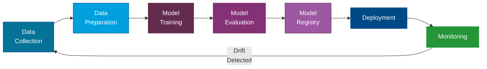

---
tags:
  - Advanced
  - Concepts
---

# Infrastructure & Operations

Building an AI model is only half the challenge. Running it reliably, efficiently, and cost-effectively in production is the other half. This page covers **MLOps** (the operational practices for machine learning), model optimization, and the infrastructure decisions that determine whether your AI system scales or stalls.

---

## MLOps: DevOps for Machine Learning

**MLOps** (Machine Learning Operations) applies the principles of DevOps -- automation, monitoring, version control, CI/CD -- to the machine learning lifecycle. It bridges the gap between data science experiments and production systems.

### MLOps vs DevOps

| Aspect | DevOps | MLOps |
|---|---|---|
| **What is versioned** | Code | Code + data + models + experiments |
| **What is tested** | Application behavior | Model accuracy + application behavior |
| **What is deployed** | Application artifacts | Model artifacts + serving infrastructure |
| **What is monitored** | Uptime, latency, errors | Uptime, latency, errors + model accuracy + data drift |
| **What triggers redeployment** | Code changes | Code changes + data changes + model degradation |
| **Pipeline** | Build, test, deploy | Ingest, train, evaluate, deploy, monitor |

!!! tip "MLOps Maturity"
    Most teams start at "manual everything" (level 0) and gradually automate. You do not need a fully automated MLOps pipeline on day one. Start with version control for data and models, then add automation incrementally.

### The MLOps Lifecycle

**Key stages:**

1. **Data Collection**: Gather raw data from sources -- databases, APIs, logs, user interactions.
2. **Data Preparation**: Clean, transform, and feature-engineer the data. Track lineage so you know where every data point came from.
3. **Model Training**: Train (or fine-tune) the model. Log hyperparameters, metrics, and artifacts.
4. **Model Evaluation**: Compare the new model against baselines using defined metrics. Automated evaluation gates prevent bad models from reaching production.
5. **Model Registry**: Store versioned models with metadata (who trained it, on what data, with what performance).
6. **Deployment**: Serve the model via an API endpoint, batch pipeline, or edge device.
7. **Monitoring**: Track model performance, data quality, and operational health in production. When quality degrades, trigger the cycle again.

---

## Model Drift and Monitoring

**Model drift** is the gradual degradation of model performance over time. A model that was accurate at launch may become unreliable as the real world changes around it.

### Types of Drift

Data drift
:   The distribution of input data changes. For example, a customer sentiment model trained on pre-pandemic reviews may perform poorly on post-pandemic data because the language and topics shifted.

Concept drift
:   The relationship between inputs and outputs changes. For example, a fraud detection model may degrade as fraudsters develop new techniques that look nothing like historical fraud patterns.

Feature drift
:   The data pipeline changes, causing features to be computed differently or become unavailable. For example, a feature that previously held "days since last purchase" is now always zero due to a data pipeline bug.

### Monitoring Strategy

| What to Monitor | How | Alert Threshold |
|---|---|---|
| **Prediction accuracy** | Compare predictions to ground truth (when available) | Accuracy drops below defined baseline |
| **Input data distribution** | Statistical tests (KS test, PSI) comparing current vs training data | Distribution shift exceeds threshold |
| **Output distribution** | Track the distribution of model predictions over time | Sudden changes in prediction patterns |
| **Latency** | Measure end-to-end response time | P95 latency exceeds SLA |
| **Error rates** | Track failed predictions, timeouts, and exceptions | Error rate exceeds baseline |
| **Token usage** | Monitor tokens consumed per request | Unexpected spikes in consumption |

!!! warning "Monitoring Is Not Optional"
    In production AI systems, monitoring is as critical as the model itself. Without it, you will not know your model is degrading until users complain -- or worse, until bad decisions are already made.

---

## Quantization and Model Optimization

**Quantization** reduces the precision of a model's numerical weights -- for example, from 32-bit floating point (FP32) to 8-bit integers (INT8) or even 4-bit. This dramatically reduces model size, memory usage, and inference latency, often with minimal impact on quality.

### How Quantization Works

| Precision | Bits per Weight | Relative Size | Typical Quality Impact |
|---|---|---|---|
| FP32 | 32 | 1x (baseline) | None (full precision) |
| FP16 / BF16 | 16 | 0.5x | Negligible |
| INT8 | 8 | 0.25x | Minimal for most tasks |
| INT4 | 4 | 0.125x | Noticeable on complex reasoning |

### Quantization Methods

Post-training quantization (PTQ)
:   Applied after training is complete. No additional training data is needed. Fast and easy but may lose more quality than training-aware methods.

Quantization-aware training (QAT)
:   Simulates quantization during training, allowing the model to adapt its weights to lower precision. Produces better quality but requires training infrastructure.

GPTQ / AWQ / GGUF
:   Specialized quantization formats for LLMs. GPTQ and AWQ are GPU-focused, while GGUF (used by llama.cpp) is optimized for CPU and edge inference.

!!! tip "Start with INT8"
    For most deployment scenarios, INT8 quantization provides an excellent balance of size reduction and quality preservation. Only go to INT4 if you have strict hardware constraints and can tolerate some quality loss.

---

## Edge AI and On-Device Inference

**Edge AI** runs models directly on local devices -- laptops, phones, IoT devices, on-premise servers -- rather than sending data to the cloud. This is increasingly practical with small language models and quantization.

### When to Use Edge AI

| Scenario | Why Edge Makes Sense |
|---|---|
| **Data privacy** | Sensitive data never leaves the device or local network |
| **Low latency** | No network round-trip to a cloud API |
| **Offline operation** | Works without internet connectivity |
| **Cost at scale** | No per-query API costs for high-volume use cases |
| **Regulatory compliance** | Data residency requirements mandate local processing |

### Edge AI Technologies

| Technology | Description |
|---|---|
| **ONNX Runtime** | Cross-platform inference engine, supports quantized models |
| **llama.cpp** | C++ inference for LLMs, runs on CPU, supports GGUF quantization |
| **TensorFlow Lite** | Google's on-device ML framework |
| **Apple Core ML** | On-device inference optimized for Apple hardware |
| **Windows ML** | ML inference on Windows devices using DirectML |

### Trade-Offs

Edge AI is not free. You gain privacy, latency, and cost benefits, but you trade model capability. A 3B-parameter quantized model running on a laptop will not match the quality of GPT-4o running in the cloud. Choose edge deployment when the trade-off makes sense for your use case.

---

## Cost Management in AI

AI infrastructure costs can scale quickly if not managed carefully. Here are the main cost drivers and how to control them:

### Cost Drivers

| Cost Driver | Description | How to Optimize |
|---|---|---|
| **API tokens** | Pay-per-token for hosted model APIs | Optimize prompts, cache responses, use smaller models for simple tasks |
| **GPU compute** | Training and inference on GPU instances | Use spot instances, right-size GPU SKUs, quantize models |
| **Storage** | Vector databases, model artifacts, training data | Compress embeddings, archive old model versions, use tiered storage |
| **Data processing** | ETL pipelines, embedding generation, indexing | Batch operations, incremental updates instead of full re-indexing |
| **Monitoring** | Logging, tracing, evaluation | Sample traces rather than logging everything, set retention policies |

### Cost Optimization Strategies

=== "Prompt Optimization"

    - Remove unnecessary context from prompts
    - Use shorter system prompts
    - Cache common responses
    - Batch similar requests

=== "Model Selection"

    - Use SLMs for simple tasks (classification, extraction)
    - Use LLMs only for complex reasoning
    - Route requests to the cheapest capable model
    - Consider open-source models for high-volume workloads

=== "Infrastructure"

    - Use auto-scaling to match demand
    - Deploy in regions with lower compute costs
    - Use spot/preemptible instances for training
    - Quantize models to reduce serving costs

!!! note "Track Cost Per Request"
    Establish a metric for **cost per request** or **cost per user interaction**. This helps you make informed decisions about model selection, prompt design, and infrastructure choices. Without this metric, costs tend to grow unnoticed.

---

## Putting It All Together

A production AI system brings together all of these concerns:

| Layer | Concerns | Key Decisions |
|---|---|---|
| **Model** | Selection, fine-tuning, quantization | Which model? Cloud or edge? What precision? |
| **Data** | Ingestion, embedding, indexing, freshness | How often to re-index? What chunking strategy? |
| **Application** | Orchestration, guardrails, caching | What framework? What safety checks? |
| **Infrastructure** | Compute, storage, networking | GPU SKUs, auto-scaling, regions |
| **Operations** | Monitoring, alerting, incident response | What to monitor? What are the SLAs? |
| **Cost** | Budgeting, optimization, chargeback | Cost per request? Budget alerts? |

Each layer has its own best practices, but they are deeply interconnected. A change in model selection (e.g., switching from GPT-4o to Phi-4) ripples through infrastructure (less GPU needed), cost (lower per-request), and application (may need prompt adjustments).

---

## References

- [Azure Machine Learning](https://learn.microsoft.com/en-us/azure/machine-learning/)
- [MLflow](https://mlflow.org/docs/latest/index.html)
- [ONNX Runtime Quantization](https://onnxruntime.ai/docs/performance/model-optimizations/quantization.html)
- [Azure AI Foundry](https://learn.microsoft.com/en-us/azure/ai-studio/)
