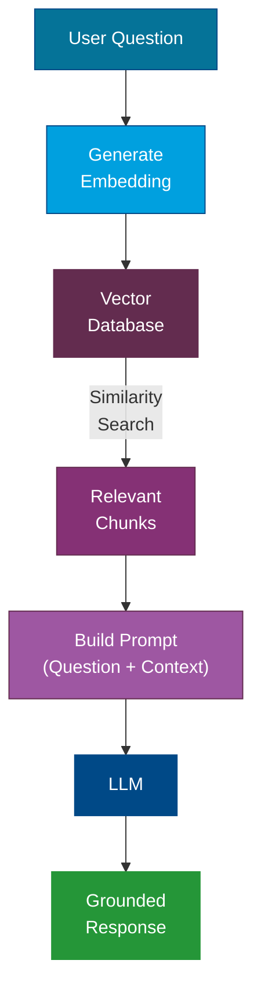
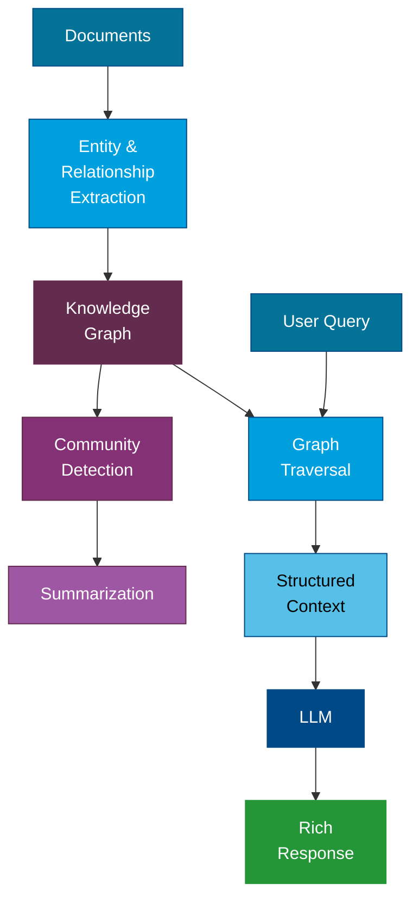

---
tags:
  - Intermediate
  - Concepts
---

# Retrieval & Data

AI models are powerful, but they have a fundamental limitation: they only know what they were trained on. **Retrieval-Augmented Generation (RAG)** bridges this gap by connecting models to your real-time, enterprise data -- without retraining. This page covers how RAG works, the data infrastructure that powers it, and when to use which approach.

!!! info "This page is an overview"
    For deep dives into each topic — embeddings, chunking strategies, vector database comparisons, GraphRAG, and evaluation — see the [RAG & Knowledge Systems](../rag/index.md) section. Each sub-page includes production guidance, model comparisons, and decision frameworks not covered here.

---

## What Is RAG?

**Retrieval-Augmented Generation (RAG)** is a pattern where, instead of relying solely on a model's built-in knowledge, you **retrieve relevant information** from an external source and include it in the prompt before generating a response.

This solves several problems:

- **Stale knowledge**: Models have a training cutoff date. RAG gives them access to current data.
- **Hallucinations**: By grounding responses in retrieved facts, RAG significantly reduces fabrication.
- **Domain specificity**: Your internal documents, policies, and data can be surfaced without fine-tuning.

### How RAG Works

**Step by step:**

1. **User asks a question** -- for example, "What is our company's remote work policy?"
2. **The question is converted to an embedding** -- a numerical representation that captures its meaning.
3. **A similarity search runs against the vector database** -- finding document chunks whose embeddings are closest to the question's embedding.
4. **The most relevant chunks are retrieved** -- typically the top 3-10 results.
5. **A prompt is assembled** -- combining the user's question with the retrieved context.
6. **The LLM generates a response** -- grounded in the retrieved information rather than its general training data.

!!! tip "RAG Is Not Search"
    RAG goes beyond traditional keyword search. It uses **semantic similarity** -- meaning it can find relevant content even when the exact words do not match. Asking "Can I work from home?" will match a document titled "Remote Work Policy" even though the words are different.

---

## Embeddings

An **embedding** is a dense numerical vector (a list of numbers) that represents the meaning of a piece of text. Similar meanings produce vectors that are close together in high-dimensional space.

!!! tip "Deep dive available"
    For embedding model comparisons, dimension tradeoffs, input types, and production guidance, see [Embeddings](../rag/embeddings.md).

| Text | Embedding (simplified) |
|---|---|
| "dog" | [0.12, 0.85, 0.33, ...] |
| "puppy" | [0.13, 0.84, 0.31, ...] |
| "automobile" | [0.91, 0.05, 0.72, ...] |

Notice that "dog" and "puppy" have very similar vectors, while "automobile" is far away. This is the core principle behind semantic search.

### Embedding Models

Embedding models are specialized models designed to convert text into vectors. They are different from generative models -- they do not produce text, only vectors.

| Model | Dimensions | Provider |
|---|---|---|
| text-embedding-3-large | 3,072 | OpenAI |
| text-embedding-3-small | 1,536 | OpenAI |
| Cohere Embed v3 | 1,024 | Cohere |
| BGE-large-en-v1.5 | 1,024 | BAAI (open source) |

!!! note "Dimensions Matter"
    Higher dimensions capture more nuance but require more storage and compute. For most enterprise use cases, 1,024-1,536 dimensions offer a good balance.

---

## Vector Databases

A **vector database** is a specialized data store optimized for storing, indexing, and querying embedding vectors at scale. Traditional databases use exact-match queries; vector databases use **approximate nearest neighbor (ANN)** algorithms to find the most similar vectors efficiently.

### How Vector Search Works

1. **Indexing**: When you ingest a document, each chunk is embedded and stored as a vector.
2. **Querying**: When a user asks a question, the question is embedded and the database finds the closest stored vectors.
3. **Ranking**: Results are ranked by similarity score (typically cosine similarity or dot product).

### Popular Vector Databases

| Database | Type | Key Strengths |
|---|---|---|
| Azure AI Search | Managed service | Hybrid search (vector + keyword), integrated with Azure ecosystem |
| Pinecone | Managed service | Simple API, serverless option, fast at scale |
| Weaviate | Open source / managed | GraphQL API, multi-modal support |
| Qdrant | Open source / managed | Rust-based performance, filtering |
| Chroma | Open source | Lightweight, great for prototyping |
| pgvector | PostgreSQL extension | Use your existing Postgres infrastructure |

!!! tip "Hybrid Search"
    The best results often come from **hybrid search** -- combining vector similarity with traditional keyword matching. Azure AI Search supports this natively with its hybrid search capability.

---

## Chunking Strategies

Before you can embed documents, you need to break them into **chunks** -- smaller pieces that fit within embedding model limits and provide focused, retrievable units of information.

Chunking strategy directly impacts retrieval quality. Too large and chunks contain mixed topics. Too small and chunks lack context.

!!! tip "Deep dive available"
    For all eight chunking strategies including parent-child, late chunking, and agentic chunking — with a decision flowchart — see [Chunking Strategies](../rag/chunking-strategies.md).

### Common Strategies

| Strategy | Description | Best For |
|---|---|---|
| **Fixed-size** | Split every N characters/tokens with overlap | Simple documents, quick setup |
| **Sentence-based** | Split on sentence boundaries | Narratives, articles |
| **Paragraph-based** | Split on paragraph breaks | Well-structured documents |
| **Semantic** | Use an embedding model to detect topic shifts | Complex documents with varied content |
| **Recursive** | Try paragraph, then sentence, then character splits | General-purpose fallback |
| **Document-aware** | Respect headings, sections, tables | Technical docs, reports with structure |

!!! warning "Overlap Is Important"
    Always include overlap between chunks (typically 10-20% of chunk size). Without overlap, important information that spans a chunk boundary can be lost.

### Chunk Size Guidelines

| Use Case | Recommended Chunk Size |
|---|---|
| FAQ / short-answer retrieval | 200-500 tokens |
| Document summarization | 500-1,000 tokens |
| Technical documentation | 300-800 tokens |
| Legal / regulatory text | 500-1,000 tokens |

---

## Knowledge Graphs and GraphRAG

Traditional RAG retrieves isolated chunks. **GraphRAG** adds a layer of structure by building a **knowledge graph** from your documents -- capturing entities, relationships, and themes.

!!! tip "Deep dive available"
    For Microsoft GraphRAG's full architecture, local vs global query modes, cost tradeoffs, and implementation options, see [GraphRAG](../rag/graphrag.md).

### Why GraphRAG?

- **Multi-hop reasoning**: Answer questions that require connecting information across multiple documents.
- **Thematic understanding**: Identify high-level themes and summaries across a corpus.
- **Better context**: Provide the LLM with structured relationships, not just text snippets.

### How GraphRAG Works

!!! note "GraphRAG vs Standard RAG"
    Use standard RAG when questions are about specific facts in specific documents. Use GraphRAG when questions require synthesis across many documents or understanding of relationships between entities.

---

## RAG vs Fine-Tuning: When to Use Which

This is one of the most common decisions in AI application design. Here is a clear comparison:

| Factor | RAG | Fine-Tuning |
|---|---|---|
| **Best for** | Grounding in specific, changing data | Teaching the model new behaviors or styles |
| **Data freshness** | Real-time (data can be updated anytime) | Static (requires retraining to update) |
| **Setup effort** | Moderate (indexing pipeline) | High (training pipeline, GPU resources) |
| **Cost** | Per-query retrieval cost + LLM cost | Upfront training cost + inference cost |
| **Hallucination control** | Strong (responses grounded in retrieved data) | Moderate (model may still hallucinate) |
| **Customization depth** | Surface-level (provides context) | Deep (changes model behavior) |
| **When data changes** | Re-index documents | Retrain the model |
| **Example use case** | "Answer questions about our HR policies" | "Write emails in our brand voice" |

!!! tip "Combine Them"
    RAG and fine-tuning are not mutually exclusive. A fine-tuned model that also uses RAG can provide domain-specific behavior **and** up-to-date, grounded responses. Many production systems use both.

### Decision Guide

=== "Use RAG When"

    - Your data changes frequently
    - You need citations and traceability
    - You want to avoid retraining costs
    - Accuracy on specific documents is critical
    - You need to keep data private (data stays in your infrastructure)

=== "Use Fine-Tuning When"

    - You need the model to adopt a specific tone or style
    - The task requires specialized domain knowledge baked into the model
    - You want to reduce prompt size (the model "just knows" things)
    - Latency is critical and you cannot afford retrieval overhead

=== "Use Both When"

    - You need domain-specific behavior AND current data
    - You want a fine-tuned model that can also reference live documents
    - You are building a production system that requires both accuracy and style

---

## References

- [RAG with Azure AI Search](https://learn.microsoft.com/en-us/azure/search/retrieval-augmented-generation-overview)
- [Azure AI Search](https://learn.microsoft.com/en-us/azure/search/)
- [LangChain RAG Tutorial](https://python.langchain.com/docs/tutorials/rag/)
- [Microsoft GraphRAG](https://microsoft.github.io/graphrag/)
- [Pinecone Learning Center](https://www.pinecone.io/learn/)

---

## Next Steps

- For deeper RAG coverage: [RAG & Knowledge Systems](../rag/index.md)
- For agent-based retrieval: [Agentic AI](agentic-ai.md)
- To compare RAG and fine-tuning approaches: [Fine-Tuning & Training](fine-tuning-and-training.md)
