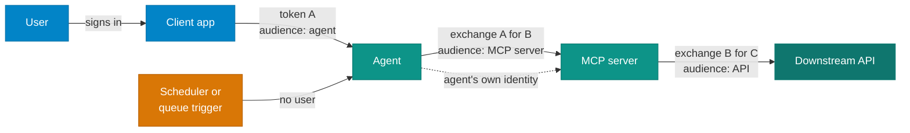

# Identity and authorization for agents and MCP

!!! abstract "Go deeper · 40 min · no code"
    **Before this:** [Model Context Protocol](../ai-dev-tools/mcp.md)  ·  **After this:** [Building agents in the enterprise](building-agents.md)
    **Hands-on version:** [4 The harness](../02-agents/the-harness.md)  ·  **In depth:** [Building MCP servers in the enterprise](building-mcp-servers.md)

!!! abstract
    Most agent incidents are not clever model attacks. They are an agent holding
    more authority than its job needed, or a token turning up somewhere it was never
    meant to be. This page sets the rules for identity and authorization that the
    [agent](building-agents.md) and [MCP server](building-mcp-servers.md) pages build
    on. It is a set of practices, not a design: it tells you what must be true, not
    which product to buy.

**Verified as of 2026-09-17.** Product names, preview status and the MCP
specification (revision `2026-07-28`) move quickly. Check the linked source before
you rely on a detail.

## How to read these pages

Every rule has an ID you can cite in a design review or a pull request, and one of
three levels:

| Level | Meaning |
|---|---|
| **MUST** | Not optional. An exception needs a written risk acceptance from whoever owns security for the system. |
| **SHOULD** | The default. Deviate only with a recorded reason your architecture team has seen. |
| **AVOID** | A pattern that has caused real incidents. Treat it as a review finding. |

The rules are framework-neutral. Where a control has an obvious home on Azure it is
named, but nothing here depends on a particular SDK, agent framework or vendor.

!!! question "When to talk to your architecture team"
    These pages tell you what good looks like. They do not design your system. If
    your case matches one of the **Take this to your architecture team** boxes, or
    you cannot meet a MUST, contact the architecture team in your organisation
    before you build, not after.

## Three questions every call must answer

Every request an agent makes, to a model, a tool, an MCP server or an API, has to
answer three questions, and the answers must be checkable by the receiver:

1. **Who is calling?** The agent's own identity, not a shared service account and
   not a developer's personal token.
2. **On whose behalf?** A signed-in user, a user who started a task and has since
   left, or nobody, because the agent is running on its own schedule.
3. **With what authority?** The specific permissions this call needs, for this
   resource, for a limited time.

If a component cannot answer all three from the credential it received, it cannot
make a correct authorization decision, and it cannot produce an audit record anyone
can use after an incident.

## Four ways an agent runs

Some agents work for a person who is sitting in front of them. Others run in the
background on a schedule or in response to an event. Many do both. The execution
mode decides which identity the agent uses and what it may do, so decide it
explicitly for every capability, not once for the whole agent.

| Mode | Example | Identity used | Authority is bounded by |
|---|---|---|---|
| **Interactive, on behalf of a user** | A claims assistant answering an adjuster in a chat | Agent identity plus the user's delegated token, exchanged per hop | The intersection of the user's rights and the agent's delegated scopes |
| **Background, as itself** | A nightly job that reconciles policy records; an agent triggered by a queue message | The agent's own identity, no user token | Application permissions granted to that agent, scoped to named resources |
| **Background, for a user who has left** | "Compile this report and email it to me when it is done" | Agent identity plus a stored, time-limited delegation from the user | The user's rights, the scopes they consented to, and the time window |
| **Agent as a user account** | An agent that needs its own mailbox or a Teams presence | A dedicated user-type account paired with the agent | Exactly what that account is granted. Use only when the first three cannot work |

Each arrow carries a **different token with a different audience**. No token
travels further than the component it was issued for. That single property is what
most of the rules below protect.

## Agent identity

### AUTH-01 Every agent has its own identity — MUST

Each agent, and each distinct deployment of it, authenticates with an identity that
belongs to that agent alone. Not a shared service principal used by five agents,
not a developer's account, not a personal access token pasted into a config file.

**Why:** a shared identity makes it impossible to revoke one misbehaving agent
without breaking the others, and impossible to tell from a log which one acted. The
Five Eyes agencies' joint guidance on agentic AI names *accountability opacity* as
one of its five risk categories for exactly this reason.

**On Azure:** Microsoft Entra Agent ID gives agents a dedicated identity type,
created from an *agent identity blueprint*. Microsoft's own guidance is not to
create new agents as ordinary app registrations.

### AUTH-02 Every agent has a named owner and is registered — MUST

An agent identity records a technical owner and an accountable business owner, and
the agent appears in the organisation's agent inventory before it reaches
production. An agent with no owner is a finding, not a curiosity.

**Why:** the owner is who you call during an incident and who attests, at each
access review, that the agent still needs what it holds.

**On Azure:** Entra Agent ID supports *owners* and *sponsors*, and sponsorship moves
to the sponsor's manager if they leave. The Agent 365 registry flags agents with no
owner or no registry entry as *shadow agents*.

### AUTH-03 No secrets in agent or MCP server credentials — MUST

Production agents and servers authenticate with managed identities or workload
identity federation. Where a certificate is unavoidable, the private key lives in a
key vault or HSM and is rotated. Client secrets and API keys in environment files,
source code, container images or prompt templates are not acceptable.

**Why:** in the Nx "s1ngularity" supply-chain attack, malware harvested 2,349
secrets from developer machines and CI, in part by driving locally installed AI
command-line tools to search for them. A credential that does not exist on disk
cannot be harvested.

**On Azure:** managed identity as the federated credential for the agent
blueprint; Azure Key Vault for anything that must be a certificate.

### AUTH-04 Decide the execution mode per capability and record it — MUST

For each tool or action, the design states which of the four modes it runs in and
why. An agent that answers users interactively and also runs a nightly batch has
two sets of authority, and they are reviewed separately.

**Why:** the common failure is an agent built interactively, then given a
background trigger, which quietly switches it to its own, usually broader,
application permissions.

## Delegation: acting on behalf of a user

### AUTH-05 Never pass a token through — MUST

A component that receives a token uses it only to authorize the call made to
itself. To call anything further downstream, it obtains a **new** token for that
downstream audience, through a token exchange such as the on-behalf-of flow
(standardised as OAuth 2.0 Token Exchange, RFC 8693), or through its own
credentials.

The MCP specification is normative on this: servers *"MUST NOT accept any tokens
that were not explicitly issued for the MCP server"*, and when calling upstream
APIs, *"The MCP server MUST NOT pass through the token it received from the MCP
client."*

**Why:** a forwarded token lets any compromised hop replay the user's authority
against every service that token was valid for, and the downstream audit log shows
the user, not the agent that actually made the call.

**On Azure:** Entra's agent on-behalf-of flow, where the agent identity, not the
blueprint, performs the exchange. Foundry Agent Service refuses to send a token with
a Microsoft audience to a custom or third-party MCP server and returns an error
instead, which is the behaviour you want from every platform.

### AUTH-06 Validate every token on every request — MUST

Every receiver checks the signature, issuer, **audience**, expiry and required
scopes on every request. Audience is the check most often skipped, and the one that
stops a token issued for another service being accepted by yours.

MCP's `2026-07-28` revision removed protocol-level sessions. There is no
connection-scoped login any more, so each request must stand on its own.

**Avoid:** trusting a gateway's validation and skipping it in the service behind
it. Gateways get bypassed by misconfiguration, internal callers and future routes.

### AUTH-07 A delegated agent never exceeds the user — MUST

When acting for a user, the agent's effective authority is the intersection of what
the user may do and what the agent's delegated scopes allow. An agent must never
become a way for a user to do something they could not do directly.

**Avoid:** an agent that reads with the user's token but writes with its own
application permissions "because the user token lacked the scope". That is a
privilege escalation with a friendly interface. In the Supabase MCP leak, the
connection used the `service_role` key, which bypasses row-level security, so a
prompt injection could read every table.

### AUTH-08 Carry the user's identity through to the audit record — MUST

Every downstream log entry for a delegated call identifies both the agent and the
user it acted for. Token exchange supports this directly: RFC 8693 defines an `act`
(actor) claim for the delegation chain.

**Why:** after an incident the first question is "who asked for this?" If the
answer stops at the agent, you cannot tell a compromised user from a compromised
agent.

## Background agents

### AUTH-09 Autonomous agents get narrow application permissions — MUST

An agent running as itself is granted application permissions scoped to the
specific resources it works on (named sites, mailboxes, containers, queues), never
tenant-wide equivalents because they were easier to configure.

**Why:** an autonomous agent has no user whose rights cap the damage. Its own
grants are the whole blast radius.

**On Azure:** prefer resource-scoped permissions (for Microsoft Graph, the
`*.Selected` family) and Azure RBAC role assignments on individual resources over
subscription-wide roles.

### AUTH-10 A message is not an identity — MUST

An agent triggered by a queue, event or webhook authorizes as itself. A user ID
inside the message payload is data for the audit trail, not proof of who asked. The
MCP specification makes the same point about request metadata: servers *"MUST NOT
rely on client-provided user identification without server verification."*

**Avoid:** "the message says user 4711 requested it, so act with user 4711's
permissions". Anyone who can write to the queue can then act as anyone.

### AUTH-11 Delegation that outlives the session is explicit, scoped and time-bound — MUST

When a user starts work that finishes after they leave, the task holds a
delegation that:

- covers only the scopes the task needs, consented to when the task starts;
- expires with the task, or at a fixed limit, whichever comes first;
- is stored in a managed token store, never in agent memory, conversation history,
  logs or an application database column;
- stops working when the user is disabled, leaves, or revokes consent.

**Avoid:** a silent fallback to the agent's own permissions when the user's token
can no longer be refreshed. The task should fail closed and tell the user.

!!! tip "High-impact steps wait for the user"
    If a background task reaches an irreversible step, such as sending externally,
    paying, or deleting, queue it for the user's confirmation when they return
    instead of acting on a delegation granted hours earlier for a different purpose.

**On Azure:** API Management credential manager or Foundry Agent Service's managed
OAuth store hold the delegated tokens, so the agent code never sees a refresh token.

### AUTH-12 Use an agent user account only when nothing else works — SHOULD

Give an agent its own user-type account, with a mailbox or chat presence, only when
the scenario genuinely requires the agent to appear as a participant. It is the
widest identity an agent can hold and the hardest to reason about.

**On Azure:** Entra Agent ID *agent user accounts*. Note that Conditional Access
policies targeting "all users" do not include them. Target them explicitly.

## Least privilege and credentials

### AUTH-13 Scopes are minimal and specific — MUST

Request the smallest scope that works, and ask for more only at the moment it is
needed. No wildcard or omnibus scopes (`*`, `all`, `full-access`). The MCP
specification builds this in: a server answers an under-scoped request with HTTP
403 and `insufficient_scope`, and the client steps up.

**Why:** the GitHub MCP exploit worked because the agent held a personal access
token that could read every private repository the user could. A token scoped to
the one repository in the task would have leaked nothing.

### AUTH-14 Tokens are short-lived; personal access tokens stay out of agents — MUST

Access tokens are short-lived and obtained at run time. Long-lived personal access
tokens in MCP client configuration files, `.env` files or CI variables are not an
acceptable production pattern, and should be phased out of developer setups too.

**Why:** a leaked PAT is usually broadly scoped and there is no single place to
revoke every copy of it.

### AUTH-15 The agent's own resource access follows least privilege too — MUST

The identity an agent runs under, including anything reachable from a sandbox
through a cloud metadata endpoint, holds only what the agent's job requires. Code
running inside an execution environment can always reach that environment's
identity, so scope it as if the code were hostile.

## Where authorization decisions are made

### AUTH-16 Authorization is enforced in code, never in a prompt — MUST

A system prompt saying "only show the user their own claims" is not access
control. The tool, MCP server or API checks the caller's authority against the
resource on every call, whatever the model asked for.

**Why:** the model can be talked out of any instruction. A check in code cannot.
See [safety](../02-agents/safety.md) for a measured example of a well-written
prompt-level defence failing on the first attempt.

### AUTH-17 Re-check tenant and ownership on every call — MUST

Multi-tenant tools verify that the requested resource belongs to the caller's
tenant on every request, including requests served from a cache.

**Why:** in June 2025 Asana took its MCP server offline for about two weeks after a
flaw exposed data from roughly a thousand customer organisations to users of other
organisations.

### AUTH-18 A handle is not a credential — MUST

If a server hands back an identifier for multi-step work (a job ID, cart ID or
workflow ID), possession of that identifier grants nothing. The server binds it to
the authenticated subject and checks that binding on every use. The MCP
specification calls this *state handle hijacking* and requires servers to
*"verify all inbound requests"*.

## Agent to agent

### AUTH-19 Agents authenticate to each other like any other service — MUST

An agent calling another agent presents a token issued for that agent, and the
receiver validates it (AUTH-06). Claims inside the message body, such as "I am the
orchestrator" or "the user already approved this", carry no authority.

**Why:** in a multi-agent system a single compromised or injected agent can
otherwise instruct every agent downstream with borrowed authority. OWASP lists this
as ASI07, insecure inter-agent communication.

**On A2A:** the Agent Card's `securitySchemes` declares how a caller must
authenticate. Publish it, and enforce it.

### AUTH-20 A sub-agent does not inherit its parent's full authority — SHOULD

An orchestrator delegates only the authority a sub-agent needs for its piece of
work. A research sub-agent reading public documents does not need the
orchestrator's write access to the claims system.

## Enterprise sign-in for MCP clients

### AUTH-21 Remote MCP servers implement the specification's authorization — MUST

A remote (HTTP) MCP server publishes Protected Resource Metadata (RFC 9728), accepts
only audience-bound tokens (RFC 8707 resource indicators), and requires PKCE on the
client side. A local server using the stdio transport does not run OAuth. The
specification says it should *"retrieve credentials from the environment"*, which
makes the environment itself something to protect.

The details are on the [MCP server page](building-mcp-servers.md#authorization).

### AUTH-22 Let the identity provider decide which MCP servers a user may connect — SHOULD

Where clients support it, use the MCP *Enterprise-Managed Authorization* extension,
in which the corporate identity provider issues an identity assertion grant (ID-JAG)
and policy is evaluated centrally. Revoking access at the identity provider then
takes effect across every client.

It is an opt-in extension, and client support varies, so check before you rely on
it.

## Revocation, review and response

### AUTH-23 You can switch an agent off in one step — MUST

There is a documented, tested way to disable a single agent's identity, and all
agents from a given template, immediately. The incident runbook names it.

**On Azure:** disabling an Entra agent identity blueprint blocks every agent
identity created from it.

### AUTH-24 Agent access is reviewed like human access — MUST

Agent permissions and consents are included in periodic access reviews, with the
owner attesting that each grant is still needed. Agents that have not run in a
review period are candidates for removal.

### AUTH-25 Agent sign-ins and token exchanges are monitored — SHOULD

Agent sign-in and audit events flow into the same security monitoring as human
accounts, with alerts for unusual resources, volumes or locations.

**On Azure:** Entra sign-in logs have an agent filter, and ID Protection's
risky-agents detection (preview at the time of writing) can feed Conditional
Access.

## Where to do this on Azure

These are the obvious homes for each control on Azure. None of the rules requires
them; an equivalent on another platform meets the rule just as well.

| Control | Azure service or feature | Rules |
|---|---|---|
| Dedicated agent identity, template, owners, kill switch | Microsoft Entra Agent ID (agent identity blueprints, agent identities, sponsors) | AUTH-01, 02, 23 |
| No stored secrets | Managed identities, workload identity federation, Azure Key Vault | AUTH-03 |
| Delegated calls without passthrough | Entra on-behalf-of flow for agents | AUTH-05, 07, 08 |
| Token validation at the edge | API Management `validate-azure-ad-token` or `validate-jwt` policy | AUTH-06 |
| Stored delegated tokens for background work | API Management credential manager; Foundry Agent Service OAuth identity passthrough | AUTH-11 |
| Conditional Access and risk-based blocking for agents | Entra Conditional Access for agents; ID Protection for agents (preview) | AUTH-22, 25 |
| Agent inventory | Microsoft Agent 365 agent registry | AUTH-02 |
| Access reviews | Entra ID Governance for agent identities | AUTH-24 |
| Audit | Entra sign-in and audit logs, forwarded to Microsoft Sentinel | AUTH-08, 25 |

## Gotchas

- **Several Entra features for agents need an extra licence.** The agent identity
  itself does not, but Microsoft documents Conditional Access for agents and ID
  Protection for agents as requiring a Microsoft Agent 365 licence on top of Entra
  ID P1 or P2, with enforcement announced as coming soon. Budget for it before you
  design around them.
- **Conditional Access does not cover everything.** It does not apply when an agent
  authenticates with an API key instead of Entra tokens, and policies aimed at "all
  users" skip agent user accounts.
- **Foundry Agent Service blocks Microsoft-audience tokens to custom MCP servers.**
  If your MCP server needs to call Microsoft Graph for the user, register it under
  its own audience and exchange the token there.
- **OAuth identity passthrough in Foundry does not cross tenants.** The user's
  tenant must match the project's tenant.
- **Entra does not support MCP's Dynamic Client Registration natively.** Microsoft
  points to Protected Resource Metadata patterns fronted by API Management instead.
  Dynamic Client Registration is deprecated in MCP `2026-07-28` anyway, in favour of
  Client ID Metadata Documents.
- **Agent identity standards are not finished.** RFC 8693 token exchange is a
  standard. The IETF drafts for agent-specific delegation and NIST's agent identity
  work are still drafts. Build on token exchange, and expect the agent-specific
  layers to change.

!!! question "Take this to your architecture team"
    - An agent needs to act for a user **after** the user has gone, beyond a single
      task.
    - An agent needs tenant-wide or subscription-wide permissions.
    - You are about to give an agent its own user account.
    - An agent or MCP server must call across tenants or across organisations.
    - A vendor's MCP server or agent platform requires you to hand it a user's token.
    - You cannot meet AUTH-05 because a downstream system only accepts the original
      user token.

## Go deeper

- [MCP authorization specification](https://modelcontextprotocol.io/specification/2026-07-28/basic/authorization) — the normative text for audience binding, discovery and step-up scopes. Check the revision in the URL.
- [MCP security best practices](https://modelcontextprotocol.io/docs/2026-07-28/tutorials/security/security_best_practices) — confused deputy, token passthrough, SSRF and state handle hijacking, each with its mitigation.
- [Enterprise-Managed Authorization](https://modelcontextprotocol.io/extensions/auth/enterprise-managed-authorization) — how an identity provider takes over MCP access decisions.
- [RFC 8693, OAuth 2.0 Token Exchange](https://www.rfc-editor.org/rfc/rfc8693) — the standard underneath every on-behalf-of flow, including the `act` claim for delegation chains.
- [Entra Agent ID best practices](https://learn.microsoft.com/en-us/entra/agent-id/best-practices-agent-id) — one identity per agent, owners and sponsors, and credential guidance in Microsoft's words.
- [Agent on-behalf-of flow](https://learn.microsoft.com/en-us/entra/agent-id/agent-on-behalf-of-oauth-flow) — the exact token requests, including the audience rules that reject a forwarded Graph token.
- [Careful Adoption of Agentic AI Services](https://www.cisa.gov/resources-tools/resources/careful-adoption-agentic-ai-services) — the Five Eyes joint guidance, and the most persuasive citation when someone asks why this matters.
- [OWASP Top 10 for Agentic Applications](https://genai.owasp.org/resource/owasp-top-10-for-agentic-applications-for-2026/) — ASI03, identity and privilege abuse, is the risk this page addresses.

## Next

[Building agents in the enterprise](building-agents.md) — design, containment,
code execution, oversight and release gates.
