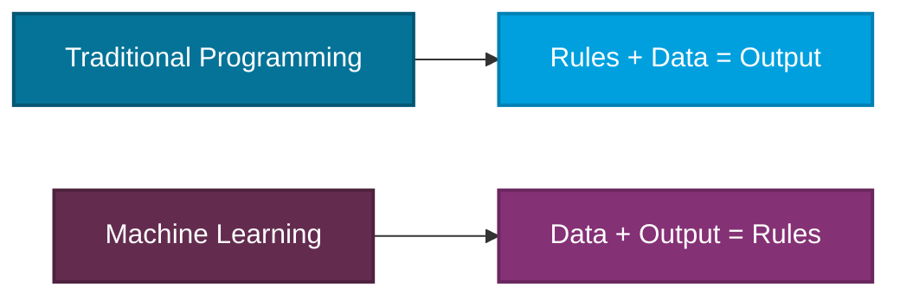

---
tags:
  - Beginner
---

# Getting Started with AI

A plain-English introduction to Artificial Intelligence, Machine Learning, and Large Language Models. No prior technical knowledge required.

---

## What is Artificial Intelligence?

**Artificial Intelligence (AI)** is the broad field of creating computer systems that can perform tasks typically requiring human intelligence -- things like understanding language, recognizing patterns, making decisions, and generating content.

!!! info "AI is Not New"
    AI as a field has existed since the 1950s. What has changed dramatically in recent years is the scale of data, computing power, and breakthroughs in neural network architectures that have made AI practical and powerful.

---

## What is Machine Learning?

**Machine Learning (ML)** is a subset of AI where systems learn patterns from data rather than being explicitly programmed with rules.

Instead of writing rules manually, you feed the system examples and it figures out the patterns. This is how spam filters, recommendation engines, and fraud detection work.

---

## What are Large Language Models?

**Large Language Models (LLMs)** are AI systems trained on massive amounts of text data. They can understand and generate human language with remarkable fluency.

### How LLMs Work (Simplified)

1. **Training** -- The model reads billions of pages of text and learns patterns about language, facts, and reasoning
2. **Input (Prompt)** -- You give the model a question or instruction in natural language
3. **Processing** -- The model uses its learned patterns to predict the most appropriate response
4. **Output** -- The model generates a response, token by token (roughly word by word)

!!! tip "Think of it Like This"
    An LLM is like an extremely well-read assistant that has absorbed vast amounts of written knowledge. It does not "think" like a human, but it can produce remarkably useful responses by predicting what text should come next based on patterns it learned.

### Popular LLMs You May Have Heard Of

| Model | Created By | Key Strength |
|-------|-----------|--------------|
| **GPT-4o / GPT-4.1** | OpenAI | General-purpose, multimodal (text + images) |
| **Claude** | Anthropic | Long-context analysis, safety-focused |
| **Gemini** | Google | Multimodal, integrated with Google ecosystem |
| **Llama** | Meta | Open-source, customizable |
| **Phi** | Microsoft | Small, fast, runs on-device |

---

## Key Terms to Know

Here are the essential terms you will encounter throughout this site:

**Token**
:   The basic unit LLMs process -- roughly three-quarters of a word in English. Model inputs, outputs, and context limits are commonly measured in tokens.

**Prompt**
:   The input you give to an AI model -- your question, instruction, or context.

**Context Window**
:   How much text a model can consider at once. A 128K context window means roughly 100,000 words.

**Inference**
:   The process of running a model to get a response. When you chat with an AI, that is inference.

**Hallucination**
:   When an AI generates confident-sounding but incorrect or fabricated information.

**RAG (Retrieval-Augmented Generation)**
:   A technique that gives AI access to your specific data before generating a response, making answers more accurate and grounded.

**AI Agent**
:   An AI system that can plan, reason, and take actions autonomously -- not just answer questions, but actually do things.

!!! note "Want More Terms?"
    Visit the complete [Glossary](../glossary/index.md) for 60+ AI terms explained in plain English.

---

## How AI Fits Into Our Organization

We use AI across several areas:

-   :material-robot-outline:{ .lg .middle } __AI Agents__

    Autonomous systems that can plan, execute tasks, and integrate with our tools and data.

    [:octicons-arrow-right-24: Learn about AI Agents](../concepts/ai-agents.md)

-   :material-database-search-outline:{ .lg .middle } __RAG & Knowledge Systems__

    Connecting AI to our enterprise data so it can answer questions using our actual documents and policies.

    [:octicons-arrow-right-24: Learn about RAG](../concepts/retrieval-and-data.md)

-   :material-account-voice:{ .lg .middle } __Copilots & Assistants__

    AI embedded in our daily tools to help with writing, analysis, coding, and decision-making.

    [:octicons-arrow-right-24: See Enterprise Patterns](../patterns/enterprise-patterns.md)

-   :material-tools:{ .lg .middle } __Frameworks & Platforms__

    The specific tools and frameworks we use to build AI solutions.

    [:octicons-arrow-right-24: View Our Stack](../tools-and-frameworks/index.md)

---

## Where to Go Next

=== "Business Analyst / PM"

    1. Browse the [Glossary](../glossary/index.md) to build vocabulary
    2. Read [Foundation & Models](../concepts/foundation-and-models.md) to understand the building blocks
    3. Explore [Enterprise Patterns](../patterns/enterprise-patterns.md) to see how AI fits into business workflows

=== "Software Engineer"

    1. Dive into [AI Agents](../concepts/ai-agents.md) and [Agentic AI](../concepts/agentic-ai.md)
    2. Study [Design Patterns](../patterns/design-patterns.md) for implementation guidance
    3. Review [Tools & Frameworks](../tools-and-frameworks/index.md) for our tech stack

=== "Co-op Student / New Joiner"

    1. Read this page fully -- you are here!
    2. Work through [Concepts](../concepts/index.md) one topic at a time
    3. Keep the [Glossary](../glossary/index.md) open as a reference

=== "Leader / Decision Maker"

    1. Skim [Foundation & Models](../concepts/foundation-and-models.md) for the landscape
    2. Read [Enterprise Patterns](../patterns/enterprise-patterns.md) for strategic context
    3. Check [Tools & Frameworks](../tools-and-frameworks/index.md) for what we invest in

---

## References

- [Microsoft AI Fundamentals Learning Path](https://learn.microsoft.com/en-us/training/paths/get-started-with-artificial-intelligence-on-azure/)
- [Google Machine Learning Crash Course](https://developers.google.com/machine-learning/crash-course)
- [OpenAI Documentation](https://platform.openai.com/docs/overview)
- [Anthropic Documentation](https://docs.anthropic.com/)
