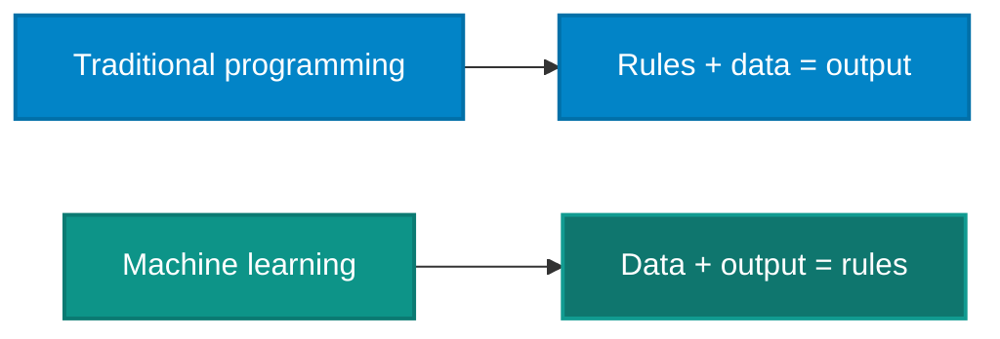

# Getting started with AI

!!! abstract "Start here · 40 min · no code"
    **Before this:** [Choose your path](../00-start-here/index.md)  ·  **After this:** [How models work](../concepts/foundation-and-models.md)

A plain-English introduction to artificial intelligence, machine learning and
large language models. No prior technical knowledge, and no code.

By the end you will know what these systems are, what they genuinely cannot do,
why they get things wrong, what makes them expensive, and how to tell a real
claim from a marketed one.

---

## What is artificial intelligence?

**Artificial intelligence** is the broad field of building computer systems that
do things we would call intelligent if a person did them: understanding
language, recognising patterns, making decisions, generating content.

It is an umbrella term, and a loose one. In practice, almost everything sold as
"AI" today is machine learning, and most of what is interesting right now is one
particular kind of machine learning.

!!! info "AI is not new"
    The field dates to the 1950s and has been through several cycles of
    enthusiasm and disappointment. What changed recently is not the idea but the
    scale: far more text to learn from, far more computing power to learn with,
    and one architectural breakthrough in 2017 called the transformer. The ideas
    underneath are older than most of the people selling them.

---

## What is machine learning?

**Machine learning** is the part of AI where a system learns patterns from
examples instead of being given rules.

```mermaid
graph LR
    A[Traditional programming] --> B["Rules + data = output"]
    C[Machine learning] --> D["Data + output = rules"]

    style A fill:#0284c7,stroke:#0270a8,stroke-width:2px,color:#fff
    style B fill:#0284c7,stroke:#0270a8,stroke-width:2px,color:#fff
    style C fill:#0d9488,stroke:#0b7a72,stroke-width:2px,color:#fff
    style D fill:#0f766e,stroke:#119b91,stroke-width:2px,color:#fff
```

Nobody wrote down the rules for "this email is spam". Instead the system was
shown a great many emails already labelled spam or not, and it worked out which
patterns separate the two. Same for fraud detection, recommendations, and credit
scoring.

**Deep learning** is machine learning using neural networks with many layers.
The depth is what lets a system build up from simple patterns to complicated
ones — edges to shapes to faces, letters to words to arguments. Every system
discussed on this site is a deep learning system.

### Two different jobs

The distinction that matters most for a newcomer is what the model produces.

| | **Predictive** | **Generative** |
|---|---|---|
| Produces | A label, a number, a score | New content: text, images, code, audio |
| Question it answers | "Which category is this?" "How much?" | "What comes next?" |
| Examples | Spam or not, fraud risk, demand forecast | Chat assistants, image generation, code completion |
| Output is | One of a fixed set of answers | Open-ended, and different each time |
| Usually judged by | Accuracy against known answers | Harder — there is rarely one right answer |

Predictive machine learning has been quietly running in production for twenty
years. Generative AI is the recent arrival, and it is what people mean when they
say "AI" today. It is also the harder one to evaluate, which is a theme you will
meet repeatedly on this site.

---

## What are large language models?

A **large language model** is a deep learning system trained on an enormous
amount of text. It generates language with striking fluency, and it is the
engine inside every chat assistant, coding tool and agent you have heard about.

### How it works, simplified

1. **Training.** The model reads an enormous volume of text and adjusts billions
   of internal numbers so it gets better at one narrow task: predicting the next
   piece of text. That is genuinely the whole training objective.
2. **Prompt.** You give it text — a question, an instruction, a document.
3. **Generation.** It predicts the next token, adds it to the text, and predicts
   again. Over and over.
4. **Output.** The result is what you read.

!!! tip "The useful mental model"
    An LLM is an extremely well-read assistant that has absorbed a vast amount
    of writing and is very good at continuing text plausibly. It is not looking
    anything up, and it is not reasoning the way you do. Nearly everything
    surprising about these systems — the fluency and the confident errors alike —
    follows from that one sentence.

The surprising part is how much falls out of "predict the next token" done well
enough. To continue a paragraph of legal argument convincingly, a system has to
encode a great deal about law, language and structure. Capability emerged from
scale rather than from anyone programming it in.

### The kinds of model you will meet

Specific model names change every few months, and any list of them is out of
date within a season. What lasts is the shape of the choice. Picking the right
tier matters far more than picking the right name inside it.

| Tier | What it is | Typical use |
|---|---|---|
| **Frontier, hosted** | The largest and most capable models, run by a vendor and reached over an API. Highest cost per token, best at hard reasoning and long documents. | Work where quality dominates cost: analysis, agents, code |
| **Small and open-weight** | Smaller models you can download and run yourself, on your own hardware or a cheap server. | High volume, privacy-sensitive or offline work; every lab on this site |
| **On-device** | Small enough to run on a phone or laptop chip. | Latency-critical or fully offline features |

There is also a distinction inside the frontier tier worth knowing: some models
are tuned to **reason before answering**, spending extra hidden output working
through a problem. They are better at maths, logic and multi-step planning, and
they are slower and more expensive. For summarising a document, they are wasted.

For what exists today and what it costs, go to the source rather than to any
article, including this one:
[Anthropic](https://docs.claude.com/en/docs/about-claude/models),
[OpenAI](https://developers.openai.com/api/docs/models),
[Google](https://ai.google.dev/gemini-api/docs/models),
[Microsoft's Azure catalogue](https://learn.microsoft.com/en-us/azure/foundry/foundry-models/concepts/models-sold-directly-by-azure),
and [Meta](https://www.llama.com/). Every secondary summary starts ageing the
day it is written.

---

## Three things a language model is not

This is the most useful section on the page. Almost every misunderstanding about
these systems, and a good share of failed projects, comes from assuming one of
these three things is true.

Each limitation has a solution, and each solution is a later page on this site.
That is the shape of the whole reading path.

### It does not remember

A model has no memory between calls. Each request is answered from scratch.

When a chat assistant appears to remember what you said earlier, the application
is silently resending the whole conversation with every message. The memory is
in the software around the model, not in the model.

This matters because that resent conversation has a size limit, called the
**context window**. Long conversations eventually exceed it, and what happens
then is rarely what people expect.

> Covered in [How models work](../concepts/foundation-and-models.md), and
> hands-on in [context engineering](../02-agents/context-engineering.md).

### It does not know anything recent, or anything of yours

Training finished on a particular date. The model knows nothing after it, and it
never knew your contracts, your policies or your customer records.

Ask about either and you will usually still get a confident answer, because
producing plausible text is what the system does. This is the single most
common way these projects go wrong.

The fix is to fetch the relevant material and include it in the prompt, so the
model is reading rather than recalling. That is **retrieval-augmented
generation**, and it is the reason RAG appears in nearly every serious
deployment.

> Covered in [Retrieval and data](../concepts/retrieval-and-data.md), in depth
> across [Retrieval in depth](../rag/index.md).

### It cannot do anything

A model only produces text. It cannot send an email, query a database or refund
a payment.

When a system appears to take actions, the model is emitting a structured
request — "call `refund_order` with this ID" — and ordinary code decides whether
to honour it and then does the work. The model proposes; your software disposes.

Understanding this changes how you think about safety. The question is never
"can we trust the model?" but "what did we permit the code around it to do, and
what stops it?"

> Covered in [What an agent is](../concepts/ai-agents.md), and built by hand in
> [tool calling](../02-agents/tool-calling.md).

---

## Why they get things wrong

A **hallucination** is a confident, well-formed, incorrect answer. It is not a
bug that a future release will fix. It follows from how the system works.

The model is producing text that is *likely*, not text that is *true*. Those
usually overlap, which is why it works at all. When they do not, nothing in the
mechanism notices, because there is no separate step where the system checks
whether what it said is so.

Two consequences worth carrying with you:

- **Fluency is not evidence.** A wrong answer reads exactly as well as a right
  one. Human reviewers are measurably worse at catching errors in confident
  prose, which makes the problem harder rather than easier.
- **It cannot reliably tell you when it is unsure.** Asked how confident it is,
  a model generates a plausible-sounding confidence statement. That is not the
  same as measuring its own uncertainty.

What actually helps: give it the source material rather than relying on recall,
ask for citations you can check, and constrain the task. What does not help:
asking it to try harder, or telling it not to hallucinate.

> Covered in [Safety and responsible AI](../concepts/safety-and-responsible-ai.md).

---

## What it costs, and why

Usage is billed in **tokens** — roughly three-quarters of a word each — and both
directions count. You pay for everything you send and everything you get back.

Three cost facts that surprise people:

- **The conversation is resent every turn.** Because the model has no memory, a
  twenty-turn conversation sends the first message twenty times. Cost grows with
  the square of the conversation length, not linearly.
- **Long documents are expensive to consult.** Pasting a hundred-page contract
  into every question means paying for a hundred pages every question. This is
  exactly why retrieval exists: fetch the three relevant paragraphs instead.
- **Reasoning models bill for thinking you never see.** The hidden working-out
  is charged like any other output.

The practical lesson for anyone sizing a project: the cost driver is rarely the
number of users. It is how much text each interaction carries and how many turns
it takes.

> Covered in [Infrastructure and operations](../concepts/infrastructure-and-operations.md),
> and measured in [observability](../02-agents/observability.md).

---

## Key terms to know

The [glossary](../glossary/index.md) has all 74. These are the ones you need to
read the rest of this path.

**Token**
:   The basic unit a model processes — roughly three-quarters of a word in
    English. Inputs, outputs, limits and prices are all measured in tokens.

**Prompt**
:   Everything you send the model: your question, plus any instructions and
    documents the application adds around it.

**System prompt**
:   Standing instructions the application sets before your message — the role,
    the rules, the tone. You usually never see it.

**Context window**
:   How much text the model can consider at once, measured in tokens. Everything
    must fit: system prompt, conversation, retrieved documents and the answer.

**Training cutoff**
:   The date the model's knowledge stops. Anything after it is unknown to the
    model, whether or not it says so.

**Inference**
:   Running the model to get an answer, as opposed to training it. Every
    interaction you have is inference.

**Temperature**
:   A setting controlling randomness. Low means consistent and repetitive; high
    means varied and less predictable. The same prompt can give different
    answers, which matters for testing.

**Hallucination**
:   A confident, fluent, incorrect answer.

**Embedding**
:   A list of numbers representing a piece of text's meaning, so that similar
    meanings sit close together. The mechanism underneath search and retrieval.

**RAG (retrieval-augmented generation)**
:   Fetching relevant material and putting it in the prompt, so the model reads
    rather than recalls.

**Fine-tuning**
:   Further training on your own examples to change how a model behaves. Changes
    style and format reliably; a poor way to add facts.

**Multimodal**
:   Able to handle more than text — images, audio, sometimes video.

**AI agent**
:   A system where the model chooses which actions to take, in a loop, until a
    goal is met. The step beyond answering questions.

**Copilot**
:   An assistant that suggests and drafts while a person stays in control. Most
    successful deployments are copilots, not autonomous agents.

---

## How to judge a claim about AI

If your role is to evaluate proposals rather than build systems, this section is
the one to keep.

**"It knows our data."** Ask how. There are only three real answers: the material
is fetched and put in the prompt (retrieval), the model was further trained on it
(fine-tuning), or it is being pasted in every time. If nobody can say which, the
answer is usually that it does not.

**"It is 95% accurate."** Ask: on what set of questions, chosen by whom, graded
how? Generative output has no single right answer, so an accuracy figure is only
as good as the test behind it, and the test is usually much easier than reality.

**"It does not hallucinate."** No system has this property. A good answer sounds
like "we ground answers in retrieved documents, show citations, and route
low-confidence cases to a person".

**"It is autonomous."** Ask what it is permitted to do without a human, and what
stops it. If the answer is about the prompt being carefully worded, the control
is not real — instructions in a prompt are not a security boundary.

**"We are using the latest model."** Rarely the important question. The system
around the model — what it retrieves, what it is allowed to do, how failures are
caught — decides quality far more often than the model choice does.

---

## Where to go next

You have the vocabulary and, more importantly, the three limitations that shape
everything else. The rest of the reading path builds on this page in order.

| # | Next | Why it follows |
|---|---|---|
| 2 | [How models work](../concepts/foundation-and-models.md) | Tokens, context windows and inference, one level below this page |
| 3 | [Prompting](../concepts/prompting-and-techniques.md) | How to actually get what you want out of a model |
| 4 | [Retrieval and data](../concepts/retrieval-and-data.md) | The fix for "it does not know anything of yours" |
| 5 | [What an agent is](../concepts/ai-agents.md) | The fix for "it cannot do anything" |

The full route, with times, is on [Choose your path](../00-start-here/index.md).

**If you write code**, the [build path](../00-start-here/the-path.md) covers the
same ground as something you run: ten modules, ten labs, all free and local.
Read pages 2 and 5 above first, then start there.

**Keep open while you read:** the [glossary](../glossary/index.md).

## Go deeper

- [Google's machine learning crash course](https://developers.google.com/machine-learning/crash-course)
  — free, and the clearest introduction to what "learning from data" actually
  means if you want the layer beneath this page.
- [Microsoft Learn: get started with AI apps and agents](https://learn.microsoft.com/en-us/training/paths/get-started-ai-apps-agents/)
  — a structured path with hands-on modules, free to work through.
- [Anthropic's documentation](https://docs.claude.com/) and
  [OpenAI's](https://developers.openai.com/api/docs) — the primary sources.
  Prefer them to any summary, including this one, whenever a detail matters.
