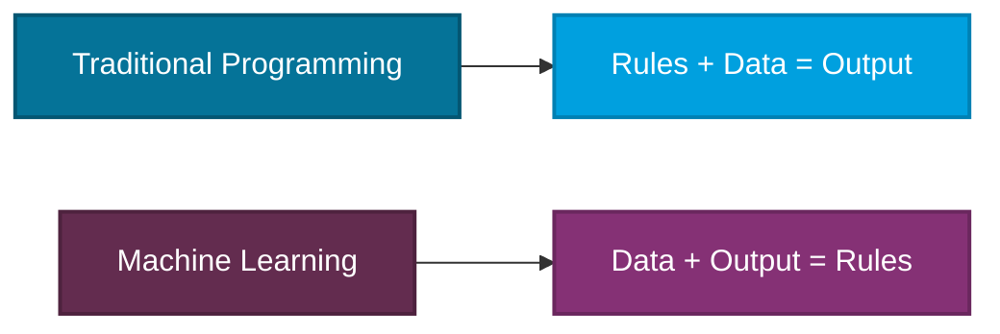

# Getting Started with AI

A plain-English introduction to Artificial Intelligence, Machine Learning, and Large Language Models. No prior technical knowledge required.

---

## What is Artificial Intelligence?

**Artificial Intelligence (AI)** is the broad field of creating computer systems that can perform tasks typically requiring human intelligence -- things like understanding language, recognizing patterns, making decisions, and generating content.

!!! info "AI is Not New"
    AI as a field has existed since the 1950s. What has changed dramatically in recent years is the scale of data, computing power, and breakthroughs in neural network architectures that have made AI practical and powerful.

---

## What is Machine Learning?

**Machine Learning (ML)** is a subset of AI where systems learn patterns from data rather than being explicitly programmed with rules.

```mermaid
graph LR
    A[Traditional Programming] --> B["Rules + Data = Output"]
    C[Machine Learning] --> D["Data + Output = Rules"]

    style A fill:#057398,stroke:#045672,stroke-width:2px,color:#fff
    style B fill:#00A0DF,stroke:#0080B3,stroke-width:2px,color:#fff
    style C fill:#632C4F,stroke:#4E223E,stroke-width:2px,color:#fff
    style D fill:#853175,stroke:#6A275E,stroke-width:2px,color:#fff
```

Instead of writing rules manually, you feed the system examples and it figures out the patterns. This is how spam filters, recommendation engines, and fraud detection work.

---

## What are Large Language Models?

**Large Language Models (LLMs)** are AI systems trained on massive amounts of text data. They can understand and generate human language with remarkable fluency.

### How LLMs Work (Simplified)

1. **Training** -- The model reads billions of pages of text and learns patterns about language, facts, and reasoning
2. **Input (Prompt)** -- You give the model a question or instruction in natural language
3. **Processing** -- The model uses its learned patterns to predict the most appropriate response
4. **Output** -- The model generates a response, token by token (roughly word by word)

!!! tip "Think of it Like This"
    An LLM is like an extremely well-read assistant that has absorbed vast amounts of written knowledge. It does not "think" like a human, but it can produce remarkably useful responses by predicting what text should come next based on patterns it learned.

### The kinds of model you will meet

Specific model names change every few months, and any list of them is wrong
within a season. What lasts is the shape of the choice. There are three broad
tiers, and picking the right tier matters far more than picking the right name
inside it.

| Tier | What it is | Typical use |
|---|---|---|
| **Frontier, hosted** | The largest and most capable models, run by a vendor and reached over an API. Highest cost per token, best at hard reasoning and long context. | Work where quality dominates cost: analysis, agents, code |
| **Small and open-weight** | Smaller models you can download and run yourself, on your own hardware or a cheap server. | High volume, privacy-sensitive, or offline work; the labs on this site |
| **On-device** | Models small enough to run on a phone or laptop chip, often with hardware acceleration. | Latency-critical or fully offline features |

For what exists today and what it costs, go to the source rather than to any
article, including this one:
[Anthropic](https://docs.claude.com/en/docs/about-claude/models),
[OpenAI](https://developers.openai.com/api/docs/models),
[Google](https://ai.google.dev/gemini-api/docs/models),
[Microsoft's Azure catalogue](https://learn.microsoft.com/en-us/azure/foundry/foundry-models/concepts/models-sold-directly-by-azure),
and [Meta](https://www.llama.com/). Each publishes a live model page; every
secondary summary, this one included, is a snapshot that starts ageing the day
it is written.

## Key Terms to Know

Here are the essential terms you will encounter throughout this site:

**Token**
:   The basic unit LLMs process -- roughly three-quarters of a word in English. Model inputs, outputs, and context limits are commonly measured in tokens.

**Prompt**
:   The input you give to an AI model -- your question, instruction, or context.

**Context Window**
:   How much text a model can consider at once. A 128K context window means roughly 100,000 words.

**Inference**
:   The process of running a model to get a response. When you chat with an AI, that is inference.

**Hallucination**
:   When an AI generates confident-sounding but incorrect or fabricated information.

**RAG (Retrieval-Augmented Generation)**
:   A technique that gives AI access to your specific data before generating a response, making answers more accurate and grounded.

**AI Agent**
:   An AI system that can plan, reason, and take actions autonomously -- not just answer questions, but actually do things.

!!! note "Want More Terms?"
    Visit the complete [Glossary](../glossary/index.md) for 70+ AI terms explained in plain English.

---

## Where to go next

You have the vocabulary. The next nine pages of the reading path build on this
one in order, and each needs only the pages before it.

| # | Next | Why it follows |
|---|---|---|
| 2 | [How models work](../concepts/foundation-and-models.md) | Tokens, context windows and inference, one level below this page |
| 3 | [Prompting](../concepts/prompting-and-techniques.md) | How to actually get what you want out of a model |
| 4 | [Retrieval and data](../concepts/retrieval-and-data.md) | Giving the model your documents, so it stops guessing |
| 5 | [What an agent is](../concepts/ai-agents.md) | Letting the model act, not just answer |

The full route, with times, is on [Choose your path](../00-start-here/index.md).

**If you write code**, the [build path](../00-start-here/the-path.md) covers the
same ground as something you run: ten modules, ten labs, all free and local.
Read pages 2 and 5 above first, then start there.

**Keep open while you read:** the [glossary](../glossary/index.md), for any term
that is new.

## Go deeper

- [Google's Machine Learning Crash Course](https://developers.google.com/machine-learning/crash-course)
  — free, and the clearest introduction to what "learning from data" means if
  you want the layer beneath this page.
- [Microsoft Learn: get started with AI apps and agents](https://learn.microsoft.com/en-us/training/paths/get-started-ai-apps-agents/)
  — a structured path with hands-on modules, free to work through.
- [Anthropic's documentation](https://docs.claude.com/) and
  [OpenAI's](https://developers.openai.com/api/docs) — the primary sources.
  Prefer them to any summary, including this site, whenever a detail matters.
