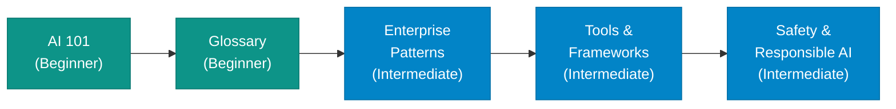
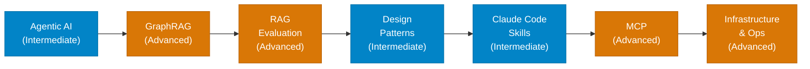
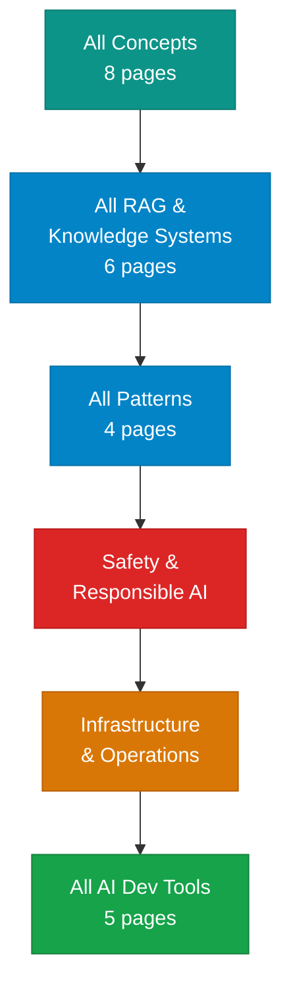

# Learning Paths

Not everyone needs to read everything. These four paths give you a clear, sequenced route through the site based on your role and goals.

---

## Difficulty Levels

Every page on this site carries a difficulty badge in its tags. Here is what each level means:

| Badge | Who It Is For |
|-------|--------------|
| **Beginner** | No prior AI knowledge required. Plain-English explanations, minimal code. |
| **Intermediate** | Assumes you understand software development. Includes architecture concepts and some code. |
| **Advanced** | Assumes familiarity with AI/ML concepts. Deep technical content with implementation detail. |
| **Expert** | For architects and specialists. Production trade-offs, research references, design decisions. |

---

## Path 1 — Non-Technical / Business

**For:** Business analysts, product managers, operations leads, executives

**Goal:** Build enough AI vocabulary to participate in strategic decisions and evaluate AI proposals critically.

**Estimated time:** 4–6 hours

| Step | Page | Why |
|------|------|-----|
| 1 | [AI 101](index.md) | Foundation — what AI, LLMs, and agents actually are |
| 2 | [Glossary](../glossary/index.md) | Build your vocabulary — refer back here whenever you hit an unknown term |
| 3 | [Enterprise Patterns](../patterns/enterprise-patterns.md) | How organizations deploy AI at scale, governance, and risk |
| 4 | [Tools & Frameworks](../tools-and-frameworks/index.md) | What the engineering team is building with |
| 5 | [Safety & Responsible AI](../concepts/safety-and-responsible-ai.md) | Risks, bias, compliance, and responsible deployment |

---

## Path 2 — Developer (New to AI)

**For:** Software engineers who understand coding but are new to AI/ML concepts

**Goal:** Go from zero to building production-ready RAG systems and understanding how agents work.

**Estimated time:** 15–20 hours

```mermaid
flowchart LR
    A["AI 101\n(Beginner)"] --> B["Foundation &\nModels\n(Intermediate)"]
    B --> C["RAG\nFundamentals\n(Intermediate)"]
    C --> D["Embeddings\n(Intermediate)"]
    D --> E["Chunking\nStrategies\n(Intermediate)"]
    E --> F["Vector\nDatabases\n(Intermediate)"]
    F --> G["AI Agents\n(Intermediate)"]
    G --> H["Design\nPatterns\n(Intermediate)"]
    H --> I["AI Dev Tools\n(Beginner)"]

    style A fill:#0d9488,stroke:#0b7a72,color:#fff
    style B fill:#0d9488,stroke:#0b7a72,color:#fff
    style C fill:#0284c7,stroke:#0270a8,color:#fff
    style D fill:#0284c7,stroke:#0270a8,color:#fff
    style E fill:#0284c7,stroke:#0270a8,color:#fff
    style F fill:#0284c7,stroke:#0270a8,color:#fff
    style G fill:#0284c7,stroke:#0270a8,color:#fff
    style H fill:#0284c7,stroke:#0270a8,color:#fff
    style I fill:#0d9488,stroke:#0b7a72,color:#fff
```

| Step | Page | Why |
|------|------|-----|
| 1 | [AI 101](index.md) | Orientation |
| 2 | [Foundation & Models](../concepts/foundation-and-models.md) | How LLMs work, tokens, context windows, model selection |
| 3 | [RAG Fundamentals](../rag/rag-fundamentals.md) | The most important pattern for enterprise AI |
| 4 | [Embeddings](../rag/embeddings.md) | The data representation underpinning RAG |
| 5 | [Chunking Strategies](../rag/chunking-strategies.md) | The most common source of RAG quality issues |
| 6 | [Vector Databases](../rag/vector-databases.md) | Where embeddings live and how to query them |
| 7 | [AI Agents](../concepts/ai-agents.md) | Moving beyond RAG to autonomous systems |
| 8 | [Agentic AI](../concepts/agentic-ai.md) | Patterns for production agent systems |
| 9 | [Design Patterns](../patterns/design-patterns.md) | Architectural patterns for agent implementations |
| 10 | [AI Developer Tools](../ai-dev-tools/index.md) | GitHub Copilot, Claude Code, MCP — your daily toolkit |

---

## Path 3 — Experienced Engineer (Production Focus)

**For:** Engineers who already know LLMs and want production-ready skills — evaluation, advanced RAG, developer tooling, and observability.

**Estimated time:** 8–10 hours

| Step | Page | Why |
|------|------|-----|
| 1 | [Agentic AI](../concepts/agentic-ai.md) | Refresh on production agent patterns |
| 2 | [GraphRAG](../rag/graphrag.md) | When standard RAG isn't enough |
| 3 | [RAG Evaluation](../rag/rag-evaluation.md) | RAGAS metrics and golden datasets |
| 4 | [Design Patterns](../patterns/design-patterns.md) | Orchestration, reflection, tool use patterns |
| 5 | [Claude Code Skills & Agents](../ai-dev-tools/claude-code-skills.md) | Subagents, hooks, custom skills |
| 6 | [MCP](../ai-dev-tools/mcp.md) | Extend any AI host with custom tools |
| 7 | [Infrastructure & Operations](../concepts/infrastructure-and-operations.md) | Observability, cost, scaling, MLOps |

---

## Path 4 — AI Architect / Lead

**For:** Solution architects, tech leads, and senior engineers designing AI systems end to end.

**Goal:** Full coverage — concepts, RAG depth, patterns, safety, observability, and developer tooling.

**Estimated time:** 30+ hours, self-paced

Recommended reading order:

**Phase 1 — Foundation (Concepts section)**

1. [Foundation & Models](../concepts/foundation-and-models.md)
2. [Retrieval & Data](../concepts/retrieval-and-data.md) — overview only, then proceed to the full RAG section
3. [AI Agents](../concepts/ai-agents.md)
4. [Agentic AI](../concepts/agentic-ai.md)
5. [Prompting & Techniques](../concepts/prompting-and-techniques.md)
6. [Fine-Tuning & Training](../concepts/fine-tuning-and-training.md)
7. [Safety & Responsible AI](../concepts/safety-and-responsible-ai.md)
8. [Infrastructure & Operations](../concepts/infrastructure-and-operations.md)

**Phase 2 — RAG Depth**

9. [RAG Fundamentals](../rag/rag-fundamentals.md)
10. [Embeddings](../rag/embeddings.md)
11. [Chunking Strategies](../rag/chunking-strategies.md)
12. [Vector Databases](../rag/vector-databases.md)
13. [GraphRAG](../rag/graphrag.md)
14. [RAG Evaluation](../rag/rag-evaluation.md)

**Phase 3 — Patterns**

15. [Design Patterns](../patterns/design-patterns.md)
16. [Enterprise Patterns](../patterns/enterprise-patterns.md)
17. [Design Principles](../patterns/design-principles.md)
18. [Code Quality Pipeline](../patterns/code-quality-pipeline.md)

**Phase 4 — Developer Tooling**

19. [GitHub Copilot](../ai-dev-tools/github-copilot.md)
20. [Copilot CLI & Extensions](../ai-dev-tools/copilot-cli-extensions.md)
21. [Claude Code](../ai-dev-tools/claude-code.md)
22. [Claude Code Skills & Agents](../ai-dev-tools/claude-code-skills.md)
23. [MCP](../ai-dev-tools/mcp.md)

---

!!! tip "Not sure which path fits?"
    Start with [AI 101](index.md). The first few sections will make it clear whether you need more foundational reading or can jump straight to advanced topics.

## Next Steps

- If you are new: [AI 101](index.md)
- If you are ready to build: [RAG Fundamentals](../rag/rag-fundamentals.md)
- If you want your daily tools first: [AI Developer Tools](../ai-dev-tools/index.md)
