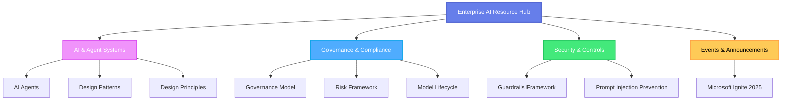

# Enterprise Architecture - AI Resource Hub

Welcome to the **Enterprise Architecture AI Resource Hub** — your comprehensive guide to building, deploying, and governing AI agent systems in enterprise environments.

---

## 📚 Documentation Categories

### AI & Agent Systems

-   :material-robot-outline:{ .lg .middle } **AI Agents**

    ---

    Comprehensive guide to AI agents, their core components, multi-agent systems, and workflows.

    **Topics:** Agent architecture, components, orchestration patterns, workflows

    [:octicons-arrow-right-24: Explore AI Agents](ai-agents.md)

-   :material-sitemap:{ .lg .middle } **Design Patterns**

    ---

    Proven architectural patterns for building scalable AI agent systems.

    **Topics:** Sequential, conditional, supervisor, hierarchical, and autonomous patterns

    [:octicons-arrow-right-24: View Design Patterns](design-pattern.md)

-   :material-cog-outline:{ .lg .middle } **Design Principles**

    ---

    Core architectural principles for developing robust agent frameworks.

    **Topics:** Async architecture, event streaming, serialization, cancellation

    [:octicons-arrow-right-24: Read Design Principles](design-principles.md)

---

### Governance & Compliance

-   :material-shield-account:{ .lg .middle } **AI Governance Operating Model**

    ---

    Organizational structure and decision-making frameworks for AI initiatives.

    **Topics:** Governance bodies, approval processes, escalation paths

    [:octicons-arrow-right-24: View Governance Model](ai-governance-operating-model.md)

-   :material-alert-decagram:{ .lg .middle } **Risk Management Framework**

    ---

    Comprehensive framework for identifying and mitigating AI-related risks.

    **Topics:** Security, privacy, compliance, operational, reputational risks

    [:octicons-arrow-right-24: Explore Risk Framework](risk-management-framework.md)

-   :material-timeline-clock:{ .lg .middle } **Model Lifecycle Governance**

    ---

    Lifecycle stages and management best practices for AI models.

    **Topics:** Preview, GA, legacy, deprecated, retired model stages

    [:octicons-arrow-right-24: Learn Model Lifecycle](model-lifecycle-governance.md)

---

### Security & Controls

-   :material-security:{ .lg .middle } **Guardrails & Control Framework**

    ---

    Technical and behavioral controls to ensure safe AI system operation.

    **Topics:** Rate limiting, content filtering, toxicity detection, monitoring

    [:octicons-arrow-right-24: View Guardrails Framework](guardrails-and-control-framework.md)

-   :material-shield-lock:{ .lg .middle } **Prompt Injection Prevention**

    ---

    Strategies and techniques to protect AI systems from prompt injection attacks.

    **Topics:** Attack vectors, Azure Prompt Shields, mitigation strategies

    [:octicons-arrow-right-24: Read Security Guide](prompt-injection-prevention.md)

---

### Events & Announcements

-   :material-microsoft:{ .lg .middle } **Microsoft Ignite 2025**

    ---

    Complete summary of Microsoft Ignite 2025 announcements and Azure AI Foundry platform.

    **Topics:** Foundry platform, agent services, tools, models, governance

    [:octicons-arrow-right-24: View Ignite Summary](ms-ignite-2025.md)

---

## 🎯 Quick Start

!!! tip "New to AI Agents?"
    Start with [AI Agents](ai-agents.md) to understand the fundamentals, then explore [Design Patterns](design-pattern.md) to learn implementation approaches.

!!! info "Setting Up Governance?"
    Begin with [AI Governance Operating Model](ai-governance-operating-model.md) and [Risk Management Framework](risk-management-framework.md).

!!! warning "Security First"
    Review [Guardrails & Control Framework](guardrails-and-control-framework.md) and [Prompt Injection Prevention](prompt-injection-prevention.md) before deployment.

---

## 🔍 What's Inside

This documentation hub provides:

- **Architectural Guidance** - Patterns and principles for building AI systems
- **Governance Frameworks** - Structures for responsible AI development
- **Security Best Practices** - Protection mechanisms and controls
- **Risk Management** - Frameworks for identifying and mitigating risks
- **Latest Updates** - Coverage of Microsoft Ignite 2025 and Azure AI Foundry

---

## 📖 Documentation Structure

---

## 💡 Key Concepts

!!! abstract "AI Agents"
    Autonomous systems that perceive their environment, reason about context, take actions via tools or APIs, and learn through feedback to achieve defined objectives.

!!! abstract "Multi-Agent Systems"
    Collections of agents that collaborate to solve tasks, each maintaining specific capabilities—reasoning, acting, and communicating.

!!! abstract "Governance"
    Organizational structures and decision-making frameworks that ensure responsible, compliant, and effective AI development and deployment.

---

## 🚀 Getting Started

1. **Understand the Fundamentals** - Start with [AI Agents](ai-agents.md)
2. **Learn the Patterns** - Explore [Design Patterns](design-pattern.md)
3. **Apply the Principles** - Review [Design Principles](design-principles.md)
4. **Implement Governance** - Set up using [Governance Model](ai-governance-operating-model.md)
5. **Secure Your Systems** - Apply [Security Controls](guardrails-and-control-framework.md)

---

## 📞 Support & Feedback

For questions, feedback, or contributions, please reach out to the Enterprise Architecture Team.

**Last Updated:** November 2025
