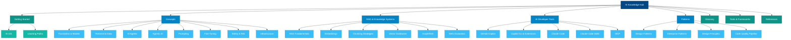

---
hide:
  - navigation
  - toc
tags:
  - Home
---

# AI Knowledge Hub

Your go-to resource for understanding AI -- from foundational concepts to architecture patterns. Built for everyone in the organization, regardless of technical background.

---

## Find Your Path

-   :material-school-outline:{ .lg .middle } __New to AI?__

    ---

    Start here to understand the basics -- what AI is, how LLMs work, and why it matters for your role.

    [:octicons-arrow-right-24: Getting Started](getting-started/index.md)

-   :material-book-open-variant:{ .lg .middle } __Learn the Concepts__

    ---

    Deep dive into AI topics -- models, RAG, agents, prompting, fine-tuning, and more.

    [:octicons-arrow-right-24: Explore Concepts](concepts/index.md)

-   :material-database-search:{ .lg .middle } __RAG & Knowledge Systems__

    ---

    Production-depth coverage of embeddings, chunking, vector databases, GraphRAG, and evaluation.

    [:octicons-arrow-right-24: Explore RAG](rag/index.md)

-   :material-code-braces:{ .lg .middle } __AI Developer Tools__

    ---

    GitHub Copilot, Claude Code, Copilot Extensions, and the Model Context Protocol.

    [:octicons-arrow-right-24: View Tools](ai-dev-tools/index.md)

-   :material-sitemap:{ .lg .middle } __Architecture Patterns__

    ---

    Design patterns and principles for building AI agent systems -- for developers and architects.

    [:octicons-arrow-right-24: View Patterns](patterns/index.md)

-   :material-format-list-text:{ .lg .middle } __Quick Reference__

    ---

    Look up any AI term instantly. A searchable glossary covering 70+ terms explained in plain English.

    [:octicons-arrow-right-24: Open Glossary](glossary/index.md)

-   :material-tools:{ .lg .middle } __Tools & Frameworks__

    ---

    What we use in our organization -- Semantic Kernel, LangChain, Azure AI, and more.

    [:octicons-arrow-right-24: View Tools](tools-and-frameworks/index.md)

-   :material-link-variant:{ .lg .middle } __References__

    ---

    Curated links to official documentation, learning resources, and research.

    [:octicons-arrow-right-24: Browse References](references/index.md)

---

## Who Is This For?

Not sure where to start? [View structured learning paths →](getting-started/learning-paths.md)

!!! tip "Business Analysts & Product Managers"
    Start with [Getting Started](getting-started/index.md) and the [Glossary](glossary/index.md) to build your AI vocabulary. Then explore [Enterprise Patterns](patterns/enterprise-patterns.md) for understanding how AI is deployed at scale.

!!! info "Software Engineers & Developers"
    Follow the [Developer Learning Path](getting-started/learning-paths.md#path-2-developer-new-to-ai): Concepts → RAG & Knowledge Systems → AI Developer Tools. The [RAG section](rag/index.md) and [AI Dev Tools section](ai-dev-tools/index.md) are specifically built for you.

!!! note "Co-op Students & New Joiners"
    Welcome! Start with [Getting Started](getting-started/index.md) for a beginner-friendly introduction, use the [Glossary](glossary/index.md) whenever you encounter unfamiliar terms, and follow the [Learning Paths](getting-started/learning-paths.md) to find the right route.

!!! abstract "Leaders & Decision Makers"
    Focus on [Getting Started](getting-started/index.md) for the big picture, [Enterprise Patterns](patterns/enterprise-patterns.md) for understanding AI architectures, and [Safety & Responsible AI](concepts/safety-and-responsible-ai.md) for governance and risk.

---

## Site Map

```mermaid
graph TD
    A[AI Knowledge Hub] --> B[Getting Started]
    A --> C[Concepts]
    A --> R[RAG & Knowledge Systems]
    A --> T[AI Developer Tools]
    A --> D[Patterns]
    A --> E[Glossary]
    A --> F[Tools & Frameworks]
    A --> G[References]

    B --> B1[AI 101]
    B --> B2[Learning Paths]

    C --> C1[Foundation & Models]
    C --> C2[Retrieval & Data]
    C --> C3[AI Agents]
    C --> C4[Agentic AI]
    C --> C5[Prompting]
    C --> C6[Fine-Tuning]
    C --> C7[Safety & RAI]
    C --> C8[Infrastructure]

    R --> R1[RAG Fundamentals]
    R --> R2[Embeddings]
    R --> R3[Chunking Strategies]
    R --> R4[Vector Databases]
    R --> R5[GraphRAG]
    R --> R6[RAG Evaluation]

    T --> T1[GitHub Copilot]
    T --> T2[Copilot CLI & Extensions]
    T --> T3[Claude Code]
    T --> T4[Claude Code Skills]
    T --> T5[MCP]

    D --> D1[Design Patterns]
    D --> D2[Enterprise Patterns]
    D --> D3[Design Principles]
    D --> D4[Code Quality Pipeline]

    style A fill:#004987,stroke:#003665,stroke-width:3px,color:#fff
    style B fill:#0d9488,stroke:#0b7a72,stroke-width:2px,color:#fff
    style C fill:#0284c7,stroke:#0270a8,stroke-width:2px,color:#fff
    style R fill:#0284c7,stroke:#0270a8,stroke-width:2px,color:#fff
    style T fill:#0284c7,stroke:#0270a8,stroke-width:2px,color:#fff
    style D fill:#0284c7,stroke:#0270a8,stroke-width:2px,color:#fff
    style E fill:#0d9488,stroke:#0b7a72,stroke-width:2px,color:#fff
    style F fill:#0d9488,stroke:#0b7a72,stroke-width:2px,color:#fff
    style G fill:#0d9488,stroke:#0b7a72,stroke-width:2px,color:#fff
    style B1 fill:#14b8a6,stroke:#0d9488,color:#fff
    style B2 fill:#14b8a6,stroke:#0d9488,color:#fff
    style C1 fill:#38bdf8,stroke:#0284c7,color:#fff
    style C2 fill:#38bdf8,stroke:#0284c7,color:#fff
    style C3 fill:#38bdf8,stroke:#0284c7,color:#fff
    style C4 fill:#38bdf8,stroke:#0284c7,color:#fff
    style C5 fill:#38bdf8,stroke:#0284c7,color:#fff
    style C6 fill:#38bdf8,stroke:#0284c7,color:#fff
    style C7 fill:#38bdf8,stroke:#0284c7,color:#fff
    style C8 fill:#38bdf8,stroke:#0284c7,color:#fff
    style R1 fill:#38bdf8,stroke:#0284c7,color:#fff
    style R2 fill:#38bdf8,stroke:#0284c7,color:#fff
    style R3 fill:#38bdf8,stroke:#0284c7,color:#fff
    style R4 fill:#38bdf8,stroke:#0284c7,color:#fff
    style R5 fill:#38bdf8,stroke:#0284c7,color:#fff
    style R6 fill:#38bdf8,stroke:#0284c7,color:#fff
    style T1 fill:#38bdf8,stroke:#0284c7,color:#fff
    style T2 fill:#38bdf8,stroke:#0284c7,color:#fff
    style T3 fill:#38bdf8,stroke:#0284c7,color:#fff
    style T4 fill:#38bdf8,stroke:#0284c7,color:#fff
    style T5 fill:#38bdf8,stroke:#0284c7,color:#fff
    style D1 fill:#38bdf8,stroke:#0284c7,color:#fff
    style D2 fill:#38bdf8,stroke:#0284c7,color:#fff
    style D3 fill:#38bdf8,stroke:#0284c7,color:#fff
    style D4 fill:#38bdf8,stroke:#0284c7,color:#fff
```

---

## What's New

Check [What's New](whats-new/index.md) for the latest updates and announcements.
