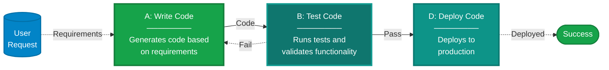
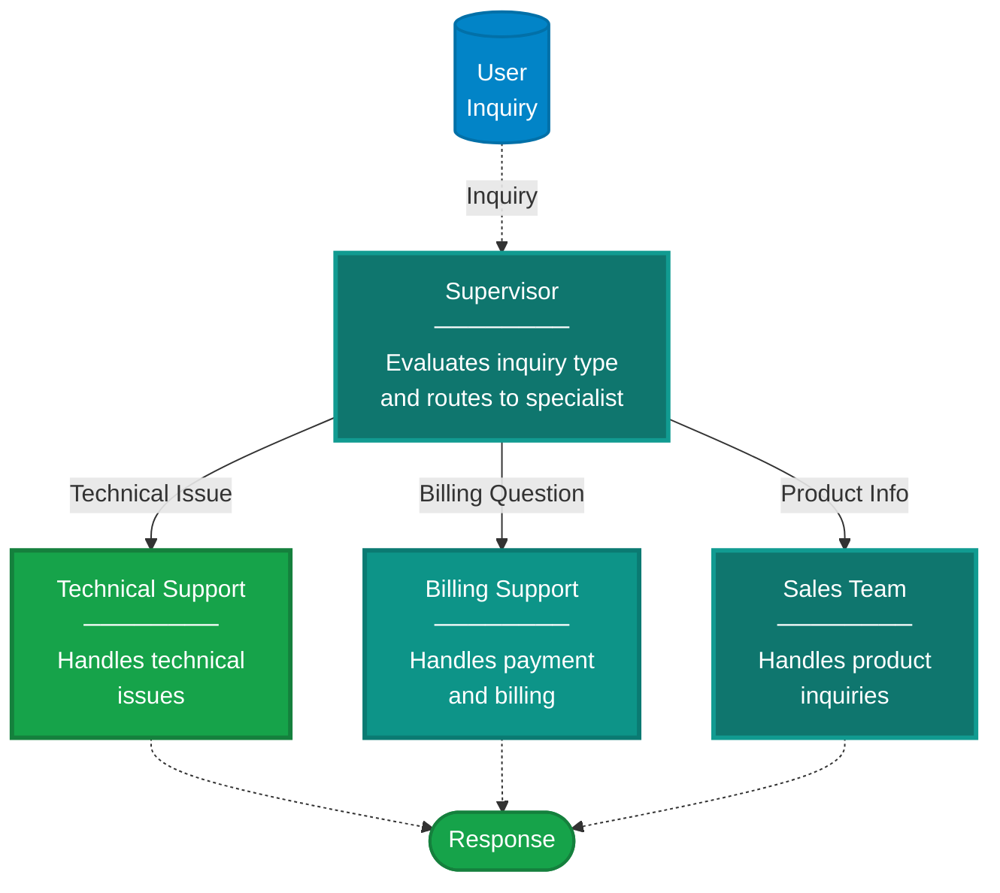
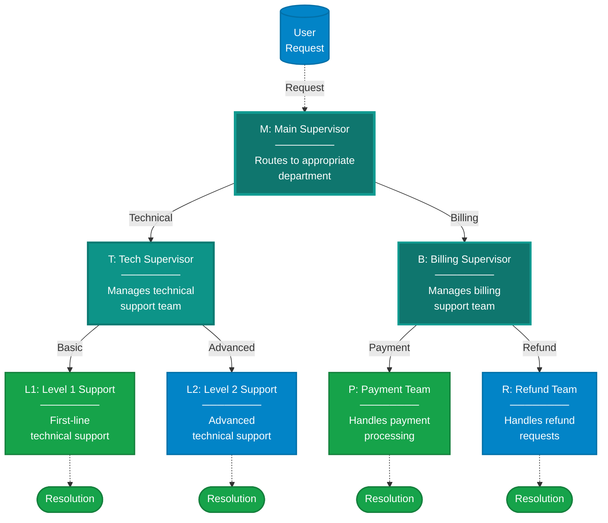
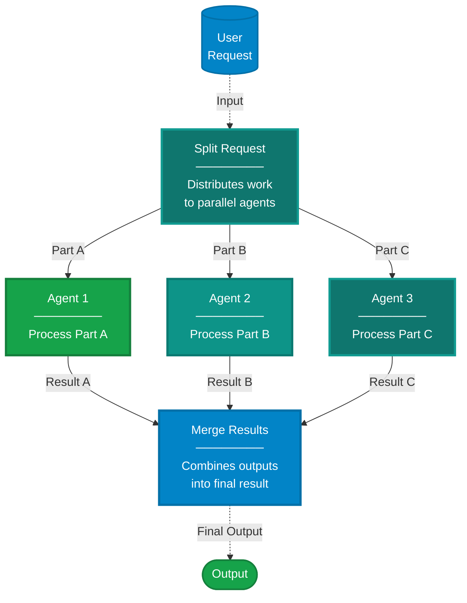
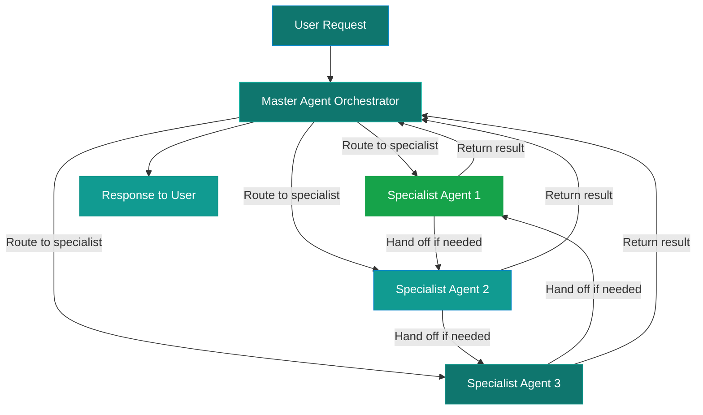

# Design patterns for AI agent systems

!!! abstract "Go deeper · 45 min · code optional"
    **Before this:** [Architecture patterns](index.md)  ·  **After this:** [Design principles](design-principles.md)
    **Hands-on version:** [2 The agent loop](../02-agents/the-agent-loop.md)

## Foundation: basic architecture patterns

### Simple model

#### When to use:

- Tasks require only text generation
- No external actions or tool usage needed
- Direct question-answer scenarios from training data
- Document summarization or code generation from specifications

#### Characteristics:

- Fast and cost-effective
- Easy to implement with direct LLM API calls
- Limited to text processing, analysis, or generation

#### Example use cases:

- Text completion and generation
- Simple question answering
- Content summarization
- Code generation from clear specifications

---

### Single agent

#### When to use:

- Tasks require actions beyond text generation
- Solution involves known action sequences with action-perception loops
- Can be handled effectively by one type of expertise
- Tasks involve API calls with result validation
- No need for specialized domain expertise or complex collaboration

#### Characteristics:

- Flexible with tool usage capabilities
- Moderate complexity
- Can handle action-taking with appropriate tools
- May struggle with highly complex multi-step tasks

#### Example use cases:

- Simple automation tasks
- Basic tool calling scenarios
- Straightforward decision-making
- Tasks requiring validation loops

---

### Multi-agent workflow

#### When to use:

- Solution can be expressed as a well-defined workflow
- Benefits from specialized expertise or domain separation
- Different parts of the task require distinct domain knowledge
- Collaboration pattern between agents is well-understood
- Each agent's role and handoffs follow established processes

#### Characteristics:

- Structured and maintainable
- Clear agent responsibilities
- Orchestrated, predictable execution flow
- Requires upfront design
- Less flexible than autonomous approaches

#### Example use cases:

- Content creation pipeline (research, writing, editing agents)
- Customer service routing (triage, specialist, resolution)
- Financial analysis (market data, risk assessment, portfolio optimization)
- Data processing workflows with specialized steps

---

## Workflow patterns (explicit control)

Workflow patterns provide developer-defined execution paths with predictable behavior. These patterns borrow concepts from graph theory to model multi-agent orchestration as computational graphs where nodes represent computational units and edges define control flow between nodes.

### Sequential workflows

Sequential workflows implement linear execution where each node's output feeds into the next node (A → B → C), ensuring ordered processing with predictable execution timing.

```mermaid
flowchart LR
    User[("User<br/>Request")]
    A["A: Topic Selection<br/>────────<br/>Identifies key topics<br/>from user input"]
    B["B: Research<br/>────────<br/>Gathers information<br/>on selected topics"]
    C["C: Analysis<br/>────────<br/>Processes and<br/>analyzes research data"]
    D["D: Report Generation<br/>────────<br/>Creates comprehensive<br/>final report"]
    End([Output])
    
    User -.->|Input| A
    A -->|Selected Topics| B
    B -->|Research Data| C
    C -->|Analysis Results| D
    D -.->|Final Report| End
    
    style User fill:#0284c7,stroke:#0270a8,stroke-width:2px,color:#fff
    style A fill:#16a34a,stroke:#15803d,stroke-width:3px,color:#fff
    style B fill:#0d9488,stroke:#0b7a72,stroke-width:3px,color:#fff
    style C fill:#0f766e,stroke:#119b91,stroke-width:3px,color:#fff
    style D fill:#0284c7,stroke:#0270a8,stroke-width:3px,color:#fff
    style End fill:#16a34a,stroke:#15803d,stroke-width:2px,color:#fff
```

---

### Conditional workflows

Conditional workflows use logic-based edges to determine the next node based on conditions, enabling branching execution paths and dynamic routing.

---

### Supervisor workflows

A supervisor workflow is a conditional workflow variant where a central control node evaluates requests and routes tasks to specialized agents based on task characteristics.

---

### Hierarchical workflows

---

### Parallel workflows

---

## Autonomous patterns (emergent control)

Autonomous patterns enable runtime-determined execution based on task state and agent reasoning. The critical concept is that the flow of control is driven by an AI model and dynamically determined at runtime. Rather than following prescribed paths, agents orchestrate through communication and shared understanding of the current task context.

These patterns exist on a spectrum of control, from structured orchestration to fully emergent behavior.

### Plan-based orchestration pattern

### Handoff pattern

---

### Conversation-driven pattern (AI-driven conversation pattern)

---

## Pattern selection criteria

### Based on task characteristics:

- **Well-defined, repeatable processes** → Workflow patterns (Sequential, Conditional, Parallel)
- **Dynamic, exploratory tasks** → Autonomous patterns (Conversation-driven)
- **Complex planning required** → Plan-Based Orchestration
- **Domain expertise needed** → Handoff patterns
- **Emergent solutions required** → AI-Driven Conversation

### Based on system requirements:

- **High predictability needed** → Workflow patterns
- **Maximum autonomy required** → AI-Driven Conversation
- **Resource constraints** → Handoff patterns (minimal coordination overhead)
- **Scalability concerns** → Parallel Workflows or Handoff patterns
- **Transparency required** → Conversation-driven patterns (shared visibility)

### Based on implementation considerations:

- **Developer resources available** → Workflow patterns (explicit control)
- **Rapid prototyping needed** → Conversation-driven patterns (simple implementation)
- **Production reliability critical** → Workflow patterns with explicit task management
- **Human oversight required** → Any pattern with human-in-the-loop integration
- **Complex task decomposition** → Plan-Based Orchestration

---

## Go deeper

- [Anthropic: building effective agents](https://www.anthropic.com/engineering/building-effective-agents) — where most of this vocabulary comes from, and clear that the simplest pattern that works is the right one.
- [Foundry Agent Service](https://learn.microsoft.com/en-us/azure/foundry/agents/overview) — these patterns as a managed service.
- [Microsoft Agent Framework](https://learn.microsoft.com/en-us/agent-framework/) — graph-based orchestration on .NET and Python.
- [LangGraph](https://docs.langchain.com/oss/python/langgraph/overview) — supervisor, hierarchical and parallel patterns as explicit graphs with checkpointing.
- [OpenAI Agents SDK](https://openai.github.io/openai-agents-python/) — handoffs as a first-class concept, which is the pattern most frameworks model worst.
- [Build the loop yourself](../02-agents/the-agent-loop.md) — about thirty lines. Do this once and every pattern above reads differently.
