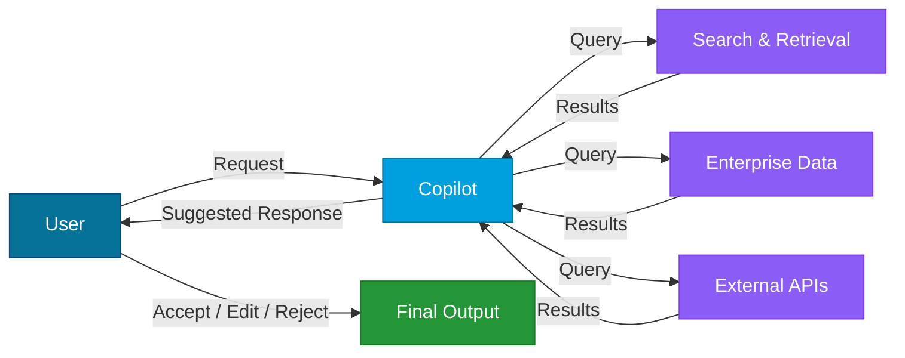
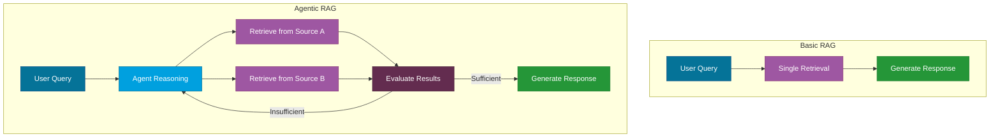

---
tags:
  - Intermediate
  - Patterns
---

# Enterprise AI Patterns

Enterprise AI patterns are proven architectural approaches that organizations use to integrate AI into business processes at scale. Each pattern addresses a different class of problem -- from augmenting human work to fully automating document pipelines.

This page covers five patterns commonly seen in enterprise AI adoption. Understanding these patterns helps teams choose the right approach for their use case and avoid over-engineering or under-investing.

---

## Copilot Pattern

The **Copilot pattern** embeds an AI assistant directly into an existing application or workflow. The AI augments the user's capabilities rather than replacing them. The human stays in control, reviewing and approving AI suggestions before they take effect.

**Key characteristics:**

- AI operates as a "second pair of eyes" within familiar tools
- Human retains final decision-making authority
- Context is drawn from the user's current work (documents, emails, data)
- Responses are grounded in organizational data through retrieval

**Example:** Microsoft 365 Copilot surfaces relevant information, drafts content, and automates tasks inside Word, Excel, Outlook, and Teams -- but the user always reviews and accepts the output.

**When to use the Copilot pattern:**

- Users need AI assistance but must retain control (regulated industries, creative work)
- The AI needs access to organizational context (documents, calendars, databases)
- Trust in AI output needs to be built incrementally

---

## Autonomous Agent Pattern

The **Autonomous Agent pattern** deploys AI that operates independently, making decisions and taking actions with minimal human oversight. The agent perceives its environment, reasons about goals, and executes multi-step plans on its own.

**Key characteristics:**

- Agent operates with a defined goal and a set of available tools
- Decision-making is delegated to the AI within guardrails
- Human oversight shifts from per-action approval to monitoring and exception handling
- Best suited for well-defined, low-risk, repeatable processes

**Risk vs. autonomy spectrum:**

| Level | Description | Example |
|-------|-------------|---------|
| **Human in the loop** | AI suggests, human approves every action | Copilot pattern |
| **Human on the loop** | AI acts independently, human monitors and can intervene | Automated ticket triage |
| **Human out of the loop** | AI operates fully autonomously within defined boundaries | Automated data pipeline cleanup |

**When to use the Autonomous Agent pattern:**

- Tasks are repetitive, well-defined, and low-risk
- Speed of execution matters more than human judgment on each step
- Clear guardrails and rollback mechanisms are in place
- The cost of occasional errors is acceptable and recoverable

!!! warning "Governance matters"
    Autonomous agents require robust monitoring, logging, and kill-switch mechanisms. Always define boundaries for what the agent can and cannot do.

---

## Intelligent Document Processing (IDP)

**Intelligent Document Processing** uses AI to extract, classify, and process information from unstructured and semi-structured documents. It combines multiple AI capabilities -- OCR, natural language processing, classification, and entity extraction -- into an end-to-end pipeline.

**Key capabilities:**

- **Document classification** -- Automatically identify document type (invoice, contract, claim form)
- **Data extraction** -- Pull structured data from unstructured text, tables, and handwriting
- **Validation** -- Cross-check extracted data against business rules and reference data
- **Integration** -- Feed extracted data into downstream business systems

**Common use cases:**

| Use Case | Document Types | Value |
|----------|---------------|-------|
| Claims processing | Claim forms, medical records, receipts | Faster turnaround, fewer errors |
| Invoice automation | Invoices, purchase orders, delivery notes | Reduced manual data entry |
| Contract analysis | Legal contracts, amendments, NDAs | Risk identification, obligation tracking |
| Customer onboarding | ID documents, applications, proof of address | Streamlined verification |

**When to use IDP:**

- High volume of documents requiring manual data entry today
- Documents follow recognizable patterns (even with variation)
- Extracted data feeds into structured business processes
- Accuracy can be validated and exceptions routed to humans

---

## Conversational AI

**Conversational AI** enables natural-language interactions between users and systems. It has evolved from rigid rule-based chatbots to sophisticated virtual agents powered by large language models that understand context, nuance, and intent.

**Evolution of conversational AI:**

| Generation | Approach | Capabilities |
|------------|----------|--------------|
| Rule-based | Decision trees, keyword matching | Fixed responses, narrow scope |
| Intent-based | NLU models, slot filling | Flexible input, structured tasks |
| LLM-powered | Large language models, RAG | Open-ended conversation, reasoning, context awareness |

**Modern conversational AI characteristics:**

- **Context awareness** -- Maintains conversation history and understands references to previous turns
- **Grounded responses** -- Retrieves information from organizational knowledge bases to provide accurate answers
- **Multi-turn reasoning** -- Handles complex requests that require clarification and follow-up
- **Channel flexibility** -- Deploys across web chat, Teams, Slack, voice, and mobile

**When to use Conversational AI:**

- Users need self-service access to information or services
- Queries are diverse and cannot be fully anticipated with static FAQs
- The interaction benefits from a natural, dialogue-based experience
- Escalation to human agents is needed for complex or sensitive cases

!!! tip "Design for failure gracefully"
    Even the best conversational AI will encounter queries it cannot handle. Design clear escalation paths to human agents and set user expectations about what the AI can and cannot do.

---

## Agentic RAG

**Agentic RAG** is the evolution of basic Retrieval-Augmented Generation. In standard RAG, a single retrieval step fetches context before the model generates a response. In Agentic RAG, an AI agent actively decides **what** to retrieve, **when** to retrieve it, and **how** to refine its search -- iterating until it has enough information to produce a high-quality answer.

**Basic RAG vs. Agentic RAG:**

**Key differences from basic RAG:**

| Aspect | Basic RAG | Agentic RAG |
|--------|-----------|-------------|
| Retrieval | Single pass | Iterative, multi-step |
| Sources | One knowledge base | Multiple, heterogeneous sources |
| Query strategy | Fixed query from user input | Agent reformulates queries dynamically |
| Reasoning | Generate after one retrieval | Reason-retrieve-refine loop |
| Complexity handling | Struggles with multi-hop questions | Decomposes complex questions into sub-queries |

**When to use Agentic RAG:**

- Questions require information from multiple sources or documents
- Simple keyword or vector search does not reliably surface the right context
- Accuracy is critical and worth the additional latency
- The domain involves complex, multi-hop reasoning (e.g., "Compare policy X across three jurisdictions")

---

## Choosing the Right Pattern

The right pattern depends on the problem, the users, and the organizational context. Many real-world solutions combine multiple patterns.

| Pattern | Best For | Human Involvement | Complexity |
|---------|----------|-------------------|------------|
| Copilot | Augmenting knowledge workers | High (human in the loop) | Medium |
| Autonomous Agent | Automating repetitive processes | Low (human on/out of the loop) | High |
| IDP | Document-heavy workflows | Medium (validation and exceptions) | Medium |
| Conversational AI | Self-service and support | Medium (escalation paths) | Medium |
| Agentic RAG | Complex information retrieval | Low to medium | High |

---

## References

- [Microsoft Copilot Extensibility](https://learn.microsoft.com/en-us/microsoft-365-copilot/extensibility/)
- [Azure AI Document Intelligence](https://learn.microsoft.com/en-us/azure/ai-services/document-intelligence/)
- [Azure AI Bot Service](https://learn.microsoft.com/en-us/azure/bot-service/)
- [Semantic Kernel Agents](https://learn.microsoft.com/en-us/semantic-kernel/agents/)
- [LangGraph Agentic RAG](https://langchain-ai.github.io/langgraph/concepts/)
