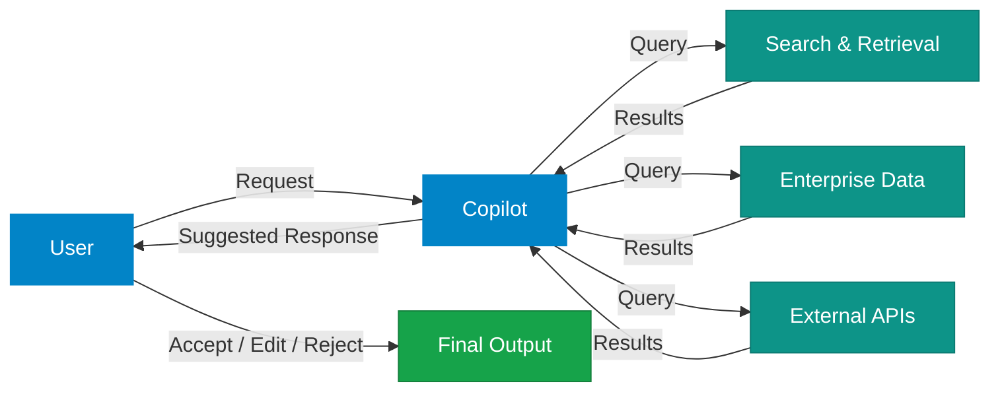
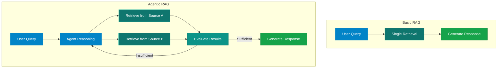

# Enterprise AI patterns

!!! abstract "Understand · 30 min · no code"
    **Before this:** [Agentic AI](../concepts/agentic-ai.md)  ·  **After this:** [Safety and responsible AI](../concepts/safety-and-responsible-ai.md)
    **Hands-on version:** [7 Retrieval](../02-agents/retrieval.md)  ·  **In depth:** [RAG fundamentals](../rag/rag-fundamentals.md)

Enterprise AI patterns are proven architectural approaches that organizations use to integrate AI into business processes at scale. Each pattern addresses a different class of problem — from augmenting human work to fully automating document pipelines.

This page covers the five patterns you will actually meet, how to choose between
them, and — the section most worth your time — why these projects fail, which is
almost never for the reason the post-mortem gives.

---

## Copilot pattern

The **Copilot pattern** embeds an AI assistant directly into an existing application or workflow. The AI augments the user's capabilities rather than replacing them. The human stays in control, reviewing and approving AI suggestions before they take effect.

**Key characteristics:**

- AI operates as a "second pair of eyes" within familiar tools
- Human retains final decision-making authority
- Context is drawn from the user's current work (documents, emails, data)
- Responses are grounded in organizational data through retrieval

**Example:** Microsoft 365 Copilot surfaces relevant information, drafts content, and automates tasks inside Word, Excel, Outlook, and Teams — but the user always reviews and accepts the output.

```mermaid
graph LR
    U[User] -->|Request| C[Copilot]
    C -->|Query| T1[Search & Retrieval]
    C -->|Query| T2[Enterprise Data]
    C -->|Query| T3[External APIs]
    T1 -->|Results| C
    T2 -->|Results| C
    T3 -->|Results| C
    C -->|Suggested Response| U
    U -->|Accept / Edit / Reject| O[Final Output]

    style U fill:#0284c7,stroke:#0284c7,color:#fff
    style C fill:#0284c7,stroke:#0284c7,color:#fff
    style T1 fill:#0d9488,stroke:#0b7a72,color:#fff
    style T2 fill:#0d9488,stroke:#0b7a72,color:#fff
    style T3 fill:#0d9488,stroke:#0b7a72,color:#fff
    style O fill:#16a34a,stroke:#15803d,color:#fff
```

**When to use the Copilot pattern:**

- Users need AI assistance but must retain control (regulated industries, creative work)
- The AI needs access to organizational context (documents, calendars, databases)
- Trust in AI output needs to be built incrementally

---

## Autonomous agent pattern

The **Autonomous Agent pattern** deploys AI that operates independently, making decisions and taking actions with minimal human oversight. The agent perceives its environment, reasons about goals, and executes multi-step plans on its own.

**Key characteristics:**

- Agent operates with a defined goal and a set of available tools
- Decision-making is delegated to the AI within guardrails
- Human oversight shifts from per-action approval to monitoring and exception handling
- Best suited for well-defined, low-risk, repeatable processes

**Risk vs. autonomy spectrum:**

```mermaid
graph LR
    A[Human in the Loop] --> B[Human on the Loop] --> C[Human out of the Loop]

    style A fill:#16a34a,stroke:#15803d,color:#fff
    style B fill:#0284c7,stroke:#0284c7,color:#fff
    style C fill:#0d9488,stroke:#0b7a72,color:#fff
```

| Level | Description | Example |
|-------|-------------|---------|
| **Human in the loop** | AI suggests, human approves every action | Copilot pattern |
| **Human on the loop** | AI acts independently, human monitors and can intervene | Automated ticket triage |
| **Human out of the loop** | AI operates fully autonomously within defined boundaries | Automated data pipeline cleanup |

**When to use the Autonomous Agent pattern:**

- Tasks are repetitive, well-defined, and low-risk
- Speed of execution matters more than human judgment on each step
- Clear guardrails and rollback mechanisms are in place
- The cost of occasional errors is acceptable and recoverable

!!! warning "Governance matters"
    Autonomous agents require robust monitoring, logging, and kill-switch mechanisms. Always define boundaries for what the agent can and cannot do.

---

## Intelligent document processing (IDP)

**Intelligent Document Processing** uses AI to extract, classify, and process information from unstructured and semi-structured documents. It combines multiple AI capabilities — OCR, natural language processing, classification, and entity extraction — into an end-to-end pipeline.

**Key capabilities:**

- **Document classification** — Automatically identify document type (invoice, contract, claim form)
- **Data extraction** — Pull structured data from unstructured text, tables, and handwriting
- **Validation** — Cross-check extracted data against business rules and reference data
- **Integration** — Feed extracted data into downstream business systems

**Common use cases:**

| Use Case | Document Types | Value |
|----------|---------------|-------|
| Claims processing | Claim forms, medical records, receipts | Faster turnaround, fewer errors |
| Invoice automation | Invoices, purchase orders, delivery notes | Reduced manual data entry |
| Contract analysis | Legal contracts, amendments, NDAs | Risk identification, obligation tracking |
| Customer onboarding | ID documents, applications, proof of address | Streamlined verification |

**When to use IDP:**

- High volume of documents requiring manual data entry today
- Documents follow recognizable patterns (even with variation)
- Extracted data feeds into structured business processes
- Accuracy can be validated and exceptions routed to humans

---

## Conversational AI

**Conversational AI** enables natural-language interactions between users and systems. It has evolved from rigid rule-based chatbots to sophisticated virtual agents powered by large language models that understand context, nuance, and intent.

**Evolution of conversational AI:**

| Generation | Approach | Capabilities |
|------------|----------|--------------|
| Rule-based | Decision trees, keyword matching | Fixed responses, narrow scope |
| Intent-based | NLU models, slot filling | Flexible input, structured tasks |
| LLM-powered | Large language models, RAG | Open-ended conversation, reasoning, context awareness |

**Modern conversational AI characteristics:**

- **Context awareness** — Maintains conversation history and understands references to previous turns
- **Grounded responses** — Retrieves information from organizational knowledge bases to provide accurate answers
- **Multi-turn reasoning** — Handles complex requests that require clarification and follow-up
- **Channel flexibility** — Deploys across web chat, Teams, Slack, voice, and mobile

**When to use Conversational AI:**

- Users need self-service access to information or services
- Queries are diverse and cannot be fully anticipated with static FAQs
- The interaction benefits from a natural, dialogue-based experience
- Escalation to human agents is needed for complex or sensitive cases

!!! tip "Design for failure gracefully"
    Even the best conversational AI will encounter queries it cannot handle. Design clear escalation paths to human agents and set user expectations about what the AI can and cannot do.

---

## Agentic RAG

**Agentic RAG** is the evolution of basic Retrieval-Augmented Generation. In standard RAG, a single retrieval step fetches context before the model generates a response. In Agentic RAG, an AI agent actively decides **what** to retrieve, **when** to retrieve it, and **how** to refine its search — iterating until it has enough information to produce a high-quality answer.

**Basic RAG vs. Agentic RAG:**

```mermaid
graph TD
    subgraph Basic RAG
        Q1[User Query] --> R1[Single Retrieval]
        R1 --> G1[Generate Response]
    end

    subgraph Agentic RAG
        Q2[User Query] --> A[Agent Reasoning]
        A --> R2[Retrieve from Source A]
        A --> R3[Retrieve from Source B]
        R2 --> E[Evaluate Results]
        R3 --> E
        E -->|Insufficient| A
        E -->|Sufficient| G2[Generate Response]
    end

    style Q1 fill:#0284c7,stroke:#0284c7,color:#fff
    style R1 fill:#0f766e,stroke:#14b8a6,color:#fff
    style G1 fill:#16a34a,stroke:#15803d,color:#fff
    style Q2 fill:#0284c7,stroke:#0284c7,color:#fff
    style A fill:#0284c7,stroke:#0284c7,color:#fff
    style R2 fill:#0f766e,stroke:#14b8a6,color:#fff
    style R3 fill:#0f766e,stroke:#14b8a6,color:#fff
    style E fill:#0d9488,stroke:#0b7a72,color:#fff
    style G2 fill:#16a34a,stroke:#15803d,color:#fff
```

**Key differences from basic RAG:**

| Aspect | Basic RAG | Agentic RAG |
|--------|-----------|-------------|
| Retrieval | Single pass | Iterative, multi-step |
| Sources | One knowledge base | Multiple, heterogeneous sources |
| Query strategy | Fixed query from user input | Agent reformulates queries dynamically |
| Reasoning | Generate after one retrieval | Reason-retrieve-refine loop |
| Complexity handling | Struggles with multi-hop questions | Decomposes complex questions into sub-queries |

**When to use Agentic RAG:**

- Questions require information from multiple sources or documents
- Simple keyword or vector search does not reliably surface the right context
- Accuracy is critical and worth the additional latency
- The domain involves complex, multi-hop reasoning (e.g., "Compare policy X across three jurisdictions")

---

## Choosing the right pattern

The right pattern depends on the problem, the users, and the organizational context. Many real-world solutions combine multiple patterns.

| Pattern | Best for | Human involvement | Complexity | Time to value |
|---|---|---|---|---|
| Copilot | Augmenting knowledge workers | High — human in the loop | Medium | Weeks |
| Intelligent document processing | Document-heavy workflows | Medium — validation and exceptions | Medium | Weeks to months |
| Conversational AI | Self-service and support | Medium — escalation paths | Medium | Months |
| Agentic RAG | Complex information retrieval | Low to medium | High | Months |
| Autonomous agent | Automating repetitive processes | Low — human on or out of the loop | High | Months, often longer |

### If you are choosing your first one

Take them roughly in that order. It is not arbitrary: it runs from most
forgiving to least.

**Copilot first, nearly always.** A person reviews every output, so a wrong
answer is a rejected suggestion rather than an incident. You learn what the
model is good at on your data at the lowest possible stakes, and the same
retrieval layer you build for it is reusable by everything after.

**Then document processing**, if you have the volume. It is narrow, the output
is checkable against the source, and the value is easy to count.

**Autonomous agents last.** Not because they do not work, but because they are
where every earlier weakness — retrieval quality, permissions, evaluation,
observability — becomes an incident rather than an annoyance. An organisation
that cannot yet measure whether its copilot is helping cannot safely run an
agent.

!!! tip "The pattern is a starting point, not a category"
    Real systems mix them. A copilot with an agentic retrieval layer is common
    and sensible. Choose the human-involvement level per action, not per
    system — see
    [autonomy is a dial](../concepts/ai-agents.md#autonomy-is-a-dial-not-a-switch).

---

## Why these projects fail

Little of this is about the model, which is why post-mortems that blame model
choice tend to be wrong.

**There is no definition of success.** The most common failure by a distance. A
pilot ships, everyone agrees it is impressive, and nobody can say whether it
helped. Without a number agreed *before* the build — hours saved, deflection
rate, error rate against today's manual process — the project cannot be
defended at budget time and quietly ends. Decide how you will measure it while
it is still cheap to change what you are measuring.

**The data was not ready.** Retrieval quality is bounded by the corpus. If the
authoritative document is one of four near-identical copies, three of them
outdated, no amount of model quality fixes it. This is usually discovered late,
and it is usually the real reason for poor answers.

**Permissions were an afterthought.** The demo indexes everything, works
beautifully, and then cannot go live because it will answer questions about
salaries. Retrofitting per-user access control into a retrieval layer is close
to a rebuild. Design it in from the first index — see
[retrieval and permissions](../concepts/retrieval-and-data.md#retrieval-and-permissions).

**It was built for the demo, not the workflow.** A separate chat interface that
people must remember to visit gets used for two weeks. The successful pattern is
almost always AI inside the tool people already have open, which is precisely
why the copilot pattern dominates.

**Nobody owns it after launch.** These systems drift: documents change, usage
patterns change, model versions change underneath you. Without an owner and a
regular quality check, a system that worked at launch degrades invisibly,
because nothing throws an error when answers get worse.

**The 80% that finishes the job was never scoped.** Demos handle the common
case. Production is exceptions, malformed inputs, edge cases and the long tail
of "what happens when it cannot answer". Budget for it explicitly, because it is
the majority of the work and it never appears in the estimate.

!!! warning "Pilot purgatory"
    The characteristic failure of enterprise AI is not a system that breaks. It
    is a portfolio of impressive pilots, none of which ever reaches production,
    because each stalls on the same unowned problems: data quality, access
    control, and no agreed measure of success.

    Those three are organisational, not technical, and they are cheaper to fix
    once for the organisation than repeatedly per project.

---

## Go deeper

- [Microsoft 365 Copilot extensibility](https://learn.microsoft.com/en-us/microsoft-365/copilot/extensibility/) — the copilot pattern where most enterprises actually meet it first.
- [Azure AI Document Intelligence](https://learn.microsoft.com/en-us/azure/ai-services/document-intelligence/) — the extraction layer under any document-processing pattern.
- [Azure AI Bot Service](https://learn.microsoft.com/en-us/azure/bot-service/) — channel plumbing for conversational AI, which is unglamorous and always underestimated.
- [Foundry Agent Service](https://learn.microsoft.com/en-us/azure/foundry/agents/overview) — the autonomous-agent pattern as a managed runtime.
- [RAG fundamentals](../rag/rag-fundamentals.md) — the agentic RAG pattern above, in depth, including the failure modes at each stage.
