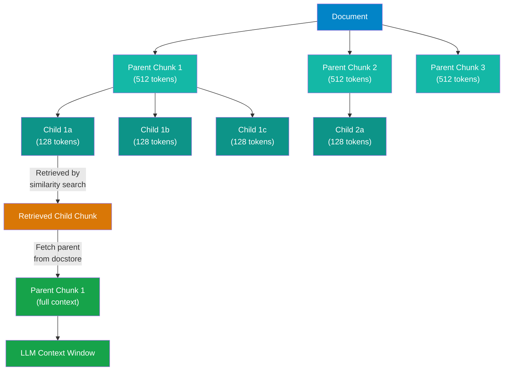
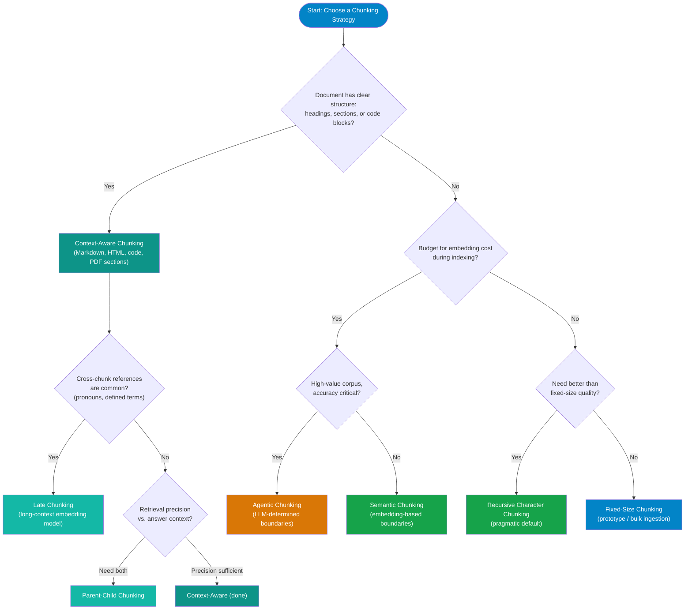

# Chunking Strategies

!!! abstract "What You'll Learn"
    This page covers eight document chunking strategies used in production RAG systems: fixed-size, sentence, recursive character, semantic, context-aware, parent-child, late chunking, and agentic. Each section covers how it works, when to use it, and the trade-offs involved. A decision flowchart and chunk size guidelines table at the end give you a practical starting point for any use case.

---

## Why Chunking Matters

Every document in your knowledge base must be split into chunks before embedding and indexing. The way you split documents has a larger impact on retrieval quality than almost any other decision in the RAG pipeline.

The core tension is straightforward:

- **Chunks too small** — each vector represents only a fragment of a thought. Retrieval returns pieces that lack the context needed to answer the question. The answer is scattered across five retrieved chunks instead of being in one.
- **Chunks too large** — each vector averages across many topics. Similarity scores are diluted. Irrelevant content fills the context window alongside what you actually needed.

!!! tip "The Goldilocks Problem"
    There is no universally correct chunk size. The right size depends on your document type, your query patterns, your embedding model's token limit, and how much context your LLM needs to generate a good answer. Use evaluation metrics (context recall, faithfulness) to validate chunk size decisions — don't rely on intuition alone.

---

## Strategy 1 — Fixed-Size Chunking

Split documents into chunks of N tokens or N characters, with optional overlap between adjacent chunks.

**How it works:** a sliding window moves through the document producing chunks of equal size. A 20% overlap means the last 20% of one chunk repeats as the first 20% of the next, reducing the chance of splitting a key sentence across chunk boundaries.

| | Detail |
|---|---|
| **Unit** | Tokens or characters |
| **Overlap** | Typically 10–20% of chunk size |
| **Speed** | Very fast — no NLP processing |
| **Quality** | Lowest — no respect for sentence or paragraph boundaries |

**Pros and cons:**

| Pros | Cons |
|---|---|
| Trivial to implement | Splits sentences mid-thought |
| Predictable storage and cost | No semantic coherence |
| Fast indexing | Overlap creates duplicate content |
| Works with any document type | Poor for structured documents |

**When to use:** rapid prototyping, homogeneous plain-text corpora, or when you need to index very large volumes with minimal latency and plan to improve later.

---

## Strategy 2 — Sentence Chunking

Use NLP sentence boundary detection to split at natural sentence endings rather than arbitrary character counts.

**How it works:** libraries like NLTK (`sent_tokenize`) or spaCy identify sentence boundaries using punctuation, capitalization, and language models. Chunks are formed by grouping N consecutive sentences, with M sentences of overlap.

This produces chunks with better internal coherence than fixed-size chunking — sentences are complete thoughts. The problem is that sentence chunks are often too short (50–100 tokens) and lose cross-sentence context; a sentence may reference pronouns or entities defined several sentences earlier.

**When to use:** FAQ documents, customer support transcripts, simple prose where sentences are self-contained. Less suited to technical documentation or regulatory text where ideas span multiple sentences.

---

## Strategy 3 — Recursive Character Chunking

Split using a hierarchy of separators, trying larger structural units first and falling back to smaller ones only when needed.

**How it works:** LangChain's `RecursiveCharacterTextSplitter` attempts to split on `\n\n` (paragraphs) first, then `\n` (lines), then `.` (sentences), then ` ` (words), then individual characters. A chunk is only created when no larger separator fits within the target size.

```python
from langchain.text_splitter import RecursiveCharacterTextSplitter

splitter = RecursiveCharacterTextSplitter(
    chunk_size=512,
    chunk_overlap=64,
    separators=["\n\n", "\n", ". ", " ", ""]
)
chunks = splitter.split_text(document_text)
```

The result is chunks that respect paragraph and sentence boundaries where possible, falling back to word splits only for unusually long paragraphs. This is the best general-purpose baseline and should be the default starting point for most projects.

**When to use:** unstructured prose, mixed-format documents, any situation where you want better-than-fixed-size quality with minimal added complexity. This is the pragmatic default.

---

## Strategy 4 — Semantic Chunking

Find chunk boundaries by detecting topic shifts using embedding similarity rather than syntactic rules.

**How it works:** embed each sentence individually. For each adjacent sentence pair, compute the cosine similarity. A sharp drop in similarity signals a topic boundary — a good place to start a new chunk. LangChain's `SemanticChunker` supports three breakpoint detection methods: percentile, standard deviation, and interquartile range.

```python
from langchain_experimental.text_splitter import SemanticChunker
from langchain_openai import OpenAIEmbeddings

chunker = SemanticChunker(
    OpenAIEmbeddings(),
    breakpoint_threshold_type="percentile",
    breakpoint_threshold_amount=95
)
chunks = chunker.create_documents([document_text])
```

Chunk boundaries align with actual topic transitions, not arbitrary character counts. Chunks are more semantically coherent.

!!! warning "Semantic Chunking is Expensive"
    Semantic chunking requires embedding every sentence in every document during indexing — not just the final chunks. For a 1,000-word document split into ~50 sentences, that is 50 embedding API calls where fixed-size would require 3–5. Expect 2–5× the indexing cost and time compared to recursive character chunking. Reserve this for high-value corpora where retrieval quality is worth the cost.

**When to use:** dense technical documents with clearly distinct sections, research papers, long-form articles. Not cost-effective for high-volume ingestion pipelines.

---

## Strategy 5 — Context-Aware / Document-Aware Chunking

Apply different splitting rules based on the document's structure and type rather than treating all documents identically.

**How it works:** parse the document's structural elements before chunking. For Markdown, split on heading boundaries (`##`, `###`). For HTML, split on `<section>`, `<article>`, and `<p>` tags. For code files, split on function and class definitions. For PDFs with detected layout, split on page sections rather than raw text flow.

Different document types warrant different strategies:

| Document Type | Recommended Approach |
|---|---|
| Markdown / RST | Split on heading levels; each section becomes a chunk |
| HTML | Parse DOM; split on `<section>`, `<article>`, `<div>` with semantic class names |
| PDF (text-based) | Detect headings by font size/weight; split on section boundaries |
| PDF (scanned) | OCR first, then treat as plain text with recursive splitting |
| Source code | Split on function/method/class definitions using AST parsing |
| Tables | Keep entire table as single chunk; do not split mid-row |
| JSON / XML | Split on top-level array elements or key sections |

!!! tip "Markdown Headers Are Natural Boundaries"
    If your knowledge base is primarily Markdown (documentation sites, Notion exports, GitHub wikis), splitting on heading boundaries is almost always the right starting point. Each `##` section represents a complete topic. LangChain's `MarkdownHeaderTextSplitter` handles this cleanly and preserves the header as metadata on each chunk.

**When to use:** structured documentation, mixed-format corpora, any situation where document structure carries semantic meaning. This is the right default for documentation-heavy knowledge bases.

---

## Strategy 6 — Parent-Child Chunking

Maintain two levels of granularity: large parent chunks for context richness and small child chunks for retrieval precision.

**How it works:** index small child chunks (128–256 tokens) for retrieval — their vectors represent focused topics, producing precise similarity matches. But at generation time, instead of passing the child chunk to the LLM, fetch its parent chunk (512–1024 tokens) to give the model the surrounding context it needs.



This pattern requires a document store (separate from your vector database) that maps child chunk IDs to their parent chunks. LlamaIndex has native support for this via `ParentDocumentRetriever`. LangChain's `ParentDocumentRetriever` in `langchain.retrievers` implements the same pattern.

**When to use:** documents where context around a relevant passage matters for answering the question — technical manuals, legal documents, API documentation, any corpus where isolated paragraphs lose meaning without surrounding context.

---

## Strategy 7 — Late Chunking

Embed the full document first, then chunk the resulting contextual embeddings rather than chunking the raw text first.

**How it works:** pass the entire document through a long-context embedding model in one forward pass. Every token's embedding is contextually aware of the full document. After the forward pass, pool tokens into chunks. Because pooling happens after the transformer's attention layers have already processed the full context, each chunk's vector reflects its meaning within the document — not in isolation.

Standard chunking loses cross-chunk context: a pronoun in chunk 3 that refers to an entity introduced in chunk 1 will be embedded without knowledge of that entity. Late chunking solves this because the pronoun was attended to by all other tokens — including the entity — during the single forward pass.

??? note "How Late Chunking Works"
    In a standard RAG pipeline: `text → chunk → embed each chunk independently`. The embedding model sees only the chunk's text.

    In late chunking: `text → embed full document (long-context model) → chunk the token embeddings`.

    The critical difference is **when attention is applied**. In standard chunking, each chunk is encoded without attending to tokens outside its boundaries. In late chunking, all tokens attend to all other tokens during the single full-document forward pass. The resulting per-token embeddings are then pooled into chunk-level representations that have already "seen" the rest of the document.

    This is particularly valuable for:

    - Documents with heavy pronoun/entity reference across sections
    - Technical documentation where a term defined in section 1 is used throughout
    - Legal text where defined terms appear far from their definitions
    - Narrative content where understanding any passage depends on prior context

    The trade-off is that you need a model with a large enough context window to process the full document. Jina AI's `jina-embeddings-v2` (8,192 tokens) and ColBERT-based models support this. For very long documents, a sliding window approach can extend coverage beyond the model's context limit.

Jina AI developed and named this approach; their ColBERT-based models are the current reference implementation.

**When to use:** documents where cross-chunk references are common, when you have access to a long-context embedding model, and when retrieval quality justifies the longer indexing time compared to standard chunking.

---

## Strategy 8 — Agentic Chunking

Use an LLM to read the document and determine chunk boundaries based on propositional content rather than syntactic or statistical signals.

**How it works:** the LLM is prompted to identify self-contained propositions — statements that can stand alone and be verified independently. Chunks are defined as groups of related propositions. The model may also generate a summary or title for each chunk to improve retrieval.

This produces the highest-quality chunks of any strategy because the boundaries reflect genuine conceptual structure. The LLM can recognize that two adjacent paragraphs are actually part of the same argument, or that a single paragraph contains two distinct claims that should be in separate chunks.

The cost is significant: every document requires one or more LLM calls during indexing. For a large corpus, this can be 100–1000× more expensive than fixed-size chunking and dramatically slower. Agentic chunking is appropriate for high-value, low-volume corpora — legal contracts, clinical guidelines, regulatory filings — where accuracy justifies the cost.

**When to use:** high-stakes, low-volume document sets where chunk quality is the dominant concern and cost is secondary.

---

## Chunk Overlap

Overlap means the last N tokens of one chunk are repeated as the first N tokens of the next. This reduces the chance of splitting a critical sentence or phrase across chunk boundaries.

!!! note "Overlap Example"
    With chunk size 256 and overlap 51 (~20%):

    ```
    Chunk 1: tokens 0–255
    Chunk 2: tokens 204–459   ← starts 51 tokens before Chunk 1 ends
    Chunk 3: tokens 408–663
    ```

    A sentence that straddles the 255/256 boundary appears in full in at least one of the two chunks.

Typical overlap is 10–20% of the chunk size. Higher overlap means more redundant storage and slightly diluted embeddings; lower overlap increases the risk of boundary splits. For most use cases, 15% is a reasonable default.

Overlap is less important when using sentence or semantic chunking because those strategies split at natural boundaries by design.

---

## Chunk Size Guidelines

| Use Case | Recommended Size | Reasoning |
|---|---|---|
| Q&A over documentation | 256–512 tokens | Each chunk should answer one question; larger chunks dilute similarity scores |
| Summarization | 1,024–2,048 tokens | Need enough content to summarize; larger context produces better summaries |
| Source code | Full function or method | Splitting mid-function destroys context; functions are the natural unit |
| Legal / regulatory text | 500–1,000 tokens | Clauses and sections are the semantic units; don't split across defined terms |
| Conversational / FAQ | 128–256 tokens | Short Q&A pairs; self-contained by design |
| Technical manuals | 512–768 tokens | Section-level granularity; use parent-child if context is important |
| News / articles | 256–512 tokens | Paragraph-level granularity; each paragraph covers one point |

These are starting points. Measure context recall and faithfulness scores against your actual query set and adjust from there.

---

## Decision Flowchart



---

## References

- [Pinecone: Chunking Strategies for LLM Applications](https://www.pinecone.io/learn/chunking-strategies/) — practical breakdown of chunking approaches with retrieval quality analysis
- [Jina AI: Late Chunking in Long-Context Embedding Models](https://jina.ai/news/late-chunking-in-long-context-embedding-models/) — the original explanation of late chunking from the team that developed it

---

## Next Steps

- [Embeddings](embeddings.md) — understanding what your embedding model does with each chunk helps you make better chunking decisions
- [Vector Databases](vector-databases.md) — how chunks and their vectors are stored, indexed, and queried
- [RAG Fundamentals](rag-fundamentals.md) — see how chunking fits into the full RAG pipeline and where it interacts with retrieval quality
