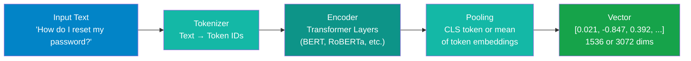

# Embeddings

!!! abstract "What You'll Learn"
    This page explains how embedding models convert text into vectors, what happens inside the model at each stage, how to compare the major commercial and open-source options, and what production concerns — storage cost, batching, caching, and model consistency — you need to address before going to production.

---

## What Are Embeddings?

An embedding is a fixed-length list of numbers (a vector) that represents the meaning of a piece of text. The key property is that **similar meanings produce vectors that are close together** in the high-dimensional space, while dissimilar meanings produce vectors that are far apart.

This geometric proximity is what makes retrieval possible: when you search for documents related to a query, you are finding vectors whose angle or distance is smallest relative to the query vector.

**Intuition through examples:**

| Text A | Text B | Closeness |
|---|---|---|
| "How do I cancel my subscription?" | "Steps to end my membership" | Very close |
| "How do I cancel my subscription?" | "What payment methods are accepted?" | Somewhat close (same domain) |
| "How do I cancel my subscription?" | "The history of the Roman Empire" | Very distant |
| "Python list comprehension" | "Python array filtering syntax" | Very close |
| "Python list comprehension" | "Grilled chicken recipe" | Very distant |

The model has no explicit rule saying "cancel" and "end" are synonyms. It learned this relationship from the statistical patterns in the training corpus.

---

## How Embeddings Are Generated

**Tokenizer** — splits the input string into tokens (subword units). "cancellation" might become ["cancel", "##lation"]. The tokenizer also enforces the model's maximum input length.

**Encoder** — a stack of transformer layers processes the token sequence. Each layer updates token representations based on attention weights that capture relationships between all tokens in the sequence.

**Pooling** — collapses the per-token representations into a single fixed-size vector. Common strategies:

- **CLS token pooling** — use the representation of the special `[CLS]` token prepended to every input (BERT-style models)
- **Mean pooling** — average all token representations; often outperforms CLS pooling for semantic similarity tasks
- **Weighted mean pooling** — like mean pooling but weights tokens by their position or importance

**Output vector** — a dense vector of 256–3072 floating-point numbers depending on the model. This vector is what gets stored in your vector database.

---

## Embedding Model Comparison

| Model | Provider | Dimensions | Multilingual | Max Tokens | Notes |
|---|---|---|---|---|---|
| `text-embedding-3-large` | OpenAI | 3072 (reducible) | Limited | 8,191 | Best quality in the OpenAI family; supports Matryoshka dimension reduction |
| `text-embedding-3-small` | OpenAI | 1536 (reducible) | Limited | 8,191 | 5× cheaper than large; good default for most use cases |
| `text-embedding-ada-002` | OpenAI | 1536 | Limited | 8,191 | Legacy; prefer text-embedding-3-small for new projects |
| `embed-v4.0` | Cohere | 1024 | Yes (100+ langs) | 128,000 | Multimodal (text + image); input type separation; strong multilingual |
| `embed-english-v3.0` | Cohere | 1024 | No | 512 | Optimized for English; strong MTEB scores |
| `BAAI/bge-large-en-v1.5` | BAAI (HuggingFace) | 1024 | No | 512 | Top open-source English model; MIT license |
| `BAAI/bge-m3` | BAAI (HuggingFace) | 1024 | Yes (100+ langs) | 8,192 | Open-source multilingual; strong MTEB performance |
| `all-mpnet-base-v2` | sentence-transformers | 768 | No | 384 | Solid local option; widely used baseline |
| `nomic-embed-text-v1.5` | Nomic | 768 (reducible) | No | 8,192 | Open-source; supports Matryoshka; Apache 2.0 |

!!! note "Check the MTEB Leaderboard"
    The [MTEB leaderboard](https://huggingface.co/spaces/mteb/leaderboard) (Massive Text Embedding Benchmark) is the standard reference for comparing embedding models across retrieval, classification, clustering, and semantic similarity tasks. Rankings shift as new models are released. Check it before committing to a model for a new project.

---

## Input Types Matter

Some embedding providers distinguish between the type of content being embedded. Cohere and Voyage AI expose this as an explicit parameter; OpenAI handles it implicitly through model training.

| Input Type | When to Use | Example |
|---|---|---|
| `search_document` | When embedding content to store in the index | Chunks from your knowledge base |
| `search_query` | When embedding the user's query at retrieval time | "What is the refund policy?" |
| `classification` | Text going into a classification pipeline | Customer support ticket |
| `clustering` | Text being grouped by topic | News articles |

Using `search_document` for indexing and `search_query` for queries is not optional with Cohere — it's part of the model's design. The model was trained with asymmetric embeddings: queries and documents are mapped to nearby but distinct regions of the embedding space.

!!! tip "Always Match Input Types"
    If you index with `search_document` and retrieve with `search_document` instead of `search_query`, retrieval quality drops measurably. This is one of the most common configuration mistakes in Cohere-based RAG pipelines.

---

## Choosing the Right Model

=== "Use OpenAI"

    OpenAI's `text-embedding-3-small` and `text-embedding-3-large` are the default choice when:

    - You are already using Azure OpenAI for your LLM and want to minimize vendor surface area
    - You need managed identity, private endpoints, and enterprise compliance (Azure OpenAI Service)
    - Your content is primarily English
    - You want predictable, high-quality results without managing infrastructure
    - `text-embedding-3-large` with dimension reduction (Matryoshka) gives you flexibility to trade storage cost for quality at query time

    **Use `text-embedding-3-small` first** — it is 5× cheaper than large and performs well enough for most retrieval tasks. Only move to large if evaluation shows a meaningful quality gap.

=== "Use Cohere"

    Cohere's `embed-v4.0` is the right choice when:

    - Your content or users span multiple languages (100+ languages, including low-resource ones)
    - You need multimodal embeddings (text + images in the same index)
    - The input type distinction (`search_document` / `search_query`) gives you a retrieval quality edge that matters
    - You are building on Cohere's broader platform (Command, Rerank, etc.) and want a consistent vendor

    `embed-v4.0`'s 128,000 token context window also means you can embed significantly longer documents without chunking, which can be an advantage for certain use cases.

=== "Use Open-Source"

    Open-source embedding models are the right choice when:

    - You cannot send data to external APIs (air-gapped environments, strict data residency)
    - You need to minimize per-token inference cost at scale (self-hosted GPU)
    - You want to fine-tune the embedding model on your domain-specific corpus
    - You are building a research prototype and want full control over the stack

    `BAAI/bge-large-en-v1.5` for English-only, `BAAI/bge-m3` for multilingual. Both run well on a single A10G or can be deployed via Azure ML or Hugging Face Inference Endpoints.

    The quality gap between top open-source models and OpenAI `text-embedding-3-small` is small on general benchmarks. On specialized domains with fine-tuning, open-source can exceed commercial options.

---

## Dimension Reduction — Matryoshka Embeddings

OpenAI's `text-embedding-3` models and some open-source models (Nomic, `bge-m3`) support **Matryoshka Representation Learning** (MRL). The model is trained so that the first N dimensions of a 3072-dim vector are themselves a valid, lower-quality embedding.

This means you can reduce a 3072-dim vector to 256, 512, or 1024 dimensions after the fact — without re-embedding — and still get useful retrieval performance. The trade-off is quality vs. storage and query latency.

Practical use: embed at full 3072 dimensions during indexing. If storage or query latency becomes a concern, truncate vectors at query time and compare evaluation metrics to find the minimum dimensions that meet your quality bar.

---

## Production Considerations

**Storage cost**

Each float32 value takes 4 bytes. A 1536-dim vector is 6 KB. At 1 million vectors, that is approximately 6 GB just for the raw vectors — not counting metadata, indexes, or replicas.

| Dimensions | 1M vectors (float32) | 10M vectors |
|---|---|---|
| 256 | ~1 GB | ~10 GB |
| 768 | ~3 GB | ~30 GB |
| 1536 | ~6 GB | ~60 GB |
| 3072 | ~12 GB | ~120 GB |

Factor this into your vector database tier selection. Many managed vector databases charge by stored vector count and dimensions.

**Batch processing for throughput**

Embedding APIs have rate limits measured in tokens per minute (TPM). For bulk indexing, always batch requests — most APIs accept 100–2,048 inputs per call. LangChain, LlamaIndex, and the OpenAI SDK all handle batching internally if you use their document loaders.

For large corpora (millions of documents), run indexing as an offline batch job rather than inline with ingestion. A queue-based architecture (Azure Service Bus + Azure Functions) handles retries, backpressure, and rate-limit recovery cleanly.

**Caching strategies**

Query embeddings can be cached when the same or semantically identical queries are frequent. A simple Redis cache keyed on normalized query text eliminates repeat embedding API calls for popular queries. At high request volume, this reduces latency and cost significantly.

Do not cache document embeddings in memory — store them in the vector database where they belong.

!!! warning "Never Mix Embedding Models"
    Your index and your query must use the same embedding model, same version, and same input type configuration. Mixing models — even different versions of the same model — produces vectors in different spaces that cannot be meaningfully compared. If you need to upgrade embedding models, you must re-embed your entire index. Plan for this operationally: version your indexes, and keep the old index live during migration.

---

## References

- [OpenAI Embeddings Guide](https://platform.openai.com/docs/guides/embeddings) — covers model selection, dimension reduction, and the Matryoshka approach
- [Cohere Embed Documentation](https://docs.cohere.com/docs/cohere-embed) — input type explanation, multilingual support, and multimodal capabilities
- [MTEB Leaderboard](https://huggingface.co/spaces/mteb/leaderboard) — current benchmark rankings across all major embedding models

---

## Next Steps

- [Chunking Strategies](chunking-strategies.md) — how you chunk documents directly affects what your embedding model sees and what it can represent
- [Vector Databases](vector-databases.md) — where to store, index, and query the vectors your embedding model produces
