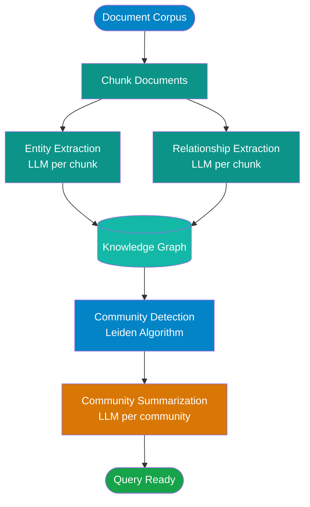
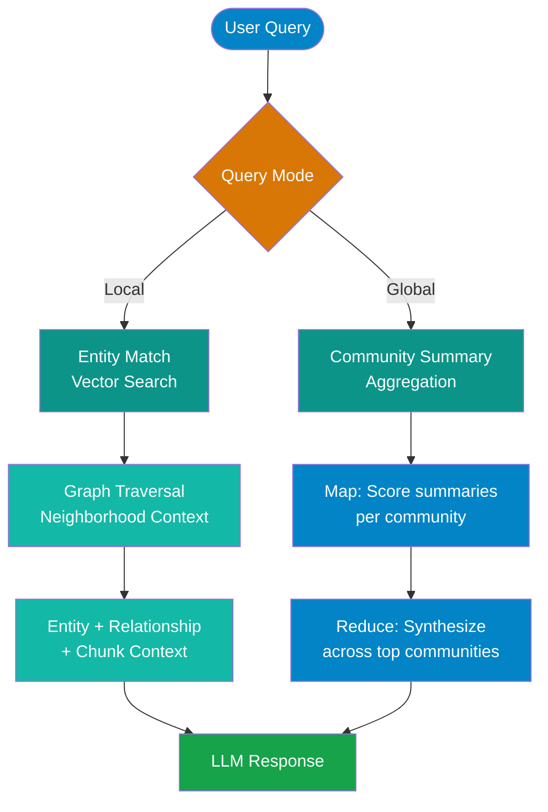

# GraphRAG

!!! abstract
    GraphRAG extends retrieval-augmented generation by building a knowledge graph — entities, relationships, and community summaries — on top of your document corpus. This page covers the architecture, indexing pipeline, local vs global query modes, available implementations, and the real cost and complexity tradeoffs before you commit to it.

!!! warning
    GraphRAG is significantly more expensive to index than standard RAG. Every document requires multiple LLM calls for entity extraction, relationship extraction, and community summarization. Read the [Limitations](#limitations) section before starting a project with it.

---

## Why Standard RAG Falls Short

Standard RAG retrieves text chunks based on semantic similarity. That works well for direct factual lookups — "What is the refund policy?" or "What does function X do?" — but breaks down for questions that require synthesizing information across many documents or reasoning about relationships.

**Questions standard RAG handles poorly:**

- "What are the main themes across all 200 research papers in this corpus?"
- "How does the acquisition of Company X relate to the restructuring described in the annual reports?"
- "What are all the risk factors mentioned across these insurance filings, and how do they cluster?"

The core problem is **multi-hop reasoning**: answering these questions requires connecting information from multiple, non-adjacent chunks that wouldn't rank highly for any single similarity search.

| Question Type | Standard RAG | GraphRAG |
|---|---|---|
| Direct factual lookup | Strong | Strong |
| Single-document summary | Strong | Strong |
| Cross-document theme synthesis | Weak | Strong |
| Entity relationship mapping | Weak | Strong |
| Holistic corpus overview | Fails | Strong |
| Real-time or frequently updated data | Strong | Weak |
| Small corpus (<50 docs) | Adequate | Overkill |

---

## What GraphRAG Adds

Where standard RAG stores text chunks + vectors, GraphRAG builds a richer intermediate representation:

- **Entities** — named things extracted from your documents (people, organizations, locations, concepts)
- **Relationships** — typed connections between entities ("Company X _acquired_ Company Y", "Dr. Smith _authored_ Study Z")
- **Communities** — groups of densely connected entities, detected algorithmically (Leiden algorithm)
- **Community summaries** — LLM-generated natural language summaries of what each community represents

This knowledge graph sits between your raw documents and the LLM, enabling queries that traverse relationships rather than just matching text similarity.

---

## Microsoft GraphRAG Architecture

### Phase 1 — Indexing Pipeline

The indexing pipeline transforms raw documents into a queryable knowledge graph. This is the expensive part.

**Entity Extraction** — For each document chunk, the LLM is prompted to extract named entities (people, organizations, locations, concepts) and their descriptions. This is one LLM call per chunk.

**Relationship Extraction** — A second LLM call per chunk extracts typed relationships between the entities found. Result: a directed graph of `(entity_a) -[relationship]-> (entity_b)`.

**Community Detection** — The [Leiden algorithm](https://www.nature.com/articles/s41598-019-41695-z) runs on the entity-relationship graph to identify clusters of densely connected entities. These become "communities" — coherent topical groupings.

**Community Summarization** — Each community gets a natural language summary generated by the LLM. These summaries are what global queries actually search over.

!!! note
    For a 1,000-document corpus you might expect 5,000–20,000 LLM calls during indexing, depending on document length and entity density. At GPT-4o pricing, this can cost $50–500+ per full index build. Plan accordingly and test on a sample first.

### Phase 2 — Query Pipeline

GraphRAG supports two fundamentally different query modes:

**Local search** starts with a vector similarity lookup against entities, then traverses the graph neighborhood — pulling in related entities, relationships, and the source text chunks. This gives targeted, relationship-aware context for specific entity questions.

**Global search** ignores local graph traversal entirely. Instead, it runs a map-reduce across community summaries: each community is scored for relevance to the query, then the top communities are synthesized into a final answer. This is the mode that enables holistic corpus-level questions.

---

## Local vs Global Query Modes

| Query Type | Mode | Example |
|---|---|---|
| Specific entity question | Local | "What did Company X announce in Q3?" |
| Relationship question | Local | "How is Dr. Smith connected to the vaccine trial?" |
| Cross-corpus theme synthesis | Global | "What are the main risks discussed across all reports?" |
| Holistic overview | Global | "Summarize the key findings across this research corpus" |
| Entity comparison | Local | "How do the approaches of Organization A and Organization B differ?" |
| Trend analysis across documents | Global | "How has the sentiment around Topic Y changed over the corpus?" |

When in doubt: if your question names a specific entity, use local. If your question is about patterns across the whole corpus, use global. Global queries are more expensive — they scale with the number of communities, not the size of the query.

---

## GraphRAG vs Standard RAG Comparison

| Dimension | Standard RAG | GraphRAG |
|---|---|---|
| **Indexing cost** | Low (embedding only) | High (many LLM calls) |
| **Indexing time** | Minutes | Hours to days |
| **Query cost** | Low | Medium (local) to High (global) |
| **Query latency** | Low (ms–seconds) | Medium (local) to High (global, 10s+) |
| **Setup complexity** | Low | High |
| **Cross-document reasoning** | Weak | Strong |
| **Direct factual lookup** | Strong | Strong |
| **Real-time / live data** | Works | Does not work well |
| **Corpus size minimum** | Any | >50–100 documents to be useful |
| **Hallucination risk** | Low (grounded in chunks) | Medium (entity/relationship extraction can hallucinate) |

---

## Implementations

**Microsoft GraphRAG** — The reference Python implementation from Microsoft Research. Open source. Supports the full indexing pipeline, both query modes, and incremental indexing (partial). Configuration-heavy but flexible. Best documentation of any implementation. Start here if you're seriously evaluating GraphRAG.

**LightRAG** — A simpler, faster-indexing alternative that approximates the GraphRAG approach with fewer LLM calls. Less mature than Microsoft GraphRAG, smaller community. Worth considering if indexing cost is the primary constraint, but expect rougher edges.

**Neo4j GraphRAG** — Uses Neo4j as the graph database backend with LangChain integration. Good fit for teams already running Neo4j or who need to expose the knowledge graph for use beyond RAG (e.g., analytics, visualization). The graph is a first-class queryable artifact, not just a RAG index.

---

## Limitations

**Expensive indexing** — The cost scales with corpus size and entity density. Every new document that enters the corpus requires re-extraction and may trigger community re-detection. GraphRAG is not suitable for corpora that change frequently.

**Static corpus assumption** — GraphRAG is designed for batch indexing of a stable document set. If your documents change daily, the graph goes stale and re-indexing is costly. Standard RAG handles incremental updates far better.

**Hallucinations in extraction** — LLMs extract entities and relationships, and they make mistakes. Entities get merged that shouldn't be, relationships get invented, and proper names get mangled. The quality of the knowledge graph depends directly on the quality of the extraction prompts and the LLM used.

**Cold start requirement** — A knowledge graph over 10 documents is not useful. You need a substantial corpus — typically 50+ documents, ideally hundreds — for community detection to produce meaningful groupings and for global search to return coherent answers.

**Operational complexity** — The Microsoft GraphRAG pipeline generates a large number of parquet files and intermediate artifacts. Understanding what failed during a large indexing run requires digging into logs and pipeline outputs. It is not a simple deployment.

---

!!! tip
    Start with standard RAG. It covers 80–90% of enterprise use cases, costs a fraction of GraphRAG to build and operate, and is far easier to debug. Add GraphRAG only when you have a concrete, validated requirement for multi-hop reasoning or holistic corpus queries that standard RAG demonstrably cannot answer.

---

## References

- [Microsoft GraphRAG documentation](https://microsoft.github.io/graphrag/)
- [Microsoft GraphRAG GitHub repository](https://github.com/microsoft/graphrag)
- [From Local to Global: A Graph RAG Approach to Query-Focused Summarization (arXiv)](https://arxiv.org/abs/2404.16130)

---

## Next Steps

- [RAG Fundamentals](rag-fundamentals.md) — core concepts that GraphRAG builds on top of
- [RAG Evaluation](rag-evaluation.md) — how to measure whether GraphRAG actually improves answer quality for your use case
- [Vector Databases](vector-databases.md) — the underlying storage layer GraphRAG still relies on
