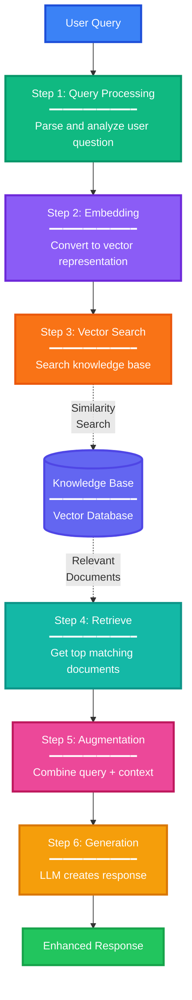

# RAG (Retrieval-Augmented Generation)

## Overview

Retrieval-Augmented Generation (RAG) is a technique that enhances Large Language Models (LLMs) by combining them with external knowledge retrieval. Instead of relying solely on the model's training data, RAG retrieves relevant information from external sources to provide more accurate, up-to-date, and contextual responses.

## How RAG Works

!!! info "RAG Process Flow"
    RAG follows a sequential 6-step process to enhance LLM responses with external knowledge.

## RAG Pipeline Explained

### 1. Query Processing
Analyze and prepare the user's question for processing.

- Parse user intent and requirements
- Clean and normalize the input text
- Extract key information and context

### 2. Embedding Conversion
Transform the query into a mathematical vector representation.

- Use embedding models (e.g., OpenAI, Sentence Transformers)
- Convert text to high-dimensional vectors
- Enable semantic similarity comparison

### 3. Vector Search
Search the knowledge base for relevant information.

- Perform similarity search in vector space
- Compare query embedding with document embeddings
- Use distance metrics (cosine similarity, euclidean distance)

### 4. Context Retrieval
Extract the most relevant documents from search results.

- Retrieve top-k matching documents
- Apply relevance scoring and ranking
- Filter results based on similarity threshold

### 5. Augmentation
Combine the original query with retrieved context.

- Merge query with relevant documents
- Format as structured prompt for LLM
- Add instructions and metadata
- Manage token limits and context window

### 6. LLM Generation
Generate the final response using enhanced context.

- LLM processes query + retrieved context
- Produces grounded, factual response
- Reduces hallucinations with source information
- Can include citations and references

---

## Key Technologies

### Vector Database
Storage system for document embeddings enabling fast similarity search.

**Popular Options:**
- **Pinecone** - Managed vector database service
- **Weaviate** - Open-source vector search engine
- **ChromaDB** - Lightweight embedding database
- **FAISS** - Facebook AI similarity search library
- **Qdrant** - High-performance vector database
- **Milvus** - Scalable vector database

## Benefits of RAG

RAG provides significant advantages over standalone LLM approaches:

### Accuracy and Reliability
- **Grounded Responses** - Answers backed by actual documents
- **Source Citations** - Transparent references to original content
- **Reduced Hallucinations** - Facts verified against knowledge base
- **Factual Consistency** - Information aligned with source material

### Flexibility and Scalability
- **Up-to-date Information** - Access current data beyond training cutoff
- **Domain-specific Knowledge** - Works with specialized knowledge bases
- **Easy Updates** - Add new documents without model retraining
- **Cost-effective** - No expensive model fine-tuning required

### Operational Benefits
- **Transparency** - Clear audit trail of sources used
- **Customization** - Tailored to specific business needs
- **Privacy Control** - Keep sensitive data in private databases
- **Performance** - Faster than retraining models with new data

---

## Common Use Cases

### Enterprise Applications
**Knowledge Management**
- Search internal company documentation
- Access policies, procedures, and guidelines
- Employee onboarding and training materials

**Customer Support**
- Automated help desk responses
- Product documentation assistance
- Troubleshooting guides

### Specialized Domains
**Legal & Compliance**
- Query regulations and legal documents
- Contract analysis and review
- Compliance checking

**Healthcare**
- Medical literature search
- Clinical guidelines reference
- Patient information systems

### Education & Research
**Learning Assistance**
- Course material Q&A systems
- Study guide generation
- Research paper analysis

**Content Creation**
- Fact-checked content generation
- Citation and reference management
- Research synthesis