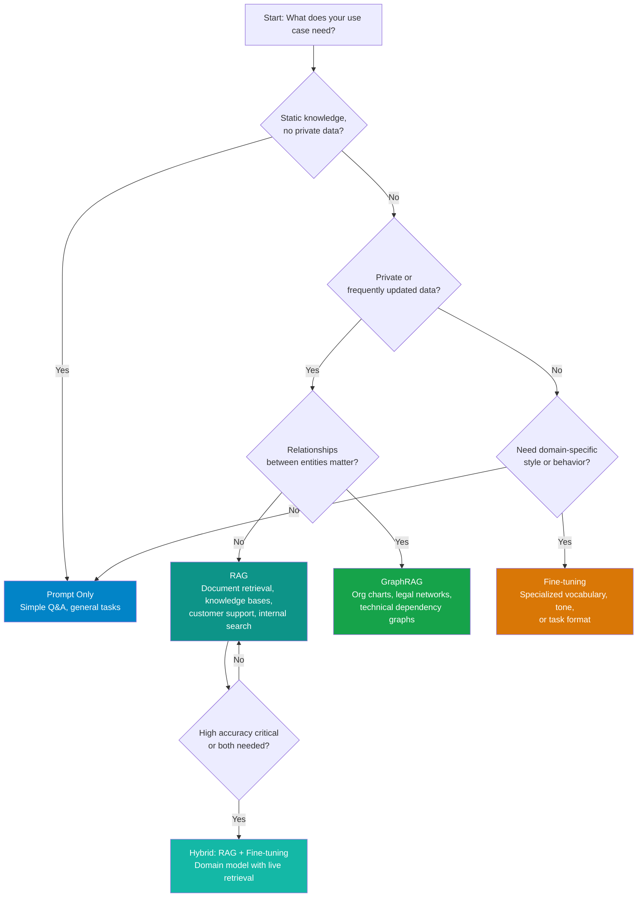

# RAG & Knowledge Systems

Retrieval-augmented generation (RAG) solves a fundamental problem with LLMs: their knowledge is frozen at training time, and their context windows — however large — cannot hold an entire enterprise knowledge base. RAG bridges that gap by fetching relevant information at inference time and grounding the model's response in retrieved facts.

This section covers everything from the basics of how RAG pipelines work, through embedding model selection, chunking strategy trade-offs, vector database operations, graph-enhanced retrieval, and how to measure whether any of it is actually working.

---

## When to Use RAG

Not every use case needs RAG. The diagram below maps common scenarios to the right approach.

```mermaid
flowchart TD
    A["Start: What does your use case need?"]
    A --> B{"Static knowledge,\nno private data?"}
    B -- Yes --> C["Prompt Only\nSimple Q&A, general tasks"]
    B -- No --> D{"Private or\nfrequently updated data?"}
    D -- Yes --> E{"Relationships\nbetween entities matter?"}
    E -- No --> F["RAG\nDocument retrieval, knowledge bases,\ncustomer support, internal search"]
    E -- Yes --> G["GraphRAG\nOrg charts, legal networks,\ntechnical dependency graphs"]
    D -- No --> H{"Need domain-specific\nstyle or behavior?"}
    H -- Yes --> I["Fine-tuning\nSpecialized vocabulary, tone,\nor task format"]
    H -- No --> C
    F --> J{"High accuracy critical\nor both needed?"}
    J -- Yes --> K["Hybrid: RAG + Fine-tuning\nDomain model with live retrieval"]
    J -- No --> F

    style C fill:#0284c7,color:#fff
    style F fill:#0d9488,color:#fff
    style G fill:#16a34a,color:#fff
    style I fill:#d97706,color:#fff
    style K fill:#14b8a6,color:#fff
```

!!! info "Prerequisites"
    This section assumes you are comfortable with:

    - Large language model basics (tokens, context windows, prompt structure)
    - Python or a similar scripting language for code examples
    - Basic familiarity with REST APIs and JSON

    If you are new to LLMs, start with [Getting Started](../getting-started/index.md) first.

---

## What's in This Section

-   :material-book-open-variant: __RAG Fundamentals__

    The evolution from Naive RAG through Advanced, Modular, and Agentic RAG. Covers failure modes and the techniques that address them.

    Difficulty: **Intermediate**

    [:octicons-arrow-right-24: RAG Fundamentals](rag-fundamentals.md)

---

-   :material-vector-combine: __Embeddings__

    How embedding models convert text to vectors, a comparison of OpenAI, Cohere, and open-source options, and production considerations including storage cost and batching.

    Difficulty: **Intermediate**

    [:octicons-arrow-right-24: Embeddings](embeddings.md)

---

-   :material-scissors-cutting: __Chunking Strategies__

    Eight chunking approaches from fixed-size to agentic, with trade-off tables, a decision flowchart, and chunk size guidelines by use case.

    Difficulty: **Intermediate**

    [:octicons-arrow-right-24: Chunking Strategies](chunking-strategies.md)

---

-   :material-database-search: __Vector Databases__

    How vector indexes work (HNSW, IVF), a feature comparison of Pinecone, Weaviate, Qdrant, Azure AI Search, and pgvector, and guidance on hybrid search.

    Difficulty: **Intermediate**

    [:octicons-arrow-right-24: Vector Databases](vector-databases.md)

---

-   :material-graph: __GraphRAG__

    Knowledge graph construction, entity and relationship extraction, community summaries, and when graph-based retrieval outperforms dense vector search.

    Difficulty: **Advanced**

    [:octicons-arrow-right-24: GraphRAG](graphrag.md)

---

-   :material-chart-bar: __RAG Evaluation__

    Metrics that matter — faithfulness, answer relevance, context recall — and how to use RAGAS, TruLens, and DeepEval in a continuous evaluation pipeline.

    Difficulty: **Intermediate**

    [:octicons-arrow-right-24: RAG Evaluation](rag-evaluation.md)

---

## Next Steps

- [RAG Fundamentals](rag-fundamentals.md) — start here if you are new to RAG pipelines
- [Embeddings](embeddings.md) — understand the foundation of all vector-based retrieval
- [Chunking Strategies](chunking-strategies.md) — chunking decisions have an outsized impact on retrieval quality
