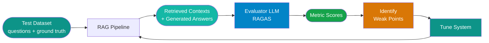

# RAG Evaluation

!!! abstract
    Building a RAG system is straightforward. Knowing whether it actually works is harder. This page covers the four RAGAS metrics that give you a quantitative view of retrieval and generation quality, how to build a golden dataset for repeatable evaluation, and which tools integrate that pipeline into your workflow.

## Why Evaluation Matters

You can't improve what you don't measure. Two RAG systems that produce plausible-looking answers can differ by 20% or more in actual retrieval quality — a difference invisible from casual inspection.

The most common trap is tuning based on a handful of manual test questions. You try a few queries, the answers look reasonable, and you ship. This doesn't catch systematic failures: whole categories of questions where retrieval consistently misses, or where the model routinely ignores the context it was given. Systematic evaluation with a proper test set surfaces these patterns before they hit production.

A good evaluation framework answers three distinct questions:

- **Is the generated answer grounded in the retrieved context?** (faithfulness)
- **Does the answer actually address the question?** (answer relevancy)
- **Did retrieval return the right chunks?** (context precision + context recall)

## The Four RAGAS Metrics

RAGAS (Retrieval Augmented Generation Assessment) is an LLM-assisted evaluation framework that scores these four dimensions without requiring manual human rating of every answer. An evaluator LLM judges each response against the retrieved context and, where applicable, a ground truth reference answer.

### Faithfulness

Faithfulness measures whether every claim in the generated answer is supported by the retrieved context. A score of 1.0 means every statement in the answer can be traced back to the context. A score of 0 means the answer contains claims the context does not support — the model is hallucinating on top of what it retrieved.

**What it catches:** The model received relevant context but generated content beyond it — inventing facts, extrapolating incorrectly, or mixing in parametric knowledge that contradicts the retrieved material.

**Logic:** The evaluator breaks the generated answer into individual claims and checks each one against the retrieved chunks. The score is the fraction of claims that are supported.

### Answer Relevancy

Answer relevancy measures whether the answer addresses the question that was actually asked. A score of 1.0 means the answer is directly on-topic and complete. A score near 0 means the answer is evasive, off-topic, or only tangentially related.

**What it catches:** Answers that retrieve correct context but then drift — responding to a nearby but different question, or giving a partial answer that skips the core of what was asked.

**Logic:** The evaluator generates candidate questions that the answer could plausibly be responding to, then measures how similar those reverse-engineered questions are to the original. High similarity means the answer stayed on-topic.

### Context Precision

Context precision measures whether the retrieved chunks are actually relevant to the question. A score of 1.0 means every retrieved chunk contributed useful signal. A score near 0 means most of what was retrieved was noise — the retrieval cast too wide a net.

**What it catches:** Poor embedding quality, an over-generous similarity threshold, or a large `k` value that pulls in tangentially related content and dilutes the context window.

**Logic:** Each retrieved chunk is scored for relevance to the question. Chunks ranked higher get more weight — so returning a relevant chunk at position 1 scores better than returning it buried at position 8.

### Context Recall

Context recall measures whether retrieval found all the information necessary to answer the question correctly. A score of 1.0 means nothing critical was missed. A score near 0 means significant relevant information exists in the corpus but wasn't retrieved.

**What it catches:** Chunking strategies that split related information across too many small pieces, embedding models that fail to match semantically equivalent phrasing, or a `k` value too small to surface all relevant material.

**Logic:** Each sentence in the ground truth reference answer is checked against the retrieved context. The score is the fraction of ground truth sentences that the retrieved chunks cover. This metric requires a ground truth reference answer.

### Summary

| Metric | Measures | Requires Ground Truth | What a Low Score Means |
|---|---|---|---|
| Faithfulness | Answer grounded in context | No | Model is hallucinating beyond the context |
| Answer Relevancy | Answer addresses the question | No | Answer is off-topic or incomplete |
| Context Precision | Retrieved chunks are relevant | No | Retrieval is noisy — too much irrelevant content |
| Context Recall | Retrieved chunks cover the answer | Yes | Retrieval is missing critical information |

## Evaluation Pipeline

The evaluation loop runs your test set through the full RAG pipeline, then scores each question/context/answer triple with RAGAS.



**Steps:**

1. **Build test set** — questions, optionally with ground truth reference answers
2. **Run RAG** — for each question, record the retrieved chunks and the generated answer
3. **Score with RAGAS** — pass question, context, answer, and ground truth to the evaluator
4. **Identify weak points** — which metrics are low? Which question categories fail?
5. **Tune** — adjust chunking, embedding model, `k`, reranker, or prompt based on findings
6. **Repeat** — re-run the full set to confirm improvement didn't regress other metrics

## Common Failure Patterns

| Symptom | Root Cause | Fix |
|---|---|---|
| Low faithfulness + high context precision | Model is ignoring the context it received | Strengthen prompt instructions to stay grounded; add explicit "only use the provided context" language |
| Low context recall | Chunking splits related information too finely, or `k` is too small | Increase chunk size, switch to semantic chunking, or increase `k` |
| Low context precision | Embedding model similarity threshold too loose, or `k` too large | Lower `k`, raise similarity threshold, or add a reranker pass |
| High context recall but low faithfulness | Generation model diverges from context | Swap to a model with stronger instruction following, or tighten the system prompt |
| Low answer relevancy | Retrieval returns context from a related but different topic | Improve query expansion or add a query rewriting step before retrieval |

## Building a Golden Dataset

The quality of your evaluation is only as good as your test set.

**How many questions:** Aim for at least 50 questions before drawing conclusions. Below that, a few outliers skew the scores significantly. For production confidence — especially before deploying major changes — 200+ questions give you stable, actionable numbers.

**Sources (in order of preference):**

- **Real user questions** — the best possible source; these reflect actual usage patterns and failure modes
- **Domain expert-generated** — SMEs writing representative questions; catches edge cases that users haven't hit yet
- **Synthetic** — generated by an LLM given the source documents; fast to create, good for initial pipeline validation

**Ground truth annotation:** A good reference answer is complete (covers all relevant points), grounded (only contains facts supported by the source material), and concise. It doesn't need to be phrased identically to what the system produces — the evaluator handles paraphrase matching.

!!! note
    Synthetic datasets are fine to start with — just validate a sample manually before trusting the scores. LLM-generated questions can be biased toward easily-answerable content and may miss the ambiguous or multi-hop queries that expose real weaknesses.

## Evaluation Tools

=== "RAGAS"

    The reference implementation. LLM-based metrics, framework-agnostic, works with any vector store or RAG pipeline.

    ```bash
    pip install ragas
    ```

    ```python
    from ragas import evaluate
    from ragas.metrics import faithfulness, answer_relevancy, context_precision, context_recall
    from datasets import Dataset

    data = {
        "question": ["What is the capital of France?"],
        "answer": ["The capital of France is Paris."],
        "contexts": [["France is a country in Western Europe. Its capital city is Paris."]],
        "ground_truth": ["Paris is the capital of France."]
    }

    dataset = Dataset.from_dict(data)
    result = evaluate(
        dataset,
        metrics=[faithfulness, answer_relevancy, context_precision, context_recall]
    )
    print(result)
    ```

    RAGAS uses an LLM as the evaluator — configure `OPENAI_API_KEY` or point it at Azure OpenAI. Scores are returned as a dict with values between 0 and 1.

    Reference: [docs.ragas.io](https://docs.ragas.io/)

=== "Azure AI Evaluation"

    Built into Azure AI Foundry. Implements the same RAGAS-inspired metrics and integrates natively with Azure Prompt Flow and Azure OpenAI.

    ```bash
    pip install azure-ai-evaluation
    ```

    ```python
    from azure.ai.evaluation import evaluate, FaithfulnessEvaluator, RelevanceEvaluator

    result = evaluate(
        data="test_data.jsonl",
        evaluators={
            "faithfulness": FaithfulnessEvaluator(model_config=azure_openai_config),
            "relevance": RelevanceEvaluator(model_config=azure_openai_config),
        }
    )
    ```

    Good choice if your RAG pipeline is already deployed on Azure — evaluation runs in the same environment without exporting data to a third-party service.

    Reference: [Azure AI Evaluation docs](https://learn.microsoft.com/en-us/azure/ai-studio/how-to/evaluate-generative-ai-app)

=== "DeepEval"

    A broader test suite with RAG-specific metrics plus general LLM evaluation. Unit-test style API makes it easy to integrate into CI pipelines.

    ```bash
    pip install deepeval
    ```

    ```python
    from deepeval import assert_test
    from deepeval.test_case import LLMTestCase
    from deepeval.metrics import FaithfulnessMetric, AnswerRelevancyMetric

    test_case = LLMTestCase(
        input="What is the refund policy?",
        actual_output="Refunds are processed within 30 days.",
        retrieval_context=["Our refund policy allows returns within 30 days of purchase."]
    )

    assert_test(test_case, [FaithfulnessMetric(threshold=0.8), AnswerRelevancyMetric(threshold=0.7)])
    ```

    The `assert_test` pattern integrates directly with pytest, so evaluation failures appear as test failures in CI.

=== "LangSmith"

    LangChain's tracing and evaluation platform. If your RAG pipeline is built with LangChain or LangGraph, LangSmith adds evaluation with minimal additional setup — every run is automatically traced.

    Configure via environment:

    ```bash
    LANGCHAIN_TRACING_V2=true
    LANGCHAIN_API_KEY=your-key
    LANGCHAIN_PROJECT=rag-evaluation
    ```

    LangSmith supports custom evaluators, dataset management, and comparison views across runs — useful for tracking metric changes across experiments rather than just point-in-time scores.

## References

- [RAGAS Documentation](https://docs.ragas.io/)
- [Azure AI Evaluation](https://learn.microsoft.com/en-us/azure/ai-studio/how-to/evaluate-generative-ai-app)

## Next Steps

- [RAG Fundamentals](rag-fundamentals.md) — understand retrieval architecture before optimizing it
- [Vector Databases](vector-databases.md) — the storage layer that context precision and recall depend on
- [GraphRAG](graphrag.md) — graph-based retrieval for multi-hop questions that flat vector search struggles with
