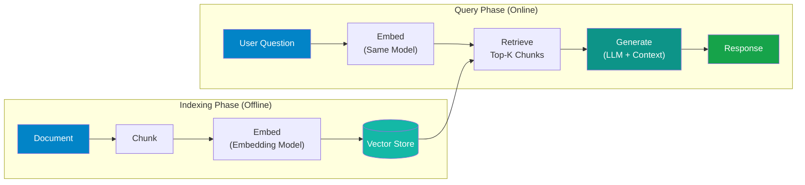

# RAG Fundamentals

!!! abstract "What You'll Learn"
    This page traces the evolution of RAG from its original "naive" form through the advanced retrieval techniques, modular architecture patterns, and agentic approaches used in production today. You will understand where naive RAG breaks down, what techniques address each failure mode, and when to move beyond standard RAG entirely.

---

## Evolution of RAG

RAG has gone through four recognizable generations since the original 2020 paper. Each generation addressed specific limitations of the one before it.

| Generation | Core Idea | Key Limitation Addressed |
|---|---|---|
| **Naive RAG** | Chunk → embed → retrieve → generate | Establishes the baseline pattern |
| **Advanced RAG** | Pre/post retrieval processing, hybrid search, reranking | Poor retrieval quality and context noise |
| **Modular RAG** | Swappable components, routing, iterative retrieval | Rigid pipelines that can't adapt to query type |
| **Agentic RAG** | LLM decides when and what to retrieve | Static pipelines that can't handle multi-hop reasoning |

---

## Naive RAG — The Basic Pipeline

Naive RAG splits the work into two phases: an offline indexing phase that runs once (or on a schedule), and an online query phase that runs on every request.



**Indexing phase:**

1. **Document ingestion** — load raw files (PDFs, HTML, Markdown, DOCX)
2. **Chunking** — split into smaller pieces suitable for embedding (see [Chunking Strategies](chunking-strategies.md))
3. **Embedding** — convert each chunk to a dense vector using an embedding model
4. **Storage** — persist vectors and metadata in a vector database

**Query phase:**

1. **Embed the question** — use the same embedding model used during indexing
2. **Retrieve top-K chunks** — find the most similar vectors via approximate nearest-neighbor search
3. **Augment the prompt** — inject retrieved chunks into the LLM context
4. **Generate a response** — the LLM answers grounded in retrieved context

This pipeline is straightforward to implement and works well for simple, well-structured knowledge bases. It breaks down quickly in production.

---

## Failure Modes of Naive RAG

Understanding where naive RAG fails is more valuable than knowing how it works. Most production RAG issues trace back to one of these categories.

| Failure Type | Symptom | Root Cause |
|---|---|---|
| **Retrieval: Wrong chunks returned** | Answer misses the relevant information completely | Embedding similarity doesn't capture semantic intent; keyword mismatch |
| **Retrieval: Too many irrelevant chunks** | LLM produces a vague or hallucinated answer despite having context | Top-K too high, low-quality embeddings, poor chunking |
| **Retrieval: Context too fragmented** | Answer is partially correct but missing key details | Chunks are too small and split mid-thought |
| **Retrieval: Recency ignored** | Outdated information returned alongside current data | No metadata filtering, stale index |
| **Generation: Hallucination despite context** | LLM ignores retrieved context and makes things up | Context injected poorly, LLM doesn't ground to context |
| **Generation: Lost-in-the-middle** | Information from the middle of a long context is ignored | LLMs attend better to beginning and end of context |
| **Generation: Context window overflow** | Truncated context, missing critical chunks | Too many/too large chunks stuffed into context |
| **Augmentation: Context irrelevance** | Retrieved chunks don't match the user's actual intent | Query-document semantic gap; query too vague |
| **Augmentation: No answer possible** | LLM says "I don't know" for questions that should be answerable | Sparse retrieval coverage, chunking destroys context |

---

## Advanced RAG Techniques

Advanced RAG adds processing steps before retrieval, improves the retrieval step itself, and refines the context before it reaches the LLM.

=== "Pre-Retrieval"

    Pre-retrieval techniques improve the query before it hits the vector store.

    **Query Rewriting**

    Reformulate the user's query to be more retrieval-friendly. LLMs write conversational queries ("what's the deal with rate limits?") that embed poorly against technical documentation.

    ```
    Original:  "what's the deal with rate limits?"
    Rewritten: "API rate limit thresholds, retry behavior, and backoff strategies"
    ```

    **HyDE — Hypothetical Document Embeddings**

    Instead of embedding the question, ask the LLM to generate a hypothetical answer first, then embed that. The hypothesis lives in the same embedding space as real documents.

    ```
    Query: "What is the refund policy for annual subscriptions?"
    Hypothesis: "Annual subscription refunds are processed within 30 days of cancellation.
                 Customers who cancel in the first 14 days receive a full refund..."
    → Embed the hypothesis → Retrieve against real docs
    ```

    The hypothesis doesn't need to be correct — it just needs to be in the right region of embedding space.

    **Step-Back Prompting**

    For specific questions, first generate a more general "step-back" question, retrieve for both, and combine the context. Useful when the answer to a specific question depends on understanding a broader principle.

    ```
    Specific:  "Why does my Azure Function timeout after 230 seconds?"
    Step-back: "What are the execution timeout limits for Azure Functions?"
    ```

=== "Retrieval"

    **Hybrid Search**

    Combine dense vector search (semantic similarity) with sparse BM25 keyword search. Reciprocal Rank Fusion (RRF) merges the two ranked lists. This handles both semantic queries and exact keyword matches.

    Most enterprise vector databases support hybrid search natively (Azure AI Search, Weaviate, Qdrant). Prefer hybrid over pure vector search in production — the improvement is consistent.

    **Cross-Encoder Reranking**

    After retrieving top-K candidates (e.g., 20), pass each (query, chunk) pair through a cross-encoder model to score relevance directly. Return the top-N (e.g., 5) highest-scored chunks to the LLM.

    Cross-encoders are slower than bi-encoders but dramatically more accurate because they see both query and document together rather than independently. Use Cohere Rerank, `cross-encoder/ms-marco-MiniLM` from HuggingFace, or Jina Reranker.

    **MMR — Maximum Marginal Relevance**

    MMR balances relevance with diversity in the retrieved set. It penalizes chunks that are too similar to chunks already selected, preventing the context from being filled with five near-identical paragraphs.

    ```
    Score(chunk) = λ × relevance(query, chunk) - (1 - λ) × max_similarity(chunk, selected)
    ```

    λ controls the relevance vs. diversity trade-off. Values around 0.5–0.7 work well in practice.

=== "Post-Retrieval"

    **Context Compression**

    After retrieval, pass the chunks and original question to a smaller LLM to extract only the relevant sentences. Reduces context window usage and noise before the main generation call.

    LangChain's `ContextualCompressionRetriever` wraps any retriever with a compressor step.

    **Context Reordering (Lost-in-the-Middle)**

    Research consistently shows LLMs attend better to content at the beginning and end of their context window. If you retrieved 10 chunks, put the most relevant ones at position 1 and 10 — not in the middle.

    Place highest-relevance chunks first and second-highest last. This is a free performance gain that requires no additional models.

    **Relevance Filtering**

    After retrieval and optional reranking, drop any chunk whose relevance score falls below a threshold. An LLM given irrelevant context often performs worse than one given no context at all.

---

## Modular RAG

Modular RAG treats the pipeline as a set of interchangeable components rather than a fixed sequence. The key insight is that different query types need different pipelines.

A modular architecture typically includes:

- **Routing** — classify the incoming query and dispatch to the appropriate sub-pipeline (e.g., simple factual retrieval vs. multi-document synthesis vs. SQL lookup)
- **Scheduling** — iterative or sequential module execution; retrieve → assess → retrieve again if needed
- **Fusion** — merge results from multiple retrieval sources (vector store + web search + structured database)

This matters in enterprise settings where a single assistant must handle queries that span structured data (SQL), unstructured documents (vector store), and real-time data (API calls). A fixed naive RAG pipeline can't route between these.

---

## Agentic RAG

Agentic RAG goes further: the LLM itself decides when to retrieve, what to retrieve, and whether the retrieved context is sufficient to answer. Retrieval becomes a tool the agent calls rather than a fixed pipeline step.

Typical agentic retrieval patterns:

- **Adaptive retrieval** — the agent assesses whether its current knowledge is sufficient before deciding to retrieve
- **Multi-hop retrieval** — the agent retrieves, reads the result, formulates a follow-up query, retrieves again, and iterates until it has enough context
- **Self-critique** — after generating a draft answer, the agent retrieves to verify its own claims and revises if needed
- **Tool-augmented** — retrieval is one of many tools alongside web search, code execution, and API calls

Agentic RAG is more powerful but also harder to control and evaluate. Latency increases with each retrieval hop, and agent loops can be expensive if not bounded.

For a deeper treatment of agentic patterns, see [Agentic AI](../concepts/agentic-ai.md).

!!! warning "Don't Skip Evaluation"
    RAG without metrics is flying blind. You can iterate on chunking strategies, embedding models, and retrieval parameters indefinitely without knowing if quality is actually improving. Instrument your pipeline with [RAG Evaluation](rag-evaluation.md) metrics from day one — faithfulness, answer relevance, and context recall at minimum.

---

## References

- [Azure AI Search: RAG Overview](https://learn.microsoft.com/en-us/azure/search/retrieval-augmented-generation-overview) — Microsoft's production-oriented RAG guidance including Azure AI Search integration
- [LangChain RAG Tutorial](https://python.langchain.com/docs/tutorials/rag/) — end-to-end walkthrough of building RAG with LangChain
- [LlamaIndex Documentation](https://docs.llamaindex.ai/en/stable/) — comprehensive RAG framework with advanced retrieval patterns and connectors

---

## Next Steps

- [Embeddings](embeddings.md) — understand what the embedding models in your pipeline actually do and how to choose between them
- [Chunking Strategies](chunking-strategies.md) — chunking is the highest-leverage decision in a RAG pipeline
- [RAG Evaluation](rag-evaluation.md) — set up metrics before you start tuning anything else
