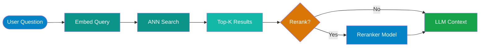

# Vector Databases

!!! abstract
    Vector databases store and search high-dimensional embeddings using approximate nearest neighbor (ANN) algorithms. This page covers how they work, compares the major options, and gives you a practical decision framework for choosing between managed cloud services, self-hosted options, and lightweight alternatives.

---

## What Makes a Vector Database Different

Traditional databases search by exact match or range queries. Vector databases search by _similarity_ — finding the vectors closest to a query vector in high-dimensional space (typically 768–3072 dimensions for modern embedding models).

The core operation is **k-nearest neighbor (kNN) search**, and because exact kNN at scale is too slow, most systems use **approximate nearest neighbor (ANN)** algorithms that trade a small amount of recall for dramatically faster queries.

### ANN Algorithms

**HNSW — Hierarchical Navigable Small Worlds**

The dominant algorithm in modern vector databases. Builds a multi-layer navigable graph where:

- Upper layers are sparse and enable fast long-distance traversal
- Lower layers are dense and enable fine-grained local search
- Queries start at the top and progressively narrow down

HNSW delivers millisecond latency at billion-vector scale with high recall. The tradeoff is memory: the graph structure is held in RAM. Build time is also non-trivial — adding 10M vectors can take minutes.

**IVF — Inverted File Index**

Partitions the vector space into Voronoi cells (clusters). At query time, only the nearest clusters are searched. More memory-efficient than HNSW but generally lower recall at the same speed. Useful when RAM is constrained.

**Flat (Exact)**

Brute-force exact search. 100% recall, no approximation error. Only practical up to ~100K vectors. Useful for small datasets or as a ground-truth baseline.

### Filtering + Metadata

Raw ANN search gives you the nearest vectors — but in practice you almost always need to filter first ("only search documents from tenant X" or "only search articles from 2024"). How a database handles **pre-filtering vs post-filtering** significantly affects both accuracy and performance:

- **Pre-filtering**: filters the candidate set before ANN search — accurate but can be slow if the filter is selective
- **Post-filtering**: runs ANN then applies filters — fast but can return fewer than k results if many candidates are filtered out

Qdrant's payload filtering and Azure AI Search's hybrid filter support are both designed to handle this correctly.

---

## Vector Database Comparison

| Database | Hosting | Scale | Hybrid Search | Filtering | Best For |
|---|---|---|---|---|---|
| **Azure AI Search** | Fully managed (Azure) | 100M+ vectors | BM25 + vector + semantic reranking | Pre/post filter with full OData expressions | Azure-integrated enterprise RAG |
| **Pinecone** | Managed cloud (serverless/pod) | Billions of vectors | Sparse + dense (hybrid) | Metadata filters | Standalone cloud-native RAG |
| **Weaviate** | Open-source + managed cloud | 100M+ vectors | BM25 + vector | GraphQL where clauses | Multi-modal search, GraphQL consumers |
| **Qdrant** | Open-source + managed cloud | 100M+ vectors | Sparse + dense | Rich payload filtering | High-performance self-hosted, Rust performance |
| **Chroma** | Local / self-hosted | <5M vectors | None (vector only) | Basic metadata | Local prototyping, notebooks |
| **pgvector** | Postgres extension (self-managed or managed) | Up to ~10M vectors | Postgres full-text + vector | Full SQL WHERE clauses | Teams already on Postgres, moderate scale |
| **Milvus** | Open-source + Zilliz Cloud | Billions of vectors | Sparse + dense | Scalar filtering | Enterprise self-hosted, cloud-native K8s |

---

## Indexing Pipeline

When you ingest documents into a RAG system, each document goes through a pipeline before it's queryable:


**Chunk** — Split documents into overlapping segments (typically 256–512 tokens with 10–20% overlap). Chunk size affects both retrieval precision and context quality.

**Embed** — Pass each chunk through an embedding model (e.g., `text-embedding-3-large`, `text-embedding-ada-002`). This produces a fixed-size float vector.

**Upsert** — Write the vector + metadata (source, chunk ID, text, timestamp, tenant ID) to the database.

**Index** — The database builds or updates its ANN index. Some databases do this continuously (HNSW append), others batch (IVF rebuild).

---

## Query Pipeline

At query time the same flow runs in reverse:



**Reranking** (optional but high-impact) — A cross-encoder model scores each candidate chunk against the query. Significantly improves result quality at the cost of latency. Azure AI Search includes semantic reranking built-in. For standalone stacks, use Cohere Rerank or a local cross-encoder.

---

## Performance Tradeoffs

| Algorithm | Query Speed | Recall | Memory Usage | Build Time |
|---|---|---|---|---|
| **HNSW** | Very fast (ms) | High (0.95–0.99) | High (graph in RAM) | Moderate |
| **IVF** | Fast | Medium (0.85–0.95, depends on nprobe) | Low–Medium | Fast |
| **Flat** | Slow (linear scan) | 100% (exact) | Low (just vectors) | Instant |

**recall@k** — the fraction of true nearest neighbors found in your top-k results. If recall@10 is 0.95, on average 9.5 of your 10 results are truly the closest vectors. Lower recall means relevant documents get dropped before the LLM ever sees them — a major failure mode in RAG. Always benchmark recall@k when tuning HNSW parameters (`ef_construction`, `M`).

---

## Azure AI Search Deep Dive

For Azure-based workloads, Azure AI Search is the default choice. It combines keyword search, vector search, and semantic reranking in a single managed service with enterprise security.

### Hybrid Search

A single query can combine:

1. **BM25** — classic keyword ranking (good for precise terms, product codes, proper names)
2. **Vector search** — semantic similarity (good for paraphrased questions, synonyms)
3. **Semantic reranking** — a Microsoft-hosted cross-encoder re-scores the top results

The scores are combined using Reciprocal Rank Fusion (RRF) before reranking. This consistently outperforms pure vector search in production RAG benchmarks.

### Integrated Vectorization

Azure AI Search can automatically embed documents on ingest via a **skillset** — you don't need to run a separate embedding pipeline. Point it at an Azure OpenAI embedding deployment and it handles chunking + embedding as part of the indexer run.

### Security

- RBAC on the search service (Reader, Contributor, Index Data Contributor roles)
- Private endpoint support — no public internet exposure
- Managed Identity for connecting to Azure OpenAI, Azure Blob, and Azure SQL data sources
- Customer-managed encryption keys (CMK)

### Index Schema (simplified)

```json
{
  "name": "documents",
  "fields": [
    { "name": "id", "type": "Edm.String", "key": true },
    { "name": "content", "type": "Edm.String", "searchable": true },
    { "name": "content_vector", "type": "Collection(Edm.Single)",
      "dimensions": 1536, "vectorSearchProfile": "hnsw-profile" },
    { "name": "source", "type": "Edm.String", "filterable": true },
    { "name": "tenant_id", "type": "Edm.String", "filterable": true }
  ]
}
```

---

## Decision Guide

=== "Managed Cloud"

    **Azure AI Search** — default if you're already on Azure. Handles hybrid search, semantic reranking, integrated vectorization, and enterprise security in one service. No separate infrastructure to manage.

    **Pinecone** — strong choice for teams not on Azure who want a dedicated, fully managed vector database. Serverless tier is cost-effective for variable workloads. Simple API, good SDKs. Doesn't include BM25 keyword search out of the box.

=== "Self-Hosted"

    **Qdrant** — best choice for teams who want high performance and rich filtering without a managed service. Written in Rust, memory-efficient, excellent payload filtering. Docker image is straightforward. Well-maintained with active development.

    **Weaviate** — good fit when you want GraphQL APIs or multi-modal search (text + images). More complex to operate than Qdrant. Its module system lets you plug in vectorizers at query time.

    **Milvus** — designed for cloud-native K8s deployments at billion-vector scale. More operational overhead than Qdrant but better horizontal scaling story. Use Zilliz Cloud (managed Milvus) if you want the scale without the ops burden.

=== "Already Have Postgres"

    **pgvector** — adds vector similarity search as a Postgres extension (`CREATE EXTENSION vector`). If your dataset is under ~5–10M vectors and your team is already running Postgres, pgvector is a legitimate production choice — not just a toy.

    When to graduate to a dedicated database:
    - Query latency exceeds acceptable thresholds (pgvector's HNSW is slower than native implementations)
    - You need hybrid search with BM25
    - You're running millions of updates per day (HNSW in pgvector doesn't handle deletes as cleanly)
    - Recall@k is materially lower than alternatives at your scale

=== "Prototyping"

    **Chroma** — zero-configuration, runs in-process or as a local server, stores data on disk. Ideal for notebooks, proof-of-concept work, and development. The API is simple and Python-first.

    Do not build production workloads on Chroma. It has no horizontal scaling, limited filtering, and no production support. Use it to validate your chunking strategy and prompt design, then migrate to a proper database before you ship.

---

!!! warning
    Don't over-engineer early. Start with pgvector (if you're on Postgres) or Chroma (for local dev). Only introduce a dedicated vector database when you have a concrete scale or performance problem. Premature infrastructure complexity is a real cost.

---

## References

- [Azure AI Search documentation](https://learn.microsoft.com/en-us/azure/search/)
- [Pinecone documentation](https://docs.pinecone.io/)
- [Weaviate documentation](https://weaviate.io/developers/weaviate)
- [Qdrant documentation](https://qdrant.tech/documentation/)

---

## Next Steps

- [RAG Fundamentals](rag-fundamentals.md) — understand chunking, embedding, and retrieval before optimizing your vector store
- [GraphRAG](graphrag.md) — when standard vector search isn't enough for multi-hop or holistic queries
- [RAG Evaluation](rag-evaluation.md) — how to measure retrieval quality, recall@k, and end-to-end answer quality
