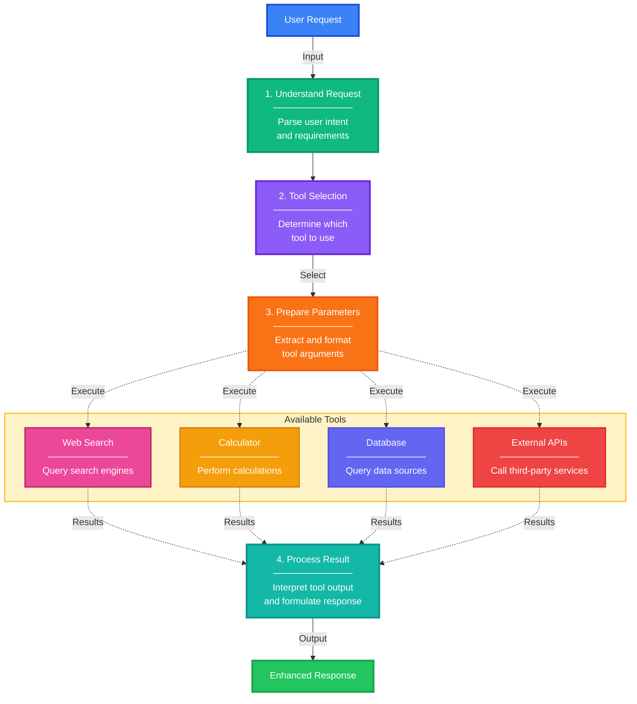

# Tools

## Overview

AI Tools are functions or capabilities that extend the functionality of Large Language Models by allowing them to interact with external systems, perform computations, or access real-time information. Instead of being limited to generating text, LLMs equipped with tools can take actions, retrieve data, and integrate with APIs.

## How AI Tools Work

## Key Concepts

=== "Tool Definition"
    **Structured Function Descriptions**
    
    - Name and clear description of what the tool does
    - Input parameters with types and constraints
    - Expected output format
    - Usage examples and guidelines

=== "Tool Selection"
    **AI Decision Making**
    
    - LLM analyzes user request to identify needed tools
    - Evaluates which tool best matches the task
    - Can chain multiple tools for complex tasks
    - Falls back to text generation when no tool is needed

=== "Tool Execution"
    **Calling External Functions**
    
    - LLM generates properly formatted tool calls
    - System executes the actual function
    - Results are returned to the LLM
    - LLM interprets results and generates response

=== "Response Integration"
    **Combining Tool Output with Generation**
    
    - Tool results are incorporated into the context
    - LLM generates natural language response
    - Cites sources or shows data when appropriate
    - Maintains conversation flow

## Common Tool Categories

**Information Retrieval**

- Web search engines
- Database queries
- Document retrieval
- Knowledge base lookups

**Computation and Analysis**

- Mathematical calculations
- Data processing and transformation
- Statistical analysis
- Code execution

**External Integrations**

- API calls to third-party services
- Email and messaging systems
- Calendar and scheduling
- File system operations

**Creation and Modification**

- Document generation
- Image creation and editing
- Code writing and refactoring
- Data formatting and export

## Benefits of Tool-Augmented LLMs

!!! success "Advantages"
    - **Extended Capabilities**: Go beyond text generation to take real actions
    - **Real-Time Information**: Access current data beyond training cutoff
    - **Reliability**: Use deterministic tools for calculations and lookups
    - **Integration**: Connect with existing systems and workflows
    - **Flexibility**: Add new tools without retraining the model
    - **Transparency**: Tool calls and results can be logged and audited

## Tool Calling Flow

!!! info "Execution Pattern"
    1. User submits a request to the AI agent
    2. LLM determines if tools are needed
    3. If tools are required, LLM generates a tool call with parameters
    4. System executes the tool and retrieves results
    5. Results are returned to the LLM as part of the conversation
    6. LLM generates final response using tool output
    7. Response is delivered to the user

## Use Cases

**Customer Support**

- Query order status from databases
- Check inventory availability
- Process refunds and updates
- Schedule appointments

**Research and Analysis**

- Search multiple data sources
- Perform calculations on datasets
- Generate reports with current data
- Cross-reference information

**Development and DevOps**

- Execute code snippets
- Query system logs
- Deploy applications
- Monitor service health

**Personal Productivity**

- Send emails and messages
- Create calendar events
- Set reminders
- Manage task lists